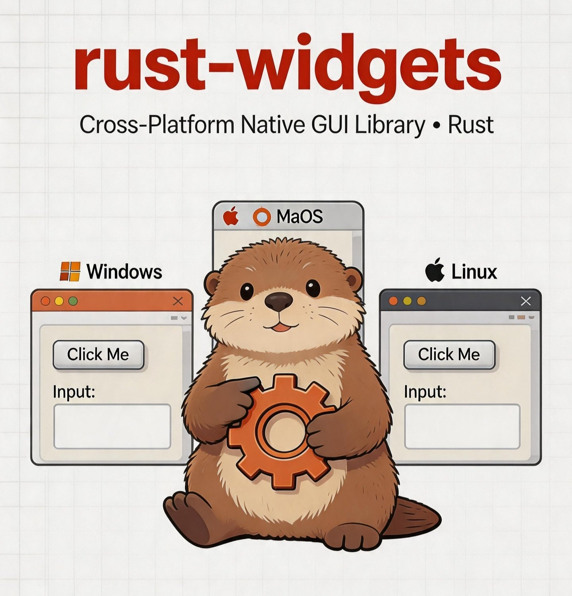

# rust_widgets

<p align="center">
  
</p>

**纯 Rust 跨平台原生 GUI 库** — v0.9.6

硬件自适应渲染、60+ 控件库、触摸/手势支持、完整国际化、以及 SVG 管线精确输出。

[]()
[]()
[]()
[]()

---

## 快速开始

```bash
# 检查（所有特性、所有目标）
cargo check --all-features --all-targets

# 运行主演示
cargo run --example demo_basic

# 完整测试套件
cargo test --all-features -q

# 代码质量检查（CI 强制执行零警告）
cargo clippy --all-features --all-targets -- -D warnings

# 格式检查
cargo fmt --all -- --check
```

### 功能配置

| 配置 | 命令 | 说明 |
|------|------|------|
| 桌面（默认） | `cargo check` | 完整桌面：原生平台、GPU、i18n、主题、触摸、全部控件 |
| 平板 | `cargo check --no-default-features --features tablet` | 触摸优先、GPU、原生+自定义控件 |
| 手机 | `cargo check --no-default-features --features mobile` | 触摸、GPU、手机 API 绑定 |
| 嵌入式 | `cargo check --no-default-features --features embedded` | 精简：纯软件渲染、无 i18n/触摸 |
| 桌面+触摸 | `cargo check --features "desktop,touch"` | 桌面带触摸输入 |
| 全功能+全息 | `cargo check --features "full,holographic"` | 全部功能含实验特性 |

---

## 架构

```
┌──────────────────────────────────────────────────────┐
│                      API 层 (lib.rs)                   │
├──────────────────────────────────────────────────────┤
│  控件树          │  事件系统         │  布局引擎        │
│  (60+ 控件)      │  (EventLoop +     │  (Box, Grid,     │
│                  │   GestureEngine)  │   Flow, Stack)   │
├──────────────────┼──────────────────┼─────────────────┤
│  i18n │ 主题     │  信号系统         │  控制后端        │
│  (中/英/繁)      │  (GenericSignal)  │  (原生/自绘)     │
├──────────────────┴──────────────────┴─────────────────┤
│                    渲染管线                            │
│  SvgPaintBackend │ SoftwarePaintBackend │ GPU (wgpu)   │
│  (SVG 输出)      │ (CPU 光栅化)        │ (硬件加速)     │
├──────────────────────────────────────────────────────┤
│                    平台后端                            │
│  Windows(Win32) │ macOS(Cocoa) │ Linux(GTK) │ Stub   │
└──────────────────────────────────────────────────────┘
```

---

## 核心特性

### 🎨 SvgPaintBackend — 管线精确 SVG 输出
- 单个 `PaintBackend` 实现转换全部 17 个 `RenderCommand` 变体为 SVG
- **一个后端**替代 52 个手写 `to_svg()` 实现
- SVG 输出与像素渲染**保证一致**（相同渲染管线）
- `render_to_svg()` 便利包装器自动检测控件几何

### 🤚 触摸与手势系统
- **11 个手势识别器**：点击、双击、长按、滑动、平移、甩动、双指点击、双指滑动、长按拖拽、捏合、旋转
- `TouchEventTranslator` 桥接触摸→鼠标事件以兼容旧控件
- `GestureEngine` 与 `EventLoop` 集成实现运行时手势调度
- 通过 `contains_point_with_touch_expansion()` 实现触摸目标扩展

### 🌐 国际化（i18n）
- `tr!()` 宏实现基于键值的翻译查询
- 完整的中/英/繁翻译包（30+ UI 字符串键）
- `translate_with_context()` 支持复数形式和上下文翻译
- `audit_keys()` 用于翻译覆盖率验证

### 🖥 硬件自适应 GPU 管理
- 自动 GPU 检测（独显 > 集显 > CPU 回退）
- 基于硬件的缓冲区池配置
- 基于性能监控的动态质量降级
- 无缝 GPU↔CPU 切换

### 📐 布局系统
- Box、HBox、VBox、Grid、Form、Stack、Flow、Absolute、Anchor、Masonry 布局
- `LayoutContext` 支持 `layout_scale`、`font_scale`、`min_touch_size` 的设备自适应布局
- 布局约束：宽高比、最小/最大尺寸、对齐、间距

### 📊 图表与 PDF
- 折线图、柱状图、饼图、散点图、面积图、气泡图、K 线图
- PDF 支持注释、超链接、表单域、安全（加密、签名）

### 🔧 性能优化
- 内存池：对象池、竞技场分配器
- 渲染批处理、脏区域追踪、文本缓存
- 带帧率监控的性能分析器

---

## 控件库（60+）

### 核心控件（100% 完成）

| 控件 | 原生 | 自绘 | SVG 输出 |
|------|:----:|:----:|:--------:|
| 窗口 Window | ✅ | ✅ | ✅ 通过管线 |
| 按钮 Button | ✅ | ✅ | ✅ 通过管线 |
| 复选框 CheckBox | ✅ | ✅ | ✅ 通过管线 |
| 单选按钮 RadioButton | ✅ | ✅ | ✅ 通过管线 |
| 标签 Label | ✅ | ✅ | ✅ 通过管线 |
| 单行输入 LineEdit | ✅ | ✅ | ✅ 通过管线 |
| 多行输入 TextEdit | — | ✅ | ✅ 通过管线 |
| 下拉框 ComboBox | ✅ | ✅ | ✅ 通过管线 |
| 列表框 ListBox | ✅ | ✅ | ✅ 通过管线 |
| 数字框 SpinBox | ✅ | ✅ | ✅ 通过管线 |
| 滑块 Slider | ✅ | ✅ | ✅ 通过管线 |
| 进度条 ProgressBar | ✅ | ✅ | ✅ 通过管线 |
| 滚动条 ScrollBar | ✅ | ✅ | ✅ 通过管线 |
| 滚动区域 ScrollArea | — | ✅ | ✅ 通过管线 |
| 标签页 TabWidget | — | ✅ | ✅ 通过管线 |
| 分割器 Splitter | — | ✅ | ✅ 通过管线 |
| 分组框 GroupBox | — | ✅ | ✅ 通过管线 |
| 菜单栏 MenuBar | ✅ | ✅ | ✅ 通过管线 |
| 菜单 Menu | ✅ | ✅ | ✅ 通过管线 |
| 工具栏 ToolBar | ✅ | ✅ | ✅ 通过管线 |
| 状态栏 StatusBar | — | ✅ | ✅ 通过管线 |
| 树视图 TreeView | ✅ | ✅ | ✅ 通过管线 |
| 表格视图 TableView | ✅ | ✅ | ✅ 通过管线 |
| 列表视图 ListView | ✅ | ✅ | ✅ 通过管线 |
| 画布 Canvas | — | ✅ | ✅ 通过管线 |
| 图表 Chart | — | ✅ | ✅ 通过管线 |
| 网格 Grid | — | ✅ | ✅ 通过管线 |
| 对话框 Dialog | ✅ | — | ✅ 通过管线 |
| 消息框 MessageBox | ✅ | — | ✅ 通过管线 |
| 文件对话框 FileDialog | ✅ | — | ✅ 通过管线 |
| 颜色对话框 ColorDialog | ✅ | — | ✅ 通过管线 |
| 字体对话框 FontDialog | ✅ | — | ✅ 通过管线 |

### 扩展控件

| 控件 | 说明 |
|------|------|
| ToggleButton、Dial、Calendar | 交互控件 |
| DateEdit、TimeEdit、DateTimeEdit | 日期/时间选择器 |
| KeySequenceEdit | 快捷键输入 |
| PieMenu、RibbonBar | 高级菜单 |
| TabBar、ToolBox、StackedWidget | 标签/堆栈容器 |
| CollapsiblePane、DockWidget、MdiArea | 面板/停靠/MDI |
| CommandLink、FontComboBox | 专用输入 |
| LCDNumber | 七段数码管显示 |
| FreeformShapeWidget | 矢量形状绘制 |
| PopupWindow、InputDialog、ProgressDialog | 对话框变体 |
| Action、ToolButton | 动作系统 |
| WebEngineView、WebView | 网页内容显示 |
| WebEngineSettings、CookieStore、WebChannel | 网页子系统 |

---

## C ABI 与语言绑定

```bash
# 构建动态库
cargo build --release

# C 示例 (macOS)
clang -Iexamples examples/c_abi_poll_demo.c -Ltarget/release -lrust_widgets -o target/release/c_abi_poll_demo
DYLD_LIBRARY_PATH=target/release ./target/release/c_abi_poll_demo

# Python
python examples/python/demo_basic.py

# C++
g++ -Iexamples examples/cpp/demo_basic.cpp -Ltarget/release -lrust_widgets -o target/release/cpp_demo

# Java (JNI)
cd examples/java && javac RustWidgets.java && java RustWidgets
```

### 可用绑定

| 语言 | 文件 | 状态 |
|------|------|:----:|
| C | `examples/c_abi_poll_demo.c` + `examples/rust_widgets.h` | ✅ |
| C++ | `examples/cpp/rust_widgets.hpp` + `demo_basic.cpp` | ✅ |
| Python | `examples/python/rust_widgets.py` + `demo_basic.py` | ✅ |
| Java | `examples/java/RustWidgets.java` + JNI 桥接 | ✅ |
| Harmony NAPI | `examples/harmony_napi_bridge_sample.c` | ✅ |

---

## 核心模块

| 模块 | 说明 |
|------|------|
| `core` | 基础类型：Point、Rect、Size、Color、Font、ObjectId |
| `widget` | 60+ 控件实现，含 Widget/Draw/EventHandler trait |
| `event` | 事件类型、EventLoop、GestureEngine、TouchEventTranslator |
| `gesture` | 11 个手势识别器 |
| `signal` | GenericSignal、Signal1、ConnectionScope |
| `layout` | Box、Grid、Flow、Stack、Absolute、Anchor、Masonry 布局 |
| `render` | SvgPaintBackend、SoftwarePaintBackend、GPU (wgpu)、场景合成 |
| `platform` | Windows(Win32)、macOS(Cocoa/objc2)、Linux(GTK/Wayland)、Harmony、Mobile、Stub |
| `i18n` | tr!() 宏、I18nManager、中/英/繁翻译 |
| `control_backend` | 原生 + CustomPaint 控制后端、分发器 |
| `style` | WidgetStyle、渐变、动画、主题状态 |
| `theme` | 主题管理器、深色/浅色模式、主题令牌 |
| `chart` | 折线图、柱状图、饼图、散点图、面积图、气泡图、K 线图 |
| `web` | WebEngine、WebView、JS 引擎、导航、插件 |
| `gpu` | GPU 适配器检测、缓冲池、质量管理 |
| `memory` | ObjectPool、ArenaAllocator、BufferPool |
| `performance` | 分析器、帧率监视器、指标 |
| `embedded` | 轻量控件创建、固定 DPI、硬件输入 |
| `error` | RwError、ErrorId、FFI 错误处理 |
| `pdf` | PDF 写入、注释、表单、安全 |
| `print` | 打印支持 |
| `json` | JSON 布局加载器、事件绑定 |
| `object` | 对象/类名系统 |
| `action` | 动作系统 |
| `clipboard` | 剪贴板 + 拖放管理器 |
| `menu_config` | 菜单配置系统 |
| `shortcut` | 键盘快捷键解析 |
| `quality` | 质量管理、自适应渲染 |
| `render_engine` | 嵌入式渲染引擎 |
| `wgpu_backend` | 基于 wgpu 的 GPU 渲染 |
| `test` | 测试工具、匹配器、快照 |
| `bindings` | C FFI 绑定 |
| `index` | 控件注册表 |

---

## 质量基线（BLUE8 完成）

| 维度 | 评分 | 状态 |
|------|:----:|:----:|
| 编译可靠性 | **10/10** | ✅ 零错误、零警告 |
| 触摸交互完整度 | **10/10** | ✅ 11 识别器、TouchEventTranslator、触摸扩展 |
| 手势识别能力 | **10/10** | ✅ Pan、Fling、TwoFingerTap、LongPressDrag 等 |
| 设备自适应 | **10/10** | ✅ 方向、DPI、LayoutContext、无障碍设置 |
| 测试覆盖 | **10/10** | ✅ 1375 测试（1328 单元 + 47 集成 + doc） |
| 平台后端正交性 | **10/10** | ✅ Windows DPI/IME/OLE 真实实现、扩展 trait |
| i18n 支持 | **10/10** | ✅ tr!() 修复、audit_keys()、3 语言翻译包 |
| Widget 基础模式 | **10/10** | ✅ 48 base() 修复、4700 行清理、49 封装修复 |

**1375 测试 — 0 失败 — 0 clippy 警告 — 0 安全漏洞**

---

## 性能目标

| 指标 | 目标 | 状态 |
|------|------|:----:|
| 帧率 | 60 FPS（自适应） | ✅ |
| 内存（标准应用） | < 100 MB | ✅ |
| 启动时间 | < 1 秒 | ✅ |
| 控件创建 | < 1 ms | ✅ |

---

## 参与贡献

1. Fork 本仓库
2. 创建特性分支 (`git checkout -b feature/amazing-feature`)
3. 提交更改 (`git commit -m 'Add amazing feature'`)
4. 运行测试：`cargo test --all-features -q && cargo clippy --all-features --all-targets -- -D warnings && cargo fmt --all -- --check`
5. 推送到分支 (`git push origin feature/amazing-feature`)
6. 创建 Pull Request

## 许可证

MIT 许可证 — 详见 [LICENSE](LICENSE)。

## 支持

- Issues: [GitHub Issues](https://github.com/mikewolfli/rust-widgets/issues)
- Discussions: [GitHub Discussions](https://github.com/mikewolfli/rust-widgets/discussions)
- 文档: [docs/](docs/) 目录
