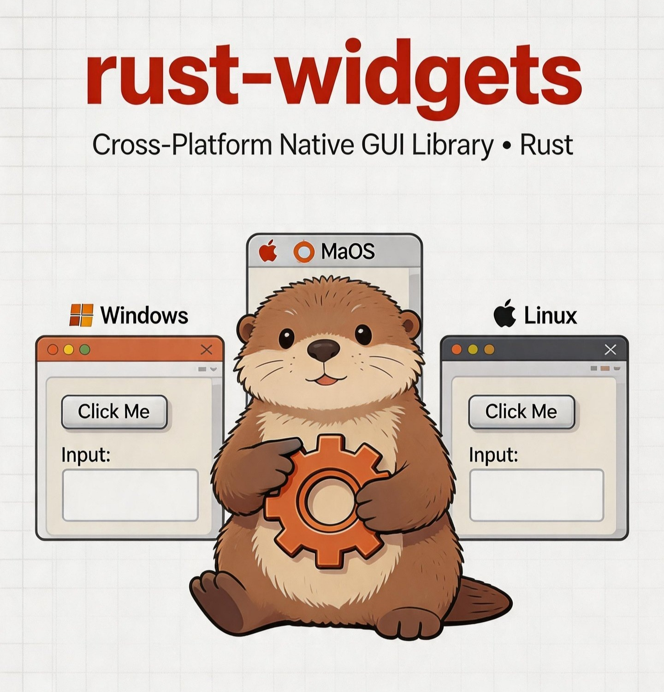

# rust_widgets — 纯 Rust GUI 库

<p align="center">
  
</p>

一个用纯 Rust 编写的跨平台 GUI 库。它**由自己绘制每一个控件**——整个 crate 里没有一处
`CreateWindowExW`、`NSButton`、`gtk_button_new` 或 `android.widget.Button`——并且可以渲染到窗口、
PNG 或 SVG。桌面、平板、移动、嵌入式，以及最小化的 `mini` 配置均在支持之列。

自绘控件值得这份投入，是因为：

| | 自绘（本库） | 原生控件 |
|---|---|---|
| 外观 | 每个操作系统完全一致 | 随工具链与版本变化 |
| 控件数量 | 各平台都是 181 种 | 只有工具链提供的那些 |
| 依赖 | 不链接任何 GUI 工具链 | GTK / AppKit / Win32 / Android SDK |
| 无头 / 嵌入式 | 完全不需要操作系统（`mini`、SVG） | 不可能 |
| 测试 | 像素与 SVG 快照 | 需要真实显示器 |

后端仍然负责真正属于操作系统的部分：窗口创建与事件循环、输入转换，以及平台服务（输入法、
剪贴板、文件对话框、DPI）。若某后端连绘制面都提供不了（例如裸帧缓冲），库会改为绘制到内存
缓冲区。详见 [`docs/ARCHITECTURE.md`](docs/ARCHITECTURE.md)。

## 安装

```toml
[dependencies]
rust_widgets = "2.8.2"
```

设备配置**只能选一个**。它们互斥——`mini` 和 `embedded` 会把 crate 的一部分**编译掉**，所以把
它们和 `desktop` 叠在一起不是「取最小公分母」，而是构建失败：

```toml
rust_widgets = { version = "2.8.2", features = ["desktop"] }                       # 默认
rust_widgets = { version = "2.8.2", default-features = false, features = ["tablet"] }
rust_widgets = { version = "2.8.2", default-features = false, features = ["mobile"] }
rust_widgets = { version = "2.8.2", default-features = false, features = ["embedded"] }
rust_widgets = { version = "2.8.2", default-features = false, features = ["mini"] }
```

> `cargo check --features embedded` 是**错的**：`desktop` 是默认特性，这条命令会同时打开两个互斥
> 配置。选择 `desktop` 以外的任何配置时，都必须加 `--no-default-features`。

## 第一个控件

```rust
use rust_widgets::core::{Color, Rect};
use rust_widgets::style::WidgetStyle;
use rust_widgets::widget::base_widgets::button::Button;
use rust_widgets::widget::Widget;   // 把 `set_style` 带入作用域

fn main() {
    // 控件就是放在 `Rect` 里的普通值。渲染成 SVG 是看到它最短的路径；
    // 换后端只改变像素去哪里，不改变控件怎么画。
    let mut button = Button::new("点击我".to_string(), Rect::new(0, 0, 160, 36));

    // 样式是一个字段全为可选值的普通结构体，因此未设置的字段是「继承」，
    // 而不会覆盖主题为该控件已解析出的颜色。
    let style = WidgetStyle {
        background_color: Some(Color::rgb(33, 150, 243)),
        text_color: Some(Color::WHITE),
        border_radius: Some(6),
        ..WidgetStyle::default()
    };
    button.set_style(style);

    println!("{}", rust_widgets::widget::svg::render_to_svg(&mut button));
}
```

窗口创建、事件循环、布局、主题、国际化与 C ABI 各有独立章节，从
[`cookbook/zh-CN/src/README.md`](cookbook/zh-CN/src/README.md) 开始。

## 渲染

| 后端 | 用途 | 说明 |
|---|---|---|
| 软件光栅化器 | 各处的默认后端 | 抗锯齿，不需要 GPU，可无头运行 |
| SVG | 快照、打印、矢量输出 | 逐字节可复现；`snapshots/svg/` 就是它产出的 |
| wgpu | GPU 加速 | 显式降级阶梯：Vulkan/Metal/DX12/WebGPU → GL → CPU |

渲染器的文本原点是字形框的**左上角**，不是基线。两个后端对这一契约的实现完全一致（SVG 后端会写
`dominant-baseline="text-before-edge"`），因此按其中一个后端测出的标签位置，在另一个后端也落在
同一处。正是这个性质让 `snapshots/svg/` 成为可用的评审产物，而不是第二个会漂移的渲染器。

## 控件的尺寸

控件拿到的矩形是「**可以使用**的区域」，不是「应该画多大」——这是两个问题。回答第二个，才是开关
不会被画成 240×120 体育场的原因：

```rust
implicit_size = max(floor, content + padding)
```

承重的是那个 `max`：**地板 = 最小可点区**，所以 5px 文字的文字按钮仍然是 `64×40`，而不是 `64×18`。
`rust_widgets::widget::ControlMetrics` 提供这个公式及建立在其上的几何 helper，
`rust_widgets::widget::metrics::dimensions` 集中所有控件尺寸（轨道、手柄半径、输入框高度、内边距），
同一事实只有一处定义：

| helper | 回答的问题 |
|---|---|
| `implicit_size` / `content_box` | 我该多大？ / 我的内容能放到哪？ |
| `center_in` / `centered_disc` / `centered_square` | 固定尺寸 chrome 居中，**只夹不撑** |
| `centered_band` / `full_width_band` | 全宽、自己的高度、垂直居中 |
| `top_band` / `bottom_band` / `band_inset` | 把条带钉在某一边，内容跟在后面 |
| `focus_ring_rect` / `focus_ring_color` | 键盘焦点环，内缩因而不会压住邻居 |

## 控件的布局

布局是**向每个子控件要尺寸**，而不是被调用方提前告知。每个控件声明自己的诉求为「地板 / 期望 / 上限」
三个值，因为「最小能压到多少」与「最大能拉到多少」是一个尺寸回答不了的：

```rust
use rust_widgets::layout::{AxisHints, Hints, LayoutParams, ChildInfo, Layout};

// 最小 120、期望 200、不超过 400；允许被横向拉伸。
let hints = Hints { width: AxisHints::new(120, 200, 400), height: AxisHints::fixed(32) };
let children = [ChildInfo::new(widget_id, hints).with_params(LayoutParams::filled())];

let mut out = Vec::new();
layout.arrange(rect, &children, &mut |id, child_rect| out.push((id, child_rect)));
```

`fill` 与尺寸**刻意分开**：滑块与按钮的期望尺寸可以相同，但只有其中一个该被拉伸铺满表单。
`AxisHints::new` 在构造时就把 `min <= pref <= max` 归一化，因此**非法状态不可表示**。
既有布局全部照常工作——`Layout::arrange` 的默认实现转 `Layout::update`。

[`examples/readme_check.rs`](examples/readme_check.rs) 提交了一份示例，因此这些片段在每次构建时
都会被编译，而不会与 API 漂移。

## 控件的行为

三条靠外形看不出来的契约：

- **`clicked` 要求释放点落在控件内部**。从按钮上按下、拖出后释放，会发 `canceled` 而不是 `clicked`；
  且只有主键能激活。
- **`pressed` 是连续量**。按住拖出会清除它，拖回会恢复它，因此控件反映指针的真实位置。
- **焦点环在「用户在用键盘」时画，而不只是「控件有焦点」时画**。`Event::FocusGained` 携带
  `FocusReason`，`FocusReason::draws_focus_ring()` 对鼠标点击返回 `false`——光标下画环会读成卡住的
  高亮。

## 动画与状态

两个机制，都是共享的而非每个控件各写一份：

- **`WidgetState`** —— `set_hovered` / `set_pressed` / `set_enabled` 会经由
  `Widget::set_state_theme_hook` **重新解析**控件的样式，因此主题作者写的
  `"button:hover"` / `":pressed"` / `":disabled"` 才真正抵达绘制代码。该钩子必须是
  对象安全的（object-safe），因为它要被 setter 本身通过 `dyn Widget` 调用。
- **`PropertyDriver`** —— 一个**存储目标**的进度值，取值 `0.0`–`1.0`，由 `MotionSlot`
  节奏令牌（`Fast` / `Normal` / `Slow`）计价。控件通过 `Widget::tick(delta_ms)` 与
  `Widget::is_animating()` 暴露它，帧循环据此发现「哪个控件还欠帧」——**控件不需要向
  任何地方注册自己**。以某个值构造的驱动器是**静止**的，不会「即将出发」，因此刚建好的
  控件不会在它的第一帧上朝反方向动起来。

`is_animating()` 是由驱动器**派生**的，而不是一个由调用方翻转的开关，所以控件与帧循环
不可能对「到底有没有东西在动」产生分歧。

## 主题与禁用态

颜色只走一条解析链——控件显式样式 → 该控件的主题解析样式 → 最后才是一个字面量兜底——
因此未被触碰的控件仍会跟随外观切换，而调用方刻意设置的颜色总是赢。

「禁用」是**两个方向相反**的动作，本仓给它们**两个名字**，因为把其中一个用在另一个的位置上，
得到的正是相反的状态：

| | 后退的方式 | 实测 |
|---|---|---|
| `BaseWidget::disabled_ink_on(ink, surface)` —— 文字与图标 | 朝**表面自身的对比色**走 | 4.57–5.91:1 |
| `BaseWidget::disabled_surface_near(surface, window)` —— 填充与面板 | 朝**背后的页面**走 | 永远不比启用时更醒目 |

权重来自同一个共享常量 `dimensions::DISABLED_VEIL_ALPHA`（`0.55`）——它是**在深色与浅色
两种外观上都**能过 4.5:1 正文底线的**最小值**。半透明中灰是**没有方向**的：压在浅色表面上
会让它变暗，压在深色表面上会让它变亮，于是「禁用」在本来就最难读的那个外观上反而更醒目。
朝表面走是**在两种外观上都**读作「后退」的唯一方向。

文字可读性也对调用方开放：`Color::contrast_ratio` 返回 WCAG 对比度，
`Color::legible_on(surface, min_ratio)` 返回调用方的颜色，或朝表面对比色走出的、
刚好满足 `min_ratio` 的那一步。

## 验证一次改动

```bash
cargo test --no-default-features --features desktop            # 全量测试
cargo clippy --no-default-features --features desktop --all-targets -- -D warnings
cargo run  --no-default-features --features desktop --example export_control_svgs
bash tools/run_all_gates.sh                                    # 全部门禁，输出 PASS/FAIL 表
```

[`snapshots/svg/`](snapshots/svg/) 下的 392 个 SVG 是「每个控件 × 明暗两种外观」各一份。它们**被提交
也被重新生成**，只要控件的绘制变了而快照没更新，`tools/check_svg_snapshots.sh` 就会逐字节失败。
于是一个「看起来不对」的控件会在评审里以 diff 的形式出现；而两个文件完全相同的控件，就是肉眼可见的
主题盲。

[`control.md`](control.md) 是同一批图换个方式给人看：每个控件的明暗两张快照，按**实现它的模块**
分成 17 组。它由 `tools/generate_control_index.py` 从控件注册表与源码树生成，所以它是快照的**一个视图**
而不是第二份副本——新控件进了注册表就会自动出现在这页上，不需要有人去改它。重新生成快照的那个门禁
同时也会重新生成这页并拒绝过期副本，因此两者不可能漂移。

`tools/run_all_gates.sh` 会跑遍 `tools/check_*.sh` 并打印每个门禁的通过情况与耗时。每个门禁都必须
**能失败**；其中最关键的那些都用反向注入验证过——故意把缺陷改回去，确认门禁会变红。

**快照并不是万能的证据。** 它展示的是控件的**静止**态，所以落在 hover、禁用或动画路径上的
缺陷对它**不可见**。那些路径改由像素级探针钉住（`tests/disabled_text_contrast.rs`、
`tests/disabled_surface_probe.rs`、`tests/m3_animation_probe.rs`），且每个探针断言的是
**被承诺的那个量**——对比度、画出的高度、线段数——而不是字节长度或「是不是在动」这类代理指标。

## 「180 个控件」覆盖什么

控件库覆盖：文本与输入（按钮、开关、输入框、掩码/一次性验证码/日期/时间编辑器、搜索框、标签输入、
虚拟键盘、富文本、Markdown、代码编辑器、终端）；选择与展示（列表、表格与支持冻结列虚拟化的数据网格、
树、chip、badge、评分、进度、骨架屏）；容器与框架（标签页、分割条、停靠面板、MDI、工具栏、菜单、
状态栏、功能带、工具箱）；对话框与浮层（消息框、文件/字体/取色器、向导、气泡、提示、横幅、吐司、
Snackbar、底部面板）；导航、媒体，以及 Material 没有对应物的图表族：K 线、成交量、盘口深度、指标、
雷达、热力图、仪表、迷你走势图。

会裁剪控件集合的配置（`mini`、`embedded`）保留精简核心；每个配置的确切集合是生成并被门禁校验的，
列在 [`docs/plans/platform_capability_matrix.md`](docs/plans/platform_capability_matrix.md)。

## 平台说明

- **Windows / macOS / Linux** —— 完整配置，真实绘制面与事件循环。
- **Linux/Wayland** —— 合成相关测试在 `tools/run_wayland_compositor_tests.sh`。
- **iOS / Android** —— 完整配置；JNI 测试 APK 用 `tools/build_android_testapp.sh` 构建。
- **Web (wasm32)** —— WebGL/WebGPU 绘制面；`cfg(target_arch = "wasm32")` 描述的是沙箱约束而非操作
  系统，操作系统相关的知识全部留在 `src/platform/` 内。
- **嵌入式 / mini** —— 仅软件光栅化器，无操作系统服务。

目前确实做不到的能力，会通过运行时能力查询诚实地返回 `false`，而不是假装支持。
`supports_custom_widgets()`、`supports_web_engine()`、`has_real_engine()` 给的是真实答案，不是
编译期桩。

## 文本覆盖

**默认构建只绘制拉丁/ASCII 字符。** crate 不随附任何字体数据，因此字形来自一套固定的 8x8 位图字体，
覆盖范围是 `U+0000`–`U+007F`。

| 输入 | 默认构建画出的东西 |
|---|---|
| `A`、`z`、`7`、`!` | 真实字形 |
| 中日韩、西里尔、阿拉伯、emoji 及任何其他文种 | **回退字形**（一个空心方框，即「豆腐块」） |

标签仍然照常排版、控件仍然正常渲染——错的只是字形。一行的绘制顺序还会按 **Unicode 双向算法**排序，
所以阿拉伯文或希伯来文的一段会从右向左绘制。排序不等于字形**形状**：针对具体文字的整形（阿拉伯文
连写、印度语系重排）完全没有应用。

因此本库**不**实现 Unicode 文本渲染，也不把自己描述为多语言。超出拉丁/ASCII 的覆盖是一条独立的、
需要可选开启的轴线，它需要字体数据——对复杂文种还需要一步整形。它必须被显式点名请求，因为 `mini`
或 `embedded` 配置不该携带它根本不会绘制的字形：

```console
cargo build --features "desktop,fonts-cjk-bitmap"
```

`fonts-cjk-bitmap` 增加一套生成的 16x16 中日韩位图字体（汉字、假名、中日韩标点与全角形式，
按需读取约 85 KB）。开启后拉丁文渲染逐字节不变：字体只是被追加到回退栈上，只能应答基础字体没有
字形的字符。

| 特性 | 数据 | 增加的内容 |
|---|---|---|
| `fonts-cjk-bitmap` | 84 996 字节，生成 | 一套 16x16 中日韩位图字体——中日韩文字，无需整形 |
| `fonts-cjk` | 361 704 字节，OFL 子集 | 同一文种的**轮廓**，因此可抗锯齿并缩放到任意像素尺寸 |
| `fonts-vector-latin` | 35 896 字节，OFL 子集 | 真实的步进与字距调整，来自 `Font::family` 指定的字体 |
| `fonts-complex` | 70 576 字节，OFL 子集 | 阿拉伯文连写，使 `بيت` 成形为一个词而非三个孤立字母 |
| `fonts-emoji-color` | 1 602 492 字节，OFL 子集 | 彩色 emoji——317 个码点，含 26 个区域指示符 |
| `icons` | 10 016 字节，Apache-2.0 | 每个 `IconName` token 一份 **Material Symbols** SVG 轮廓，共 68 个（**默认开启**） |

`fonts-cjk-bitmap` 与 `fonts-cjk` 是同一文种的两种答案，差别在于体积与画质的取舍：与位图同等覆盖
范围的轮廓子集会重达 581 KB，大约 7 倍，所以位图是 `mini`/`embedded` 构建使用的，而矢量字体面向
希望中文在任意尺寸下都抗锯齿的桌面宿主。同时开启两者时，位图会在它覆盖的字符上获胜——它是更廉价
的字体，而回退栈把廉价来源放在前面。

这些字体没有任何配置会默认开启，`--all-features` 是唯一一次拿到全部的方式。矢量与彩色子集从二进制
的只读段惰性加载，并连同其上游摘要记录在 [`NOTICE`](NOTICE) 中。

这条边界从两侧都被断言（`render::pipeline::pixel_ops::text_coverage_tests` 与
`render::text::glyph_source` 的测试）——默认构建下非拉丁字符必须回退为回退字形，而开启中日韩数据必须
恰好按它增加的字体移动这条边界——因此文档不可能悄悄夸大实际绘制的内容。

### 图标

`Icon` 随附 **68** 个 `IconName` token。开启 `icons` 特性（**默认开启**）时，每个 token 用固定在某个上游
修订、随附于仓库的 Material Symbols 集画出**真实轮廓**；关闭时则画由**同一份**轮廓派生的回退几何：

```console
cargo build                                            # 真实轮廓（默认）
cargo build --no-default-features --features desktop   # 派生的回退几何
```

打开后其余一切不变：`IconName::as_str` / `from_name` 是同样的 token，颜色走同一套阶梯。回退几何
**不是手绘的**——它是同一批 `tools/material_symbols/<token>.svg` 的粗粒度展平，所以两条路径不可能
对同一个图标给出不同形状。`IconName::data()` 返回 `IconData` 而非 `Option`，所以「新增 token 但没补
几何」是**编译错误**，而不是一个空白图标。

宿主还可以在**运行时**添加**自己的**图标——内置集是一份固定词汇，`register_icon` 是它旁边的开放扩展点：

```rust
use rust_widgets::widget::register_icon;

// 960 单位设计网格上的 SVG 路径数据，y 轴向上为负（Material Symbols 的约定）。
assert!(register_icon("disclosure", &["M480-200 240-440l480 480-240-240Z"]));
icon.set_icon("disclosure");
```

若数据源使用别的网格尺度（如 Lucide / Tabler 的 24 单位），用 `register_icon_on_grid` 传入网格大小。
`clear_registered_icons`、`registered_icon_count`、`is_registered_icon` 补全该接口，注册的图标与内置
图标走**完全相同**的绘制代码。

图标数据为 Apache-2.0（Google LLC）；许可证副本、归属声明与校验门禁见 [`NOTICE`](NOTICE)、
`tools/material_symbols/LICENSE` 与 `tools/check_icon_licences.sh`。token 集在 `tools/icon_tokens.txt`
中**只声明一次**，`tools/gen_icon_names.py` 由它生成 `IconName` 类型，所以新增一个图标是两行编辑加
一次生成器运行。

该特性**刻意不放进任何 device profile**：`mini` / `embedded` 是按尺寸的配置，调用方没要求的
载荷在那里是错的。想要图标的 profile 构建请显式要求（`--features mini,icons`）。

## 语言绑定

`C ABI` 位于 `src/bindings/`，通过 130 个 `rw_*` 函数暴露每个控件，并提供基于能力的属性与事件模型。C、C++、
Python 与 Java（JNI）绑定都在 CI 中运行；生成的头文件由 `tools/check_abi.sh` 检查漂移。

见 [`cookbook/zh-CN/src/chapters/language-bindings.md`](cookbook/zh-CN/src/chapters/language-bindings.md)。

## 文档

| 文档 | 内容 |
|---|---|
| [`cookbook/`](cookbook/) | 手册 —— 英文、简体中文、繁體中文 |
| [`docs/ARCHITECTURE.md`](docs/ARCHITECTURE.md) | 模块划分与分层规则 |
| [`docs/MIGRATION_GUIDE.md`](docs/MIGRATION_GUIDE.md) | 从 1.x 迁移（2.0 起移除原生控件创建） |
| [`CHANGELOG.md`](CHANGELOG.md) | 发行说明，含每项修复的证据 |
| [`docs/reports/`](docs/reports/) | 审计与质量报告 |
| [`docs/log/`](docs/log/) | 逐轮的工程日志 |

## 环境要求

Rust **1.87+**。默认构建不需要任何系统 GUI 库；Linux 额外用 Wayland/X11 提供绘制面。图像编解码器是
纯 Rust 的，因此交叉编译到 Android、iOS 或 wasm 不需要 `pkg-config` sysroot。

## 许可证

MIT —— 见 [LICENSE](LICENSE)。

## 支持

- 问题反馈：[GitHub Issues](https://github.com/mikewolfli/rust-widgets/issues)

[]()
[]()
[]()
[]()

<p align="center">
  <a href="README.md">
    
  </a>
</p>
