<!-- Generated by tools/generate_control_index.py — do not hand-edit. -->

# 控件图像总览 / Control gallery

本仓一共有 **188** 个控件，每个控件有两个外观（深色 / 浅色），共 **376** 张 SVG。

这些图片由 `examples/export_control_svgs.rs` 从**控件注册表**导出，并由 `tools/check_svg_snapshots.sh` 门禁保证「重新生成的结果与提交的字节完全一致」。因此它们是**产物**而不是手绘插图：任何控件的绘制改动都会在这里以 diff 的形式出现。

| | |
|---|---|
| 画布 | 240 x 120（与渲染普查的 `CENSUS_RECT` 相同，因此控件之间可横向对比） |
| 深色 | `snapshots/svg/<name>.svg` |
| 浅色 | `snapshots/svg/<name>.light.svg` |
| 重新生成 | `cargo run --no-default-features --features desktop --example export_control_svgs` |
| 分组依据 | 控件实现所在的模块目录（`src/widget/<family>/`），由本脚本自动推导 |

## 分组统计 / Families

| 分组 | 控件数 | 本节 |
|---|---|---|
| Base controls (`base_widgets`) | 7 | [跳转](#base-controls) |
| Input controls (`input_widgets`) | 26 | [跳转](#input-controls) |
| Display controls (`display_widgets`) | 25 | [跳转](#display-controls) |
| Containers (`container_widgets`) | 13 | [跳转](#containers) |
| Navigation (`nav_widgets`) | 7 | [跳转](#navigation) |
| Menus and toolbars (`menu_toolbar`) | 8 | [跳转](#menus-and-toolbars) |
| Dialogs (`dialog`) | 14 | [跳转](#dialogs) |
| Overlays (`overlay_widgets`) | 4 | [跳转](#overlays) |
| Views (`view_widgets`) | 14 | [跳转](#views) |
| Charts (`chart_widgets`) | 4 | [跳转](#charts) |
| Specialised controls (`special_widgets`) | 32 | [跳转](#specialised-controls) |
| Advanced controls (`advanced_widgets`) | 8 | [跳转](#advanced-controls) |
| Media and web (`media_widgets`) | 7 | [跳转](#media-and-web) |
| Miscellaneous (`misc_widgets`) | 8 | [跳转](#miscellaneous) |
| Cupertino (iOS-style) (`cupertino`) | 8 | [跳转](#cupertino-ios-style) |
| Web (`web_widgets`) | 1 | [跳转](#web) |
| Core controls (`root`) | 2 | [跳转](#core-controls) |
| **合计** | **188** | |

## Base controls

`base_widgets` — 7 个控件。

### `button`

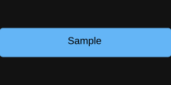

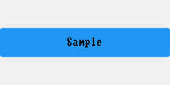

### `check_box`

### `frame`

### `label`

### `radio_button`

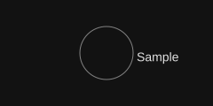

### `swipe_to_dismiss`

### `toggle_button`

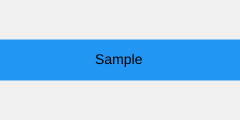

## Input controls

`input_widgets` — 26 个控件。

### `auto_complete_edit`

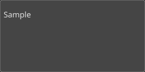

### `cascader`

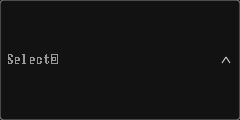

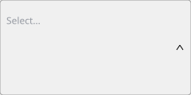

### `combo_box`

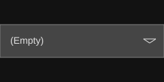

### `command_link`

### `dropdown`

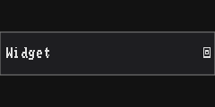

### `editable_combo_box`

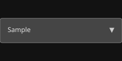

### `font_combo_box`

### `ime_preedit`

### `inplace_editor`

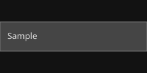

### `keyboard`

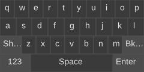

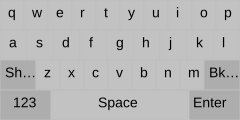

### `line_edit`

### `list_box`

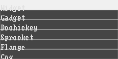

### `masked_edit`

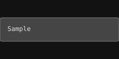

### `mention`

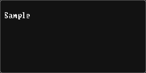

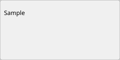

### `multi_select_combo_box`

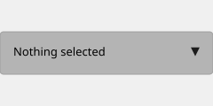

### `number_picker`

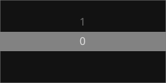

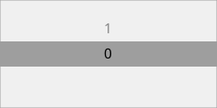

### `otp_input`

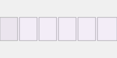

### `range_slider`

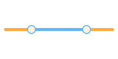

### `rich_edit`

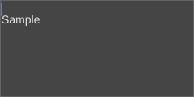

### `search_bar`

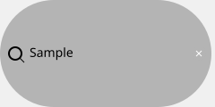

### `search_box`

### `shortcut_editor`

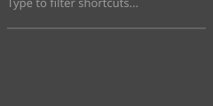

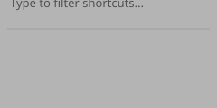

### `spin_box`

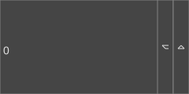

### `tag_input`

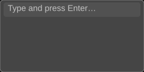

### `text_area`

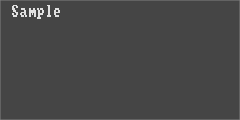

### `text_edit`

## Display controls

`display_widgets` — 25 个控件。

### `arc`

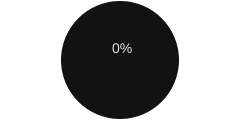

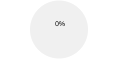

### `badge`

### `color_history`

### `color_well`

### `divider`

### `emoji_picker`

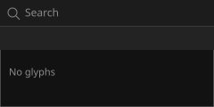

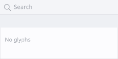

### `empty_state`

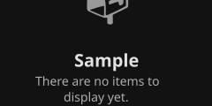

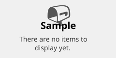

### `floating_label`

### `font_preview`

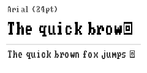

### `icon`

### `image_view`

### `lcd_number`

### `line`

### `meter`

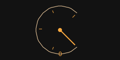

### `mini_canvas`

### `mini_chart`

### `progress_bar`

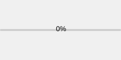

### `progress_circle`

### `rating`

### `roller`

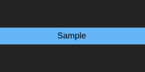

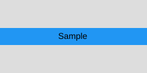

### `scroll_bar`

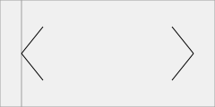

### `skeleton_loader`

### `slider`

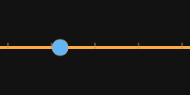

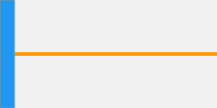

### `spinner`

### `switch`

## Containers

`container_widgets` — 13 个控件。

### `carousel`

### `collapsible_pane`

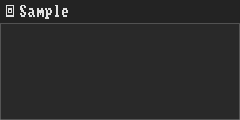

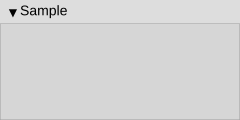

### `dock_widget`

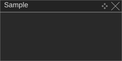

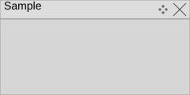

### `group_box`

### `masonry_layout`

### `mdi_area`

### `panel`

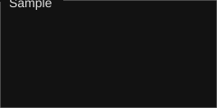

### `safe_area`

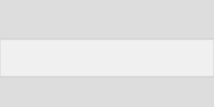

### `scroll_area`

### `splitter`

### `stacked_widget`

### `stepper`

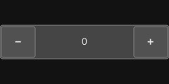

### `tab_widget`

## Navigation

`nav_widgets` — 7 个控件。

### `adaptive_scaffold`

### `app_bar`

### `bottom_navigation_bar`

### `navigation_drawer`

### `navigation_stack`

### `pagination`

### `tab_view`

## Menus and toolbars

`menu_toolbar` — 8 个控件。

### `action`

### `dropdown_menu`

### `menu`

### `menu_bar`

### `menu_button`

### `status_bar`

### `tool_bar`

### `tool_button`

## Dialogs

`dialog` — 14 个控件。

### `bottom_sheet`

### `color_dialog`

### `dialog`

### `file_dialog`

### `find_replace_dialog`

### `font_dialog`

### `input_dialog`

### `message_box`

### `modal_bottom_sheet`

### `popover`

### `popup_window`

### `progress_dialog`

### `tooltip`

### `wizard_dialog`

## Overlays

`overlay_widgets` — 4 个控件。

### `banner`

### `fab`

### `refresh_control`

### `splash_screen`

## Views

`view_widgets` — 14 个控件。

### `data_grid`

### `data_view`

### `grid_table`

### `image_gallery`

### `list_view`

### `properties_panel`

### `property_grid`

### `query_builder`

### `table`

### `table_widget`

### `tree_table`

### `tree_view`

### `virtual_list`

### `virtual_table`

## Charts

`chart_widgets` — 4 个控件。

### `bar_chart`

### `line_chart`

### `pie_chart`

### `sparkline`

## Specialised controls

`special_widgets` — 32 个控件。

### `breadcrumb`

### `candlestick_chart`

### `canvas`

### `chart`

### `chip`

### `code_editor`

### `color_picker`

### `command_palette`

### `depth_chart`

### `diff_viewer`

### `freeform_shape`

### `gantt_widget`

### `grid`

### `heatmap`

### `indicator_chart`

### `kanban_board`

### `map_view`

### `markdown_editor`

### `media_player`

### `notification_center`

### `order_book`

### `quote_board`

### `radar_chart`

### `segmented_control`

### `signature_pad`

### `snackbar`

### `split_button`

### `terminal_view`

### `timeline_widget`

### `toast`

### `toast_stack`

### `volume_chart`

## Advanced controls

`advanced_widgets` — 8 个控件。

### `calendar`

### `date_edit`

### `date_time_edit`

### `dial`

### `pie_menu`

### `ribbon_bar`

### `tab_bar`

### `time_edit`

## Media and web

`media_widgets` — 7 个控件。

### `animated_image`

### `audio_visualizer`

### `camera_preview`

### `hero_animation`

### `lottie_widget`

### `rive_widget`

### `video_player`

## Miscellaneous

`misc_widgets` — 8 个控件。

### `avatar`

### `barcode_scanner`

### `bezier_curve_editor`

### `date_range_picker`

### `drop_zone`

### `mobile_date_picker`

### `qr_code`

### `segmented_button`

## Cupertino (iOS-style)

`cupertino` — 8 个控件。

### `cupertino_alert_dialog`

### `cupertino_date_picker`

### `cupertino_navigation_bar`

### `cupertino_segmented_control`

### `cupertino_slider`

### `cupertino_switch`

### `material_navigation_rail`

### `material_snackbar`

## Web

`web_widgets` — 1 个控件。

### `web_engine_view`

## Core controls

`root` — 2 个控件。

### `tool_box`

### `window`

