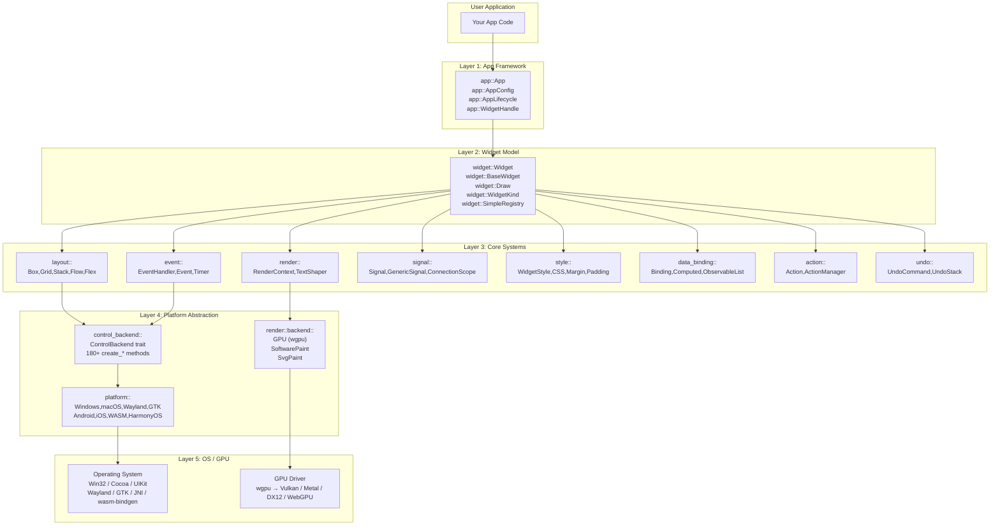
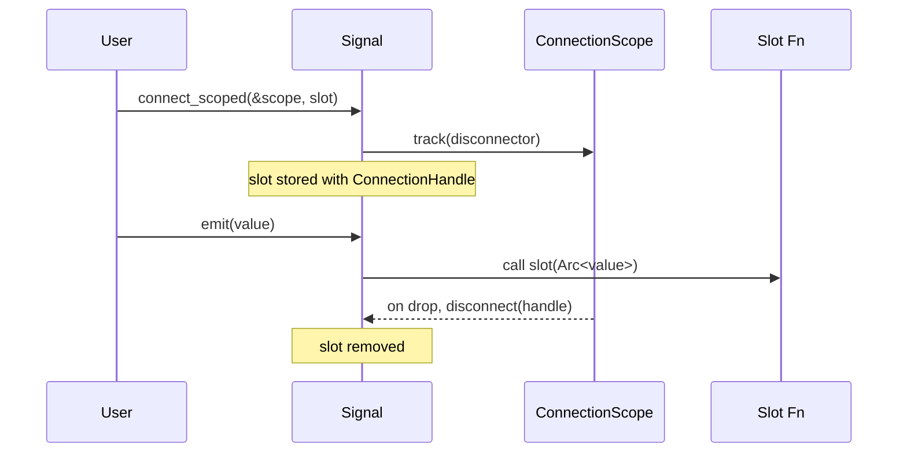
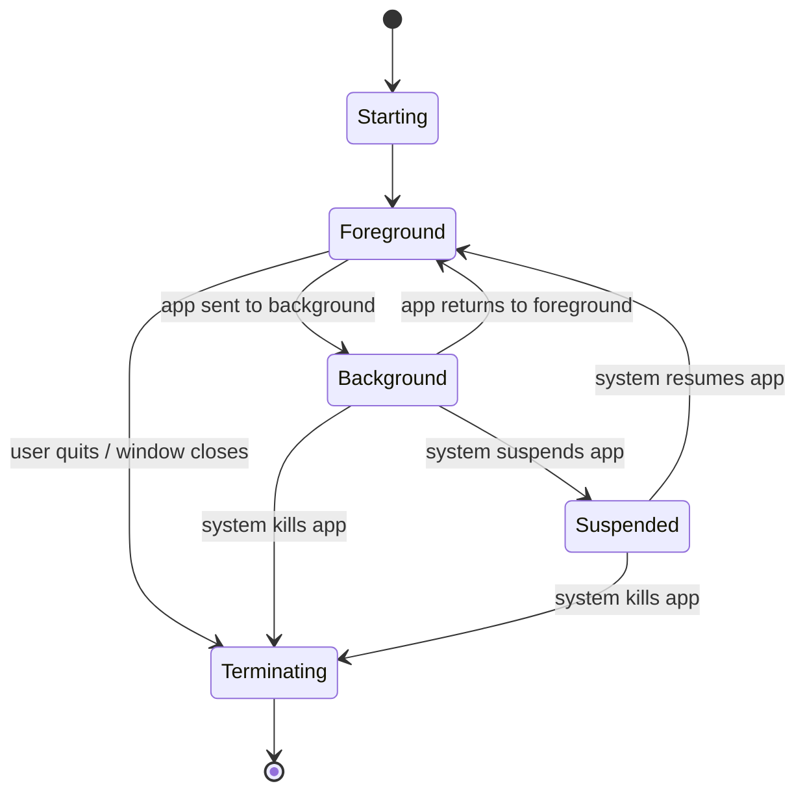
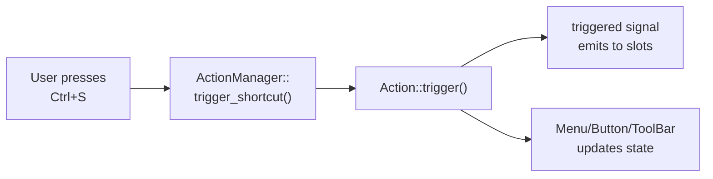

# Architecture Overview

This chapter explains the layered architecture of rust-widgets, the crate
hierarchy, the core abstractions, and how compile-time and runtime decisions
work together to produce efficient, cross-platform binaries.

---

## Layer Model

rust-widgets is organized in a **five-layer stack** where each layer depends
only on the layer below it:



### Layer Responsibilities

| Layer | Responsibility | Key Modules |
|---|---|---|
| **App Framework** | Application lifecycle, widget handles, event loop orchestration | `app::App`, `AppConfig`, `WindowHandle`, `AppLifecycle` |
| **Widget Model** | Widget trait contract, base widget state, signal slots, rendering dispatch, container composition | `widget::Widget`, `BaseWidget`, `Draw`, `WidgetKind`, `SimpleRegistry` |
| **Core Systems** | Layout, rendering, events, signals, styling, data binding, actions, undo/redo | `layout`, `render`, `event`, `signal`, `style`, `data_binding`, `action`, `undo` |
| **Platform Abstraction** | OS-native widget creation, event translation, clipboard, IME, accessibility | `control_backend::ControlBackend`, `platform` |
| **OS / GPU** | Raw platform APIs, GPU drivers | OS SDKs + `wgpu` |

---

## Crate Hierarchy and Module Dependencies

```mermaid
graph TD
    LIB["lib.rs<br/>(public API, create_* functions, tr! macro)"]
    LIB --> CORE
    LIB --> WIDGET
    LIB --> APP
    LIB --> EVENT
    LIB --> SIGNAL
    LIB --> STYLE
    LIB --> PLATFORM

    CORE["core::<br/>ObjectId, Color, Rect, Size, Point, Font<br/>Alignment, Version, PlatformCapabilities"]
    WIDGET["widget::<br/>Widget trait, BaseWidget, Draw<br/>WidgetKind, 180+ widget modules"]
    APP["app::<br/>App, AppConfig, WidgetHandle<br/>AppLifecycle, dispatch_trigger"]

    WIDGET --> CORE
    WIDGET --> SIGNAL
    WIDGET --> STYLE
    WIDGET --> EVENT
    WIDGET --> RENDER[same render]

    SIGNAL["signal::<br/>Signal, GenericSignal<br/>ConnectionScope, ConnectionHandle"]
    SIGNAL --> COMPAT["compat::<br/>HashMap, Mutex, Vec<br/>(std or heapless)"]

    EVENT["event::<br/>Event, EventHandler<br/>Timer, EventQueue, FocusTracker"]
    EVENT --> CORE

    LAYOUT["layout::<br/>BoxLayout, Grid, Stack, Flow<br/>Flex, Absolute, Form, Constraint"]
    LAYOUT --> CORE

    RENDER["render::<br/>RenderContext, RenderPipeline<br/>TextShaper, TextCache<br/>GPU/Software/SVG backends"]
    RENDER --> CORE

    STYLE["style::<br/>WidgetStyle, Margin, Padding<br/>CssParser, StyleSheetManager<br/>Theme, ThemeManager"]
    STYLE --> CORE

    DATA_BINDING["data_binding::<br/>Binding, Computed<br/>ObservableList"]
    DATA_BINDING --> COMPAT

    ACTION["action::<br/>Action, ActionManager<br/>ActionBinding"]
    ACTION --> SIGNAL

    UNDO["undo::<br/>UndoCommand, UndoStack<br/>MergePolicy"]
    UNDO --> CORE

    CTRL_BACKEND["control_backend::<br/>ControlBackend trait<br/>Dispatcher, Router<br/>Native/Custom backends"]
    CTRL_BACKEND --> CORE

    PLATFORM["platform::<br/>Linux/Wayland/GTK, macOS, Windows<br/>Android/JNI, iOS, WASM, Harmony<br/>Clipboard, IME, Accessibility<br/>Holographic, Projector"]
    PLATFORM --> CTRL_BACKEND

    I18N["i18n::<br/>tr!() macro, Translation<br/>Auditor, Plural Rules"]
    CHART["chart::<br/>LineChart, BarChart<br/>PieChart, Sparkline"]
    PDF["pdf::<br/>Document Generator<br/>Render-to-PDF Pipeline"]
    PRINT["print::<br/>System Print Services"]
    INDEX["index::<br/>Document Index<br/>Search Services"]
    WEB["web::<br/>WebView, WebEngine<br/>Settings, Cookies"]
    EMBEDDED["embedded::<br/>no_std Memory Model<br/>Arena Allocator"]

    CHART --> WIDGET
    PDF --> RENDER
    WEB --> WIDGET
    EMBEDDED --> CORE

    style CORE fill:#e6f3ff,stroke:#339
    style WIDGET fill:#fff3e0,stroke:#963
    style APP fill:#e8f5e9,stroke:#363
    style SIGNAL fill:#fce4ec,stroke:#933
    style PLATFORM fill:#f3e5f5,stroke:#636
```



### Module Summary Table

| Module | Path | Purpose |
|---|---|---|
| **core** | `src/core/` | Fundamental types: `ObjectId`, `Color`, `Rect`, `Size`, `Point`, `Font`, `Alignment`, `Version` |
| **widget** | `src/widget/` | Widget trait, BaseWidget, WidgetKind, Draw, 180+ widget implementations |
| **app** | `src/app/` | Application lifecycle, `App`/`AppConfig`, typed `WidgetHandle`s |
| **signal** | `src/signal/` | Signal/slot system: `Signal<T>`, `GenericSignal`, `ConnectionScope` |
| **event** | `src/event/` | Event types, `EventHandler` trait, timer, focus tracking, event queue |
| **layout** | `src/layout/` | Layout algorithms: Box, Grid, Stack, Flow, Flex, Absolute, Constraint |
| **render** | `src/render/` | Rendering: `RenderContext`, text shaping, GPU/CPU/SVG backends |
| **style** | `src/style/` | Styling: `WidgetStyle`, CSS parser, themes, margins, padding |
| **data_binding** | `src/data_binding/` | Reactive bindings: `Binding<T>`, `Computed<T>`, `ObservableList<T>` |
| **action** | `src/action/` | Action system: `Action`, `ActionManager`, shortcut binding |
| **undo** | `src/undo/` | Undo/redo: `UndoCommand`, `UndoStack`, merge policies |
| **control_backend** | `src/control_backend/` | `ControlBackend` trait (180+ methods), dispatcher, router |
| **platform** | `src/platform/` | Per-OS backends, clipboard, IME, accessibility, mobile APIs |
| **i18n** | `src/i18n/` | Translation infrastructure, `tr!()` macro |
| **chart** | `src/chart/` | Chart widgets: Line, Bar, Pie, Sparkline |
| **pdf** | `src/pdf/` | PDF document generation |
| **print** | `src/print/` | System print service integration |
| **memory** | `src/memory/` | Arena allocation, `no_std` memory model |
| **gesture** | `src/gesture/` | 11 gesture recognizers |
| **shortcut** | `src/shortcut/` | Keyboard shortcut definitions and matching |
| **theme** | `src/theme/` | Theme manager, style sheet management |
| **json** | `src/json/` | JSON layout loading and parsing |
| **compat** | `src/compat.rs` | `std` ↔ `no_std` compatibility bridge |

---

## Core Types Layer

The `src/core/` module provides the fundamental types used throughout the
library. Every widget, layout, and rendering operation is expressed in terms
of these primitives:

```rust
// Location: src/core/mod.rs — public re-exports
pub use alignment::{Alignment, HorizontalAlignment, VerticalAlignment};
pub use color::Color;
pub use font::Font;
pub use geometry::{Orientation, Point, Rect, Size};
pub use mutex_ext::MutexExt;
pub use types::{
    CoreConfig, CoreError, CoreObject, CoreResult, DeviceClass,
    ObjectId, PlatformCapabilities, PlatformFamily, RuntimeProfile, Version,
};
```

| Type | Purpose |
|---|---|
| `ObjectId` | `u64` wrapper — stable numeric identifier for every widget and core object |
| `Color` | RGBA color with 55+ constants, hex parsing, blending, luminance |
| `Point` | `(x: i32, y: i32)` — 2D coordinate |
| `Size` | `(width: u32, height: u32)` — rectangular dimension |
| `Rect` | `(x: i32, y: i32, width: u32, height: u32)` — positioned rectangle |
| `Font` | Font family, size, weight, bold, italic descriptor |
| `Alignment` | 5-way alignment: Left, Center, Right, Top, Bottom |
| `HorizontalAlignment` | Left, Center, Right |
| `VerticalAlignment` | Top, Center, Bottom |
| `Version` | Semver with major/minor/patch, parsing, comparison |
| `RuntimeProfile` | Full / Embedded |
| `DeviceClass` | Desktop, Tablet, Mobile, Embedded, Projector |
| `PlatformFamily` | Desktop, Embedded, Mobile, Tablet, Projector |
| `PlatformCapabilities` | GPU, touch, keyboard, mouse, screen dimensions, DPI |
| `CoreConfig` | Profile + platform + capabilities + version bundle |
| `CoreError` | InvalidArgument, NotSupported, NotFound, Internal |
| `CoreObject` | Trait: `id()`, `set_id()`, `type_name()` |

### Coordinate System

All positioning uses **screen coordinates** with the origin at the top-left:

```text
(0, 0) -------------> X
  |
  |    Screen Space (pixels)
  |    Origin: Top-Left
  |
  v Y
```

Conversion utilities in `core::coords` support:
- Screen ↔ Cartesian (`to_screen_y`, `to_cartesian_y`)
- Screen ↔ PDF (`to_pdf_y`, `from_pdf_y`)
- DPI scaling (`dpi_to_pixels`, `pixels_to_dpi`)
- Coordinate normalization/denormalization
- Rectangle conversion between systems

### Rectangle Merging

`core::rect_merge` provides centralized rectangle merging algorithms:
- `merge_intersecting_rects()` — merge overlapping rectangles into minimal covering sets
- `bounding_rect()` — compute the bounding rectangle of a set

### Mutex Extension

`core::MutexExt` adds a `.lock_guard()` method that recovers from poisoned
mutexes by calling `into_inner()` on the poison error, avoiding panics in
recovery scenarios.

> For detailed API documentation of every core type, see the
> [Core Types](core-types.md) chapter.

---

## Widget Layer

The widget layer defines the contract that every UI element follows.

### `Widget` Trait (60+ default methods)

```rust
pub trait Widget: EventHandler + Any {
    // Base delegation
    fn base(&self) -> &BaseWidget;
    fn base_mut(&mut self) -> &mut BaseWidget;

    // Identity
    fn id(&self) -> ObjectId;
    fn kind(&self) -> WidgetKind;

    // Geometry
    fn geometry(&self) -> Rect;
    fn set_geometry(&mut self, geometry: Rect);
    fn rect(&self) -> Rect;
    fn position(&self) -> Point;
    fn size(&self) -> Size;
    fn set_position(&mut self, position: Point);
    fn set_size(&mut self, size: Size);
    fn min_size(&self) -> Option<Size>;
    fn max_size(&self) -> Option<Size>;
    fn set_min_size(&mut self, min_size: Option<Size>);
    fn set_max_size(&mut self, max_size: Option<Size>);

    // Hierarchy
    fn parent(&self) -> Option<ObjectId>;
    fn set_parent(&mut self, parent: Option<ObjectId>);
    fn children(&self) -> &[ObjectId];
    fn add_child(&mut self, child: ObjectId);
    fn remove_child(&mut self, child: ObjectId);

    // Visibility & Enabled
    fn show(&mut self);
    fn hide(&mut self);
    fn is_visible(&self) -> bool;
    fn set_visible(&mut self, visible: bool);
    fn is_enabled(&self) -> bool;
    fn set_enabled(&mut self, enabled: bool);

    // Styling
    fn style(&self) -> &WidgetStyle;
    fn set_style(&mut self, style: WidgetStyle);
    fn background_color(&self) -> Option<Color>;
    fn foreground_color(&self) -> Option<Color>;
    fn font(&self) -> Option<&Font>;
    fn border_color(&self) -> Option<Color>;
    fn border_width(&self) -> u32;
    fn border_radius(&self) -> u32;
    fn set_border(&mut self, color: Option<Color>, width: u32, radius: u32);
    fn padding(&self) -> &Padding;
    fn margin(&self) -> &Margin;
    fn set_padding(&mut self, padding: Padding);

    // Tooltip & Accessibility
    fn set_tooltip(&mut self, tooltip: String);
    fn tooltip(&self) -> &str;
    fn set_translated_tooltip(&mut self, key: &str);
    fn accessible_name(&self) -> String;
    fn accessible_role(&self) -> AccessibleRole;
    fn accessible_description(&self) -> String;

    // DPI
    fn dpi_scale(&self) -> f32;
    fn set_dpi_scale(&mut self, scale: f32);
}
```

### `BaseWidget` — Shared State

Every concrete widget embeds a `BaseWidget` that provides:

```rust
pub struct BaseWidget {
    // Identity
    object: Object,
    kind: WidgetKind,

    // Geometry
    geometry: Rect,
    min_size: Option<Size>,
    max_size: Option<Size>,

    // Hierarchy
    parent: Option<ObjectId>,
    children: MiniVec<ObjectId>,

    // State
    visible: bool,
    enabled: bool,
    mouse_pressed: bool,
    dpi_scale: f32,

    // Styling
    style: WidgetStyle,
    tooltip: MiniString,
    connection_scope: ConnectionScope,

    // Signal Slots (11 built-in signals)
    pub clicked: GenericSignal,
    pub hover: Signal1<Point>,
    pub mouse_down: Signal1<(Point, u32)>,
    pub mouse_up: Signal1<(Point, u32)>,
    pub key_down: Signal1<(u32, u32)>,
    pub key_up: Signal1<(u32, u32)>,
    pub focus_gained: GenericSignal,
    pub focus_lost: GenericSignal,
    pub redraw_requested: GenericSignal,
    pub layout_requested: GenericSignal,
    pub changed: GenericSignal,
}
```

Every widget gets these 11 signals for free, and can add custom signals as
needed (e.g., `Window::closed`).

### `Draw` Trait

Widgets that render custom content implement the `Draw` trait:

```rust
pub trait Draw {
    /// Draw the widget's content using the provided render context.
    fn draw(&mut self, context: &mut RenderContext);

    /// Returns true if this widget uses custom drawing.
    fn uses_custom_drawing(&self) -> bool { true }

    /// Optional: Request a redraw of the widget.
    fn request_custom_redraw(&self) {}
}
```

### `EventHandler` Trait

All widgets handle events through the `EventHandler` trait (in `src/event/`):

```rust
pub trait EventHandler {
    fn handle_event(&mut self, event: &Event);
}
```

`BaseWidget` provides a default implementation that maps platform events to
signal emissions (click → `clicked.emit()`, mouse move → `hover.emit(point)`).

### `WidgetKind` Enum — 109+ Variants

The `WidgetKind` enum categorizes every widget type. Variants are
feature-gated: 15 are available under all profiles, and 94+ are unlocked with
non-`mini` features:

```rust
pub enum WidgetKind {
    // Always available (15):
    Window, Dialog, PopupWindow,
    Button, CheckBox, RadioButton, Label,
    LineEdit, ComboBox, SpinBox, ListBox,
    ProgressBar, Slider, ScrollBar, ScrollArea,
    Panel, GroupBox, ToggleButton,
    FreeformShape, TileView,
    Line, Meter, MiniChart, ImageView,
    MiniCanvas, Arc, Spinner, Roller,
    Dropdown, TextArea, Keyboard, Switch,

    // Feature-gated (94+):
    #[cfg(not(feature = "mini"))]
    MessageBox, FileDialog, ColorDialog, FontDialog,
    InputDialog, ProgressDialog,
    TextEdit, RichEdit,
    ListView, TreeView, Table, Grid, Chart,
    TabWidget, Splitter, MdiArea,
    MenuBar, Menu, MenuItem, ContextMenu,
    ToolBar, StatusBar, Canvas, DockPanel,
    Calendar, DatePicker, TimePicker, DateTimePicker,
    WebView, WebEngineView, WebEnginePage,
    Action, ToolButton,
    TabBar, PieMenu, RibbonBar,
    SearchBox, Chip, Badge, SkeletonLoader,
    FAB, PullToRefresh, BottomSheet,
    BottomNavigationBar, NavigationDrawer, AppBar,
    // ... and 50+ more
}
```

### Container Composition via `SimpleRegistry`

Containers like `Frame`, `TabWidget`, and `ScrollArea` use `SimpleRegistry` to
forward rendering and events to child widgets identified by `ObjectId`:

```rust
pub struct SimpleRegistry {
    entries: HashMap<ObjectId, (DrawClosure, EventClosure)>,
}

impl SimpleRegistry {
    pub fn register<D, E>(&mut self, id: ObjectId, draw: D, event: E);
    pub fn draw_widget(&mut self, id: ObjectId, context: &mut RenderContext) -> bool;
    pub fn forward_event(&mut self, id: ObjectId, event: &Event) -> bool;
}
```

This bridges the gap between `ObjectId`-based child tracking (in `BaseWidget`)
and the trait-object-based rendering/event dispatch system.

---

## Signal/Slot System

The signal/slot system provides type-safe, reentrant-safe, scoped event wiring.

### Core Types

```rust
// Typed signal with generic payload T:
pub struct Signal<T: Clone + Send + 'static>;

// Zero-argument signal:
pub struct GenericSignal { inner: Signal<()> }

// Legacy alias:
pub type Signal1<T> = Signal<T>;

// Opaque connection handle:
pub struct ConnectionHandle(pub u64);

// Owner scope — auto-disconnects on drop:
pub struct ConnectionScope;
```

### Signal<T> API

```rust
impl<T: Clone + Send + 'static> Signal<T> {
    pub fn new() -> Self;
    pub fn connect<F>(&self, slot: F) -> ConnectionHandle;
    pub fn connect_once<F>(&self, slot: F) -> ConnectionHandle;
    pub fn connect_scoped<F>(&self, owner: &ConnectionScope, slot: F) -> ConnectionHandle;
    pub fn connect_once_scoped<F>(&self, owner: &ConnectionScope, slot: F) -> ConnectionHandle;
    pub fn disconnect(&self, handle: ConnectionHandle) -> bool;
    pub fn disconnect_all(&self);
    pub fn emit(&self, value: T);
    pub fn slot_count(&self) -> usize;
}
```

### Connection Lifecycle



### Reentrancy Safety

The `emit()` method drains all slots under a write lock, invokes callbacks
**outside** the lock, then re-inserts non-`once` slots. This allows callbacks
to safely call `connect`, `disconnect`, `disconnect_all`, or `emit` on the
**same Signal** without deadlocking.

### Built-in Widget Signals

Every `BaseWidget` exposes 11 signal slots ready for connection:

| Signal | Type | Fires When |
|---|---|---|
| `clicked` | `GenericSignal` | Click-like interaction received |
| `hover` | `Signal1<Point>` | Mouse moves over widget |
| `mouse_down` | `Signal1<(Point, u32)>` | Mouse button pressed |
| `mouse_up` | `Signal1<(Point, u32)>` | Mouse button released |
| `key_down` | `Signal1<(u32, u32)>` | Keyboard key pressed |
| `key_up` | `Signal1<(u32, u32)>` | Keyboard key released |
| `focus_gained` | `GenericSignal` | Widget receives focus |
| `focus_lost` | `GenericSignal` | Widget loses focus |
| `redraw_requested` | `GenericSignal` | Redraw needed |
| `layout_requested` | `GenericSignal` | Layout recalculation needed |
| `changed` | `GenericSignal` | Stateful value changed |

---

## Data Binding

The `data_binding` module provides reactive data containers:

### `Binding<T>` — Two-Way Reactive Value

```rust
pub struct Binding<T: Clone + Send + 'static> {
    value: T,
    listeners: HashMap<String, BoxedListener>,
}

impl<T: Clone + Send + 'static> Binding<T> {
    pub fn new(value: T) -> Self;
    pub fn get(&self) -> T;
    pub fn set(&mut self, value: T);           // Notifies listeners
    pub fn subscribe(&mut self, key: &str, listener: BoxedListener);
    pub fn unsubscribe(&mut self, key: &str);
    pub fn bind_to(&mut self, other: &mut Binding<T>);  // Two-way sync
}
```

### `Computed<T>` — Derived Reactive Value

```rust
pub struct Computed<T: Clone + Send + 'static> {
    compute_fn: Box<dyn Fn() -> T>,
    cached: T,
    dirty: bool,
    listeners: HashMap<String, BoxedListener>,
}

impl<T: Clone + Send + 'static> Computed<T> {
    pub fn new<F>(compute: F, initial: T) -> Self;
    pub fn get(&mut self) -> T;       // Recomputes if dirty, notifies if changed
    pub fn get_cached(&self) -> T;
    pub fn invalidate(&mut self);     // Mark as dirty — next get() recomputes
    pub fn is_dirty(&self) -> bool;
    pub fn subscribe(&mut self, key: &str, listener: BoxedListener);
}
```

### Two-Way Binding

`bind_to()` creates a bidirectional synchronization with an `AtomicBool` guard
to prevent infinite notification loops:

```rust
let mut a = Binding::new(10);
let mut b = Binding::new(20);

a.bind_to(&mut b);

a.set(30);  // b also becomes 30
b.set(50);  // a also becomes 50
```

---

## The App Framework

### `App` — Application Wrapper

```rust
pub struct App {
    // Internal: manages lifecycle, callbacks, widget factory
}

impl App {
    pub fn new() -> Self;
    pub fn with_config(config: AppConfig) -> Self;
    pub fn init(&self);
    pub fn run(&self);
    pub fn on_startup<F: FnMut() + 'static>(self, f: F) -> Self;
    pub fn on_shutdown<F: FnMut() + 'static>(self, f: F) -> Self;
}
```

### `AppConfig`

```rust
pub struct AppConfig {
    pub app_name: String,
    pub organization: String,
    pub enable_i18n: bool,
}
```

### `WidgetHandle` Trait

Every typed handle implements `WidgetHandle`, which provides common operations:

```rust
pub trait WidgetHandle: Sized {
    fn raw_id(&self) -> ObjectId;
    fn from_raw(id: ObjectId) -> Self;
    fn show(&self);
    fn hide(&self);
    fn set_geometry(&self, x: i32, y: i32, w: u32, h: u32);
    fn set_text(&self, text: &str);
    fn text(&self) -> String;
    fn enable(&self);
    fn disable(&self);
    fn is_enabled(&self) -> bool;
    fn set_visible(&self, visible: bool);
    fn is_visible(&self) -> bool;
    fn on_click<F: FnMut() + 'static>(&self, f: F);
    fn on_value_changed<F: FnMut(String) + 'static>(&self, f: F);
}
```

### Lifecycle State Machine



---

## The Action System

### `Action` — User-Invokable Command

```rust
pub struct Action {
    pub id: String,
    pub text: String,
    enabled: bool,
    checkable: bool,
    checked: bool,
    triggered: GenericSignal,
    toggled: Signal1<bool>,
    enabled_changed: Signal1<bool>,
}

impl Action {
    pub fn new(id: impl Into<String>, text: impl Into<String>) -> Self;
    pub fn is_enabled(&self) -> bool;
    pub fn set_enabled(&mut self, enabled: bool);
    pub fn is_checkable(&self) -> bool;
    pub fn set_checkable(&mut self, checkable: bool);
    pub fn is_checked(&self) -> bool;
    pub fn set_checked(&mut self, checked: bool);
    pub fn trigger(&mut self) -> bool;
    pub fn connect_triggered<F>(&self, slot: F) -> ConnectionHandle;
    pub fn connect_toggled<F>(&self, slot: F) -> ConnectionHandle;
    pub fn connect_enabled_changed<F>(&self, slot: F) -> ConnectionHandle;
}
```

### `ActionManager` — Registry + Shortcut Router

```rust
pub struct ActionManager {
    actions: HashMap<String, Action>,
    shortcut_to_action: HashMap<String, String>,
    bindings: Vec<ActionBinding>,
}

impl ActionManager {
    pub fn register_action(&mut self, id: impl Into<String>, text: impl Into<String>) -> bool;
    pub fn action(&self, id: &str) -> Option<&Action>;
    pub fn action_mut(&mut self, id: &str) -> Option<&mut Action>;
    pub fn bind_shortcut(&mut self, shortcut: impl Into<String>, action_id: impl Into<String>) -> bool;
    pub fn trigger_shortcut(&mut self, shortcut: &str) -> bool;
    pub fn trigger_action(&mut self, action_id: &str) -> bool;
    pub fn bind_action_to_menu(&mut self, action_id: impl Into<String>, menu_id: ObjectId) -> bool;
    pub fn bind_action_to_toolbar(&mut self, action_id: impl Into<String>, toolbar_id: ObjectId) -> bool;
    pub fn bind_action_to_button(&mut self, action_id: impl Into<String>, button_id: ObjectId) -> bool;
}
```

The `ActionManager` bridges the `action` module with the `shortcut` module,
enabling keyboard shortcut resolution to actions.

### Action Binding Flow



---

## The Undo/Redo System

### `UndoCommand` Trait

```rust
pub trait UndoCommand {
    fn id(&self) -> CommandId;
    fn description(&self) -> CommandDescription;
    fn execute(&mut self) -> Result<(), String>;
    fn undo(&mut self) -> Result<(), String>;
    fn redo(&mut self) -> Result<(), String> { self.execute() }
    fn merge_policy(&self) -> MergePolicy { MergePolicy::Never }
    fn try_merge(&mut self, previous: &dyn UndoCommand) -> bool { false }
}
```

### `MergePolicy`

```rust
pub enum MergePolicy {
    Never,          // Always push as separate command
    WithPrevious,   // Attempt to merge with the previous command
}
```

### `UndoStack` — Bounded Undo/Redo

```rust
pub struct UndoStack {
    undo_stack: Vec<Box<dyn UndoCommand>>,
    redo_stack: Vec<Box<dyn UndoCommand>>,
    max_capacity: usize,
    clean_index: Option<usize>,
}

impl UndoStack {
    pub fn new() -> Self;                    // Default capacity: 100
    pub fn with_capacity(max: usize) -> Self;
    pub fn push(&mut self, command: Box<dyn UndoCommand>);
    pub fn undo(&mut self) -> Result<(), String>;
    pub fn redo(&mut self) -> Result<(), String>;
    pub fn can_undo(&self) -> bool;
    pub fn can_redo(&self) -> bool;
    pub fn undo_text(&self) -> Option<String>;
    pub fn redo_text(&self) -> Option<String>;
    pub fn mark_clean(&mut self);
    pub fn is_clean(&self) -> bool;
    pub fn clear(&mut self);
    pub fn set_max_capacity(&mut self, max: usize);
}
```

Key behaviors:
- A new `push()` **clears the redo stack** (standard undo/redo contract)
- When capacity is exceeded, the **oldest command** is evicted
- Commands with `MergePolicy::WithPrevious` are merged (e.g., consecutive
  text edits become one undoable operation)
- `mark_clean()` / `is_clean()` track the "saved" state

---

## The Control Backend

### `ControlBackend` Trait — 180+ Methods

The `ControlBackend` trait defines the interface between the widget model and
the platform-native implementation. It is the single integration point for
adding a new platform:

```rust
pub trait ControlBackend {
    // Identification
    fn backend_name(&self) -> &'static str;
    fn kind(&self) -> crate::platform::PlatformFamily;

    // Generic
    fn create_widget(&mut self, kind: WidgetKind, ...) -> ObjectId;

    // Window
    fn create_window(&mut self, title, x, y, w, h) -> ObjectId;

    // Base controls: Button, CheckBox, Label, LineEdit, RadioButton,
    //                Slider, ProgressBar, ComboBox, ListBox, SpinBox...

    // Containers: GroupBox, TabWidget, Splitter, ScrollArea, MdiArea,
    //             StackedWidget, DockPanel...

    // Views: ListView, TreeView, Table, Grid, Canvas, DataView...

    // Input: TextEdit, RichEdit, SpinBox, Dial, Calendar, DatePicker...

    // Dialogs: MessageBox, FileDialog, ColorDialog, FontDialog,
    //           ProgressDialog, InputDialog...

    // Web: WebView, WebEngineView, WebEnginePage,
    //      WebEngineSettings, WebEngineCookieStore, WebEngineWebChannel...

    // Menu/Toolbar: MenuBar, Menu, ContextMenu, ToolBar, StatusBar,
    //               Action, ToolButton...

    // State management
    fn set_widget_text(&mut self, id: ObjectId, text: &str);
    fn get_widget_text(&self, id: ObjectId) -> String;
    fn show_widget(&mut self, id: ObjectId);
    fn hide_widget(&mut self, id: ObjectId);
    fn set_widget_enabled(&mut self, id: ObjectId, enabled: bool);
    fn set_widget_visible(&mut self, id: ObjectId, visible: bool);
    fn set_widget_geometry(&mut self, id: ObjectId, x: i32, y: i32, w: u32, h: u32);

    // Event polling
    fn poll_widget_triggered(&self) -> Option<(ObjectId, WidgetTriggerKind)>;
    fn inject_widget_trigger_event(&mut self, id: ObjectId, kind: WidgetTriggerKind);

    // IME & Accessibility
    fn set_widget_ime_enabled(&mut self, id: ObjectId, enabled: bool);
    fn set_widget_accessibility_name(&mut self, id: ObjectId, name: &str);

    // Clipboard
    fn set_clipboard_text(&mut self, text: &str);
    fn get_clipboard_text(&self) -> String;

    // Drag & Drop
    fn begin_drag(&mut self, id: ObjectId);
    fn poll_drop_event(&self) -> Option<DropEvent>;
}
```

### Dispatch Policies

The dispatcher in `control_backend::dispatcher` routes widget creation calls
to the appropriate backend based on compile-time feature flags. The routing
system in `control_backend::routing` handles the 180+ widget kinds, mapping
each to the correct native or custom implementation.

---

## Compile-Time vs Runtime Decisions

rust-widgets makes extensive use of compile-time decisions to keep the runtime
overhead minimal:

| Decision | Mechanism | When |
|---|---|---|
| **Device profile** | `#[cfg(feature = "desktop/tablet/mobile/embedded/mini")]` | Compile time |
| **OS backend** | `#[cfg(feature = "windows/macos/linux-wayland/etc")]` | Compile time |
| **GPU vs CPU render** | `#[cfg(feature = "wgpu/software")]` | Compile time |
| **Widget availability** | `#[cfg(not(feature = "mini"))]` on `WidgetKind` variants | Compile time |
| **Memory model** | `compat.rs` maps `HashMap`/`Mutex`/`Vec` to std or heapless | Compile time |
| **Widget creation** | `ControlBackend::create_*` dispatches to OS-native or custom | Runtime |
| **Event translation** | Platform events translated to `Event` enum by backend | Runtime |
| **Layout** | Layout algorithm selected by user, applied at runtime | Runtime |
| **Signal connections** | `Signal::connect()` / `connect_scoped()` | Runtime |
| **i18n locale** | Locale detected at startup, `tr!()` keys resolved at compile time | Both |

### The `compat.rs` Bridge

A single file (`src/compat.rs`) bridges `std` and `no_std` environments:

```rust
// Under std (desktop/tablet/mobile):
pub use std::collections::HashMap;
pub use std::sync::Mutex;
pub type MiniVec<T> = Vec<T>;
pub type MiniString = String;

// Under mini/embedded (no_std):
pub use hashbrown::HashMap;
pub use spin::Mutex;
pub type MiniVec<T, const N: usize = 64> = heapless::Vec<T, N>;
pub type MiniString = heapless::String<128>;
```

This means widget code does not need `#[cfg]` annotations for memory types
— the `compat` layer abstracts the difference.

---

## Key Architectural Principles

1. **Trait-based polymorphism over inheritance.** The `Widget` trait provides
   60+ default methods that delegate to `BaseWidget`. Concrete widgets only
   override what they need.

2. **ObjectId-based identity instead of references.** Widgets are identified
   by `u64` IDs, avoiding lifetime and borrowing issues in the widget tree.

3. **Signal/slot for decoupling.** Widgets don't know about their consumers.
   They emit signals, and consumers connect slots. This enables clean
   separation between UI and logic.

4. **Compile-time feature selection.** Dead code is eliminated by the compiler.
   A mini profile binary contains only ~15 widget implementations with zero
   overhead from unused widget code.

5. **Single backend contract.** The `ControlBackend` trait is the only
   integration point for a new platform. Implement 180+ methods once, and
   the entire widget library works on the new target.

6. **Reentrancy-safe signals.** The signal system is designed to never
   deadlock, even when callbacks modify the signal graph during emission.

---

## Next Steps

- **Core Types** — deep dive into every type in `src/core/` with code examples
- **Widget System** — explore the full widget hierarchy, widget lifecycle, and
  how to create custom widgets
- **Event System** — understand event types, propagation, gesture recognition,
  and the timer system
