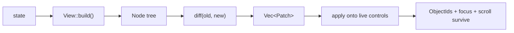

# Declarative View Layer

> **Platform availability.** This chapter describes `rust_widgets::view`, which is
> compiled on `desktop`, `tablet` and `mobile` only. On `mini` and `embedded` the
> module **does not exist** — those profiles build their UI with `add_child` and the
> `create_*` functions. See [Platform Support](platform-support.md).

## Two orthogonal questions

Most discussions of "declarative vs retained" conflate two independent questions:

| Question | This library |
|---|---|
| **Who owns state?** | **Retained.** A control is a long-lived object with an `ObjectId`. It keeps its own fields, and mutating it in place is the normal way to change the UI. |
| **Who describes structure?** | Either. `add_child` describes it imperatively; a `View` describes it declaratively as a function of state. |

React, Flutter and SwiftUI answer these the same way: **declarative *and* retained.**
So "this library is retained" is not an argument against also having a declarative
description. The `view` module adds that second half without taking the first away.

## The loop



`Node` is a plain value — no ids, no live controls, no platform calls. That is what
lets `diff` be a pure function and therefore testable without a window.

## Basic use

```rust
use rust_widgets::view::{Node, View, ViewEngine};
use rust_widgets::widget::capability::CapabilityValue;

struct Counter {
    count: i64,
}

impl View for Counter {
    fn build(&self) -> Node {
        Node::new("group_box")
            .key("root")
            .child(
                Node::new("label")
                    .key("count")
                    .prop("text", CapabilityValue::String(format!("Count: {}", self.count))),
            )
    }
}

let mut engine = ViewEngine::new();
engine.mount(&Counter { count: 0 }, &create);       // builds the tree
engine.update(&Counter { count: 1 }, &create);      // diffs, applies one SetProperty
```

`create` is your bridge from a declarative name to a live control:

```rust
use rust_widgets::core::{ObjectId, Rect};
use rust_widgets::widget::{runtime, Widget, WidgetFactory};
use rust_widgets::view::Node;

let factory = WidgetFactory::new_with_defaults();
let create = move |node: &Node| -> Option<ObjectId> {
    let widget: Box<dyn Widget> =
        factory.create(&node.widget, Rect::new(0, 0, 200, 28), node.key_str().unwrap_or("anon"))?;
    runtime::register(widget)
};
```

It is **injected** rather than hardwired to the JSON loader, so the engine can be
exercised headlessly and a host with its own construction policy is not forced
through the loader's choice.

## Keys are how identity survives

A `key` is what lets `diff` recognise *the same control* across rebuilds. Without
one, matching falls back to position — and then inserting an item at the head
shifts every later node's identity, moving focus and scroll state onto the wrong
controls.

```rust
// Good: an insert at the head leaves the other rows alone.
Node::new("listview").children_of(rows.iter().map(|r| Node::new("label").key(r.id)))

// Degraded: matched by position, so a head insert renumbers everything after it.
Node::new("listview").children_of(rows.iter().map(|r| Node::new("label")))
```

The degradation is **reported**, not silent: `DiffReport::positional_matches`
counts the nodes that had to be matched positionally, and
`DiffReport::replaced_subtrees` counts subtrees rebuilt because their type or key
changed. A non-zero `positional_matches` means "add keys".

Keys must be unique among siblings; `Node::duplicate_sibling_keys()` reports
violations, and `tools/check_view_keys_are_unique.sh` fails the build on a literal
duplicate.

## What `apply` can do

```rust
pub enum Patch {
    SetProperty { id: ObjectId, name: String, value: CapabilityValue },
    Remove      { id: ObjectId },
    Insert      { parent: ObjectId, index: usize, node: Node },
    Move        { id: ObjectId, parent: ObjectId, index: usize },
    Replace     { id: ObjectId, parent: ObjectId, index: usize, node: Node },
}
```

`SetProperty` lands on each control's own published property contract — the same
one the JSON loader writes through — so the declarative layer cannot invent a
property a control does not have.

## Reactive state: `ReactiveHost`

A `Binding` can be set from any thread, so `BindingListener` requires `Send`. A
`ViewEngine` and its controls are `!Send`, because the widget registry is
thread-local. **A listener therefore cannot hold the engine.** That is the
contract, and it names the only sound design:

```text
  worker thread                      UI thread
  ─────────────                      ─────────
  binding.set(v)
    └─ listener fires   ──queue──▶   host.pump()
                                       └─ view.build()
                                          └─ diff → apply   (touches controls)
```

```rust
use rust_widgets::data_binding::Binding;
use rust_widgets::view::ReactiveHost;

let text = Binding::new(String::from("first"));
let mut host = ReactiveHost::new(MyView { text: &text }, Box::new(create));
host.mount();
host.subscribe(&text);

// Any thread:
text.set(String::from("second"));

// UI thread, typically once per frame:
host.pump();   // returns how many rebuilds it performed; 0 is the common case
```

Why a **queue** and not an atomic flag: a flag loses intermediate values, so the
number of updates would depend on timing. That makes "how many patches did that
change cause" non-deterministic, which breaks both tests and reasoning. The queue
keeps the producer's count exact; coalescing becomes an explicit decision rather
than a transport side effect.

## When not to use this layer

- **Build a tree once and never change it.** `JsonLoader::load` already does that;
  a diff over a tree that never changes is pure overhead.
- **One-off imperative edits.** A single `btn.set_text("x")` is cheaper than
  describing a whole tree to produce one patch.
- **Per-frame animation.** Animation is `PropertyAnimation`'s job. This layer
  expresses *target* state; mixing in time would make the diff non-deterministic.
- **On `mini` / `embedded`.** The module is absent; use `add_child`.

## Reachability and cost

A caller that never rebuilds a tree pays nothing: `Node` and `diff` are inert data
and arithmetic with no registration, no global state and no platform calls.

`Patch::SetProperty` is the only path that reaches a control, and `apply` is the
only function in the module that mutates anything — which is what makes the
"nothing else changed" property testable.
