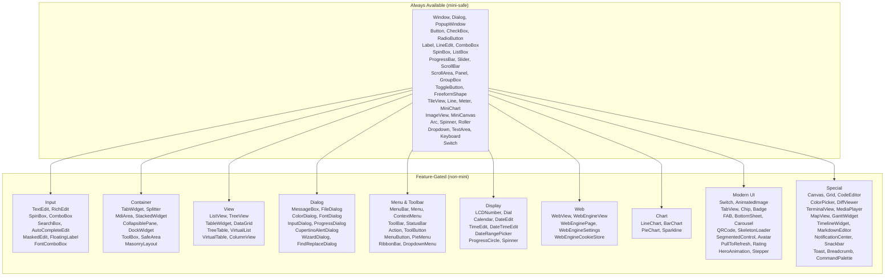
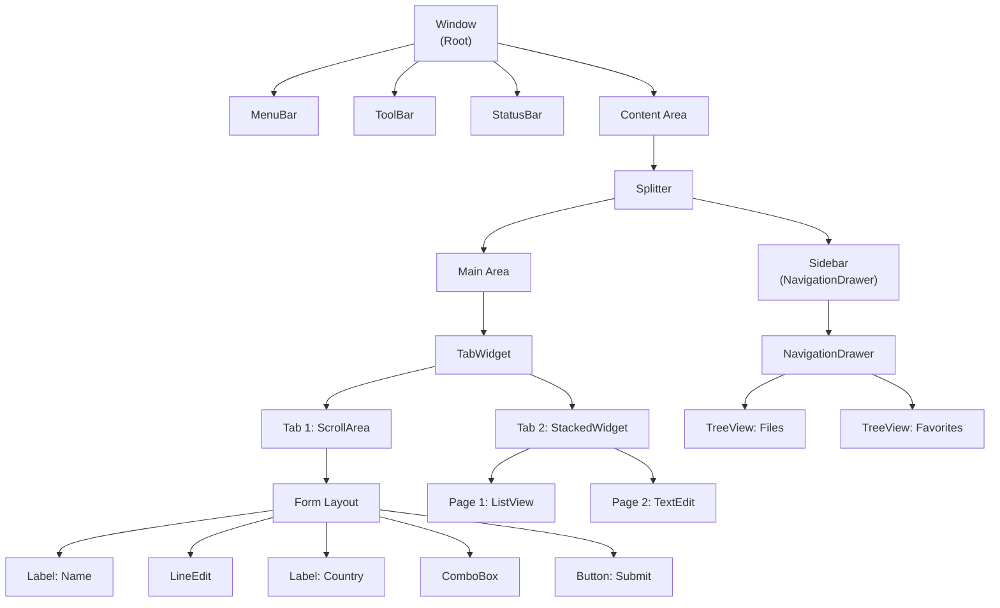

# Widget System

This chapter provides a comprehensive reference for the entire widget system:
the `Widget` trait, `BaseWidget`, rendering, the widget hierarchy, and how to
create custom widgets.

---

## Architecture Overview

Every widget in rust-widgets follows a consistent pattern:

```
┌──────────────────────────────────────────────────┐
│                    Widget Trait                    │
│  (60+ default methods delegating to BaseWidget)   │
├──────────────────────────────────────────────────┤
│                    BaseWidget                      │
│  Shared state: geometry, visibility, signals,     │
│  styling, hierarchy, DPI, tooltip, accessibility  │
├──────────────┬──────────────┬────────────────────┤
│   Draw Trait │ EventHandler │  Custom Signals     │
│ (rendering)  │  (input)     │  (widget-specific)  │
└──────────────┴──────────────┴────────────────────┘
```

Concrete widgets implement (at minimum) three things:
1. **`Widget`** — getters for `base()` and `base_mut()`
2. **`EventHandler`** — how to respond to events
3. **`Draw`** — how to paint the widget

---

## The `Widget` Trait (60+ Default Methods)

```rust
pub trait Widget: EventHandler + Any {
    // ── Base delegation (must implement) ──
    fn base(&self) -> &BaseWidget;
    fn base_mut(&mut self) -> &mut BaseWidget;

    // ── Identity ──
    fn id(&self) -> ObjectId;
    fn kind(&self) -> WidgetKind;

    // ── Geometry (6 methods) ──
    fn geometry(&self) -> Rect;
    fn set_geometry(&mut self, geometry: Rect);
    fn rect(&self) -> Rect;        // alias
    fn set_rect(&mut self, rect: Rect);  // alias
    fn position(&self) -> Point;
    fn size(&self) -> Size;
    fn set_position(&mut self, position: Point);
    fn set_size(&mut self, size: Size);
    fn min_size(&self) -> Option<Size>;
    fn max_size(&self) -> Option<Size>;
    fn set_min_size(&mut self, min_size: Option<Size>);
    fn set_max_size(&mut self, max_size: Option<Size>);

    // ── Hierarchy ──
    fn parent(&self) -> Option<ObjectId>;
    fn set_parent(&mut self, parent: Option<ObjectId>);
    fn children(&self) -> &[ObjectId];
    fn add_child(&mut self, child: ObjectId);
    fn remove_child(&mut self, child: ObjectId);

    // ── Visibility & State ──
    fn show(&mut self);
    fn hide(&mut self);
    fn is_visible(&self) -> bool;
    fn set_visible(&mut self, visible: bool);
    fn is_enabled(&self) -> bool;
    fn set_enabled(&mut self, enabled: bool);

    // ── Styling (13 methods) ──
    fn style(&self) -> &WidgetStyle;
    fn set_style(&mut self, style: WidgetStyle);
    fn background_color(&self) -> Option<Color>;
    fn set_background_color(&mut self, color: Option<Color>);
    fn foreground_color(&self) -> Option<Color>;
    fn set_foreground_color(&mut self, color: Option<Color>);
    fn font(&self) -> Option<&Font>;
    fn set_font(&mut self, font: Option<Font>);
    fn border_color(&self) -> Option<Color>;
    fn border_width(&self) -> u32;
    fn border_radius(&self) -> u32;
    fn set_border_color(&mut self, color: Option<Color>);
    fn set_border_width(&mut self, width: u32);
    fn set_border_radius(&mut self, radius: u32);
    fn set_border(&mut self, color: Option<Color>, width: u32, radius: u32);
    fn padding(&self) -> &Padding;
    fn margin(&self) -> &Margin;
    fn set_padding(&mut self, padding: Padding);

    // ── Tooltip & Accessibility ──
    fn set_tooltip(&mut self, tooltip: String);
    fn tooltip(&self) -> &str;
    fn set_translated_tooltip(&mut self, key: &str);
    fn accessible_name(&self) -> String;
    fn accessible_role(&self) -> AccessibleRole;
    fn accessible_description(&self) -> String;

    // ── DPI ──
    fn dpi_scale(&self) -> f32;
    fn set_dpi_scale(&mut self, scale: f32);
}
```

All default implementations delegate to `BaseWidget`. Concrete widgets only
need to implement `base()` and `base_mut()` — everything else is inherited.

### Minimal Widget Implementation

```rust
use rust_widgets::widget::{Widget, BaseWidget, WidgetKind, Draw};
use rust_widgets::event::{Event, EventHandler};
use rust_widgets::render::RenderContext;
use rust_widgets::core::{Color, Font, Point, Rect};

struct MinimalWidget {
    base: BaseWidget,
}

impl MinimalWidget {
    fn new(geometry: Rect) -> Self {
        Self {
            base: BaseWidget::new(WidgetKind::Panel, geometry, "MinimalWidget"),
        }
    }
}

impl Widget for MinimalWidget {
    fn base(&self) -> &BaseWidget { &self.base }
    fn base_mut(&mut self) -> &mut BaseWidget { &mut self.base }
}

impl EventHandler for MinimalWidget {
    fn handle_event(&mut self, event: &Event) {
        // Delegate to BaseWidget's default event → signal mapping
        self.base.handle_event(event);
    }
}

impl Draw for MinimalWidget {
    fn draw(&mut self, context: &mut RenderContext) {
        let rect = self.geometry();
        context.fill_rect(rect, Color::rgb(200, 200, 200));
        context.draw_text(
            Point::new(rect.x + 10, rect.y + 10),
            "Minimal Widget",
            &Font::simple("Arial", 12.0),
            Color::BLACK,
        );
    }
}
```

---

## `BaseWidget` — Shared State and Signals

Every concrete widget embeds a `BaseWidget`:

```rust
pub struct BaseWidget {
    // Identity
    pub(crate) object: Object,
    pub(crate) kind: WidgetKind,

    // Geometry
    pub(crate) geometry: Rect,
    pub(crate) min_size: Option<Size>,
    pub(crate) max_size: Option<Size>,

    // Hierarchy
    pub(crate) parent: Option<ObjectId>,
    pub(crate) children: MiniVec<ObjectId>,

    // State
    pub(crate) visible: bool,
    pub(crate) enabled: bool,
    pub(crate) mouse_pressed: bool,
    pub(crate) dpi_scale: f32,

    // Styling
    pub(crate) style: WidgetStyle,
    pub(crate) tooltip: MiniString,
    pub(crate) connection_scope: ConnectionScope,

    // ── 11 Built-in Signal Slots ──
    pub clicked: GenericSignal,
    pub hover: Signal1<Point>,
    pub mouse_down: Signal1<(Point, u32)>,
    pub mouse_up: Signal1<(Point, u32)>,
    pub key_down: Signal1<(u32, u32)>,
    pub key_up: Signal1<(u32, u32)>,
    pub focus_gained: GenericSignal,
    pub focus_lost: GenericSignal,
    pub redraw_requested: GenericSignal,
    pub layout_requested: GenericSignal,
    pub changed: GenericSignal,
}

impl BaseWidget {
    pub fn new(kind: WidgetKind, geometry: Rect, class_name: &'static str) -> Self;

    // Accessors for all state fields
    pub fn id(&self) -> ObjectId;
    pub fn kind(&self) -> WidgetKind;
    pub fn geometry(&self) -> Rect;
    pub fn set_geometry(&mut self, geometry: Rect);
    pub fn parent(&self) -> Option<ObjectId>;
    pub fn set_parent(&mut self, parent: Option<ObjectId>);
    pub fn children(&self) -> &[ObjectId];
    pub fn add_child(&mut self, child: ObjectId);
    pub fn remove_child(&mut self, child: ObjectId);
    pub fn show(&mut self);
    pub fn hide(&mut self);
    pub fn is_visible(&self) -> bool;
    pub fn is_enabled(&self) -> bool;
    pub fn set_enabled(&mut self, enabled: bool);
    pub fn dpi_scale(&self) -> f32;
    pub fn set_dpi_scale(&mut self, scale: f32);
    pub fn set_tooltip(&mut self, tooltip: MiniString);
    pub fn tooltip(&self) -> &str;
    pub fn set_translated_tooltip(&mut self, key: &str);

    // Style accessors
    pub fn style(&self) -> &WidgetStyle;
    pub fn set_style(&mut self, style: WidgetStyle);
    pub fn request_redraw(&mut self);  // emits redraw_requested
    pub fn request_layout(&mut self);  // emits layout_requested
}
```

### The 11 Base Signals

| Signal | Type | Emitted When |
|---|---|---|
| `clicked` | `GenericSignal` | User clicks/interacts with the widget |
| `hover` | `Signal1<Point>` | Mouse cursor moves over the widget |
| `mouse_down` | `Signal1<(Point, u32)>` | Mouse button pressed on widget |
| `mouse_up` | `Signal1<(Point, u32)>` | Mouse button released on widget |
| `key_down` | `Signal1<(u32, u32)>` | Key pressed while widget focused |
| `key_up` | `Signal1<(u32, u32)>` | Key released while widget focused |
| `focus_gained` | `GenericSignal` | Widget receives input focus |
| `focus_lost` | `GenericSignal` | Widget loses input focus |
| `redraw_requested` | `GenericSignal` | Widget needs repainting |
| `layout_requested` | `GenericSignal` | Widget needs layout recalculation |
| `changed` | `GenericSignal` | Widget's value/state changed |

### Connecting to Signals

```rust
use rust_widgets::widget::{Widget, BaseWidget, WidgetKind, Draw};
use rust_widgets::core::{Point, Rect};

let mut widget = MyWidget::new(Rect::new(10, 10, 200, 100));

// Persistent connection:
widget.base.clicked.connect(|| {
    println!("Widget was clicked!");
});

// One-shot connection (auto-disconnects after first activation):
widget.base.hover.connect_once(|point: std::sync::Arc<Point>| {
    println!("First hover at ({}, {})", point.x, point.y);
});

// Scoped connection (auto-disconnects when scope drops):
let scope = rust_widgets::signal::ConnectionScope::new();
widget.base.changed.connect_scoped(&scope, || {
    println!("Widget value changed");
});
// ... scope drops here → connection automatically removed
```

---

## The `Draw` Trait

The `Draw` trait enables widgets to render custom content through the
`RenderContext`:

```rust
pub trait Draw {
    /// Draw the widget's content using the provided render context.
    fn draw(&mut self, context: &mut RenderContext);

    /// Returns true if this widget uses custom drawing.
    fn uses_custom_drawing(&self) -> bool { true }

    /// Optional: Request a redraw of the widget.
    fn request_custom_redraw(&self) {}
}
```

### `RenderContext` — Drawing Primitives

The `RenderContext` provides the core drawing API:

```rust
impl RenderContext {
    // Filled shapes
    pub fn fill_rect(&mut self, rect: Rect, color: Color);
    pub fn fill_rounded_rect(&mut self, rect: Rect, radius: u32, color: Color);
    pub fn fill_circle(&mut self, center: Point, radius: u32, color: Color);

    // Stroked shapes
    pub fn draw_rect_stroke(&mut self, rect: Rect, color: Color, width: u32);
    pub fn draw_line(&mut self, from: Point, to: Point, color: Color);

    // Text
    pub fn draw_text(&mut self, pos: Point, text: &str, font: &Font, color: Color);

    // Images
    pub fn draw_image(&mut self, rect: Rect, image: &Image);
}
```

### Complete `Draw` Example

```rust
use rust_widgets::widget::Draw;
use rust_widgets::render::RenderContext;
use rust_widgets::core::{Color, Font, Point, Rect};

impl Draw for MyWidget {
    fn draw(&mut self, context: &mut RenderContext) {
        let rect = self.geometry();
        let style = self.style();

        // 1. Draw background
        let bg = style.background_color.unwrap_or(Color::rgb(240, 240, 240));
        let radius = style.border_radius;
        context.fill_rounded_rect(rect, radius, bg);

        // 2. Draw border
        if let Some(border) = style.border_color {
            context.draw_rect_stroke(rect, border, style.border_width);
        }

        // 3. Draw text centered
        let font = style.font.as_ref().unwrap_or(&Font::default_ui());
        let text = "My Widget";
        let text_color = style.text_color.unwrap_or(Color::BLACK);

        // Center text within the widget rect
        let text_x = rect.x + (rect.width as i32 / 2) - 30;
        let text_y = rect.y + (rect.height as i32 / 2);
        context.draw_text(Point::new(text_x, text_y), text, font, text_color);

        // 4. Draw an accent line at the bottom
        let accent_y = rect.y + rect.height as i32 - 2;
        context.draw_line(
            Point::new(rect.x, accent_y),
            Point::new(rect.x + rect.width as i32, accent_y),
            Color::BLUE,
        );
    }
}
```

---

## `EventHandler` — Default Implementation

`BaseWidget` provides a default `EventHandler` that maps platform events to
signal emissions:

```rust
impl EventHandler for BaseWidget {
    fn handle_event(&mut self, event: &Event) {
        match event {
            Event::MouseDown { position, button, .. } => {
                self.mouse_pressed = true;
                self.mouse_down.emit((*position, *button));
            }
            Event::MouseUp { position, button, .. } => {
                self.mouse_pressed = false;
                self.mouse_up.emit((*position, *button));
            }
            Event::MouseMove { position, .. } => {
                self.hover.emit(*position);
            }
            Event::KeyDown { key, modifiers, .. } => {
                self.key_down.emit((*key, *modifiers));
            }
            Event::KeyUp { key, modifiers, .. } => {
                self.key_up.emit((*key, *modifiers));
            }
            Event::FocusGained => {
                self.focus_gained.emit();
            }
            Event::FocusLost => {
                self.focus_lost.emit();
            }
            Event::Click => {
                self.clicked.emit();
            }
            Event::Redraw => {
                self.redraw_requested.emit();
            }
            Event::Layout => {
                self.layout_requested.emit();
            }
            Event::ValueChanged => {
                self.changed.emit();
            }
            _ => {}
        }
    }
}
```

Custom widgets can add additional logic before or after delegating:

```rust
impl EventHandler for MyWidget {
    fn handle_event(&mut self, event: &Event) {
        // Pre-processing:
        if let Event::Click = event {
            log::info!("MyWidget clicked at ({},{})", self.position().x, self.position().y);
        }

        // Delegate to base (emits signals):
        self.base.handle_event(event);

        // Post-processing:
        if self.base.is_enabled() {
            if let Event::MouseMove { position, .. } = event {
                self.track_mouse_trail(*position);
            }
        }
    }
}
```

---

## `WidgetKind` Enum — 109+ Variants

The `WidgetKind` enum categorizes every widget type. It is feature-gated:
15 variants are always available; 94+ require non-`mini` features.



### Complete WidgetKind Reference

| Category | Variant | Mini-Safe | Description |
|---|---|---|---|
| **Window** | `Window` | ✓ | Top-level application window |
| | `Dialog` | ✓ | Modal dialog |
| | `PopupWindow` | ✓ | Non-modal popup |
| **Base** | `Button` | ✓ | Push button |
| | `CheckBox` | ✓ | Check box (on/off/partial) |
| | `RadioButton` | ✓ | Radio button (exclusive group) |
| | `Label` | ✓ | Text label |
| | `ToggleButton` | ✓ | Toggle button (stays pressed) |
| | `Switch` | ✓ | On/off toggle switch |
| | `FreeformShape` | ✓ | Path-based clickable shape |
| **Input** | `LineEdit` | ✓ | Single-line text input |
| | `TextArea` | ✓ | Multi-line text input |
| | `ComboBox` | ✓ | Drop-down selection |
| | `SpinBox` | ✓ | Numeric spinner |
| | `ListBox` | ✓ | Scrolling selection list |
| | `Slider` | ✓ | Horizontal value slider |
| | `Dropdown` | ✓ | Standalone dropdown |
| | `Keyboard` | ✓ | On-screen virtual keyboard |
| | `TextEdit` | ✗ | Rich text editor |
| | `RichEdit` | ✗ | Full rich-text editing |
| | `SearchBox` | ✗ | Search input with icon |
| | `AutoCompleteEdit` | ✗ | Text input with suggestions |
| | `MaskedEdit` | ✗ | Formatted text mask |
| | `FloatingLabel` | ✗ | Material Design floating label |
| | `CommandLink` | ✗ | Command link button |
| | `FontComboBox` | ✗ | Font family selector |
| | `KeySequenceEdit` | ✗ | Keyboard shortcut editor |
| | `TagInput` | ✗ | Tag/chip text input |
| **Container** | `ScrollArea` | ✓ | Scrollable viewport |
| | `GroupBox` | ✓ | Group/panel container |
| | `Panel` | ✓ | Panel (alias for GroupBox) |
| | `TileView` | ✓ | Swipeable tiled pages |
| | `TabWidget` | ✗ | Tabbed panel container |
| | `Splitter` | ✗ | Resizable split panels |
| | `MdiArea` | ✗ | MDI sub-window area |
| | `StackedWidget` | ✗ | Card-stack container |
| | `CollapsiblePane` | ✗ | Expandable/collapsible pane |
| | `DockWidget` | ✗ | Dockable panel |
| | `DockPanel` | ✗ | Dock panel (alias) |
| | `ToolBox` | ✗ | Toolbox container |
| | `SafeArea` | ✗ | Safe area inset container |
| | `MasonryLayout` | ✗ | Pinterest-style waterfall layout |
| | `NavigationStack` | ✗ | Push/pop page navigation |
| **Display** | `ProgressBar` | ✓ | Progress indicator |
| | `ScrollBar` | ✓ | Scroll bar |
| | `Line` | ✓ | Divider line |
| | `Meter` | ✓ | Gauge with arc+needle |
| | `MiniChart` | ✓ | Simplified line/bar chart |
| | `ImageView` | ✓ | Image display |
| | `MiniCanvas` | ✓ | Simplified drawing surface |
| | `Arc` | ✓ | Circular progress arc |
| | `Spinner` | ✓ | Rotating loading indicator |
| | `Roller` | ✓ | Scroll-wheel selector |
| | `LCDNumber` | ✗ | LCD digit display |
| | `Dial` | ✗ | Rotary dial widget |
| | `Calendar` | ✗ | Calendar month view |
| | `DateEdit` | ✗ | Date input field |
| | `TimeEdit` | ✗ | Time input field |
| | `DateTimeEdit` | ✗ | Combined date+time input |
| | `DatePicker` | ✗ | Date picker (alias) |
| | `TimePicker` | ✗ | Time picker (alias) |
| | `DateTimePicker` | ✗ | DateTime picker (alias) |
| | `DateRangePicker` | ✗ | Date range selection |
| | `ProgressCircle` | ✗ | Circular progress |
| | `Rating` | ✗ | Star rating control |
| | `Icon` | ✗ | Icon widget |
| | `Stepper` | ✗ | Stepper control |
| **View** | `ListView` | ✗ | Multi-column list |
| | `TreeView` | ✗ | Hierarchical tree |
| | `TableWidget` | ✗ | Tabular data table |
| | `DataGrid` | ✗ | Data grid with sorting/filtering |
| | `TreeTable` | ✗ | Tree + table combo |
| | `VirtualList` | ✗ | Virtualized list |
| | `VirtualTable` | ✗ | Virtualized table |
| | `ColumnView` | ✗ | Column view (alias) |
| | `DataView` | ✗ | Data view (alias) |
| | `UndoView` | ✗ | Undo history view |
| | `PropertyGrid` | ✗ | Property editor grid |
| **Dialog** | `MessageBox` | ✗ | Modal message dialog |
| | `FileDialog` | ✗ | File open/save dialog |
| | `DirectoryDialog` | ✗ | Directory chooser |
| | `ColorDialog` | ✗ | Color picker dialog |
| | `FontDialog` | ✗ | Font selection dialog |
| | `InputDialog` | ✗ | Single-input dialog |
| | `ProgressDialog` | ✗ | Progress dialog |
| | `FindReplaceDialog` | ✗ | Find/replace dialog |
| | `WizardDialog` | ✗ | Step-by-step wizard |
| | `CupertinoAlertDialog` | ✗ | iOS-style alert |
| **Menu & Toolbar** | `MenuBar` | ✗ | Menu bar |
| | `Menu` | ✗ | Drop-down menu |
| | `MenuItem` | ✗ | Menu item (always available) |
| | `ContextMenu` | ✗ | Right-click menu |
| | `ToolBar` | ✗ | Tool bar |
| | `StatusBar` | ✗ | Status bar |
| | `Action` | ✗ | Action widget |
| | `ToolButton` | ✗ | Toolbar button |
| | `MenuButton` | ✗ | Button with dropdown menu |
| | `PieMenu` | ✗ | Radial/pie menu |
| | `RibbonBar` | ✗ | Office-style ribbon |
| | `TabBar` | ✗ | Standalone tab bar |
| | `DropdownMenu` | ✗ | Dropdown menu selector |
| **Modern UI** | `FAB` | ✗ | Floating action button |
| | `BottomSheet` | ✗ | Bottom sheet panel |
| | `BottomNavigationBar` | ✗ | Bottom tab bar |
| | `NavigationDrawer` | ✗ | Side navigation drawer |
| | `AppBar` | ✗ | Top app bar |
| | `Chip` | ✗ | Chip/tag widget |
| | `Badge` | ✗ | Notification badge |
| | `SkeletonLoader` | ✗ | Loading placeholder |
| | `PullToRefresh` | ✗ | Pull-to-refresh control |
| | `RefreshControl` | ✗ | Refresh indicator |
| | `Carousel` | ✗ | Swipeable image carousel |
| | `Avatar` | ✗ | User avatar |
| | `EmptyState` | ✗ | Empty state placeholder |
| | `Divider` | ✗ | Divider/separator line |
| | `PagerPageView` | ✗ | Paged view with dots |
| | `SegmentedControl` | ✗ | Material 3 segmented control |
| | `SegmentedButton` | ✗ | Segmented button group |
| | `Popover` | ✗ | Floating popover card |
| | `Tooltip` | ✗ | Tooltip widget |
| | `Snackbar` | ✗ | Material snackbar notification |
| | `ToastStack` | ✗ | Toast notification stack |
| | `Breadcrumb` | ✗ | Breadcrumb navigation |
| | `SplitButton` | ✗ | Split action button |
| | `ModalBottomSheet` | ✗ | Draggable bottom sheet |
| | `SwipeToDismiss` | ✗ | Swipe gesture container |
| **Cupertino** | `CupertinoSwitch` | ✗ | iOS-style switch |
| | `CupertinoSlider` | ✗ | iOS-style slider |
| | `CupertinoNavigationBar` | ✗ | iOS large title nav bar |
| | `CupertinoSegmentedControl` | ✗ | iOS pill segmented control |
| | `CupertinoDatePicker` | ✗ | iOS scrolling wheel picker |
| | `MaterialNavigationRail` | ✗ | Material side nav rail |
| | `MaterialSnackbar` | ✗ | Material snackbar |
| **Special** | `Canvas` | ✗ | Drawing canvas |
| | `Grid` | ✗ | Grid layout widget |
| | `Chart` | ✗ | Chart surface |
| | `ColorPicker` | ✗ | Color picker control |
| | `CodeEditor` | ✗ | Code editor widget |
| | `DiffViewer` | ✗ | Diff comparison viewer |
| | `TerminalView` | ✗ | Terminal emulator |
| | `MediaPlayer` | ✗ | Media player widget |
| | `MapView` | ✗ | Map display widget |
| | `GanttWidget` | ✗ | Gantt chart widget |
| | `TimelineWidget` | ✗ | Timeline widget |
| | `MarkdownEditor` | ✗ | Markdown editor |
| | `CommandPalette` | ✗ | Command palette widget |
| | `NotificationCenter` | ✗ | Notification center |
| | `QRCode` | ✗ | QR code display |
| | `VideoPlayer` | ✗ | Video player |
| | `ImageGallery` | ✗ | Image gallery browser |
| | `AudioVisualizer` | ✗ | Audio waveform display |
| | `CameraPreview` | ✗ | Camera viewfinder |
| | `BarcodeScanner` | ✗ | Barcode/QR scanner |
| | `AnimatedImage` | ✗ | Frame-sequence animation; feed RGBA frames via `load_frames` (stream decoding not built in) |
| | `HeroAnimation` | ✗ | Shared element transition |
| | `BezierCurveEditor` | ✗ | Bezier curve editor |
| | `LottieWidget` | ✗ | Lottie animation player |
| | `RiveWidget` | ✗ | Rive animation runtime |
| **Chart** | `LineChart` | ✗ | Line chart |
| | `BarChart` | ✗ | Bar chart |
| | `PieChart` | ✗ | Pie chart |
| | `Sparkline` | ✗ | Inline sparkline |
| **Web** | `WebView` | ✗ | Web content display |
| | `WebEngineView` | ✗ | Web engine view |
| | `WebEnginePage` | ✗ | Web page widget |
| | `WebEngineSettings` | ✗ | Web settings |
| | `WebEngineDownloadItem` | ✗ | Download item widget |
| | `WebEngineCookieStore` | ✗ | Cookie store widget |
| | `WebEngineWebChannel` | ✗ | JS communication channel |
| | `WebEngineFindTextResult` | ✗ | Find text result |
| | `WebEngineNotification` | ✗ | Web notification |
| | `WebEngineScriptDialog` | ✗ | JS dialog widget |
| | `WebEngineContextMenuRequest` | ✗ | Context menu request |
| **Mobile** | `MobileDatePicker` | ✗ | Mobile-style date picker |
| | `SearchBar` | ✗ | iOS-style search bar |
| | `AdaptiveScaffold` | ✗ | Cross-platform scaffold |
| | `TabView` | ✗ | iOS segmented tab page view |
| | `ImePreedit` | ✗ | IME composition text overlay |

---

## Widget Category Deep Dives

### Window Widget

The `Window` is the root widget — every application has at least one:

```rust
use rust_widgets::widget::{Window, Widget, BaseWidget, Draw, WidgetKind};
use rust_widgets::core::{Color, Font, Point, Rect};
use rust_widgets::signal::GenericSignal;

pub struct Window {
    base: BaseWidget,
    title: String,
    title_bar_height: u32,
    close_button_size: u32,
    button_spacing: u32,
    pub closed: GenericSignal,  // Custom signal
}

impl Window {
    pub fn new(title: String, geometry: Rect) -> Self {
        Self {
            base: BaseWidget::new(WidgetKind::Window, geometry, "Window"),
            title,
            title_bar_height: 32,
            close_button_size: 14,
            button_spacing: 40,
            closed: GenericSignal::new(),
        }
    }

    pub fn add_child(&mut self, child: ObjectId) {
        self.base.add_child(child);
    }

    pub fn title(&self) -> &str { &self.title }
    pub fn set_title(&mut self, title: String) { self.title = title; }

    /// Emits the `closed` signal.
    pub fn close(&mut self) { self.closed.emit(); }
}

impl Widget for Window {
    fn base(&self) -> &BaseWidget { &self.base }
    fn base_mut(&mut self) -> &mut BaseWidget { &mut self.base }
}

impl EventHandler for Window {
    fn handle_event(&mut self, event: &Event) {
        self.base.handle_event(event);
        if matches!(event, Event::Quit) {
            self.closed.emit();
        }
    }
}
```

`Window` renders a title bar, close/minimize/maximize buttons, window
border, and delegate content area — all through its `Draw` implementation.

### Container Widgets

Containers use `SimpleRegistry` to forward rendering and events to children:

```rust
use rust_widgets::widget::{SimpleRegistry, Widget, BaseWidget, Draw, WidgetKind};
use rust_widgets::event::{Event, EventHandler};
use rust_widgets::render::RenderContext;
use rust_widgets::core::{ObjectId, Rect};

struct FrameWidget {
    base: BaseWidget,
    registry: SimpleRegistry,
}

impl FrameWidget {
    fn new(title: &str, geometry: Rect) -> Self {
        Self {
            base: BaseWidget::new(WidgetKind::GroupBox, geometry, "Frame"),
            registry: SimpleRegistry::new(),
        }
    }

    fn add_child_widget<W: Widget + Draw + EventHandler + 'static>(
        &mut self,
        child: &mut W,
    ) {
        let id = child.id();
        self.base.add_child(id);

        // Register the child's draw + event handlers
        // (In practice, this uses closures that borrow the child)
        self.registry.register(
            id,
            |ctx| { /* forward to child.draw(ctx) */ },
            |evt| { /* forward to child.handle_event(evt) */ },
        );
    }
}
```

---

## WidgetFactory and Capability System

### WidgetCapability

The capability system allows querying what features a widget supports:

```rust
pub struct WidgetCapability {
    pub kind: WidgetKind,
    pub properties: HashMap<String, PropertySchema>,
    pub features: Vec<String>,
}

pub enum PropertyValueKind {
    Integer, Float, String, Boolean, Color, Font, Enum(Vec<String>),
}

pub struct PropertySchema {
    pub name: String,
    pub kind: PropertyValueKind,
    pub writable: bool,
    pub default_value: CapabilityValue,
}

pub enum CapabilityValue {
    Integer(i64), Float(f64), String(String),
    Boolean(bool), Color(Color), Font(Font),
}
```

### WidgetFactory

The `WidgetFactory` centralizes widget construction:

```rust
pub struct WidgetFactory {
    creators: HashMap<WidgetKind, Box<dyn WidgetCreator>>,
}

impl WidgetFactory {
    pub fn new() -> Self;
    pub fn register<W: Widget + 'static>(&mut self, kind: WidgetKind);
    pub fn create(&self, kind: WidgetKind, geometry: Rect) -> Option<Box<dyn Widget>>;
    pub fn capabilities(&self, kind: WidgetKind) -> Option<&WidgetCapability>;
}
```

---

## Creating a Custom Widget (Complete Example)

Below is a complete custom widget that tracks a counter, responds to clicks,
and custom-renders itself:

```rust
use rust_widgets::widget::{Widget, BaseWidget, WidgetKind, Draw};
use rust_widgets::event::{Event, EventHandler};
use rust_widgets::render::RenderContext;
use rust_widgets::signal::{GenericSignal, ConnectionScope};
use rust_widgets::core::{Color, Font, Point, Rect, Size, ObjectId};

/// A clickable counter widget that increments on each click.
pub struct CounterWidget {
    base: BaseWidget,
    count: u32,
    /// Emitted when the count changes, with the new value.
    pub count_changed: GenericSignal,
}

impl CounterWidget {
    pub fn new(geometry: Rect) -> Self {
        let mut base = BaseWidget::new(WidgetKind::Panel, geometry, "CounterWidget");
        base.set_min_size(Some(Size::new(60, 30)));

        Self {
            base,
            count: 0,
            count_changed: GenericSignal::new(),
        }
    }

    pub fn count(&self) -> u32 {
        self.count
    }

    pub fn reset(&mut self) {
        self.count = 0;
        self.count_changed.emit();
        self.base.request_redraw();
    }

    fn increment(&mut self) {
        self.count += 1;
        self.count_changed.emit();
        self.base.request_redraw();
    }
}

impl Widget for CounterWidget {
    fn base(&self) -> &BaseWidget {
        &self.base
    }

    fn base_mut(&mut self) -> &mut BaseWidget {
        &mut self.base
    }
}

impl EventHandler for CounterWidget {
    fn handle_event(&mut self, event: &Event) {
        // Pre-process clicks to increment the counter
        if let Event::Click = event {
            self.increment();
        }

        // Always delegate to base for signal emissions
        self.base.handle_event(event);
    }
}

impl Draw for CounterWidget {
    fn draw(&mut self, context: &mut RenderContext) {
        let rect = self.geometry();
        let style = self.style();

        // Background
        let bg = style.background_color.unwrap_or(Color::rgb(52, 152, 219));
        let radius = style.border_radius;
        context.fill_rounded_rect(rect, radius, bg);

        // Text: show the count
        let text = format!("Count: {}", self.count);
        let font = Font::bold("Arial", 14.0);
        let text_color = Color::WHITE;

        // Center the text
        let text_w = (text.len() as u32 * 8); // rough estimate
        let text_x = rect.x + (rect.width as i32 / 2) - (text_w as i32 / 2);
        let text_y = rect.y + (rect.height as i32 / 2) + 5;
        context.draw_text(Point::new(text_x, text_y), &text, &font, text_color);

        // Draw a subtle inner highlight at the top
        let highlight_rect = Rect::new(rect.x, rect.y, rect.width, rect.height / 2);
        let highlight = Color::rgba(255, 255, 255, 40);
        context.fill_rounded_rect(highlight_rect, radius, highlight);
    }
}

// Usage:
fn main() {
    let mut counter = CounterWidget::new(Rect::new(10, 10, 160, 40));

    // Connect to custom signal:
    counter.count_changed.connect(|| {
        println!("Counter changed!");
    });

    // Connect to base signal:
    counter.base.clicked.connect(|| {
        println!("Counter was clicked!");
    });

    // Simulate a click (in a real app, the event loop sends Click events):
    counter.handle_event(&Event::Click);
    println!("Count is now: {}", counter.count());  // → 1
}
```

---

## Widget Hierarchy — Tree Diagram



---

## Layout Integration

Widgets participate in the layout system through their geometry and
size-constraint methods:

```rust
// Configure a widget for layout:
widget.set_min_size(Some(Size::new(100, 30)));
widget.set_max_size(Some(Size::new(400, 200)));

// Layout engines call set_geometry to position widgets:
widget.set_geometry(Rect::new(10, 20, 200, 100));

// After layout, read the final position:
let pos = widget.position();
let sz = widget.size();
let rect = widget.geometry();
```

The `layout_requested` signal fires when a widget needs its parent layout
container to recalculate positions. The `redraw_requested` signal fires when
visual state needs repainting.

---

## Accessibility

Every widget exposes accessibility information through the `Widget` trait:

```rust
impl Widget for MyWidget {
    fn accessible_name(&self) -> String {
        // Prefer tooltip, fall back to widget kind name
        let tooltip = self.tooltip().trim();
        if tooltip.is_empty() {
            format!("{:?}", self.kind())
        } else {
            tooltip.to_string()
        }
    }

    fn accessible_role(&self) -> AccessibleRole {
        AccessibleRole::from(self.kind())
    }

    fn accessible_description(&self) -> String {
        let mut flags = Vec::new();
        if !self.is_enabled() { flags.push("disabled"); }
        if !self.is_visible() { flags.push("hidden"); }
        if flags.is_empty() {
            format!("{:?}", self.accessible_role())
        } else {
            format!("{:?} ({})", self.accessible_role(), flags.join(", "))
        }
    }
}
```

The `a11y` feature bridges this information to platform accessibility APIs
(AT-SPI on Linux, NSAccessibility on macOS, UI Automation on Windows).

---

## Widget Lifecycle Summary

```
┌──────────────────────────────────────────────────────────┐
│                     Widget Lifecycle                       │
├──────────────┬───────────────────────────────────────────┤
│  1. Creation │ new(geometry) → BaseWidget(WidgetKind)     │
│  2. Configure│ set_style, set_text, set_tooltip,          │
│              │   set_min_size, connect signals            │
│  3. Parenting│ set_parent(parent_id)                      │
│              │   parent.add_child(child_id)               │
│  4. Layout   │ Layout engine sets geometry               │
│  5. Show     │ show() → visible = true                    │
│  6. Paint    │ Draw::draw(context) → render pipeline      │
│  7. Events   │ EventHandler::handle_event → signal emits  │
│  8. Update   │ set_geometry, set_style → redraw_requested │
│  9. Hide     │ hide() → visible = false                   │
│ 10. Destroy  │ Drop impl → cleanup, disconnect signals    │
└──────────────┴───────────────────────────────────────────┘
```

---

## Signal Wiring Patterns

### Pattern 1: Widget-to-Widget Communication

```rust
// When button is clicked, update the label text:
button.base.clicked.connect({
    let label_id = label.id();
    move || {
        // In a real app, use handle-based text updates:
        // label.set_text("Button was clicked!");
    }
});
```

### Pattern 2: Value-to-Display Binding

```rust
// Slider value → label text:
slider.base.changed.connect({
    move || {
        let value = slider.value();
        label.set_text(&format!("Value: {}", value));
    }
});
```

### Pattern 3: Window Close Handler

```rust
window.closed.connect(|| {
    println!("Window is closing, save state...");
    // Perform cleanup
    app.quit();
});
```

### Pattern 4: Scoped Connections for Temporary UI

```rust
{
    let scope = ConnectionScope::new();

    // These connections are only active while this dialog exists:
    ok_button.base.clicked.connect_scoped(&scope, || {
        dialog.accept();
    });
    cancel_button.base.clicked.connect_scoped(&scope, || {
        dialog.reject();
    });

    // ... show dialog, wait for result ...

} // scope drops → all connections disconnected automatically
```

---

## Best Practices

### 1. Always Delegate to `base.handle_event()`

```rust
impl EventHandler for MyWidget {
    fn handle_event(&mut self, event: &Event) {
        // PRE: custom pre-processing
        self.base.handle_event(event);  // ← always call this
        // POST: custom post-processing
    }
}
```

The default handler maps events to the 11 base signals. Skipping it means
those signals never fire.

### 2. Clean Up Connections with `ConnectionScope`

```rust
struct MyForm {
    scope: ConnectionScope,
    submit_button: Box<dyn Widget>,
    // ...
}

impl Drop for MyForm {
    fn drop(&mut self) {
        // Connections auto-disconnected when scope drops
    }
}
```

### 3. Check Visibility/Enabled Before Expensive Work

```rust
impl Draw for ExpensiveWidget {
    fn draw(&mut self, context: &mut RenderContext) {
        if !self.is_visible() {
            return;  // Skip rendering entirely
        }
        // ... expensive rendering ...
    }
}
```

### 4. Use `request_redraw()` Sparingly

Instead of calling `request_redraw()` in tight loops, batch changes:

```rust
// Bad: multiple redraws
widget.set_position(new_pos);  // triggers redraw
widget.set_text("new text");    // triggers another redraw

// Good: batch then redraw once
widget.set_geometry(new_rect);
widget.set_text("new text");
widget.base.request_redraw();   // single redraw
```

### 5. Validate Input Sizes

```rust
pub fn new(geometry: Rect) -> Self {
    let mut base = BaseWidget::new(WidgetKind::Panel, geometry, "MyWidget");

    // Ensure minimum touch target size (44x44):
    if geometry.width < 44 || geometry.height < 44 {
        let expanded = geometry.expand_to_touch_target();
        base.set_geometry(expanded);
    }

    Self { base, /* ... */ }
}
```

---

## Next Steps

- **Layout System** — learn how widgets are positioned using Box, Grid, Stack,
  Flow, Flex, and Absolute layout algorithms
- **Event System** — deep dive into event types, propagation, gesture
  recognition, and timer management
- **Styling & Theming** — understand `WidgetStyle`, CSS-based theming,
  and hot-reload of stylesheets
- **Rendering System** — explore GPU/CPU/SVG backends, dirty regions,
  and partial refresh optimization
