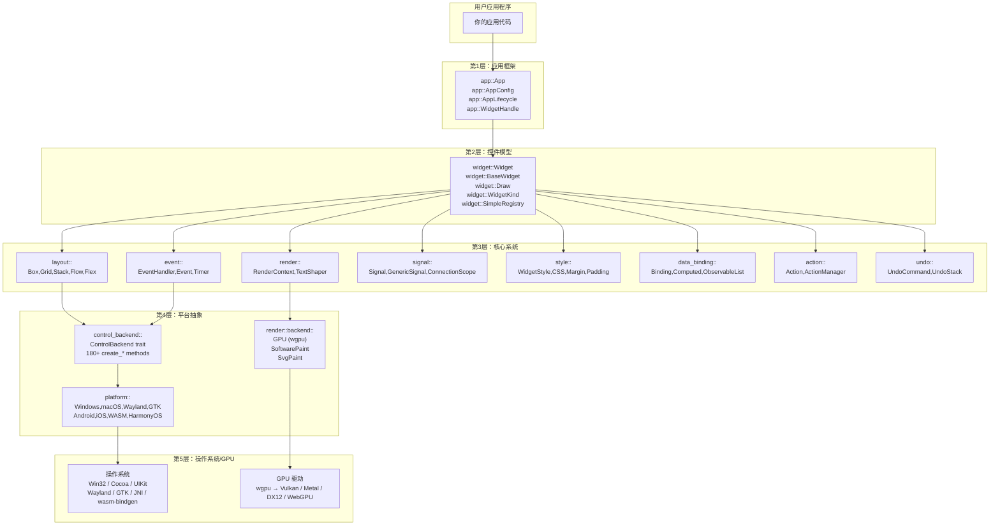
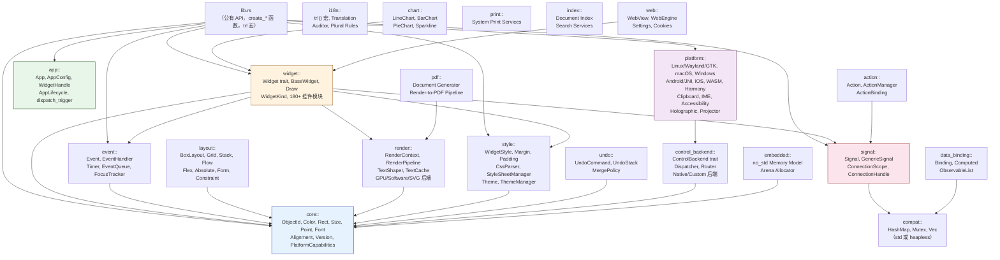
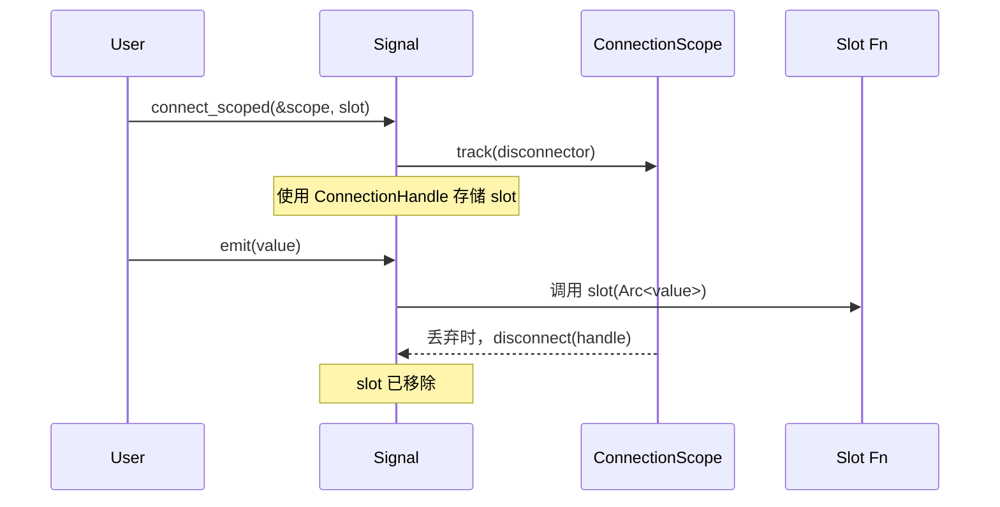
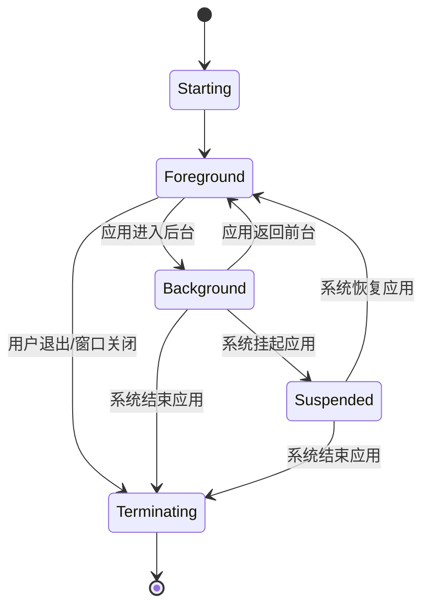
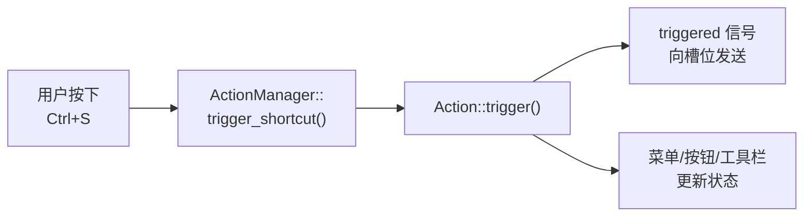

# 架构概览

本章解释 `rust-widgets` 的分层架构、crate 层次结构、核心抽象，以及编译时与运行时决策如何协同工作以生成高效的跨平台二进制文件。

---

## 层次模型

`rust-widgets` 按照**五层堆栈**组织，每一层仅依赖于其下方的一层：



### 各层职责

| 层 | 职责 | 关键模块 |
|---|---|---|
| **应用框架** | 应用生命周期、控件句柄、事件循环编排 | `app::App`, `AppConfig`, `WindowHandle`, `AppLifecycle` |
| **控件模型** | 控件 trait 契约、基础控件状态、信号槽位、渲染分发、容器组合 | `widget::Widget`, `BaseWidget`, `Draw`, `WidgetKind`, `SimpleRegistry` |
| **核心系统** | 布局、渲染、事件、信号、样式、数据绑定、动作、撤销/重做 | `layout`, `render`, `event`, `signal`, `style`, `data_binding`, `action`, `undo` |
| **平台抽象** | 操作系统原生控件创建、事件转换、剪贴板、输入法、辅助功能 | `control_backend::ControlBackend`, `platform` |
| **操作系统/GPU** | 原始平台 API、GPU 驱动 | 操作系统 SDK + `wgpu` |

---

## Crate 层次结构与模块依赖



### 模块汇总表

| 模块 | 路径 | 用途 |
|---|---|---|
| **core** | `src/core/` | 基础类型：`ObjectId`, `Color`, `Rect`, `Size`, `Point`, `Font`, `Alignment`, `Version` |
| **widget** | `src/widget/` | Widget trait、BaseWidget、WidgetKind、Draw、180+ 控件实现 |
| **app** | `src/app/` | 应用生命周期、`App`/`AppConfig`、类型化 `WidgetHandle` |
| **signal** | `src/signal/` | 信号/槽系统：`Signal<T>`, `GenericSignal`, `ConnectionScope` |
| **event** | `src/event/` | 事件类型、`EventHandler` trait、定时器、焦点跟踪、事件队列 |
| **layout** | `src/layout/` | 布局算法：Box, Grid, Stack, Flow, Flex, Absolute, Constraint |
| **render** | `src/render/` | 渲染：`RenderContext`、文字塑形、GPU/CPU/SVG 后端 |
| **style** | `src/style/` | 样式：`WidgetStyle`、CSS 解析器、主题、边距、内边距 |
| **data_binding** | `src/data_binding/` | 响应式绑定：`Binding<T>`, `Computed<T>`, `ObservableList<T>` |
| **action** | `src/action/` | 动作系统：`Action`, `ActionManager`, 快捷键绑定 |
| **undo** | `src/undo/` | 撤销/重做：`UndoCommand`, `UndoStack`, 合并策略 |
| **control_backend** | `src/control_backend/` | `ControlBackend` trait（180+ 方法）、调度器、路由器 |
| **platform** | `src/platform/` | 各操作系统后端、剪贴板、输入法、辅助功能、移动端 API |
| **i18n** | `src/i18n/` | 翻译基础设施、`tr!()` 宏 |
| **chart** | `src/chart/` | 图表控件：Line, Bar, Pie, Sparkline |
| **pdf** | `src/pdf/` | PDF 文档生成 |
| **print** | `src/print/` | 系统打印服务集成 |
| **memory** | `src/memory/` | 竞技场分配器、`no_std` 内存模型 |
| **gesture** | `src/gesture/` | 11 个手势识别器 |
| **shortcut** | `src/shortcut/` | 键盘快捷键定义与匹配 |
| **theme** | `src/theme/` | 主题管理器、样式表管理 |
| **json** | `src/json/` | JSON 布局加载与解析 |
| **compat** | `src/compat.rs` | `std` ↔ `no_std` 兼容性桥接 |

---

## 核心类型层

`src/core/` 模块提供了整个库中使用的基础类型。每个控件、布局和渲染操作都通过这些原语来表达：

```rust
// 位置：src/core/mod.rs——公有重新导出
pub use alignment::{Alignment, HorizontalAlignment, VerticalAlignment};
pub use color::Color;
pub use font::Font;
pub use geometry::{Orientation, Point, Rect, Size};
pub use mutex_ext::MutexExt;
pub use types::{
    CoreConfig, CoreError, CoreObject, CoreResult, DeviceClass,
    ObjectId, PlatformCapabilities, PlatformFamily, RuntimeProfile, Version,
};
```

| 类型 | 用途 |
|---|---|
| `ObjectId` | `u64` 包装器——每个控件和核心对象的稳定数字标识符 |
| `Color` | RGBA 颜色，包含 55+ 常量、十六进制解析、混合、亮度 |
| `Point` | `(x: i32, y: i32)`——2D 坐标 |
| `Size` | `(width: u32, height: u32)`——矩形尺寸 |
| `Rect` | `(x: i32, y: i32, width: u32, height: u32)`——定位矩形 |
| `Font` | 字体系列、大小、字重、粗体、斜体描述符 |
| `Alignment` | 5 方向对齐：Left, Center, Right, Top, Bottom |
| `HorizontalAlignment` | Left, Center, Right |
| `VerticalAlignment` | Top, Center, Bottom |
| `Version` | 语义化版本，包含 major/minor/patch、解析、比较 |
| `RuntimeProfile` | Full / Embedded |
| `DeviceClass` | Desktop, Tablet, Mobile, Embedded, Projector |
| `PlatformFamily` | Desktop, Embedded, Mobile, Tablet, Projector |
| `PlatformCapabilities` | GPU、触摸、键盘、鼠标、屏幕尺寸、DPI |
| `CoreConfig` | 配置文件 + 平台 + 能力 + 版本的组合包 |
| `CoreError` | InvalidArgument, NotSupported, NotFound, Internal |
| `CoreObject` | Trait: `id()`, `set_id()`, `type_name()` |

### 坐标系统

所有定位使用**屏幕坐标**，原点位于左上角：

```text
(0, 0) -------------> X
  |
  |    屏幕空间（像素）
  |    原点：左上角
  |
  v Y
```

`core::coords` 中的转换工具支持：
- 屏幕 ↔ 笛卡尔（`to_screen_y`, `to_cartesian_y`）
- 屏幕 ↔ PDF（`to_pdf_y`, `from_pdf_y`）
- DPI 缩放（`dpi_to_pixels`, `pixels_to_dpi`）
- 坐标标准化/反标准化
- 矩形在不同系统间的转换

### 矩形合并

`core::rect_merge` 提供了集中式的矩形合并算法：
- `merge_intersecting_rects()` — 将重叠矩形合并为最小的覆盖集合
- `bounding_rect()` — 计算一组矩形的包围盒

### Mutex 扩展

`core::MutexExt` 添加了一个 `.lock_guard()` 方法，通过调用毒化错误上的 `into_inner()` 来恢复中毒的互斥锁，避免在恢复场景中出现 panic。

> 有关每个核心类型的详细 API 文档，请参见[核心类型](core-types.md)章节。

---

## 控件层

控件层定义了每个 UI 元素遵循的契约。

### `Widget` Trait（60+ 默认方法）

```rust
pub trait Widget: EventHandler + Any {
    // 基础委托
    fn base(&self) -> &BaseWidget;
    fn base_mut(&mut self) -> &mut BaseWidget;

    // 标识
    fn id(&self) -> ObjectId;
    fn kind(&self) -> WidgetKind;

    // 几何属性
    fn geometry(&self) -> Rect;
    fn set_geometry(&mut self, geometry: Rect);
    fn rect(&self) -> Rect;
    fn position(&self) -> Point;
    fn size(&self) -> Size;
    fn set_position(&mut self, position: Point);
    fn set_size(&mut self, size: Size);
    fn min_size(&self) -> Option<Size>;
    fn max_size(&self) -> Option<Size>;
    fn set_min_size(&mut self, min_size: Option<Size>);
    fn set_max_size(&mut self, max_size: Option<Size>);

    // 层次结构
    fn parent(&self) -> Option<ObjectId>;
    fn set_parent(&mut self, parent: Option<ObjectId>);
    fn children(&self) -> &[ObjectId];
    fn add_child(&mut self, child: ObjectId);
    fn remove_child(&mut self, child: ObjectId);

    // 可见性与状态
    fn show(&mut self);
    fn hide(&mut self);
    fn is_visible(&self) -> bool;
    fn set_visible(&mut self, visible: bool);
    fn is_enabled(&self) -> bool;
    fn set_enabled(&mut self, enabled: bool);

    // 样式
    fn style(&self) -> &WidgetStyle;
    fn set_style(&mut self, style: WidgetStyle);
    fn background_color(&self) -> Option<Color>;
    fn foreground_color(&self) -> Option<Color>;
    fn font(&self) -> Option<&Font>;
    fn border_color(&self) -> Option<Color>;
    fn border_width(&self) -> u32;
    fn border_radius(&self) -> u32;
    fn set_border(&mut self, color: Option<Color>, width: u32, radius: u32);
    fn padding(&self) -> &Padding;
    fn margin(&self) -> &Margin;
    fn set_padding(&mut self, padding: Padding);

    // 提示文本与辅助功能
    fn set_tooltip(&mut self, tooltip: String);
    fn tooltip(&self) -> &str;
    fn set_translated_tooltip(&mut self, key: &str);
    fn accessible_name(&self) -> String;
    fn accessible_role(&self) -> AccessibleRole;
    fn accessible_description(&self) -> String;

    // DPI
    fn dpi_scale(&self) -> f32;
    fn set_dpi_scale(&mut self, scale: f32);
}
```

### `BaseWidget` — 共享状态

每个具体的控件都嵌入了一个 `BaseWidget`，它提供：

```rust
pub struct BaseWidget {
    // 标识
    object: Object,
    kind: WidgetKind,

    // 几何属性
    geometry: Rect,
    min_size: Option<Size>,
    max_size: Option<Size>,

    // 层次结构
    parent: Option<ObjectId>,
    children: MiniVec<ObjectId>,

    // 状态
    visible: bool,
    enabled: bool,
    mouse_pressed: bool,
    dpi_scale: f32,

    // 样式
    style: WidgetStyle,
    tooltip: MiniString,
    connection_scope: ConnectionScope,

    // 信号槽位（11 个内置信号）
    pub clicked: GenericSignal,
    pub hover: Signal1<Point>,
    pub mouse_down: Signal1<(Point, u32)>,
    pub mouse_up: Signal1<(Point, u32)>,
    pub key_down: Signal1<(u32, u32)>,
    pub key_up: Signal1<(u32, u32)>,
    pub focus_gained: GenericSignal,
    pub focus_lost: GenericSignal,
    pub redraw_requested: GenericSignal,
    pub layout_requested: GenericSignal,
    pub changed: GenericSignal,
}
```

每个控件都可以免费获得这 11 个信号，并根据需要添加自定义信号（例如 `Window::closed`）。

### `Draw` Trait

渲染自定义内容的控件实现了 `Draw` trait：

```rust
pub trait Draw {
    /// 使用提供的渲染上下文绘制控件内容。
    fn draw(&mut self, context: &mut RenderContext);

    /// 如果此控件使用自定义绘制，返回 true。
    fn uses_custom_drawing(&self) -> bool { true }

    /// 可选：请求重绘该控件。
    fn request_custom_redraw(&self) {}
}
```

### `EventHandler` Trait

所有控件通过 `EventHandler` trait 处理事件（位于 `src/event/`）：

```rust
pub trait EventHandler {
    fn handle_event(&mut self, event: &Event);
}
```

`BaseWidget` 提供了一个默认实现，将平台事件映射为信号发射（click → `clicked.emit()`，鼠标移动 → `hover.emit(point)`）。

### `WidgetKind` Enum — 109+ 变体

`WidgetKind` 枚举对所有控件类型进行分类。变体受功能门控：15 个在所有配置文件中可用，94+ 个通过非 `mini` 功能解锁：

```rust
pub enum WidgetKind {
    // 始终可用（15 个）：
    Window, Dialog, PopupWindow,
    Button, CheckBox, RadioButton, Label,
    LineEdit, ComboBox, SpinBox, ListBox,
    ProgressBar, Slider, ScrollBar, ScrollArea,
    Panel, GroupBox, ToggleButton,
    FreeformShape, TileView,
    Line, Meter, MiniChart, ImageView,
    MiniCanvas, Arc, Spinner, Roller,
    Dropdown, TextArea, Keyboard, Switch,

    // 功能门控（94+ 个）：
    #[cfg(not(feature = "mini"))]
    MessageBox, FileDialog, ColorDialog, FontDialog,
    InputDialog, ProgressDialog,
    TextEdit, RichEdit,
    ListView, TreeView, Table, Grid, Chart,
    TabWidget, Splitter, MdiArea,
    MenuBar, Menu, MenuItem, ContextMenu,
    ToolBar, StatusBar, Canvas, DockPanel,
    Calendar, DatePicker, TimePicker, DateTimePicker,
    WebView, WebEngineView, WebEnginePage,
    Action, ToolButton,
    TabBar, PieMenu, RibbonBar,
    SearchBox, Chip, Badge, SkeletonLoader,
    FAB, PullToRefresh, BottomSheet,
    BottomNavigationBar, NavigationDrawer, AppBar,
    // ... 以及 50+ 更多
}
```

### 通过 `SimpleRegistry` 进行容器组合

像 `Frame`、`TabWidget` 和 `ScrollArea` 这样的容器使用 `SimpleRegistry` 将渲染和事件转发给通过 `ObjectId` 标识的子控件：

```rust
pub struct SimpleRegistry {
    entries: HashMap<ObjectId, (DrawClosure, EventClosure)>,
}

impl SimpleRegistry {
    pub fn register<D, E>(&mut self, id: ObjectId, draw: D, event: E);
    pub fn draw_widget(&mut self, id: ObjectId, context: &mut RenderContext) -> bool;
    pub fn forward_event(&mut self, id: ObjectId, event: &Event) -> bool;
}
```

这弥合了基于 `ObjectId` 的子控件跟踪（在 `BaseWidget` 中）与基于 trait 对象的渲染/事件分发系统之间的鸿沟。

---

## 信号/槽系统

信号/槽系统提供了类型安全、可重入安全、带作用域的事件接线。

### 核心类型

```rust
// 带泛型载荷 T 的类型化信号：
pub struct Signal<T: Clone + Send + 'static>;

// 零参数信号：
pub struct GenericSignal { inner: Signal<()> }

// 旧别名：
pub type Signal1<T> = Signal<T>;

// 不透明的连接句柄：
pub struct ConnectionHandle(pub u64);

// 所有者作用域——丢弃时自动断开连接：
pub struct ConnectionScope;
```

### Signal<T> API

```rust
impl<T: Clone + Send + 'static> Signal<T> {
    pub fn new() -> Self;
    pub fn connect<F>(&self, slot: F) -> ConnectionHandle;
    pub fn connect_once<F>(&self, slot: F) -> ConnectionHandle;
    pub fn connect_scoped<F>(&self, owner: &ConnectionScope, slot: F) -> ConnectionHandle;
    pub fn connect_once_scoped<F>(&self, owner: &ConnectionScope, slot: F) -> ConnectionHandle;
    pub fn disconnect(&self, handle: ConnectionHandle) -> bool;
    pub fn disconnect_all(&self);
    pub fn emit(&self, value: T);
    pub fn slot_count(&self) -> usize;
}
```

### 连接生命周期



### 可重入安全性

`emit()` 方法在写锁下排空所有槽位，在**锁外部**调用回调，然后重新插入非 `once` 槽位。这允许回调安全地调用同一个 `Signal` 上的 `connect`、`disconnect`、`disconnect_all` 或 `emit` 而不会死锁。

### 内置控件信号

每个 `BaseWidget` 暴露 11 个信号槽位供连接：

| 信号 | 类型 | 触发时机 |
|---|---|---|
| `clicked` | `GenericSignal` | 收到类似点击的交互 |
| `hover` | `Signal1<Point>` | 鼠标移动到控件上 |
| `mouse_down` | `Signal1<(Point, u32)>` | 鼠标按钮按下 |
| `mouse_up` | `Signal1<(Point, u32)>` | 鼠标按钮释放 |
| `key_down` | `Signal1<(u32, u32)>` | 键盘按键按下 |
| `key_up` | `Signal1<(u32, u32)>` | 键盘按键释放 |
| `focus_gained` | `GenericSignal` | 控件获得焦点 |
| `focus_lost` | `GenericSignal` | 控件失去焦点 |
| `redraw_requested` | `GenericSignal` | 需要重绘 |
| `layout_requested` | `GenericSignal` | 需要重新计算布局 |
| `changed` | `GenericSignal` | 有状态值发生变化 |

---

## 数据绑定

`data_binding` 模块提供了响应式数据容器：

### `Binding<T>` — 双向响应式值

```rust
pub struct Binding<T: Clone + Send + 'static> {
    value: T,
    listeners: HashMap<String, BoxedListener>,
}

impl<T: Clone + Send + 'static> Binding<T> {
    pub fn new(value: T) -> Self;
    pub fn get(&self) -> T;
    pub fn set(&mut self, value: T);           // 通知监听器
    pub fn subscribe(&mut self, key: &str, listener: BoxedListener);
    pub fn unsubscribe(&mut self, key: &str);
    pub fn bind_to(&mut self, other: &mut Binding<T>);  // 双向同步
}
```

### `Computed<T>` — 派生响应式值

```rust
pub struct Computed<T: Clone + Send + 'static> {
    compute_fn: Box<dyn Fn() -> T>,
    cached: T,
    dirty: bool,
    listeners: HashMap<String, BoxedListener>,
}

impl<T: Clone + Send + 'static> Computed<T> {
    pub fn new<F>(compute: F, initial: T) -> Self;
    pub fn get(&mut self) -> T;       // 如果脏则重新计算，变化时通知
    pub fn get_cached(&self) -> T;
    pub fn invalidate(&mut self);     // 标记为脏——下次 get() 时重新计算
    pub fn is_dirty(&self) -> bool;
    pub fn subscribe(&mut self, key: &str, listener: BoxedListener);
}
```

### 双向绑定

`bind_to()` 创建一个双向同步，带有 `AtomicBool` 保护以防止无限通知循环：

```rust
let mut a = Binding::new(10);
let mut b = Binding::new(20);

a.bind_to(&mut b);

a.set(30);  // b 也变成 30
b.set(50);  // a 也变成 50
```

---

## 应用框架

### `App` — 应用包装器

```rust
pub struct App {
    // 内部：管理生命周期、回调、控件工厂
}

impl App {
    pub fn new() -> Self;
    pub fn with_config(config: AppConfig) -> Self;
    pub fn init(&self);
    pub fn run(&self);
    pub fn on_startup<F: FnMut() + 'static>(self, f: F) -> Self;
    pub fn on_shutdown<F: FnMut() + 'static>(self, f: F) -> Self;
}
```

### `AppConfig`

```rust
pub struct AppConfig {
    pub app_name: String,
    pub organization: String,
    pub enable_i18n: bool,
}
```

### `WidgetHandle` Trait

每个类型化句柄都实现了 `WidgetHandle`，它提供了通用操作：

```rust
pub trait WidgetHandle: Sized {
    fn raw_id(&self) -> ObjectId;
    fn from_raw(id: ObjectId) -> Self;
    fn show(&self);
    fn hide(&self);
    fn set_geometry(&self, x: i32, y: i32, w: u32, h: u32);
    fn set_text(&self, text: &str);
    fn text(&self) -> String;
    fn enable(&self);
    fn disable(&self);
    fn is_enabled(&self) -> bool;
    fn set_visible(&self, visible: bool);
    fn is_visible(&self) -> bool;
    fn on_click<F: FnMut() + 'static>(&self, f: F);
    fn on_value_changed<F: FnMut(String) + 'static>(&self, f: F);
}
```

### 生命周期状态机



---

## 动作系统

### `Action` — 用户可调用的命令

```rust
pub struct Action {
    pub id: String,
    pub text: String,
    enabled: bool,
    checkable: bool,
    checked: bool,
    triggered: GenericSignal,
    toggled: Signal1<bool>,
    enabled_changed: Signal1<bool>,
}

impl Action {
    pub fn new(id: impl Into<String>, text: impl Into<String>) -> Self;
    pub fn is_enabled(&self) -> bool;
    pub fn set_enabled(&mut self, enabled: bool);
    pub fn is_checkable(&self) -> bool;
    pub fn set_checkable(&mut self, checkable: bool);
    pub fn is_checked(&self) -> bool;
    pub fn set_checked(&mut self, checked: bool);
    pub fn trigger(&mut self) -> bool;
    pub fn connect_triggered<F>(&self, slot: F) -> ConnectionHandle;
    pub fn connect_toggled<F>(&self, slot: F) -> ConnectionHandle;
    pub fn connect_enabled_changed<F>(&self, slot: F) -> ConnectionHandle;
}
```

### `ActionManager` — 注册表 + 快捷键路由器

```rust
pub struct ActionManager {
    actions: HashMap<String, Action>,
    shortcut_to_action: HashMap<String, String>,
    bindings: Vec<ActionBinding>,
}

impl ActionManager {
    pub fn register_action(&mut self, id: impl Into<String>, text: impl Into<String>) -> bool;
    pub fn action(&self, id: &str) -> Option<&Action>;
    pub fn action_mut(&mut self, id: &str) -> Option<&mut Action>;
    pub fn bind_shortcut(&mut self, shortcut: impl Into<String>, action_id: impl Into<String>) -> bool;
    pub fn trigger_shortcut(&mut self, shortcut: &str) -> bool;
    pub fn trigger_action(&mut self, action_id: &str) -> bool;
    pub fn bind_action_to_menu(&mut self, action_id: impl Into<String>, menu_id: ObjectId) -> bool;
    pub fn bind_action_to_toolbar(&mut self, action_id: impl Into<String>, toolbar_id: ObjectId) -> bool;
    pub fn bind_action_to_button(&mut self, action_id: impl Into<String>, button_id: ObjectId) -> bool;
}
```

`ActionManager` 桥接了 `action` 模块与 `shortcut` 模块，使得键盘快捷键可以解析为动作。

### 动作绑定流程



---

## 撤销/重做系统

### `UndoCommand` Trait

```rust
pub trait UndoCommand {
    fn id(&self) -> CommandId;
    fn description(&self) -> CommandDescription;
    fn execute(&mut self) -> Result<(), String>;
    fn undo(&mut self) -> Result<(), String>;
    fn redo(&mut self) -> Result<(), String> { self.execute() }
    fn merge_policy(&self) -> MergePolicy { MergePolicy::Never }
    fn try_merge(&mut self, previous: &dyn UndoCommand) -> bool { false }
}
```

### `MergePolicy`

```rust
pub enum MergePolicy {
    Never,          // 始终作为单独命令推送
    WithPrevious,   // 尝试与上一个命令合并
}
```

### `UndoStack` — 有界撤销/重做

```rust
pub struct UndoStack {
    undo_stack: Vec<Box<dyn UndoCommand>>,
    redo_stack: Vec<Box<dyn UndoCommand>>,
    max_capacity: usize,
    clean_index: Option<usize>,
}

impl UndoStack {
    pub fn new() -> Self;                    // 默认容量：100
    pub fn with_capacity(max: usize) -> Self;
    pub fn push(&mut self, command: Box<dyn UndoCommand>);
    pub fn undo(&mut self) -> Result<(), String>;
    pub fn redo(&mut self) -> Result<(), String>;
    pub fn can_undo(&self) -> bool;
    pub fn can_redo(&self) -> bool;
    pub fn undo_text(&self) -> Option<String>;
    pub fn redo_text(&self) -> Option<String>;
    pub fn mark_clean(&mut self);
    pub fn is_clean(&self) -> bool;
    pub fn clear(&mut self);
    pub fn set_max_capacity(&mut self, max: usize);
}
```

关键行为：
- 新的 `push()` **清空重做栈**（标准的撤销/重做契约）
- 当超出容量时，**最旧的命令** 被淘汰
- 具有 `MergePolicy::WithPrevious` 的命令会被合并（例如，连续的文本编辑合并为一个可撤销的操作）
- `mark_clean()` / `is_clean()` 跟踪"已保存"状态

---

## 控制后端

### `ControlBackend` Trait — 180+ 方法

`ControlBackend` trait 定义了控件模型与平台原生实现之间的接口。它是添加新平台的唯一集成点：

```rust
pub trait ControlBackend {
    // 标识
    fn backend_name(&self) -> &'static str;
    fn kind(&self) -> crate::platform::PlatformFamily;

    // 通用
    fn create_widget(&mut self, kind: WidgetKind, ...) -> ObjectId;

    // 窗口
    fn create_window(&mut self, title, x, y, w, h) -> ObjectId;

    // 基础控件：Button, CheckBox, Label, LineEdit, RadioButton,
    //           Slider, ProgressBar, ComboBox, ListBox, SpinBox...

    // 容器：GroupBox, TabWidget, Splitter, ScrollArea, MdiArea,
    //        StackedWidget, DockPanel...

    // 视图：ListView, TreeView, Table, Grid, Canvas, DataView...

    // 输入：TextEdit, RichEdit, SpinBox, Dial, Calendar, DatePicker...

    // 对话框：MessageBox, FileDialog, ColorDialog, FontDialog,
    //           ProgressDialog, InputDialog...

    // Web：WebView, WebEngineView, WebEnginePage,
    //       WebEngineSettings, WebEngineCookieStore, WebEngineWebChannel...

    // 菜单/工具栏：MenuBar, Menu, ContextMenu, ToolBar, StatusBar,
    //              Action, ToolButton...

    // 状态管理
    fn set_widget_text(&mut self, id: ObjectId, text: &str);
    fn get_widget_text(&self, id: ObjectId) -> String;
    fn show_widget(&mut self, id: ObjectId);
    fn hide_widget(&mut self, id: ObjectId);
    fn set_widget_enabled(&mut self, id: ObjectId, enabled: bool);
    fn set_widget_visible(&mut self, id: ObjectId, visible: bool);
    fn set_widget_geometry(&mut self, id: ObjectId, x: i32, y: i32, w: u32, h: u32);

    // 事件轮询
    fn poll_widget_triggered(&self) -> Option<(ObjectId, WidgetTriggerKind)>;
    fn inject_widget_trigger_event(&mut self, id: ObjectId, kind: WidgetTriggerKind);

    // 输入法与辅助功能
    fn set_widget_ime_enabled(&mut self, id: ObjectId, enabled: bool);
    fn set_widget_accessibility_name(&mut self, id: ObjectId, name: &str);

    // 剪贴板
    fn set_clipboard_text(&mut self, text: &str);
    fn get_clipboard_text(&self) -> String;

    // 拖放
    fn begin_drag(&mut self, id: ObjectId);
    fn poll_drop_event(&self) -> Option<DropEvent>;
}
```

### 调度策略

`control_backend::dispatcher` 中的调度器根据编译时的功能标志将控件创建调用路由到相应的后端。`control_backend::routing` 中的路由系统处理 180+ 种控件类型，将每种类型映射到正确的原生或自定义实现。

---

## 编译时 vs 运行时决策

`rust-widgets` 广泛利用编译时决策来保持运行时开销最小：

| 决策 | 机制 | 时机 |
|---|---|---|
| **设备配置文件** | `#[cfg(feature = "desktop/tablet/mobile/embedded/mini")]` | 编译时 |
| **操作系统后端** | `#[cfg(feature = "windows/macos/linux-wayland/etc")]` | 编译时 |
| **GPU vs CPU 渲染** | `#[cfg(feature = "wgpu/software")]` | 编译时 |
| **控件可用性** | `WidgetKind` 变体上的 `#[cfg(not(feature = "mini"))]` | 编译时 |
| **内存模型** | `compat.rs` 将 `HashMap`/`Mutex`/`Vec` 映射到 std 或 heapless | 编译时 |
| **控件创建** | `ControlBackend::create_*` 分发到操作系统原生或自定义实现 | 运行时 |
| **事件转换** | 平台事件由后端转换为 `Event` 枚举 | 运行时 |
| **布局** | 由用户选择布局算法，在运行时应用 | 运行时 |
| **信号连接** | `Signal::connect()` / `connect_scoped()` | 运行时 |
| **国际化区域** | 启动时检测区域，`tr!()` 键在编译时解析 | 两者 |

### `compat.rs` 桥接

一个文件（`src/compat.rs`）桥接了 `std` 和 `no_std` 环境：

```rust
// 在 std 下（desktop/tablet/mobile）：
pub use std::collections::HashMap;
pub use std::sync::Mutex;
pub type MiniVec<T> = Vec<T>;
pub type MiniString = String;

// 在 mini/embedded (no_std) 下：
pub use hashbrown::HashMap;
pub use spin::Mutex;
pub type MiniVec<T, const N: usize = 64> = heapless::Vec<T, N>;
pub type MiniString = heapless::String<128>;
```

这意味着控件代码不需要为内存类型添加 `#[cfg]` 注解——`compat` 层抽象了这些差异。

---

## 关键架构原则

1. **基于 trait 的多态性，而非继承。** `Widget` trait 提供 60+ 个默认方法，委托给 `BaseWidget`。具体控件仅需覆盖它们需要的部分。

2. **基于 ObjectId 的标识，而非引用。** 控件通过 `u64` ID 标识，避免了控件树中的生命周期和借用问题。

3. **信号/槽实现解耦。** 控件不知道它们的消费者。它们发出信号，消费者连接槽位。这实现了 UI 与逻辑的清晰分离。

4. **编译时功能选择。** 死代码由编译器消除。mini 配置文件的二进制文件仅包含约 15 个控件实现，无来自未使用控件代码的开销。

5. **单一后端契约。** `ControlBackend` trait 是新平台的唯一集成点。实现 180+ 个方法一次，整个控件库即可在新目标上运行。

6. **可重入安全的信号。** 信号系统设计为绝不会死锁，即使回调在发射过程中修改了信号图。

---

## 下一步

- **核心类型**——深入探讨 `src/core/` 中的每个类型，包含代码示例
- **控件系统**——探索完整的控件层次结构、控件生命周期，以及如何创建自定义控件
- **事件系统**——理解事件类型、传播、手势识别和定时器系统
