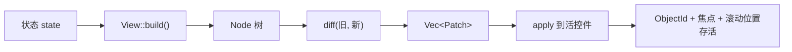

# 声明式视图层

> **平台可用性。** 本章描述的 `rust_widgets::view` 仅在 `desktop`、`tablet`、
> `mobile` 三档编译。`mini` 与 `embedded` 下该模块**不存在** —— 这两档用
> `add_child` 与 `create_*` 构建界面。见[平台支持](platform-support.md)。

## 两个正交的问题

关于「声明式 vs 保留式」的讨论，多数把两个**互不相关**的问题混在了一起：

| 问题 | 本库的答案 |
|---|---|
| **谁持有状态？** | **保留式**。控件是带 `ObjectId` 的长期对象，持有自己的字段，直接改它就是常规改 UI 的方式。 |
| **谁描述结构？** | 两者皆可。`add_child` 是命令式描述；`View` 则把结构描述为状态的函数。 |

React、Flutter、SwiftUI 对这两个问题的回答与这里一致：**既是声明式，也是保留式。**
所以「本库是保留式」并不构成「不能有声明式描述」的理由。`view` 模块加上的正是后一半，
且没有拿掉前一半。

## 闭环



`Node` 是**普通值** —— 不含 id、不含活控件、不调用平台 API。这正是 `diff` 能是纯函数、
因而能脱离窗口测试的原因。

## 基本用法

```rust
use rust_widgets::view::{Node, View, ViewEngine};
use rust_widgets::widget::capability::CapabilityValue;

struct Counter {
    count: i64,
}

impl View for Counter {
    fn build(&self) -> Node {
        Node::new("group_box")
            .key("root")
            .child(
                Node::new("label")
                    .key("count")
                    .prop("text", CapabilityValue::String(format!("Count: {}", self.count))),
            )
    }
}

let mut engine = ViewEngine::new();
engine.mount(&Counter { count: 0 }, &create);       // 建树
engine.update(&Counter { count: 1 }, &create);      // 求差，只施加一个 SetProperty
```

`create` 是从「声明名」到「活控件」的桥：

```rust
use rust_widgets::core::{ObjectId, Rect};
use rust_widgets::widget::{runtime, Widget, WidgetFactory};
use rust_widgets::view::Node;

let factory = WidgetFactory::new_with_defaults();
let create = move |node: &Node| -> Option<ObjectId> {
    let widget: Box<dyn Widget> =
        factory.create(&node.widget, Rect::new(0, 0, 200, 28), node.key_str().unwrap_or("anon"))?;
    runtime::register(widget)
};
```

它是**注入**的而非硬连 JSON 加载器，因此引擎可以无窗口测试，且有自己构造策略的宿主
不会被加载器的实现选择绑架。

## `key` 是身份存活的关键

`key` 让 `diff` 在重建之间认出**同一个控件**。没有 key 时匹配退化为按位置 ——
此时在头部插入一项会让其后每个节点的身份漂移，把焦点与滚动状态转移到错误的控件上。

```rust
// 正确：头部插入不影响其余行。
Node::new("listview").children_of(rows.iter().map(|r| Node::new("label").key(r.id)))

// 降级：按位置匹配，头部插入会重排其后全部身份。
Node::new("listview").children_of(rows.iter().map(|r| Node::new("label")))
```

降级是**被上报**的，不是静默的：`DiffReport::positional_matches` 统计被迫按位置匹配的
节点数，`DiffReport::replaced_subtrees` 统计因类型或 key 变化而整棵重建的子树数。
`positional_matches` 非零就意味着「该补 key 了」。

key 必须在兄弟间唯一；`Node::duplicate_sibling_keys()` 会上报冲突，
`tools/check_view_keys_are_unique.sh` 遇到字面量重复直接失败。

## `apply` 能做什么

```rust
pub enum Patch {
    SetProperty { id: ObjectId, name: String, value: CapabilityValue },
    Remove      { id: ObjectId },
    Insert      { parent: ObjectId, index: usize, node: Node },
    Move        { id: ObjectId, parent: ObjectId, index: usize },
    Replace     { id: ObjectId, parent: ObjectId, index: usize, node: Node },
}
```

`SetProperty` 落在每个控件**自身**公开的属性契约上 —— 与 JSON 加载器写入的是同一套 ——
因此声明式层不可能凭空发明一个控件并不具备的属性。

## 响应式状态：`ReactiveHost`

`Binding` 可以被任意线程 set，所以 `BindingListener` 要求 `Send`。
而 `ViewEngine` 及其控件是 `!Send`，因为控件注册表是 thread-local。
**因此监听器不能持有引擎。** 这就是契约本身，它点名了唯一正确的设计：

```text
  工作线程                            UI 线程
  ─────────────                      ─────────
  binding.set(v)
    └─ 监听器触发   ──队列──▶  host.pump()
                                  └─ view.build()
                                     └─ diff → apply   （碰控件）
```

```rust
use rust_widgets::data_binding::Binding;
use rust_widgets::view::ReactiveHost;

let text = Binding::new(String::from("first"));
let mut host = ReactiveHost::new(MyView { text: &text }, Box::new(create));
host.mount();
host.subscribe(&text);

// 任意线程：
text.set(String::from("second"));

// UI 线程，通常每帧一次：
host.pump();   // 返回本次执行的重建次数；常见情况是 0
```

**为什么用队列而不是原子标志**：标志会**丢失中间值**，使更新次数依赖时序 ——
于是「这次改动产生几个 patch」变得不确定，测试与推理都不可靠。
队列保持生产者计数精确；若要合并，那是调用方的**显式决定**，而不是传输层的副作用。

## 什么时候不要用这一层

- **只建一次、永不改动的树。** `JsonLoader::load` 已经做了这件事；
  对永不变化的树求差纯属额外开销。
- **一次性的命令式修改。** 单次 `btn.set_text("x")` 比为产生一个 patch 而描述整棵树更省。
- **逐帧动画。** 动画是 `PropertyAnimation` 的职责。本层表达的是**目标**状态，
  混入时间会让 diff 不确定。
- **在 `mini` / `embedded` 上。** 该模块不存在；请用 `add_child`。

## 可达性与开销

从不重建树的调用方不付任何代价：`Node` 与 `diff` 是惰性数据与算术，
没有注册、没有全局状态、不调用平台 API。

`Patch::SetProperty` 是唯一抵达控件的路径，而 `apply` 是该模块中唯一会 mutate 的函数 ——
这正是「其余什么都没变」这一性质可被测试的原因。
