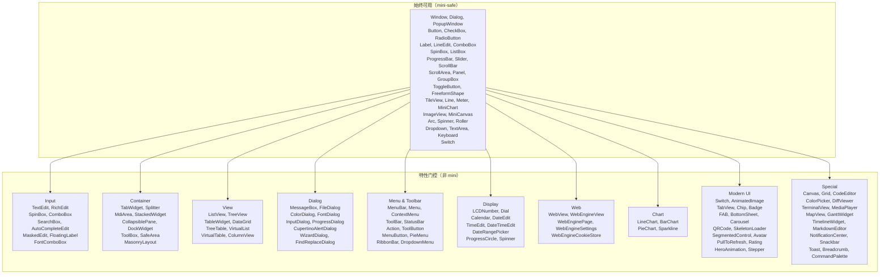
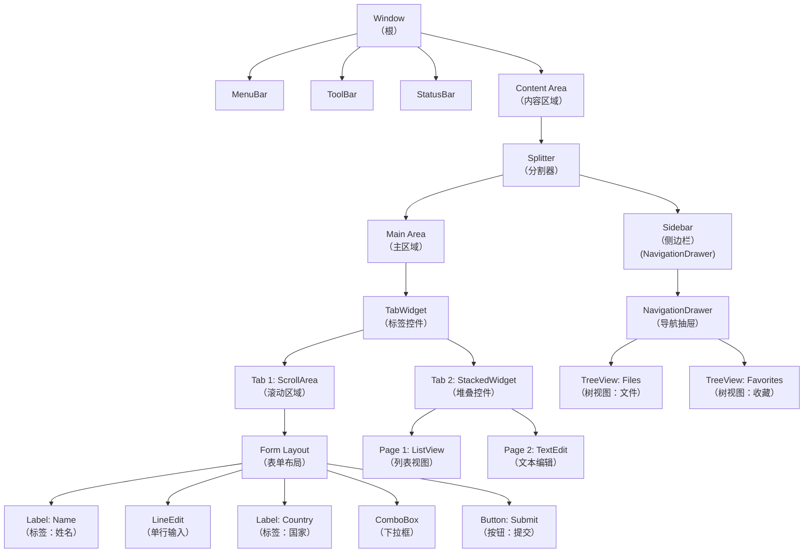

# 控件系统

本章提供了整个控件系统的全面参考：
`Widget` trait、`BaseWidget`、渲染、控件层级结构以及如何创建自定义控件。

---

## 架构概述

rust-widgets 中的每个控件都遵循一致的模式：

```
┌──────────────────────────────────────────────────┐
│                    Widget Trait                    │
│  (60+ 默认方法委托给 BaseWidget)                    │
├──────────────────────────────────────────────────┤
│                    BaseWidget                      │
│  共享状态：几何、可见性、信号、                       │
│  样式、层级结构、DPI、工具提示、无障碍               │
├──────────────┬──────────────┬────────────────────┤
│   Draw Trait │ EventHandler │  自定义信号           │
│ （渲染）      │  （输入）     │  （控件特有）          │
└──────────────┴──────────────┴────────────────────┘
```

具体控件至少要实现三件事：
1. **`Widget`** — `base()` 和 `base_mut()` 的 getter 方法
2. **`EventHandler`** — 如何响应事件
3. **`Draw`** — 如何绘制控件

---

## `Widget` Trait（60+ 默认方法）

```rust
pub trait Widget: EventHandler + Any {
    // ── 基础委托（必须实现）──
    fn base(&self) -> &BaseWidget;
    fn base_mut(&mut self) -> &mut BaseWidget;

    // ── 身份标识 ──
    fn id(&self) -> ObjectId;
    fn kind(&self) -> WidgetKind;

    // ── 几何属性（6 个方法）──
    fn geometry(&self) -> Rect;
    fn set_geometry(&mut self, geometry: Rect);
    fn rect(&self) -> Rect;        // 别名
    fn set_rect(&mut self, rect: Rect);  // 别名
    fn position(&self) -> Point;
    fn size(&self) -> Size;
    fn set_position(&mut self, position: Point);
    fn set_size(&mut self, size: Size);
    fn min_size(&self) -> Option<Size>;
    fn max_size(&self) -> Option<Size>;
    fn set_min_size(&mut self, min_size: Option<Size>);
    fn set_max_size(&mut self, max_size: Option<Size>);

    // ── 层级结构 ──
    fn parent(&self) -> Option<ObjectId>;
    fn set_parent(&mut self, parent: Option<ObjectId>);
    fn children(&self) -> &[ObjectId];
    fn add_child(&mut self, child: ObjectId);
    fn remove_child(&mut self, child: ObjectId);

    // ── 可见性与状态 ──
    fn show(&mut self);
    fn hide(&mut self);
    fn is_visible(&self) -> bool;
    fn set_visible(&mut self, visible: bool);
    fn is_enabled(&self) -> bool;
    fn set_enabled(&mut self, enabled: bool);

    // ── 样式（13 个方法）──
    fn style(&self) -> &WidgetStyle;
    fn set_style(&mut self, style: WidgetStyle);
    fn background_color(&self) -> Option<Color>;
    fn set_background_color(&mut self, color: Option<Color>);
    fn foreground_color(&self) -> Option<Color>;
    fn set_foreground_color(&mut self, color: Option<Color>);
    fn font(&self) -> Option<&Font>;
    fn set_font(&mut self, font: Option<Font>);
    fn border_color(&self) -> Option<Color>;
    fn border_width(&self) -> u32;
    fn border_radius(&self) -> u32;
    fn set_border_color(&mut self, color: Option<Color>);
    fn set_border_width(&mut self, width: u32);
    fn set_border_radius(&mut self, radius: u32);
    fn set_border(&mut self, color: Option<Color>, width: u32, radius: u32);
    fn padding(&self) -> &Padding;
    fn margin(&self) -> &Margin;
    fn set_padding(&mut self, padding: Padding);

    // ── 工具提示与无障碍 ──
    fn set_tooltip(&mut self, tooltip: String);
    fn tooltip(&self) -> &str;
    fn set_translated_tooltip(&mut self, key: &str);
    fn accessible_name(&self) -> String;
    fn accessible_role(&self) -> AccessibleRole;
    fn accessible_description(&self) -> String;

    // ── DPI ──
    fn dpi_scale(&self) -> f32;
    fn set_dpi_scale(&mut self, scale: f32);
}
```

所有默认实现都委托给 `BaseWidget`。具体控件只需实现 `base()` 和 `base_mut()` —— 其余所有功能都继承而来。

### 最小控件实现

```rust
use rust_widgets::widget::{Widget, BaseWidget, WidgetKind, Draw};
use rust_widgets::event::{Event, EventHandler};
use rust_widgets::render::RenderContext;
use rust_widgets::core::{Color, Font, Point, Rect};

struct MinimalWidget {
    base: BaseWidget,
}

impl MinimalWidget {
    fn new(geometry: Rect) -> Self {
        Self {
            base: BaseWidget::new(WidgetKind::Panel, geometry, "MinimalWidget"),
        }
    }
}

impl Widget for MinimalWidget {
    fn base(&self) -> &BaseWidget { &self.base }
    fn base_mut(&mut self) -> &mut BaseWidget { &mut self.base }
}

impl EventHandler for MinimalWidget {
    fn handle_event(&mut self, event: &Event) {
        // 委托给 BaseWidget 的默认事件 → 信号映射
        self.base.handle_event(event);
    }
}

impl Draw for MinimalWidget {
    fn draw(&mut self, context: &mut RenderContext) {
        let rect = self.geometry();
        context.fill_rect(rect, Color::rgb(200, 200, 200));
        context.draw_text(
            Point::new(rect.x + 10, rect.y + 10),
            "Minimal Widget",
            &Font::simple("Arial", 12.0),
            Color::BLACK,
        );
    }
}
```

---

## `BaseWidget` — 共享状态与信号

每个具体控件都内嵌了一个 `BaseWidget`：

```rust
pub struct BaseWidget {
    // 身份标识
    pub(crate) object: Object,
    pub(crate) kind: WidgetKind,

    // 几何属性
    pub(crate) geometry: Rect,
    pub(crate) min_size: Option<Size>,
    pub(crate) max_size: Option<Size>,

    // 层级结构
    pub(crate) parent: Option<ObjectId>,
    pub(crate) children: MiniVec<ObjectId>,

    // 状态
    pub(crate) visible: bool,
    pub(crate) enabled: bool,
    pub(crate) mouse_pressed: bool,
    pub(crate) dpi_scale: f32,

    // 样式
    pub(crate) style: WidgetStyle,
    pub(crate) tooltip: MiniString,
    pub(crate) connection_scope: ConnectionScope,

    // ── 11 个内置信号槽 ──
    pub clicked: GenericSignal,
    pub hover: Signal1<Point>,
    pub mouse_down: Signal1<(Point, u32)>,
    pub mouse_up: Signal1<(Point, u32)>,
    pub key_down: Signal1<(u32, u32)>,
    pub key_up: Signal1<(u32, u32)>,
    pub focus_gained: GenericSignal,
    pub focus_lost: GenericSignal,
    pub redraw_requested: GenericSignal,
    pub layout_requested: GenericSignal,
    pub changed: GenericSignal,
}

impl BaseWidget {
    pub fn new(kind: WidgetKind, geometry: Rect, class_name: &'static str) -> Self;

    // 所有状态字段的访问器
    pub fn id(&self) -> ObjectId;
    pub fn kind(&self) -> WidgetKind;
    pub fn geometry(&self) -> Rect;
    pub fn set_geometry(&mut self, geometry: Rect);
    pub fn parent(&self) -> Option<ObjectId>;
    pub fn set_parent(&mut self, parent: Option<ObjectId>);
    pub fn children(&self) -> &[ObjectId];
    pub fn add_child(&mut self, child: ObjectId);
    pub fn remove_child(&mut self, child: ObjectId);
    pub fn show(&mut self);
    pub fn hide(&mut self);
    pub fn is_visible(&self) -> bool;
    pub fn is_enabled(&self) -> bool;
    pub fn set_enabled(&mut self, enabled: bool);
    pub fn dpi_scale(&self) -> f32;
    pub fn set_dpi_scale(&mut self, scale: f32);
    pub fn set_tooltip(&mut self, tooltip: MiniString);
    pub fn tooltip(&self) -> &str;
    pub fn set_translated_tooltip(&mut self, key: &str);

    // 样式访问器
    pub fn style(&self) -> &WidgetStyle;
    pub fn set_style(&mut self, style: WidgetStyle);
    pub fn request_redraw(&mut self);  // 发出 redraw_requested 信号
    pub fn request_layout(&mut self);  // 发出 layout_requested 信号
}
```

### 11 个基础信号

| 信号 | 类型 | 发出时机 |
|---|---|---|
| `clicked` | `GenericSignal` | 用户点击/与控件交互时 |
| `hover` | `Signal1<Point>` | 鼠标光标移动到控件上时 |
| `mouse_down` | `Signal1<(Point, u32)>` | 在控件上按下鼠标按钮时 |
| `mouse_up` | `Signal1<(Point, u32)>` | 在控件上释放鼠标按钮时 |
| `key_down` | `Signal1<(u32, u32)>` | 控件获得焦点时按下按键 |
| `key_up` | `Signal1<(u32, u32)>` | 控件获得焦点时释放按键 |
| `focus_gained` | `GenericSignal` | 控件接收输入焦点时 |
| `focus_lost` | `GenericSignal` | 控件失去输入焦点时 |
| `redraw_requested` | `GenericSignal` | 控件需要重绘时 |
| `layout_requested` | `GenericSignal` | 控件需要重新计算布局时 |
| `changed` | `GenericSignal` | 控件的值/状态改变时 |

### 连接到信号

```rust
use rust_widgets::widget::{Widget, BaseWidget, WidgetKind, Draw};
use rust_widgets::core::{Point, Rect};

let mut widget = MyWidget::new(Rect::new(10, 10, 200, 100));

// 持久连接：
widget.base.clicked.connect(|| {
    println!("控件被点击了！");
});

// 一次性连接（首次激活后自动断开）：
widget.base.hover.connect_once(|point: std::sync::Arc<Point>| {
    println!("首次悬停在 ({}, {})", point.x, point.y);
});

// 作用域连接（作用域释放时自动断开）：
let scope = rust_widgets::signal::ConnectionScope::new();
widget.base.changed.connect_scoped(&scope, || {
    println!("控件值已改变");
});
// ... scope 在此处释放 → 连接自动移除
```

---

## `Draw` Trait

`Draw` trait 使控件能够通过 `RenderContext` 渲染自定义内容：

```rust
pub trait Draw {
    /// 使用提供的渲染上下文绘制控件内容。
    fn draw(&mut self, context: &mut RenderContext);

    /// 如果此控件使用自定义绘制则返回 true。
    fn uses_custom_drawing(&self) -> bool { true }

    /// 可选：请求重绘控件。
    fn request_custom_redraw(&self) {}
}
```

### `RenderContext` — 绘制基元

`RenderContext` 提供了核心绘图 API：

```rust
impl RenderContext {
    // 填充形状
    pub fn fill_rect(&mut self, rect: Rect, color: Color);
    pub fn fill_rounded_rect(&mut self, rect: Rect, radius: u32, color: Color);
    pub fn fill_circle(&mut self, center: Point, radius: u32, color: Color);

    // 描边形状
    pub fn draw_rect_stroke(&mut self, rect: Rect, color: Color, width: u32);
    pub fn draw_line(&mut self, from: Point, to: Point, color: Color);

    // 文本
    pub fn draw_text(&mut self, pos: Point, text: &str, font: &Font, color: Color);

    // 图像
    pub fn draw_image(&mut self, rect: Rect, image: &Image);
}
```

### 完整的 `Draw` 示例

```rust
use rust_widgets::widget::Draw;
use rust_widgets::render::RenderContext;
use rust_widgets::core::{Color, Font, Point, Rect};

impl Draw for MyWidget {
    fn draw(&mut self, context: &mut RenderContext) {
        let rect = self.geometry();
        let style = self.style();

        // 1. 绘制背景
        let bg = style.background_color.unwrap_or(Color::rgb(240, 240, 240));
        let radius = style.border_radius;
        context.fill_rounded_rect(rect, radius, bg);

        // 2. 绘制边框
        if let Some(border) = style.border_color {
            context.draw_rect_stroke(rect, border, style.border_width);
        }

        // 3. 居中绘制文本
        let font = style.font.as_ref().unwrap_or(&Font::default_ui());
        let text = "My Widget";
        let text_color = style.text_color.unwrap_or(Color::BLACK);

        // 在控件矩形内居中文本
        let text_x = rect.x + (rect.width as i32 / 2) - 30;
        let text_y = rect.y + (rect.height as i32 / 2);
        context.draw_text(Point::new(text_x, text_y), text, font, text_color);

        // 4. 在底部绘制强调线
        let accent_y = rect.y + rect.height as i32 - 2;
        context.draw_line(
            Point::new(rect.x, accent_y),
            Point::new(rect.x + rect.width as i32, accent_y),
            Color::BLUE,
        );
    }
}
```

---

## `EventHandler` — 默认实现

`BaseWidget` 提供了一个默认的 `EventHandler`，将平台事件映射到信号发射：

```rust
impl EventHandler for BaseWidget {
    fn handle_event(&mut self, event: &Event) {
        match event {
            Event::MouseDown { position, button, .. } => {
                self.mouse_pressed = true;
                self.mouse_down.emit((*position, *button));
            }
            Event::MouseUp { position, button, .. } => {
                self.mouse_pressed = false;
                self.mouse_up.emit((*position, *button));
            }
            Event::MouseMove { position, .. } => {
                self.hover.emit(*position);
            }
            Event::KeyDown { key, modifiers, .. } => {
                self.key_down.emit((*key, *modifiers));
            }
            Event::KeyUp { key, modifiers, .. } => {
                self.key_up.emit((*key, *modifiers));
            }
            Event::FocusGained => {
                self.focus_gained.emit();
            }
            Event::FocusLost => {
                self.focus_lost.emit();
            }
            Event::Click => {
                self.clicked.emit();
            }
            Event::Redraw => {
                self.redraw_requested.emit();
            }
            Event::Layout => {
                self.layout_requested.emit();
            }
            Event::ValueChanged => {
                self.changed.emit();
            }
            _ => {}
        }
    }
}
```

自定义控件可以在委托前后添加额外的逻辑：

```rust
impl EventHandler for MyWidget {
    fn handle_event(&mut self, event: &Event) {
        // 预处理：
        if let Event::Click = event {
            log::info!("MyWidget 在 ({},{}) 被点击", self.position().x, self.position().y);
        }

        // 委托给 base（发射信号）：
        self.base.handle_event(event);

        // 后处理：
        if self.base.is_enabled() {
            if let Event::MouseMove { position, .. } = event {
                self.track_mouse_trail(*position);
            }
        }
    }
}
```

---

## `WidgetKind` 枚举 — 109+ 变体

`WidgetKind` 枚举对每个控件类型进行分类。它通过特性门控：
15 个变体始终可用；94+ 个需要非 `mini` 特性。



### 完整 WidgetKind 参考

| 类别 | 变体 | Mini-Safe | 描述 |
|---|---|---|---|
| **窗口** | `Window` | ✓ | 顶级应用程序窗口 |
| | `Dialog` | ✓ | 模态对话框 |
| | `PopupWindow` | ✓ | 非模态弹出窗口 |
| **基础** | `Button` | ✓ | 按钮 |
| | `CheckBox` | ✓ | 复选框（开/关/部分） |
| | `RadioButton` | ✓ | 单选按钮（互斥组） |
| | `Label` | ✓ | 文本标签 |
| | `ToggleButton` | ✓ | 切换按钮（保持按下状态） |
| | `Switch` | ✓ | 开/关切换开关 |
| | `FreeformShape` | ✓ | 基于路径的可点击形状 |
| **输入** | `LineEdit` | ✓ | 单行文本输入 |
| | `TextArea` | ✓ | 多行文本输入 |
| | `ComboBox` | ✓ | 下拉选择 |
| | `SpinBox` | ✓ | 数值微调框 |
| | `ListBox` | ✓ | 滚动选择列表 |
| | `Slider` | ✓ | 水平值滑块 |
| | `Dropdown` | ✓ | 独立下拉菜单 |
| | `Keyboard` | ✓ | 屏幕虚拟键盘 |
| | `TextEdit` | ✗ | 富文本编辑器 |
| | `RichEdit` | ✗ | 完整富文本编辑 |
| | `SearchBox` | ✗ | 带图标的搜索输入框 |
| | `AutoCompleteEdit` | ✗ | 带建议的文本输入 |
| | `MaskedEdit` | ✗ | 格式化文本掩码 |
| | `FloatingLabel` | ✗ | Material Design 浮动标签 |
| | `CommandLink` | ✗ | 命令链接按钮 |
| | `FontComboBox` | ✗ | 字体选择器 |
| | `KeySequenceEdit` | ✗ | 键盘快捷键编辑器 |
| | `TagInput` | ✗ | 标签/芯片文本输入 |
| **容器** | `ScrollArea` | ✓ | 可滚动视口 |
| | `GroupBox` | ✓ | 分组/面板容器 |
| | `Panel` | ✓ | 面板（GroupBox 的别名） |
| | `TileView` | ✓ | 可滑动的瓦片页面 |
| | `TabWidget` | ✗ | 标签面板容器 |
| | `Splitter` | ✗ | 可调整大小的分割面板 |
| | `MdiArea` | ✗ | MDI 子窗口区域 |
| | `StackedWidget` | ✗ | 卡片堆叠容器 |
| | `CollapsiblePane` | ✗ | 可展开/折叠的面板 |
| | `DockWidget` | ✗ | 可停靠面板 |
| | `DockPanel` | ✗ | 停靠面板（别名） |
| | `ToolBox` | ✗ | 工具箱容器 |
| | `SafeArea` | ✗ | 安全区域内边距容器 |
| | `MasonryLayout` | ✗ | Pinterest 风格瀑布流布局 |
| | `NavigationStack` | ✗ | 推入/弹出页面导航 |
| **显示** | `ProgressBar` | ✓ | 进度指示器 |
| | `ScrollBar` | ✓ | 滚动条 |
| | `Line` | ✓ | 分隔线 |
| | `Meter` | ✓ | 带弧线和指针的仪表 |
| | `MiniChart` | ✓ | 简化折线/柱状图 |
| | `ImageView` | ✓ | 图像显示 |
| | `MiniCanvas` | ✓ | 简化绘图表面 |
| | `Arc` | ✓ | 圆形进度弧 |
| | `Spinner` | ✓ | 旋转加载指示器 |
| | `Roller` | ✓ | 滚轮选择器 |
| | `LCDNumber` | ✗ | LCD 数字显示 |
| | `Dial` | ✗ | 旋钮控件 |
| | `Calendar` | ✗ | 日历月视图 |
| | `DateEdit` | ✗ | 日期输入字段 |
| | `TimeEdit` | ✗ | 时间输入字段 |
| | `DateTimeEdit` | ✗ | 组合日期+时间输入 |
| | `DatePicker` | ✗ | 日期选择器（别名） |
| | `TimePicker` | ✗ | 时间选择器（别名） |
| | `DateTimePicker` | ✗ | 日期时间选择器（别名） |
| | `DateRangePicker` | ✗ | 日期范围选择 |
| | `ProgressCircle` | ✗ | 圆形进度 |
| | `Rating` | ✗ | 星级评分控件 |
| | `Icon` | ✗ | 图标控件 |
| | `Stepper` | ✗ | 步进器控件 |
| **视图** | `ListView` | ✗ | 多列列表 |
| | `TreeView` | ✗ | 层级树 |
| | `TableWidget` | ✗ | 表格数据表 |
| | `DataGrid` | ✗ | 带排序/筛选的数据网格 |
| | `TreeTable` | ✗ | 树+表组合 |
| | `VirtualList` | ✗ | 虚拟化列表 |
| | `VirtualTable` | ✗ | 虚拟化表格 |
| | `ColumnView` | ✗ | 列视图（别名） |
| | `DataView` | ✗ | 数据视图（别名） |
| | `UndoView` | ✗ | 撤销历史视图 |
| | `PropertyGrid` | ✗ | 属性编辑器网格 |
| **对话框** | `MessageBox` | ✗ | 模态消息对话框 |
| | `FileDialog` | ✗ | 文件打开/保存对话框 |
| | `DirectoryDialog` | ✗ | 目录选择器 |
| | `ColorDialog` | ✗ | 颜色选择对话框 |
| | `FontDialog` | ✗ | 字体选择对话框 |
| | `InputDialog` | ✗ | 单输入对话框 |
| | `ProgressDialog` | ✗ | 进度对话框 |
| | `FindReplaceDialog` | ✗ | 查找/替换对话框 |
| | `WizardDialog` | ✗ | 分步向导 |
| | `CupertinoAlertDialog` | ✗ | iOS 风格提示框 |
| **菜单与工具栏** | `MenuBar` | ✗ | 菜单栏 |
| | `Menu` | ✗ | 下拉菜单 |
| | `MenuItem` | ✗ | 菜单项（始终可用） |
| | `ContextMenu` | ✗ | 右键菜单 |
| | `ToolBar` | ✗ | 工具栏 |
| | `StatusBar` | ✗ | 状态栏 |
| | `Action` | ✗ | 动作控件 |
| | `ToolButton` | ✗ | 工具栏按钮 |
| | `MenuButton` | ✗ | 带下拉菜单的按钮 |
| | `PieMenu` | ✗ | 径向/饼形菜单 |
| | `RibbonBar` | ✗ | Office 风格功能区 |
| | `TabBar` | ✗ | 独立标签栏 |
| | `DropdownMenu` | ✗ | 下拉菜单选择器 |
| **现代 UI** | `FAB` | ✗ | 浮动操作按钮 |
| | `BottomSheet` | ✗ | 底部面板 |
| | `BottomNavigationBar` | ✗ | 底部标签栏 |
| | `NavigationDrawer` | ✗ | 侧边导航抽屉 |
| | `AppBar` | ✗ | 顶部应用栏 |
| | `Chip` | ✗ | 芯片/标签控件 |
| | `Badge` | ✗ | 通知徽章 |
| | `SkeletonLoader` | ✗ | 加载占位符 |
| | `PullToRefresh` | ✗ | 下拉刷新控件 |
| | `RefreshControl` | ✗ | 刷新指示器 |
| | `Carousel` | ✗ | 可滑动的图片轮播 |
| | `Avatar` | ✗ | 用户头像 |
| | `EmptyState` | ✗ | 空状态占位符 |
| | `Divider` | ✗ | 分隔线 |
| | `PagerPageView` | ✗ | 带圆点的页面视图 |
| | `SegmentedControl` | ✗ | Material 3 分段控件 |
| | `SegmentedButton` | ✗ | 分段按钮组 |
| | `Popover` | ✗ | 浮动弹出卡 |
| | `Tooltip` | ✗ | 工具提示控件 |
| | `Snackbar` | ✗ | Material Snackbar 通知 |
| | `ToastStack` | ✗ | Toast 通知堆栈 |
| | `Breadcrumb` | ✗ | 面包屑导航 |
| | `SplitButton` | ✗ | 分割操作按钮 |
| | `ModalBottomSheet` | ✗ | 可拖拽底部面板 |
| | `SwipeToDismiss` | ✗ | 滑动手势容器 |
| **Cupertino** | `CupertinoSwitch` | ✗ | iOS 风格开关 |
| | `CupertinoSlider` | ✗ | iOS 风格滑块 |
| | `CupertinoNavigationBar` | ✗ | iOS 大标题导航栏 |
| | `CupertinoSegmentedControl` | ✗ | iOS 药丸分段控件 |
| | `CupertinoDatePicker` | ✗ | iOS 滚动滚轮选择器 |
| | `MaterialNavigationRail` | ✗ | Material 侧边导航栏 |
| | `MaterialSnackbar` | ✗ | Material Snackbar |
| **特殊** | `Canvas` | ✗ | 画布 |
| | `Grid` | ✗ | 网格布局控件 |
| | `Chart` | ✗ | 图表表面 |
| | `ColorPicker` | ✗ | 颜色选择器控件 |
| | `CodeEditor` | ✗ | 代码编辑器控件 |
| | `DiffViewer` | ✗ | Diff 比较查看器 |
| | `TerminalView` | ✗ | 终端模拟器 |
| | `MediaPlayer` | ✗ | 媒体播放器控件 |
| | `MapView` | ✗ | 地图显示控件 |
| | `GanttWidget` | ✗ | 甘特图控件 |
| | `TimelineWidget` | ✗ | 时间线控件 |
| | `MarkdownEditor` | ✗ | Markdown 编辑器 |
| | `CommandPalette` | ✗ | 命令面板控件 |
| | `NotificationCenter` | ✗ | 通知中心 |
| | `QRCode` | ✗ | 二维码显示 |
| | `VideoPlayer` | ✗ | 视频播放器 |
| | `ImageGallery` | ✗ | 图片库浏览器 |
| | `AudioVisualizer` | ✗ | 音频波形显示 |
| | `CameraPreview` | ✗ | 相机取景器 |
| | `BarcodeScanner` | ✗ | 条码/二维码扫描器 |
| | `AnimatedImage` | ✗ | 动画 GIF/APNG/WebP |
| | `HeroAnimation` | ✗ | 共享元素过渡动画 |
| | `BezierCurveEditor` | ✗ | 贝塞尔曲线编辑器 |
| | `LottieWidget` | ✗ | Lottie 动画播放器 |
| | `RiveWidget` | ✗ | Rive 动画运行时 |
| **图表** | `LineChart` | ✗ | 折线图 |
| | `BarChart` | ✗ | 柱状图 |
| | `PieChart` | ✗ | 饼图 |
| | `Sparkline` | ✗ | 内联迷你图 |
| **Web** | `WebView` | ✗ | Web 内容显示 |
| | `WebEngineView` | ✗ | Web 引擎视图 |
| | `WebEnginePage` | ✗ | 网页控件 |
| | `WebEngineSettings` | ✗ | Web 设置 |
| | `WebEngineDownloadItem` | ✗ | 下载项控件 |
| | `WebEngineCookieStore` | ✗ | Cookie 存储控件 |
| | `WebEngineWebChannel` | ✗ | JS 通信通道 |
| | `WebEngineFindTextResult` | ✗ | 查找文本结果 |
| | `WebEngineNotification` | ✗ | Web 通知 |
| | `WebEngineScriptDialog` | ✗ | JS 对话框控件 |
| | `WebEngineContextMenuRequest` | ✗ | 上下文菜单请求 |
| **移动** | `MobileDatePicker` | ✗ | 移动风格日期选择器 |
| | `SearchBar` | ✗ | iOS 风格搜索栏 |
| | `AdaptiveScaffold` | ✗ | 跨平台脚手架 |
| | `TabView` | ✗ | iOS 分段标签页面视图 |
| | `ImePreedit` | ✗ | 输入法组合文本覆盖层 |

---

## 控件类别深入解析

### Window 控件

`Window` 是根控件 —— 每个应用程序至少有一个：

```rust
use rust_widgets::widget::{Window, Widget, BaseWidget, Draw, WidgetKind};
use rust_widgets::core::{Color, Font, Point, Rect};
use rust_widgets::signal::GenericSignal;

pub struct Window {
    base: BaseWidget,
    title: String,
    title_bar_height: u32,
    close_button_size: u32,
    button_spacing: u32,
    pub closed: GenericSignal,  // 自定义信号
}

impl Window {
    pub fn new(title: String, geometry: Rect) -> Self {
        Self {
            base: BaseWidget::new(WidgetKind::Window, geometry, "Window"),
            title,
            title_bar_height: 32,
            close_button_size: 14,
            button_spacing: 40,
            closed: GenericSignal::new(),
        }
    }

    pub fn add_child(&mut self, child: ObjectId) {
        self.base.add_child(child);
    }

    pub fn title(&self) -> &str { &self.title }
    pub fn set_title(&mut self, title: String) { self.title = title; }

    /// 发出 `closed` 信号。
    pub fn close(&mut self) { self.closed.emit(); }
}

impl Widget for Window {
    fn base(&self) -> &BaseWidget { &self.base }
    fn base_mut(&mut self) -> &mut BaseWidget { &mut self.base }
}

impl EventHandler for Window {
    fn handle_event(&mut self, event: &Event) {
        self.base.handle_event(event);
        if matches!(event, Event::Quit) {
            self.closed.emit();
        }
    }
}
```

`Window` 通过其 `Draw` 实现来渲染标题栏、关闭/最小化/最大化按钮、窗口边框和委托内容区域。

### 容器控件

容器使用 `SimpleRegistry` 将渲染和事件转发给子控件：

```rust
use rust_widgets::widget::{SimpleRegistry, Widget, BaseWidget, Draw, WidgetKind};
use rust_widgets::event::{Event, EventHandler};
use rust_widgets::render::RenderContext;
use rust_widgets::core::{ObjectId, Rect};

struct FrameWidget {
    base: BaseWidget,
    registry: SimpleRegistry,
}

impl FrameWidget {
    fn new(title: &str, geometry: Rect) -> Self {
        Self {
            base: BaseWidget::new(WidgetKind::GroupBox, geometry, "Frame"),
            registry: SimpleRegistry::new(),
        }
    }

    fn add_child_widget<W: Widget + Draw + EventHandler + 'static>(
        &mut self,
        child: &mut W,
    ) {
        let id = child.id();
        self.base.add_child(id);

        // 注册子控件的绘制 + 事件处理器
        // （实际应用中，这使用借用子控件的闭包）
        self.registry.register(
            id,
            |ctx| { /* 转发到 child.draw(ctx) */ },
            |evt| { /* 转发到 child.handle_event(evt) */ },
        );
    }
}
```

---

## WidgetFactory 与能力系统

### WidgetCapability

能力系统允许查询控件支持哪些特性：

```rust
pub struct WidgetCapability {
    pub kind: WidgetKind,
    pub properties: HashMap<String, PropertySchema>,
    pub features: Vec<String>,
}

pub enum PropertyValueKind {
    Integer, Float, String, Boolean, Color, Font, Enum(Vec<String>),
}

pub struct PropertySchema {
    pub name: String,
    pub kind: PropertyValueKind,
    pub writable: bool,
    pub default_value: CapabilityValue,
}

pub enum CapabilityValue {
    Integer(i64), Float(f64), String(String),
    Boolean(bool), Color(Color), Font(Font),
}
```

### WidgetFactory

`WidgetFactory` 集中管理控件构造：

```rust
pub struct WidgetFactory {
    creators: HashMap<WidgetKind, Box<dyn WidgetCreator>>,
}

impl WidgetFactory {
    pub fn new() -> Self;
    pub fn register<W: Widget + 'static>(&mut self, kind: WidgetKind);
    pub fn create(&self, kind: WidgetKind, geometry: Rect) -> Option<Box<dyn Widget>>;
    pub fn capabilities(&self, kind: WidgetKind) -> Option<&WidgetCapability>;
}
```

---

## 创建自定义控件（完整示例）

下面是一个完整的自定义控件，它跟踪计数器、响应点击并自定义渲染：

```rust
use rust_widgets::widget::{Widget, BaseWidget, WidgetKind, Draw};
use rust_widgets::event::{Event, EventHandler};
use rust_widgets::render::RenderContext;
use rust_widgets::signal::{GenericSignal, ConnectionScope};
use rust_widgets::core::{Color, Font, Point, Rect, Size, ObjectId};

/// 一个可点击的计数器控件，每次点击递增。
pub struct CounterWidget {
    base: BaseWidget,
    count: u32,
    /// 当计数改变时发射，附带新值。
    pub count_changed: GenericSignal,
}

impl CounterWidget {
    pub fn new(geometry: Rect) -> Self {
        let mut base = BaseWidget::new(WidgetKind::Panel, geometry, "CounterWidget");
        base.set_min_size(Some(Size::new(60, 30)));

        Self {
            base,
            count: 0,
            count_changed: GenericSignal::new(),
        }
    }

    pub fn count(&self) -> u32 {
        self.count
    }

    pub fn reset(&mut self) {
        self.count = 0;
        self.count_changed.emit();
        self.base.request_redraw();
    }

    fn increment(&mut self) {
        self.count += 1;
        self.count_changed.emit();
        self.base.request_redraw();
    }
}

impl Widget for CounterWidget {
    fn base(&self) -> &BaseWidget {
        &self.base
    }

    fn base_mut(&mut self) -> &mut BaseWidget {
        &mut self.base
    }
}

impl EventHandler for CounterWidget {
    fn handle_event(&mut self, event: &Event) {
        // 预处理点击事件以递增计数器
        if let Event::Click = event {
            self.increment();
        }

        // 始终委托给 base 以发射信号
        self.base.handle_event(event);
    }
}

impl Draw for CounterWidget {
    fn draw(&mut self, context: &mut RenderContext) {
        let rect = self.geometry();
        let style = self.style();

        // 背景
        let bg = style.background_color.unwrap_or(Color::rgb(52, 152, 219));
        let radius = style.border_radius;
        context.fill_rounded_rect(rect, radius, bg);

        // 文本：显示计数
        let text = format!("Count: {}", self.count);
        let font = Font::bold("Arial", 14.0);
        let text_color = Color::WHITE;

        // 居中文本
        let text_w = (text.len() as u32 * 8); // 粗略估计
        let text_x = rect.x + (rect.width as i32 / 2) - (text_w as i32 / 2);
        let text_y = rect.y + (rect.height as i32 / 2) + 5;
        context.draw_text(Point::new(text_x, text_y), &text, &font, text_color);

        // 在顶部绘制细微的内部高光
        let highlight_rect = Rect::new(rect.x, rect.y, rect.width, rect.height / 2);
        let highlight = Color::rgba(255, 255, 255, 40);
        context.fill_rounded_rect(highlight_rect, radius, highlight);
    }
}

// 使用示例：
fn main() {
    let mut counter = CounterWidget::new(Rect::new(10, 10, 160, 40));

    // 连接到自定义信号：
    counter.count_changed.connect(|| {
        println!("计数器已改变！");
    });

    // 连接到基础信号：
    counter.base.clicked.connect(|| {
        println!("计数器被点击了！");
    });

    // 模拟一次点击（在实际应用中，事件循环会发送 Click 事件）：
    counter.handle_event(&Event::Click);
    println!("计数现在是：{}", counter.count());  // → 1
}
```

---

## 控件层级结构 —— 树状图



---

## 布局集成

控件通过其几何属性和尺寸约束方法参与布局系统：

```rust
// 为布局配置控件：
widget.set_min_size(Some(Size::new(100, 30)));
widget.set_max_size(Some(Size::new(400, 200)));

// 布局引擎调用 set_geometry 来定位控件：
widget.set_geometry(Rect::new(10, 20, 200, 100));

// 布局完成后，读取最终位置：
let pos = widget.position();
let sz = widget.size();
let rect = widget.geometry();
```

当控件需要其父布局容器重新计算位置时，会触发 `layout_requested` 信号。
当视觉状态需要重绘时，会触发 `redraw_requested` 信号。

---

## 无障碍

每个控件都通过 `Widget` trait 暴露无障碍信息：

```rust
impl Widget for MyWidget {
    fn accessible_name(&self) -> String {
        // 优先使用工具提示，降级为控件类型名称
        let tooltip = self.tooltip().trim();
        if tooltip.is_empty() {
            format!("{:?}", self.kind())
        } else {
            tooltip.to_string()
        }
    }

    fn accessible_role(&self) -> AccessibleRole {
        AccessibleRole::from(self.kind())
    }

    fn accessible_description(&self) -> String {
        let mut flags = Vec::new();
        if !self.is_enabled() { flags.push("disabled"); }
        if !self.is_visible() { flags.push("hidden"); }
        if flags.is_empty() {
            format!("{:?}", self.accessible_role())
        } else {
            format!("{:?} ({})", self.accessible_role(), flags.join(", "))
        }
    }
}
```

`a11y` 特性将这些信息桥接到平台无障碍 API（Linux 上的 AT-SPI、macOS 上的 NSAccessibility、Windows 上的 UI Automation）。

---

## 控件生命周期总结

```
┌──────────────────────────────────────────────────────────┐
│                      控件生命周期                          │
├──────────────┬───────────────────────────────────────────┤
│  1. 创建     │ new(geometry) → BaseWidget(WidgetKind)     │
│  2. 配置     │ set_style, set_text, set_tooltip,          │
│              │   set_min_size, connect signals            │
│  3. 设父级   │ set_parent(parent_id)                      │
│              │   parent.add_child(child_id)               │
│  4. 布局     │ 布局引擎设置 geometry                       │
│  5. 显示     │ show() → visible = true                    │
│  6. 绘制     │ Draw::draw(context) → 渲染管线              │
│  7. 事件     │ EventHandler::handle_event → 信号发射       │
│  8. 更新     │ set_geometry, set_style → redraw_requested │
│  9. 隐藏     │ hide() → visible = false                   │
│ 10. 销毁     │ Drop impl → 清理，断开信号连接               │
└──────────────┴───────────────────────────────────────────┘
```

---

## 信号连接模式

### 模式 1：控件间通信

```rust
// 当按钮被点击时，更新标签文本：
button.base.clicked.connect({
    let label_id = label.id();
    move || {
        // 在实际应用中，使用基于句柄的文本更新：
        // label.set_text("Button was clicked!");
    }
});
```

### 模式 2：值与显示绑定

```rust
// 滑块值 → 标签文本：
slider.base.changed.connect({
    move || {
        let value = slider.value();
        label.set_text(&format!("Value: {}", value));
    }
});
```

### 模式 3：窗口关闭处理器

```rust
window.closed.connect(|| {
    println!("窗口正在关闭，保存状态...");
    // 执行清理
    app.quit();
});
```

### 模式 4：临时 UI 的作用域连接

```rust
{
    let scope = ConnectionScope::new();

    // 这些连接仅在对话框存在期间激活：
    ok_button.base.clicked.connect_scoped(&scope, || {
        dialog.accept();
    });
    cancel_button.base.clicked.connect_scoped(&scope, || {
        dialog.reject();
    });

    // ... 显示对话框，等待结果 ...

} // scope 释放 → 所有连接自动断开
```

---

## 最佳实践

### 1. 始终委托给 `base.handle_event()`

```rust
impl EventHandler for MyWidget {
    fn handle_event(&mut self, event: &Event) {
        // PRE：自定义预处理
        self.base.handle_event(event);  // ← 始终调用此方法
        // POST：自定义后处理
    }
}
```

默认处理器将事件映射到 11 个基础信号。跳过此方法意味着这些信号永远不会被触发。

### 2. 使用 `ConnectionScope` 清理连接

```rust
struct MyForm {
    scope: ConnectionScope,
    submit_button: Box<dyn Widget>,
    // ...
}

impl Drop for MyForm {
    fn drop(&mut self) {
        // 作用域释放时连接自动断开
    }
}
```

### 3. 在执行昂贵操作前检查可见性/启用状态

```rust
impl Draw for ExpensiveWidget {
    fn draw(&mut self, context: &mut RenderContext) {
        if !self.is_visible() {
            return;  // 完全跳过渲染
        }
        // ... 昂贵的渲染 ...
    }
}
```

### 4. 谨慎使用 `request_redraw()`

不要在紧凑循环中调用 `request_redraw()`，而是批量处理变更：

```rust
// 差：多次重绘
widget.set_position(new_pos);  // 触发重绘
widget.set_text("new text");    // 再次触发重绘

// 好：批量处理后一次性重绘
widget.set_geometry(new_rect);
widget.set_text("new text");
widget.base.request_redraw();   // 单次重绘
```

### 5. 验证输入尺寸

```rust
pub fn new(geometry: Rect) -> Self {
    let mut base = BaseWidget::new(WidgetKind::Panel, geometry, "MyWidget");

    // 确保最小触摸目标尺寸（44x44）:
    if geometry.width < 44 || geometry.height < 44 {
        let expanded = geometry.expand_to_touch_target();
        base.set_geometry(expanded);
    }

    Self { base, /* ... */ }
}
```

---

## 下一步

- **布局系统** — 学习如何使用 Box、Grid、Stack、Flow、Flex 和 Absolute 布局算法定位控件
- **事件系统** — 深入探讨事件类型、传播、手势识别和定时器管理
- **样式与主题** — 了解 `WidgetStyle`、基于 CSS 的主题以及样式表的热重载
- **渲染系统** — 探索 GPU/CPU/SVG 后端、脏区域和局部刷新优化 