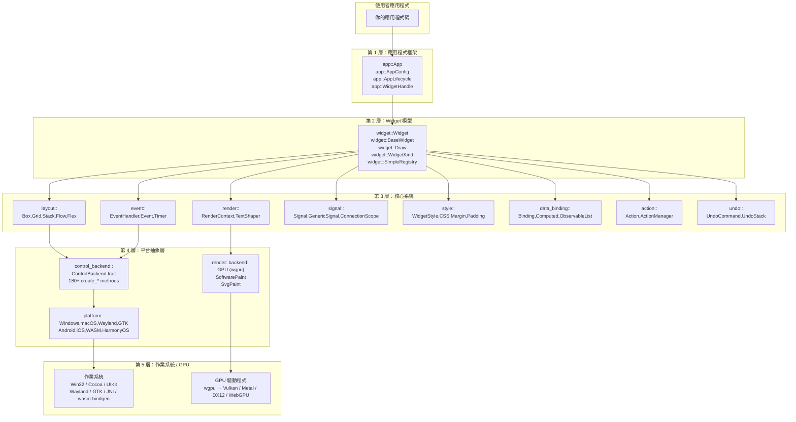
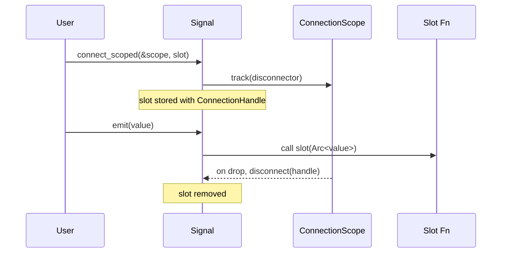
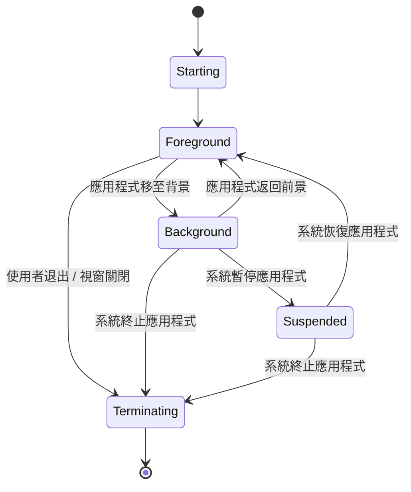
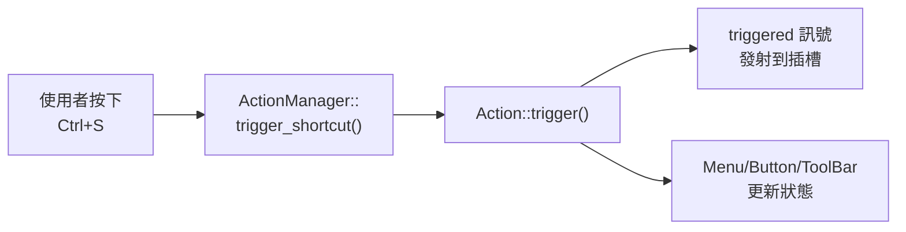

# 架構概觀

本章將說明 rust-widgets 的分層架構、crate 階層、核心抽象概念，以及編譯期與執行期決策如何協同運作，以產生高效、跨平台的二進位檔案。

---

## 分層模型

rust-widgets 採用**五層堆疊**組織，每一層僅依賴其下方的層：



### 各層職責

| 層級 | 職責 | 關鍵模組 |
|---|---|---|
| **應用程式框架** | 應用程式生命週期、widget handles、事件迴圈編排 | `app::App`、`AppConfig`、`WindowHandle`、`AppLifecycle` |
| **Widget 模型** | Widget trait 合約、base widget 狀態、訊號插槽、渲染分派、容器組合 | `widget::Widget`、`BaseWidget`、`Draw`、`WidgetKind`、`SimpleRegistry` |
| **核心系統** | 佈局、渲染、事件、訊號、樣式、資料繫結、動作、復原/重做 | `layout`、`render`、`event`、`signal`、`style`、`data_binding`、`action`、`undo` |
| **平台抽象層** | 作業系統原生 widget 建立、事件轉譯、剪貼簿、IME、無障礙存取 | `control_backend::ControlBackend`、`platform` |
| **作業系統 / GPU** | 原始平台 API、GPU 驅動程式 | 作業系統 SDK + `wgpu` |

---

## Crate 階層與模組相依關係

```mermaid
graph TD
    LIB["lib.rs<br/>(公開 API, create_* 函式, tr! 巨集)"]
    LIB --> CORE
    LIB --> WIDGET
    LIB --> APP
    LIB --> EVENT
    LIB --> SIGNAL
    LIB --> STYLE
    LIB --> PLATFORM

    CORE["core::<br/>ObjectId, Color, Rect, Size, Point, Font<br/>Alignment, Version, PlatformCapabilities"]
    WIDGET["widget::<br/>Widget trait, BaseWidget, Draw<br/>WidgetKind, 180+ widget 模組"]
    APP["app::<br/>App, AppConfig, WidgetHandle<br/>AppLifecycle, dispatch_trigger"]

    WIDGET --> CORE
    WIDGET --> SIGNAL
    WIDGET --> STYLE
    WIDGET --> EVENT
    WIDGET --> RENDER[same render]

    SIGNAL["signal::<br/>Signal, GenericSignal<br/>ConnectionScope, ConnectionHandle"]
    SIGNAL --> COMPAT["compat::<br/>HashMap, Mutex, Vec<br/>(std or heapless)"]

    EVENT["event::<br/>Event, EventHandler<br/>Timer, EventQueue, FocusTracker"]
    EVENT --> CORE

    LAYOUT["layout::<br/>BoxLayout, Grid, Stack, Flow<br/>Flex, Absolute, Form, Constraint"]
    LAYOUT --> CORE

    RENDER["render::<br/>RenderContext, RenderPipeline<br/>TextShaper, TextCache<br/>GPU/Software/SVG backends"]
    RENDER --> CORE

    STYLE["style::<br/>WidgetStyle, Margin, Padding<br/>CssParser, StyleSheetManager<br/>Theme, ThemeManager"]
    STYLE --> CORE

    DATA_BINDING["data_binding::<br/>Binding, Computed<br/>ObservableList"]
    DATA_BINDING --> COMPAT

    ACTION["action::<br/>Action, ActionManager<br/>ActionBinding"]
    ACTION --> SIGNAL

    UNDO["undo::<br/>UndoCommand, UndoStack<br/>MergePolicy"]
    UNDO --> CORE

    CTRL_BACKEND["control_backend::<br/>ControlBackend trait<br/>Dispatcher, Router<br/>Native/Custom backends"]
    CTRL_BACKEND --> CORE

    PLATFORM["platform::<br/>Linux/Wayland/GTK, macOS, Windows<br/>Android/JNI, iOS, WASM, Harmony<br/>Clipboard, IME, Accessibility<br/>Holographic, Projector"]
    PLATFORM --> CTRL_BACKEND

    I18N["i18n::<br/>tr!() macro, Translation<br/>Auditor, Plural Rules"]
    CHART["chart::<br/>LineChart, BarChart<br/>PieChart, Sparkline"]
    PDF["pdf::<br/>Document Generator<br/>Render-to-PDF Pipeline"]
    PRINT["print::<br/>System Print Services"]
    INDEX["index::<br/>Document Index<br/>Search Services"]
    WEB["web::<br/>WebView, WebEngine<br/>Settings, Cookies"]
    EMBEDDED["embedded::<br/>no_std Memory Model<br/>Arena Allocator"]

    CHART --> WIDGET
    PDF --> RENDER
    WEB --> WIDGET
    EMBEDDED --> CORE

    style CORE fill:#e6f3ff,stroke:#339
    style WIDGET fill:#fff3e0,stroke:#963
    style APP fill:#e8f5e9,stroke:#363
    style SIGNAL fill:#fce4ec,stroke:#933
    style PLATFORM fill:#f3e5f5,stroke:#636
```



### 模組摘要表

| 模組 | 路徑 | 用途 |
|---|---|---|
| **core** | `src/core/` | 基礎型別：`ObjectId`、`Color`、`Rect`、`Size`、`Point`、`Font`、`Alignment`、`Version` |
| **widget** | `src/widget/` | Widget trait、BaseWidget、WidgetKind、Draw、180+ 個 widget 實作 |
| **app** | `src/app/` | 應用程式生命週期、`App`/`AppConfig`、型別化 `WidgetHandle` |
| **signal** | `src/signal/` | 訊號/插槽系統：`Signal<T>`、`GenericSignal`、`ConnectionScope` |
| **event** | `src/event/` | 事件型別、`EventHandler` trait、計時器、焦點追蹤、事件佇列 |
| **layout** | `src/layout/` | 佈局演算法：Box、Grid、Stack、Flow、Flex、Absolute、Constraint |
| **render** | `src/render/` | 渲染：`RenderContext`、文字塑形、GPU/CPU/SVG 後端 |
| **style** | `src/style/` | 樣式：`WidgetStyle`、CSS 解析器、主題、邊距、內距 |
| **data_binding** | `src/data_binding/` | 反應式繫結：`Binding<T>`、`Computed<T>`、`ObservableList<T>` |
| **action** | `src/action/` | 動作系統：`Action`、`ActionManager`、快捷鍵繫結 |
| **undo** | `src/undo/` | 復原/重做：`UndoCommand`、`UndoStack`、合併策略 |
| **control_backend** | `src/control_backend/` | `ControlBackend` trait（180+ 方法）、分派器、路由器 |
| **platform** | `src/platform/` | 各作業系統後端、剪貼簿、IME、無障礙存取、行動 API |
| **i18n** | `src/i18n/` | 翻譯基礎架構、`tr!()` 巨集 |
| **chart** | `src/chart/` | 圖表 widgets：折線圖、長條圖、圓餅圖、Sparkline |
| **pdf** | `src/pdf/` | PDF 文件生成 |
| **print** | `src/print/` | 系統列印服務整合 |
| **memory** | `src/memory/` | 區域配置、`no_std` 記憶體模型 |
| **gesture** | `src/gesture/` | 11 種手勢辨識器 |
| **shortcut** | `src/shortcut/` | 鍵盤快捷鍵定義與比對 |
| **theme** | `src/theme/` | 主題管理員、樣式表管理 |
| **json** | `src/json/` | JSON 佈局載入與解析 |
| **compat** | `src/compat.rs` | `std` ↔ `no_std` 相容性橋接 |

---

## 核心型別層

`src/core/` 模組提供了整個函式庫中使用的基本型別。每個 widget、佈局和渲染操作都以這些基本型別來表達：

```rust
// 位置：src/core/mod.rs — 公開重新匯出
pub use alignment::{Alignment, HorizontalAlignment, VerticalAlignment};
pub use color::Color;
pub use font::Font;
pub use geometry::{Orientation, Point, Rect, Size};
pub use mutex_ext::MutexExt;
pub use types::{
    CoreConfig, CoreError, CoreObject, CoreResult, DeviceClass,
    ObjectId, PlatformCapabilities, PlatformFamily, RuntimeProfile, Version,
};
```

| 型別 | 用途 |
|---|---|
| `ObjectId` | `u64` 包裝 — 每個 widget 和核心物件的穩定數值識別碼 |
| `Color` | RGBA 顏色，含 55+ 個預定義常數、十六進位解析、混合、亮度 |
| `Point` | `(x: i32, y: i32)` — 2D 座標 |
| `Size` | `(width: u32, height: u32)` — 矩形尺寸 |
| `Rect` | `(x: i32, y: i32, width: u32, height: u32)` — 定位矩形 |
| `Font` | 字型家族、大小、粗細、粗體、斜體描述 |
| `Alignment` | 5 向對齊：左、中、右、上、下 |
| `HorizontalAlignment` | 左、中、右 |
| `VerticalAlignment` | 上、中、下 |
| `Version` | 含 major/minor/patch 的語意化版本，支援解析與比較 |
| `RuntimeProfile` | Full / Embedded |
| `DeviceClass` | Desktop、Tablet、Mobile、Embedded、Projector |
| `PlatformFamily` | Desktop、Embedded、Mobile、Tablet、Projector |
| `PlatformCapabilities` | GPU、觸控、鍵盤、滑鼠、螢幕尺寸、DPI |
| `CoreConfig` | 設定檔 + 平台 + 功能 + 版本組合包 |
| `CoreError` | InvalidArgument、NotSupported、NotFound、Internal |
| `CoreObject` | Trait：`id()`、`set_id()`、`type_name()` |

### 座標系統

所有定位都使用**螢幕座標**，原點位於左上角：

```text
(0, 0) -------------> X
  |
  |    螢幕空間（像素）
  |    原點：左上角
  |
  v Y
```

`core::coords` 中的轉換工具支援：
- 螢幕 ↔ 笛卡兒（`to_screen_y`、`to_cartesian_y`）
- 螢幕 ↔ PDF（`to_pdf_y`、`from_pdf_y`）
- DPI 縮放（`dpi_to_pixels`、`pixels_to_dpi`）
- 座標正規化/反正規化
- 不同系統間的矩形轉換

### 矩形合併

`core::rect_merge` 提供集中化的矩形合併演算法：
- `merge_intersecting_rects()` — 將重疊矩形合併為最小覆蓋集合
- `bounding_rect()` — 計算一組矩形的最小邊界矩形

### Mutex 擴充

`core::MutexExt` 新增了一個 `.lock_guard()` 方法，可從中毒的 mutex 中恢復，透過在中毒錯誤上呼叫 `into_inner()`，避免在恢復情境中發生 panic。

> 關於每個核心型別的詳細 API 文件，請參閱[核心型別](core-types.md)章節。

---

## Widget 層

Widget 層定義了每個 UI 元素所遵循的合約。

### `Widget` Trait（60+ 個預設方法）

```rust
pub trait Widget: EventHandler + Any {
    // 基礎委派
    fn base(&self) -> &BaseWidget;
    fn base_mut(&mut self) -> &mut BaseWidget;

    // 識別
    fn id(&self) -> ObjectId;
    fn kind(&self) -> WidgetKind;

    // 幾何
    fn geometry(&self) -> Rect;
    fn set_geometry(&mut self, geometry: Rect);
    fn rect(&self) -> Rect;
    fn position(&self) -> Point;
    fn size(&self) -> Size;
    fn set_position(&mut self, position: Point);
    fn set_size(&mut self, size: Size);
    fn min_size(&self) -> Option<Size>;
    fn max_size(&self) -> Option<Size>;
    fn set_min_size(&mut self, min_size: Option<Size>);
    fn set_max_size(&mut self, max_size: Option<Size>);

    // 階層
    fn parent(&self) -> Option<ObjectId>;
    fn set_parent(&mut self, parent: Option<ObjectId>);
    fn children(&self) -> &[ObjectId];
    fn add_child(&mut self, child: ObjectId);
    fn remove_child(&mut self, child: ObjectId);

    // 可見性與啟用狀態
    fn show(&mut self);
    fn hide(&mut self);
    fn is_visible(&self) -> bool;
    fn set_visible(&mut self, visible: bool);
    fn is_enabled(&self) -> bool;
    fn set_enabled(&mut self, enabled: bool);

    // 樣式
    fn style(&self) -> &WidgetStyle;
    fn set_style(&mut self, style: WidgetStyle);
    fn background_color(&self) -> Option<Color>;
    fn foreground_color(&self) -> Option<Color>;
    fn font(&self) -> Option<&Font>;
    fn border_color(&self) -> Option<Color>;
    fn border_width(&self) -> u32;
    fn border_radius(&self) -> u32;
    fn set_border(&mut self, color: Option<Color>, width: u32, radius: u32);
    fn padding(&self) -> &Padding;
    fn margin(&self) -> &Margin;
    fn set_padding(&mut self, padding: Padding);

    // 工具提示與無障礙存取
    fn set_tooltip(&mut self, tooltip: String);
    fn tooltip(&self) -> &str;
    fn set_translated_tooltip(&mut self, key: &str);
    fn accessible_name(&self) -> String;
    fn accessible_role(&self) -> AccessibleRole;
    fn accessible_description(&self) -> String;

    // DPI
    fn dpi_scale(&self) -> f32;
    fn set_dpi_scale(&mut self, scale: f32);
}
```

### `BaseWidget` — 共享狀態

每個具體的 widget 都嵌入了一個 `BaseWidget`，提供：

```rust
pub struct BaseWidget {
    // 識別
    object: Object,
    kind: WidgetKind,

    // 幾何
    geometry: Rect,
    min_size: Option<Size>,
    max_size: Option<Size>,

    // 階層
    parent: Option<ObjectId>,
    children: MiniVec<ObjectId>,

    // 狀態
    visible: bool,
    enabled: bool,
    mouse_pressed: bool,
    dpi_scale: f32,

    // 樣式
    style: WidgetStyle,
    tooltip: MiniString,
    connection_scope: ConnectionScope,

    // 訊號插槽（11 個內建訊號）
    pub clicked: GenericSignal,
    pub hover: Signal1<Point>,
    pub mouse_down: Signal1<(Point, u32)>,
    pub mouse_up: Signal1<(Point, u32)>,
    pub key_down: Signal1<(u32, u32)>,
    pub key_up: Signal1<(u32, u32)>,
    pub focus_gained: GenericSignal,
    pub focus_lost: GenericSignal,
    pub redraw_requested: GenericSignal,
    pub layout_requested: GenericSignal,
    pub changed: GenericSignal,
}
```

每個 widget 都可免費獲得這 11 個訊號，並可根據需要新增自訂訊號（例如 `Window::closed`）。

### `Draw` Trait

渲染自訂內容的 widgets 會實作 `Draw` trait：

```rust
pub trait Draw {
    /// 使用提供的渲染上下文繪製 widget 的內容。
    fn draw(&mut self, context: &mut RenderContext);

    /// 如果此 widget 使用自訂繪圖，則回傳 true。
    fn uses_custom_drawing(&self) -> bool { true }

    /// 選擇性：請求重新繪製 widget。
    fn request_custom_redraw(&self) {}
}
```

### `EventHandler` Trait

所有 widgets 都透過 `EventHandler` trait（位於 `src/event/`）來處理事件：

```rust
pub trait EventHandler {
    fn handle_event(&mut self, event: &Event);
}
```

`BaseWidget` 提供了一個預設實作，將平台事件對應到訊號發射（點擊 → `clicked.emit()`、滑鼠移動 → `hover.emit(point)`）。

### `WidgetKind` 列舉 — 109+ 個變體

`WidgetKind` 列舉對每個 widget 型別進行分類。變體是功能閘控的：在所有設定檔下都有 15 個可用，94+ 個需要非 `mini` 功能才能解鎖：

```rust
pub enum WidgetKind {
    // 始終可用（15 個）：
    Window, Dialog, PopupWindow,
    Button, CheckBox, RadioButton, Label,
    LineEdit, ComboBox, SpinBox, ListBox,
    ProgressBar, Slider, ScrollBar, ScrollArea,
    Panel, GroupBox, ToggleButton,
    FreeformShape, TileView,
    Line, Meter, MiniChart, ImageView,
    MiniCanvas, Arc, Spinner, Roller,
    Dropdown, TextArea, Keyboard, Switch,

    // 功能閘控（94+ 個）：
    #[cfg(not(feature = "mini"))]
    MessageBox, FileDialog, ColorDialog, FontDialog,
    InputDialog, ProgressDialog,
    TextEdit, RichEdit,
    ListView, TreeView, Table, Grid, Chart,
    TabWidget, Splitter, MdiArea,
    MenuBar, Menu, MenuItem, ContextMenu,
    ToolBar, StatusBar, Canvas, DockPanel,
    Calendar, DatePicker, TimePicker, DateTimePicker,
    WebView, WebEngineView, WebEnginePage,
    Action, ToolButton,
    TabBar, PieMenu, RibbonBar,
    SearchBox, Chip, Badge, SkeletonLoader,
    FAB, PullToRefresh, BottomSheet,
    BottomNavigationBar, NavigationDrawer, AppBar,
    // ... 還有 50+ 個
}
```

### 透過 `SimpleRegistry` 進行容器組合

像 `Frame`、`TabWidget` 和 `ScrollArea` 這樣的容器使用 `SimpleRegistry` 來將渲染和事件轉發給由 `ObjectId` 識別的子 widgets：

```rust
pub struct SimpleRegistry {
    entries: HashMap<ObjectId, (DrawClosure, EventClosure)>,
}

impl SimpleRegistry {
    pub fn register<D, E>(&mut self, id: ObjectId, draw: D, event: E);
    pub fn draw_widget(&mut self, id: ObjectId, context: &mut RenderContext) -> bool;
    pub fn forward_event(&mut self, id: ObjectId, event: &Event) -> bool;
}
```

這橋接了基於 `ObjectId` 的子元件追蹤（在 `BaseWidget` 中）與基於 trait 物件的渲染/事件分派系統之間的差距。

---

## 訊號/插槽系統

訊號/插槽系統提供了型別安全、可重入安全、限定範圍的事件接線。

### 核心型別

```rust
// 帶有泛型 payload T 的型別化訊號：
pub struct Signal<T: Clone + Send + 'static>;

// 零參數訊號：
pub struct GenericSignal { inner: Signal<()> }

// 舊版別名：
pub type Signal1<T> = Signal<T>;

// 不透明的連線 handle：
pub struct ConnectionHandle(pub u64);

// 擁有者範圍 — 釋放時自動中斷連線：
pub struct ConnectionScope;
```

### Signal<T> API

```rust
impl<T: Clone + Send + 'static> Signal<T> {
    pub fn new() -> Self;
    pub fn connect<F>(&self, slot: F) -> ConnectionHandle;
    pub fn connect_once<F>(&self, slot: F) -> ConnectionHandle;
    pub fn connect_scoped<F>(&self, owner: &ConnectionScope, slot: F) -> ConnectionHandle;
    pub fn connect_once_scoped<F>(&self, owner: &ConnectionScope, slot: F) -> ConnectionHandle;
    pub fn disconnect(&self, handle: ConnectionHandle) -> bool;
    pub fn disconnect_all(&self);
    pub fn emit(&self, value: T);
    pub fn slot_count(&self) -> usize;
}
```

### 連線生命週期



### 可重入安全性

`emit()` 方法在寫入鎖定下耗盡所有插槽，在**鎖定外部**呼叫回呼，然後重新插入非 `once` 的插槽。這允許回呼安全地在**同一個 Signal** 上呼叫 `connect`、`disconnect`、`disconnect_all` 或 `emit`，而不會死結。

### 內建 Widget 訊號

每個 `BaseWidget` 都公開 11 個可供連線的訊號插槽：

| 訊號 | 型別 | 觸發時機 |
|---|---|---|
| `clicked` | `GenericSignal` | 接收到類似點擊的互動 |
| `hover` | `Signal1<Point>` | 滑鼠移動到 widget 上方 |
| `mouse_down` | `Signal1<(Point, u32)>` | 滑鼠按鈕按下 |
| `mouse_up` | `Signal1<(Point, u32)>` | 滑鼠按鈕放開 |
| `key_down` | `Signal1<(u32, u32)>` | 鍵盤按鍵按下 |
| `key_up` | `Signal1<(u32, u32)>` | 鍵盤按鍵放開 |
| `focus_gained` | `GenericSignal` | Widget 獲得焦點 |
| `focus_lost` | `GenericSignal` | Widget 失去焦點 |
| `redraw_requested` | `GenericSignal` | 需要重新繪製 |
| `layout_requested` | `GenericSignal` | 需要重新計算佈局 |
| `changed` | `GenericSignal` | 有狀態的值變更 |

---

## 資料繫結

`data_binding` 模組提供反應式資料容器：

### `Binding<T>` — 雙向反應式值

```rust
pub struct Binding<T: Clone + Send + 'static> {
    value: T,
    listeners: HashMap<String, BoxedListener>,
}

impl<T: Clone + Send + 'static> Binding<T> {
    pub fn new(value: T) -> Self;
    pub fn get(&self) -> T;
    pub fn set(&mut self, value: T);           // 通知監聽器
    pub fn subscribe(&mut self, key: &str, listener: BoxedListener);
    pub fn unsubscribe(&mut self, key: &str);
    pub fn bind_to(&mut self, other: &mut Binding<T>);  // 雙向同步
}
```

### `Computed<T>` — 衍生反應式值

```rust
pub struct Computed<T: Clone + Send + 'static> {
    compute_fn: Box<dyn Fn() -> T>,
    cached: T,
    dirty: bool,
    listeners: HashMap<String, BoxedListener>,
}

impl<T: Clone + Send + 'static> Computed<T> {
    pub fn new<F>(compute: F, initial: T) -> Self;
    pub fn get(&mut self) -> T;       // 若髒則重新計算，變更時通知
    pub fn get_cached(&self) -> T;
    pub fn invalidate(&mut self);     // 標記為髒 — 下次 get() 會重新計算
    pub fn is_dirty(&self) -> bool;
    pub fn subscribe(&mut self, key: &str, listener: BoxedListener);
}
```

### 雙向繫結

`bind_to()` 建立一個雙向同步機制，並帶有 `AtomicBool` 守衛以防止無限通知迴圈：

```rust
let mut a = Binding::new(10);
let mut b = Binding::new(20);

a.bind_to(&mut b);

a.set(30);  // b 也變成 30
b.set(50);  // a 也變成 50
```

---

## 應用程式框架

### `App` — 應用程式包裝器

```rust
pub struct App {
    // 內部：管理生命週期、回呼、widget 工廠
}

impl App {
    pub fn new() -> Self;
    pub fn with_config(config: AppConfig) -> Self;
    pub fn init(&self);
    pub fn run(&self);
    pub fn on_startup<F: FnMut() + 'static>(self, f: F) -> Self;
    pub fn on_shutdown<F: FnMut() + 'static>(self, f: F) -> Self;
}
```

### `AppConfig`

```rust
pub struct AppConfig {
    pub app_name: String,
    pub organization: String,
    pub enable_i18n: bool,
}
```

### `WidgetHandle` Trait

每個型別化的 handle 都實作 `WidgetHandle`，提供常見的操作：

```rust
pub trait WidgetHandle: Sized {
    fn raw_id(&self) -> ObjectId;
    fn from_raw(id: ObjectId) -> Self;
    fn show(&self);
    fn hide(&self);
    fn set_geometry(&self, x: i32, y: i32, w: u32, h: u32);
    fn set_text(&self, text: &str);
    fn text(&self) -> String;
    fn enable(&self);
    fn disable(&self);
    fn is_enabled(&self) -> bool;
    fn set_visible(&self, visible: bool);
    fn is_visible(&self) -> bool;
    fn on_click<F: FnMut() + 'static>(&self, f: F);
    fn on_value_changed<F: FnMut(String) + 'static>(&self, f: F);
}
```

### 生命週期狀態機



---

## 動作系統

### `Action` — 使用者可呼叫的命令

```rust
pub struct Action {
    pub id: String,
    pub text: String,
    enabled: bool,
    checkable: bool,
    checked: bool,
    triggered: GenericSignal,
    toggled: Signal1<bool>,
    enabled_changed: Signal1<bool>,
}

impl Action {
    pub fn new(id: impl Into<String>, text: impl Into<String>) -> Self;
    pub fn is_enabled(&self) -> bool;
    pub fn set_enabled(&mut self, enabled: bool);
    pub fn is_checkable(&self) -> bool;
    pub fn set_checkable(&mut self, checkable: bool);
    pub fn is_checked(&self) -> bool;
    pub fn set_checked(&mut self, checked: bool);
    pub fn trigger(&mut self) -> bool;
    pub fn connect_triggered<F>(&self, slot: F) -> ConnectionHandle;
    pub fn connect_toggled<F>(&self, slot: F) -> ConnectionHandle;
    pub fn connect_enabled_changed<F>(&self, slot: F) -> ConnectionHandle;
}
```

### `ActionManager` — 註冊表 + 快捷鍵路由器

```rust
pub struct ActionManager {
    actions: HashMap<String, Action>,
    shortcut_to_action: HashMap<String, String>,
    bindings: Vec<ActionBinding>,
}

impl ActionManager {
    pub fn register_action(&mut self, id: impl Into<String>, text: impl Into<String>) -> bool;
    pub fn action(&self, id: &str) -> Option<&Action>;
    pub fn action_mut(&mut self, id: &str) -> Option<&mut Action>;
    pub fn bind_shortcut(&mut self, shortcut: impl Into<String>, action_id: impl Into<String>) -> bool;
    pub fn trigger_shortcut(&mut self, shortcut: &str) -> bool;
    pub fn trigger_action(&mut self, action_id: &str) -> bool;
    pub fn bind_action_to_menu(&mut self, action_id: impl Into<String>, menu_id: ObjectId) -> bool;
    pub fn bind_action_to_toolbar(&mut self, action_id: impl Into<String>, toolbar_id: ObjectId) -> bool;
    pub fn bind_action_to_button(&mut self, action_id: impl Into<String>, button_id: ObjectId) -> bool;
}
```

`ActionManager` 橋接了 `action` 模組與 `shortcut` 模組，實現了鍵盤快捷鍵到動作的解析。

### 動作繫結流程



---

## 復原/重做系統

### `UndoCommand` Trait

```rust
pub trait UndoCommand {
    fn id(&self) -> CommandId;
    fn description(&self) -> CommandDescription;
    fn execute(&mut self) -> Result<(), String>;
    fn undo(&mut self) -> Result<(), String>;
    fn redo(&mut self) -> Result<(), String> { self.execute() }
    fn merge_policy(&self) -> MergePolicy { MergePolicy::Never }
    fn try_merge(&mut self, previous: &dyn UndoCommand) -> bool { false }
}
```

### `MergePolicy`

```rust
pub enum MergePolicy {
    Never,          // 始終作為獨立命令推送
    WithPrevious,   // 嘗試與前一個命令合併
}
```

### `UndoStack` — 有邊界的復原/重做

```rust
pub struct UndoStack {
    undo_stack: Vec<Box<dyn UndoCommand>>,
    redo_stack: Vec<Box<dyn UndoCommand>>,
    max_capacity: usize,
    clean_index: Option<usize>,
}

impl UndoStack {
    pub fn new() -> Self;                    // 預設容量：100
    pub fn with_capacity(max: usize) -> Self;
    pub fn push(&mut self, command: Box<dyn UndoCommand>);
    pub fn undo(&mut self) -> Result<(), String>;
    pub fn redo(&mut self) -> Result<(), String>;
    pub fn can_undo(&self) -> bool;
    pub fn can_redo(&self) -> bool;
    pub fn undo_text(&self) -> Option<String>;
    pub fn redo_text(&self) -> Option<String>;
    pub fn mark_clean(&mut self);
    pub fn is_clean(&self) -> bool;
    pub fn clear(&mut self);
    pub fn set_max_capacity(&mut self, max: usize);
}
```

關鍵行為：
- 新的 `push()` **會清除重做堆疊**（標準復原/重做合約）
- 當超過容量時，**最舊的命令**會被驅逐
- 具有 `MergePolicy::WithPrevious` 的命令會被合併（例如連續的文字編輯變成一個可復原的操作）
- `mark_clean()` / `is_clean()` 追蹤「已儲存」狀態

---

## 控制後端

### `ControlBackend` Trait — 180+ 個方法

`ControlBackend` trait 定義了 widget 模型與平台原生實作之間的介面。它是新增平台的單一整合點：

```rust
pub trait ControlBackend {
    // 識別
    fn backend_name(&self) -> &'static str;
    fn kind(&self) -> crate::platform::PlatformFamily;

    // 通用
    fn create_widget(&mut self, kind: WidgetKind, ...) -> ObjectId;

    // 視窗
    fn create_window(&mut self, title, x, y, w, h) -> ObjectId;

    // 基礎控制項：Button, CheckBox, Label, LineEdit, RadioButton,
    //               Slider, ProgressBar, ComboBox, ListBox, SpinBox...

    // 容器：GroupBox, TabWidget, Splitter, ScrollArea, MdiArea,
    //        StackedWidget, DockPanel...

    // 檢視：ListView, TreeView, Table, Grid, Canvas, DataView...

    // 輸入：TextEdit, RichEdit, SpinBox, Dial, Calendar, DatePicker...

    // 對話框：MessageBox, FileDialog, ColorDialog, FontDialog,
    //          ProgressDialog, InputDialog...

    // 網頁：WebView, WebEngineView, WebEnginePage,
    //       WebEngineSettings, WebEngineCookieStore, WebEngineWebChannel...

    // 選單/工具列：MenuBar, Menu, ContextMenu, ToolBar, StatusBar,
    //               Action, ToolButton...

    // 狀態管理
    fn set_widget_text(&mut self, id: ObjectId, text: &str);
    fn get_widget_text(&self, id: ObjectId) -> String;
    fn show_widget(&mut self, id: ObjectId);
    fn hide_widget(&mut self, id: ObjectId);
    fn set_widget_enabled(&mut self, id: ObjectId, enabled: bool);
    fn set_widget_visible(&mut self, id: ObjectId, visible: bool);
    fn set_widget_geometry(&mut self, id: ObjectId, x: i32, y: i32, w: u32, h: u32);

    // 事件輪詢
    fn poll_widget_triggered(&self) -> Option<(ObjectId, WidgetTriggerKind)>;
    fn inject_widget_trigger_event(&mut self, id: ObjectId, kind: WidgetTriggerKind);

    // IME 與無障礙存取
    fn set_widget_ime_enabled(&mut self, id: ObjectId, enabled: bool);
    fn set_widget_accessibility_name(&mut self, id: ObjectId, name: &str);

    // 剪貼簿
    fn set_clipboard_text(&mut self, text: &str);
    fn get_clipboard_text(&self) -> String;

    // 拖放
    fn begin_drag(&mut self, id: ObjectId);
    fn poll_drop_event(&self) -> Option<DropEvent>;
}
```

### 分派策略

`control_backend::dispatcher` 中的分派器根據編譯期功能標記，將 widget 建立呼叫路由到適當的後端。`control_backend::routing` 中的路由系統處理 180+ 種 widget 種類，將每一種對應到正確的原生或自訂實作。

---

## 編譯期 vs 執行期決策

rust-widgets 廣泛使用編譯期決策來將執行期開銷降到最低：

| 決策 | 機制 | 時機 |
|---|---|---|
| **裝置設定檔** | `#[cfg(feature = "desktop/tablet/mobile/embedded/mini")]` | 編譯期 |
| **作業系統後端** | `#[cfg(feature = "windows/macos/linux-wayland/etc")]` | 編譯期 |
| **GPU vs CPU 渲染** | `#[cfg(feature = "wgpu/software")]` | 編譯期 |
| **Widget 可用性** | `#[cfg(not(feature = "mini"))]` 在 `WidgetKind` 變體上 | 編譯期 |
| **記憶體模型** | `compat.rs` 將 `HashMap`/`Mutex`/`Vec` 對應到 std 或 heapless | 編譯期 |
| **Widget 建立** | `ControlBackend::create_*` 分派到作業系統原生或自訂 | 執行期 |
| **事件轉譯** | 平台事件由後端轉譯為 `Event` 列舉 | 執行期 |
| **佈局** | 佈局演算法由使用者選擇，在執行期套用 | 執行期 |
| **訊號連線** | `Signal::connect()` / `connect_scoped()` | 執行期 |
| **i18n 地區** | 地區在啟動時偵測，`tr!()` 金鑰在編譯期解析 | 兩者 |

### `compat.rs` 橋接

單一檔案（`src/compat.rs`）橋接了 `std` 和 `no_std` 環境：

```rust
// 在 std 下（desktop/tablet/mobile）：
pub use std::collections::HashMap;
pub use std::sync::Mutex;
pub type MiniVec<T> = Vec<T>;
pub type MiniString = String;

// 在 mini/embedded 下（no_std）：
pub use hashbrown::HashMap;
pub use spin::Mutex;
pub type MiniVec<T, const N: usize = 64> = heapless::Vec<T, N>;
pub type MiniString = heapless::String<128>;
```

這意味著 widget 程式碼不需要為記憶體型別加上 `#[cfg]` 註解 — `compat` 層抽象化了這個差異。

---

## 關鍵架構原則

1. **基於 Trait 的多型而非繼承。** `Widget` trait 提供 60+ 個委派給 `BaseWidget` 的預設方法。具體的 widgets 只需覆寫它們需要的部分。

2. **基於 ObjectId 的識別而非參考。** Widgets 由 `u64` ID 識別，避免了 widget 樹中的生命週期和借用問題。

3. **訊號/插槽實現解耦。** Widgets 不知道它們的消費者。它們發射訊號，消費者連接插槽。這實現了 UI 與邏輯之間的清晰分離。

4. **編譯期功能選擇。** 死碼由編譯器消除。mini 設定檔的二進位檔只包含約 15 個 widget 實作，且沒有來自未使用 widget 程式碼的任何開銷。

5. **單一後端合約。** `ControlBackend` trait 是新增平台的唯一整合點。實作 180+ 個方法一次，整個 widget 函式庫就能在新的目標上運作。

6. **可重入安全的訊號。** 訊號系統設計為永遠不會死結，即使回呼在發射期間修改了訊號圖。

---

## 後續步驟

- **核心型別** — 深入探討 `src/core/` 中的每個型別，附帶程式碼範例
- **Widget 系統** — 探索完整的 widget 階層、widget 生命週期，以及如何建立自訂 widgets
- **事件系統** — 了解事件型別、傳播、手勢辨識和計時器系統
