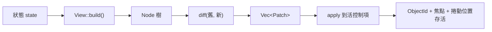

# 宣告式檢視層

> **平台可用性。** 本章描述的 `rust_widgets::view` 僅在 `desktop`、`tablet`、
> `mobile` 三檔編譯。`mini` 與 `embedded` 下該模組**不存在** —— 這兩檔用
> `add_child` 與 `create_*` 建構介面。見[平台支援](platform-support.md)。

## 兩個正交的問題

關於「宣告式 vs 保留式」的討論，多數把兩個**互不相關**的問題混在了一起：

| 問題 | 本函式庫的答案 |
|---|---|
| **誰持有狀態？** | **保留式**。控制項是帶 `ObjectId` 的長期物件，持有自己的欄位，直接改它就是常規改 UI 的方式。 |
| **誰描述結構？** | 兩者皆可。`add_child` 是命令式描述；`View` 則把結構描述為狀態的函式。 |

React、Flutter、SwiftUI 對這兩個問題的回答與這裡一致：**既是宣告式，也是保留式。**
所以「本函式庫是保留式」並不構成「不能有宣告式描述」的理由。`view` 模組加上的正是後一半，
且沒有拿掉前一半。

## 閉環



`Node` 是**普通值** —— 不含 id、不含活控制項、不呼叫平台 API。這正是 `diff` 能是純函式、
因而能脫離視窗測試的原因。

## 基本用法

```rust
use rust_widgets::view::{Node, View, ViewEngine};
use rust_widgets::widget::capability::CapabilityValue;

struct Counter {
    count: i64,
}

impl View for Counter {
    fn build(&self) -> Node {
        Node::new("group_box")
            .key("root")
            .child(
                Node::new("label")
                    .key("count")
                    .prop("text", CapabilityValue::String(format!("Count: {}", self.count))),
            )
    }
}

let mut engine = ViewEngine::new();
engine.mount(&Counter { count: 0 }, &create);       // 建樹
engine.update(&Counter { count: 1 }, &create);      // 求差，只施加一個 SetProperty
```

`create` 是從「宣告名」到「活控制項」的橋：

```rust
use rust_widgets::core::{ObjectId, Rect};
use rust_widgets::widget::{runtime, Widget, WidgetFactory};
use rust_widgets::view::Node;

let factory = WidgetFactory::new_with_defaults();
let create = move |node: &Node| -> Option<ObjectId> {
    let widget: Box<dyn Widget> =
        factory.create(&node.widget, Rect::new(0, 0, 200, 28), node.key_str().unwrap_or("anon"))?;
    runtime::register(widget)
};
```

它是**注入**的而非硬連 JSON 載入器，因此引擎可以無視窗測試，且有自己建構策略的宿主
不會被載入器的實作選擇綁架。

## `key` 是身分存活的關鍵

`key` 讓 `diff` 在重建之間認出**同一個控制項**。沒有 key 時匹配退化為按位置 ——
此時在頭部插入一項會讓其後每個節點的身分漂移，把焦點與捲動狀態轉移到錯誤的控制項上。

```rust
// 正確：頭部插入不影響其餘列。
Node::new("listview").children_of(rows.iter().map(|r| Node::new("label").key(r.id)))

// 降級：按位置匹配，頭部插入會重排其後全部身分。
Node::new("listview").children_of(rows.iter().map(|r| Node::new("label")))
```

降級是**被上報**的，不是靜默的：`DiffReport::positional_matches` 統計被迫按位置匹配的
節點數，`DiffReport::replaced_subtrees` 統計因型別或 key 變化而整棵重建的子樹數。
`positional_matches` 非零就意味著「該補 key 了」。

key 必須在兄弟間唯一；`Node::duplicate_sibling_keys()` 會上報衝突，
`tools/check_view_keys_are_unique.sh` 遇到字面量重複直接失敗。

## `apply` 能做什麼

```rust
pub enum Patch {
    SetProperty { id: ObjectId, name: String, value: CapabilityValue },
    Remove      { id: ObjectId },
    Insert      { parent: ObjectId, index: usize, node: Node },
    Move        { id: ObjectId, parent: ObjectId, index: usize },
    Replace     { id: ObjectId, parent: ObjectId, index: usize, node: Node },
}
```

`SetProperty` 落在每個控制項**自身**公開的屬性契約上 —— 與 JSON 載入器寫入的是同一套 ——
因此宣告式層不可能憑空發明一個控制項並不具備的屬性。

## 響應式狀態：`ReactiveHost`

`Binding` 可以被任意執行緒 set，所以 `BindingListener` 要求 `Send`。
而 `ViewEngine` 及其控制項是 `!Send`，因為控制項註冊表是 thread-local。
**因此監聽器不能持有引擎。** 這就是契約本身，它點名了唯一正確的設計：

```text
  工作執行緒                          UI 執行緒
  ─────────────                      ─────────
  binding.set(v)
    └─ 監聽器觸發   ──佇列──▶  host.pump()
                                  └─ view.build()
                                     └─ diff → apply   （碰控制項）
```

```rust
use rust_widgets::data_binding::Binding;
use rust_widgets::view::ReactiveHost;

let text = Binding::new(String::from("first"));
let mut host = ReactiveHost::new(MyView { text: &text }, Box::new(create));
host.mount();
host.subscribe(&text);

// 任意執行緒：
text.set(String::from("second"));

// UI 執行緒，通常每幀一次：
host.pump();   // 回傳本次執行的重建次數；常見情況是 0
```

**為什麼用佇列而不是原子旗標**：旗標會**丟失中間值**，使更新次數依賴時序 ——
於是「這次改動產生幾個 patch」變得不確定，測試與推理都不可靠。
佇列保持生產者計數精確；若要合併，那是呼叫方的**顯式決定**，而不是傳輸層的副作用。

## 什麼時候不要用這一層

- **只建一次、永不改動的樹。** `JsonLoader::load` 已經做了這件事；
  對永不變化的樹求差純屬額外開銷。
- **一次性的命令式修改。** 單次 `btn.set_text("x")` 比為產生一個 patch 而描述整棵樹更省。
- **逐幀動畫。** 動畫是 `PropertyAnimation` 的職責。本層表達的是**目標**狀態，
  混入時間會讓 diff 不確定。
- **在 `mini` / `embedded` 上。** 該模組不存在；請用 `add_child`。

## 可達性與開銷

從不重建樹的呼叫方不付任何代價：`Node` 與 `diff` 是惰性資料與算術，
沒有註冊、沒有全域狀態、不呼叫平台 API。

`Patch::SetProperty` 是唯一抵達控制項的路徑，而 `apply` 是該模組中唯一會 mutate 的函式 ——
這正是「其餘什麼都沒變」這一性質可被測試的原因。
