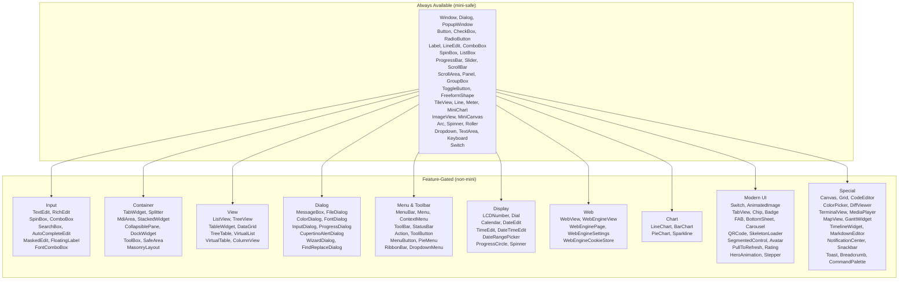
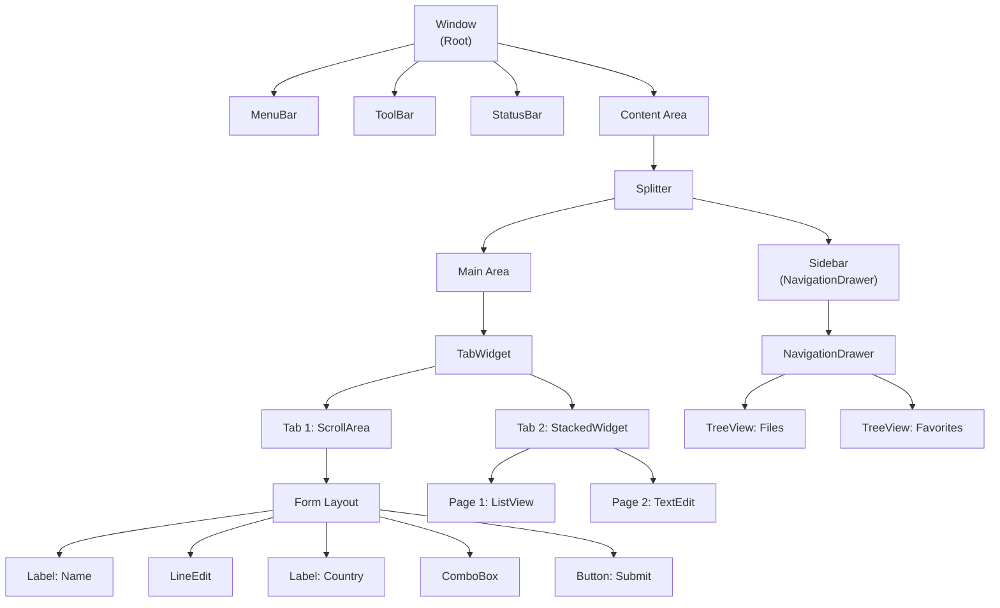

# 控制項系統

本章提供整個控制項系統的完整參考：`Widget` 特徵、`BaseWidget`、渲染、控制項階層，以及如何建立自訂控制項。

---

## 架構概覽

rust-widgets 中的每個控制項都遵循一致的模式：

```
┌──────────────────────────────────────────────────┐
│                   Widget 特徵                      │
│  (60+ 預設方法委派給 BaseWidget)                   │
├──────────────────────────────────────────────────┤
│                   BaseWidget                       │
│  共享狀態：geometry、visibility、signals、           │
│  styling、hierarchy、DPI、tooltip、accessibility    │
├──────────────┬──────────────┬────────────────────┤
│  Draw 特徵    │ EventHandler │  自訂訊號            │
│  (rendering)  │  (input)     │  (widget-specific)  │
└──────────────┴──────────────┴────────────────────┘
```

具體控制項至少實作三件事：
1. **`Widget`**——`base()` 和 `base_mut()` 的取得器
2. **`EventHandler`**——如何回應事件
3. **`Draw`**——如何繪製控制項

**沒有任何一個控制項是作業系統原生控制項。** 後端只提供四件事——**繪製面**、**事件迴圈**、**輸入轉譯**與**平台服務**——而函式庫會自行繪製 100% 的控制項。因此「控制項在哪些平台上可用」不是一個問題：同一個 `Draw` 實作在任何地方都會產生相同的像素。

---

## `Widget` 特徵（60+ 預設方法）

```rust
pub trait Widget: EventHandler + Any {
    // ── Base delegation (must implement) ──
    fn base(&self) -> &BaseWidget;
    fn base_mut(&mut self) -> &mut BaseWidget;

    // ── Identity ──
    fn id(&self) -> ObjectId;
    fn kind(&self) -> WidgetKind;

    // ── Geometry (6 methods) ──
    fn geometry(&self) -> Rect;
    fn set_geometry(&mut self, geometry: Rect);
    fn rect(&self) -> Rect;        // alias
    fn set_rect(&mut self, rect: Rect);  // alias
    fn position(&self) -> Point;
    fn size(&self) -> Size;
    fn set_position(&mut self, position: Point);
    fn set_size(&mut self, size: Size);
    fn min_size(&self) -> Option<Size>;
    fn max_size(&self) -> Option<Size>;
    fn set_min_size(&mut self, min_size: Option<Size>);
    fn set_max_size(&mut self, max_size: Option<Size>);

    // ── Hierarchy ──
    fn parent(&self) -> Option<ObjectId>;
    fn set_parent(&mut self, parent: Option<ObjectId>);
    fn children(&self) -> &[ObjectId];
    fn add_child(&mut self, child: ObjectId);
    fn remove_child(&mut self, child: ObjectId);

    // ── Visibility & State ──
    fn show(&mut self);
    fn hide(&mut self);
    fn is_visible(&self) -> bool;
    fn set_visible(&mut self, visible: bool);
    fn is_enabled(&self) -> bool;
    fn set_enabled(&mut self, enabled: bool);

    // ── Styling (13 methods) ──
    fn style(&self) -> &WidgetStyle;
    fn set_style(&mut self, style: WidgetStyle);
    fn background_color(&self) -> Option<Color>;
    fn set_background_color(&mut self, color: Option<Color>);
    fn foreground_color(&self) -> Option<Color>;
    fn set_foreground_color(&mut self, color: Option<Color>);
    fn font(&self) -> Option<&Font>;
    fn set_font(&mut self, font: Option<Font>);
    fn border_color(&self) -> Option<Color>;
    fn border_width(&self) -> u32;
    fn border_radius(&self) -> u32;
    fn set_border_color(&mut self, color: Option<Color>);
    fn set_border_width(&mut self, width: u32);
    fn set_border_radius(&mut self, radius: u32);
    fn set_border(&mut self, color: Option<Color>, width: u32, radius: u32);
    fn padding(&self) -> &Padding;
    fn margin(&self) -> &Margin;
    fn set_padding(&mut self, padding: Padding);

    // ── Tooltip & Accessibility ──
    fn set_tooltip(&mut self, tooltip: String);
    fn tooltip(&self) -> &str;
    fn set_translated_tooltip(&mut self, key: &str);
    fn accessible_name(&self) -> String;
    fn accessible_role(&self) -> AccessibleRole;
    fn accessible_description(&self) -> String;

    // ── DPI ──
    fn dpi_scale(&self) -> f32;
    fn set_dpi_scale(&mut self, scale: f32);
}
```

所有預設實作都委派給 `BaseWidget`。具體控制項只需實作 `base()` 和 `base_mut()`——其他一切都會繼承。

### 最小控制項實作

```rust
use rust_widgets::widget::{Widget, BaseWidget, WidgetKind, Draw};
use rust_widgets::event::{Event, EventHandler};
use rust_widgets::render::RenderContext;
use rust_widgets::core::{Color, Font, Point, Rect};

struct MinimalWidget {
    base: BaseWidget,
}

impl MinimalWidget {
    fn new(geometry: Rect) -> Self {
        Self {
            base: BaseWidget::new(WidgetKind::Panel, geometry, "MinimalWidget"),
        }
    }
}

impl Widget for MinimalWidget {
    fn base(&self) -> &BaseWidget { &self.base }
    fn base_mut(&mut self) -> &mut BaseWidget { &mut self.base }
}

impl EventHandler for MinimalWidget {
    fn handle_event(&mut self, event: &Event) {
        // 委派給 BaseWidget 的預設事件 → 訊號對應
        self.base.handle_event(event);
    }
}

impl Draw for MinimalWidget {
    fn draw(&mut self, context: &mut RenderContext) {
        let rect = self.geometry();
        context.fill_rect(rect, Color::rgb(200, 200, 200));
        context.draw_text(
            Point::new(rect.x + 10, rect.y + 10),
            "Minimal Widget",
            &Font::simple("Arial", 12.0),
            Color::BLACK,
        );
    }
}
```

---

## `BaseWidget`——共享狀態和訊號

每個具體控制項都內嵌一個 `BaseWidget`：

```rust
pub struct BaseWidget {
    // Identity
    pub(crate) object: Object,
    pub(crate) kind: WidgetKind,

    // Geometry
    pub(crate) geometry: Rect,
    pub(crate) min_size: Option<Size>,
    pub(crate) max_size: Option<Size>,

    // Hierarchy
    pub(crate) parent: Option<ObjectId>,
    pub(crate) children: MiniVec<ObjectId>,

    // State
    pub(crate) visible: bool,
    pub(crate) enabled: bool,
    pub(crate) mouse_pressed: bool,
    pub(crate) dpi_scale: f32,

    // Styling
    pub(crate) style: WidgetStyle,
    pub(crate) tooltip: MiniString,
    pub(crate) connection_scope: ConnectionScope,

    // ── 11 Built-in Signal Slots ──
    pub clicked: GenericSignal,
    pub hover: Signal1<Point>,
    pub mouse_down: Signal1<(Point, u32)>,
    pub mouse_up: Signal1<(Point, u32)>,
    pub key_down: Signal1<(u32, u32)>,
    pub key_up: Signal1<(u32, u32)>,
    pub focus_gained: GenericSignal,
    pub focus_lost: GenericSignal,
    pub redraw_requested: GenericSignal,
    pub layout_requested: GenericSignal,
    pub changed: GenericSignal,
}

impl BaseWidget {
    pub fn new(kind: WidgetKind, geometry: Rect, class_name: &'static str) -> Self;

    // Accessors for all state fields
    pub fn id(&self) -> ObjectId;
    pub fn kind(&self) -> WidgetKind;
    pub fn geometry(&self) -> Rect;
    pub fn set_geometry(&mut self, geometry: Rect);
    pub fn parent(&self) -> Option<ObjectId>;
    pub fn set_parent(&mut self, parent: Option<ObjectId>);
    pub fn children(&self) -> &[ObjectId];
    pub fn add_child(&mut self, child: ObjectId);
    pub fn remove_child(&mut self, child: ObjectId);
    pub fn show(&mut self);
    pub fn hide(&mut self);
    pub fn is_visible(&self) -> bool;
    pub fn is_enabled(&self) -> bool;
    pub fn set_enabled(&mut self, enabled: bool);
    pub fn dpi_scale(&self) -> f32;
    pub fn set_dpi_scale(&mut self, scale: f32);
    pub fn set_tooltip(&mut self, tooltip: MiniString);
    pub fn tooltip(&self) -> &str;
    pub fn set_translated_tooltip(&mut self, key: &str);

    // Style accessors
    pub fn style(&self) -> &WidgetStyle;
    pub fn set_style(&mut self, style: WidgetStyle);
    pub fn request_redraw(&mut self);  // emits redraw_requested
    pub fn request_layout(&mut self);  // emits layout_requested
}
```

### 11 個基礎訊號

| 訊號 | 型別 | 發出時機 |
|---|---|---|
| `clicked` | `GenericSignal` | 使用者點擊/與控制項互動 |
| `hover` | `Signal1<Point>` | 滑鼠游標移到控制項上方 |
| `mouse_down` | `Signal1<(Point, u32)>` | 滑鼠按鈕在控制項上按下 |
| `mouse_up` | `Signal1<(Point, u32)>` | 滑鼠按鈕在控制項上釋放 |
| `key_down` | `Signal1<(u32, u32)>` | 控制項聚焦時按下按鍵 |
| `key_up` | `Signal1<(u32, u32)>` | 控制項聚焦時釋放按鍵 |
| `focus_gained` | `GenericSignal` | 控制項接收輸入焦點 |
| `focus_lost` | `GenericSignal` | 控制項失去輸入焦點 |
| `redraw_requested` | `GenericSignal` | 控制項需要重新繪製 |
| `layout_requested` | `GenericSignal` | 控制項需要重新計算版面配置 |
| `changed` | `GenericSignal` | 控制項的值/狀態變更 |

### 連線至訊號

```rust
use rust_widgets::widget::{Widget, BaseWidget, WidgetKind, Draw};
use rust_widgets::core::{Point, Rect};

let mut widget = MyWidget::new(Rect::new(10, 10, 200, 100));

// Persistent connection:
widget.base.clicked.connect(|| {
    println!("Widget was clicked!");
});

// One-shot connection (auto-disconnects after first activation):
widget.base.hover.connect_once(|point: std::sync::Arc<Point>| {
    println!("First hover at ({}, {})", point.x, point.y);
});

// Scoped connection (auto-disconnects when scope drops):
let scope = rust_widgets::signal::ConnectionScope::new();
widget.base.changed.connect_scoped(&scope, || {
    println!("Widget value changed");
});
// ... scope drops here → connection automatically removed
```

---

## `Draw` 特徵

`Draw` 特徵讓控制項能透過 `RenderContext` 渲染自訂內容：

```rust
pub trait Draw {
    /// Draw the widget's content using the provided render context.
    fn draw(&mut self, context: &mut RenderContext);

    /// Returns true if this widget uses custom drawing.
    fn uses_custom_drawing(&self) -> bool { true }

    /// Optional: Request a redraw of the widget.
    fn request_custom_redraw(&self) {}
}
```

### `RenderContext`——繪圖原始語

`RenderContext` 提供核心的繪圖 API：

```rust
impl RenderContext {
    // Filled shapes
    pub fn fill_rect(&mut self, rect: Rect, color: Color);
    pub fn fill_rounded_rect(&mut self, rect: Rect, radius: u32, color: Color);
    pub fn fill_circle(&mut self, center: Point, radius: u32, color: Color);

    // Stroked shapes
    pub fn draw_rect_stroke(&mut self, rect: Rect, color: Color, width: u32);
    pub fn draw_line(&mut self, from: Point, to: Point, color: Color);

    // Text
    pub fn draw_text(&mut self, pos: Point, text: &str, font: &Font, color: Color);

    // Images
    pub fn draw_image(&mut self, rect: Rect, image: &Image);
}
```

### 完整的 `Draw` 範例

```rust
use rust_widgets::widget::Draw;
use rust_widgets::render::RenderContext;
use rust_widgets::core::{Color, Font, Point, Rect};

impl Draw for MyWidget {
    fn draw(&mut self, context: &mut RenderContext) {
        let rect = self.geometry();
        let style = self.style();

        // 1. 繪製背景
        let bg = style.background_color.unwrap_or(Color::rgb(240, 240, 240));
        let radius = style.border_radius;
        context.fill_rounded_rect(rect, radius, bg);

        // 2. 繪製邊框
        if let Some(border) = style.border_color {
            context.draw_rect_stroke(rect, border, style.border_width);
        }

        // 3. 置中繪製文字
        let font = style.font.as_ref().unwrap_or(&Font::default_ui());
        let text = "My Widget";
        let text_color = style.text_color.unwrap_or(Color::BLACK);

        // 將文字置中於控制項矩形內
        let text_x = rect.x + (rect.width as i32 / 2) - 30;
        let text_y = rect.y + (rect.height as i32 / 2);
        context.draw_text(Point::new(text_x, text_y), text, font, text_color);

        // 4. 在底部繪製一條強調線
        let accent_y = rect.y + rect.height as i32 - 2;
        context.draw_line(
            Point::new(rect.x, accent_y),
            Point::new(rect.x + rect.width as i32, accent_y),
            Color::BLUE,
        );
    }
}
```

---

## `EventHandler`——預設實作

`BaseWidget` 提供一個預設的 `EventHandler`，將平台事件對應到訊號發射：

```rust
impl EventHandler for BaseWidget {
    fn handle_event(&mut self, event: &Event) {
        match event {
            Event::MouseDown((position, button)) | Event::MousePress { pos: position, button } => {
                self.mouse_pressed = true;
                self.mouse_down.emit((*position, *button));
            }
            Event::MouseUp((position, button)) | Event::MouseRelease { pos: position, button } => {
                self.mouse_pressed = false;
                self.mouse_up.emit((*position, *button));
            }
            Event::MouseMove { pos: position } => {
                self.hover.emit(*position);
            }
            Event::KeyDown((key, modifiers)) | Event::KeyPress { key, modifiers } => {
                self.key_down.emit((*key, *modifiers));
            }
            Event::KeyUp((key, modifiers)) | Event::KeyRelease { key, modifiers } => {
                self.key_up.emit((*key, *modifiers));
            }
            Event::FocusGained => {
                self.focus_gained.emit();
            }
            Event::FocusLost => {
                self.focus_lost.emit();
            }
            _ => {}
        }
    }
}
```

自訂控制項可以在委派之前或之後加入額外的邏輯：

```rust
impl EventHandler for MyWidget {
    fn handle_event(&mut self, event: &Event) {
        // 前處理：
        if let Event::MousePress { pos, button: 1 } = event {
            log::info!("MyWidget clicked at ({},{})", self.position().x, self.position().y);
        }

        // 委派給 base（發射訊號）：
        self.base.handle_event(event);

        // 後處理：
        if self.base.is_enabled() {
            if let Event::MouseMove { pos } = event {
                self.track_mouse_trail(*pos);
            }
        }
    }
}
```

---

## `WidgetKind` 列舉——109+ 變體

`WidgetKind` 列舉將每個控制項型別分類。它透過功能旗標進行門控：15 個變體始終可用；94+ 個需要非 `mini` 功能。

無論是哪一個後端在繪製，這些種類語意都相同——`WidgetKind::Button` 永遠代表自繪的按鈕，永遠不會是作業系統的原生按鈕。當一個種類需要 `mini` 未編譯進來的模組時，它就不存在；請據此拒絕該操作，而不是退回原生控制項（因為根本沒有原生控制項可退回）。



### 完整的 WidgetKind 參考

| 分類 | 變體 | Mini 安全 | 說明 |
|---|---|---|---|
| **Window** | `Window` | ✓ | 頂層應用程式視窗 |
| | `Dialog` | ✓ | 模態對話方塊 |
| | `PopupWindow` | ✓ | 非模態彈出視窗 |
| **Base** | `Button` | ✓ | 按鈕 |
| | `CheckBox` | ✓ | 核取方塊（開/關/部分） |
| | `RadioButton` | ✓ | 選項按鈕（互斥群組） |
| | `Label` | ✓ | 文字標籤 |
| | `ToggleButton` | ✓ | 切換按鈕（保持按下） |
| | `Switch` | ✓ | 開/關切換開關 |
| | `FreeformShape` | ✓ | 路徑式可點擊圖形 |
| **Input** | `LineEdit` | ✓ | 單行文字輸入 |
| | `TextArea` | ✓ | 多行文字輸入 |
| | `ComboBox` | ✓ | 下拉選取 |
| | `SpinBox` | ✓ | 數值微調器 |
| | `ListBox` | ✓ | 可捲動的選取清單 |
| | `Slider` | ✓ | 水平數值滑桿 |
| | `Dropdown` | ✓ | 獨立下拉式選單 |
| | `Keyboard` | ✓ | 螢幕虛擬鍵盤 |
| | `TextEdit` | ✗ | 富文字編輯器 |
| | `RichEdit` | ✗ | 完整富文字編輯 |
| | `SearchBox` | ✗ | 附圖示的搜尋輸入 |
| | `AutoCompleteEdit` | ✗ | 附建議清單的文字輸入 |
| | `MaskedEdit` | ✗ | 格式化文字遮罩 |
| | `FloatingLabel` | ✗ | Material Design 浮動標籤 |
| | `CommandLink` | ✗ | 命令連結按鈕 |
| | `FontComboBox` | ✗ | 字型家族選擇器 |
| | `KeySequenceEdit` | ✗ | 鍵盤快捷鍵編輯器 |
| | `TagInput` | ✗ | 標籤/晶片文字輸入 |
| **Container** | `ScrollArea` | ✓ | 可捲動視口 |
| | `GroupBox` | ✓ | 群組/面板容器 |
| | `Panel` | ✓ | 面板（`GroupBox` 的別名） |
| | `TileView` | ✓ | 可滑動的磚塊頁面 |
| | `TabWidget` | ✗ | 分頁面板容器 |
| | `Splitter` | ✗ | 可調整大小的分割面板 |
| | `MdiArea` | ✗ | MDI 子視窗區域 |
| | `StackedWidget` | ✗ | 卡片堆疊容器 |
| | `CollapsiblePane` | ✗ | 可展開/摺疊的區塊 |
| | `DockWidget` | ✗ | 可停靠面板 |
| | `DockPanel` | ✗ | 停靠面板（別名） |
| | `ToolBox` | ✗ | 工具箱容器 |
| | `SafeArea` | ✗ | 安全區域內縮容器 |
| | `MasonryLayout` | ✗ | Pinterest 風格瀑布流版面配置 |
| | `NavigationStack` | ✗ | 推入/彈出頁面導覽 |
| **Display** | `ProgressBar` | ✓ | 進度指示器 |
| | `ScrollBar` | ✓ | 捲軸 |
| | `Line` | ✓ | 分隔線 |
| | `Meter` | ✓ | 帶弧形與指針的儀表 |
| | `MiniChart` | ✓ | 簡化的折線/長條圖 |
| | `ImageView` | ✓ | 圖片顯示 |
| | `MiniCanvas` | ✓ | 簡化的繪圖表面 |
| | `Arc` | ✓ | 環形進度弧 |
| | `Spinner` | ✓ | 旋轉載入指示器 |
| | `Roller` | ✓ | 滾輪選取器 |
| | `LCDNumber` | ✗ | LCD 數字顯示 |
| | `Dial` | ✗ | 旋轉撥盤控制項 |
| | `Calendar` | ✗ | 日曆月檢視 |
| | `DateEdit` | ✗ | 日期輸入欄位 |
| | `TimeEdit` | ✗ | 時間輸入欄位 |
| | `DateTimeEdit` | ✗ | 日期＋時間的合併輸入 |
| | `DatePicker` | ✗ | 日期選擇器（別名） |
| | `TimePicker` | ✗ | 時間選擇器（別名） |
| | `DateTimePicker` | ✗ | 日期時間選擇器（別名） |
| | `DateRangePicker` | ✗ | 日期範圍選取 |
| | `ProgressCircle` | ✗ | 環形進度 |
| | `Rating` | ✗ | 星等評分控制項 |
| | `Icon` | ✗ | 圖示控制項 |
| | `Stepper` | ✗ | 步進器控制項 |
| **View** | `ListView` | ✗ | 多欄清單 |
| | `TreeView` | ✗ | 階層式樹狀檢視 |
| | `TableWidget` | ✗ | 表格式資料表格 |
| | `DataGrid` | ✗ | 支援排序/篩選的資料網格 |
| | `TreeTable` | ✗ | 樹狀＋表格的組合 |
| | `VirtualList` | ✗ | 虛擬化清單 |
| | `VirtualTable` | ✗ | 虛擬化表格 |
| | `ColumnView` | ✗ | 分欄檢視（別名） |
| | `DataView` | ✗ | 資料檢視（別名） |
| | `UndoView` | ✗ | 復原歷史檢視 |
| | `PropertyGrid` | ✗ | 屬性編輯器網格 |
| **Dialog** | `MessageBox` | ✗ | 模態訊息對話方塊 |
| | `FileDialog` | ✗ | 檔案開啟/儲存對話方塊 |
| | `DirectoryDialog` | ✗ | 目錄選擇器 |
| | `ColorDialog` | ✗ | 色彩選擇對話方塊 |
| | `FontDialog` | ✗ | 字型選擇對話方塊 |
| | `InputDialog` | ✗ | 單一輸入對話方塊 |
| | `ProgressDialog` | ✗ | 進度對話方塊 |
| | `FindReplaceDialog` | ✗ | 尋找/取代對話方塊 |
| | `WizardDialog` | ✗ | 逐步精靈 |
| | `CupertinoAlertDialog` | ✗ | iOS 風格提示 |
| **Menu & Toolbar** | `MenuBar` | ✗ | 選單列 |
| | `Menu` | ✗ | 下拉選單 |
| | `MenuItem` | ✗ | 選單項目（始終可用） |
| | `ContextMenu` | ✗ | 右鍵選單 |
| | `ToolBar` | ✗ | 工具列 |
| | `StatusBar` | ✗ | 狀態列 |
| | `Action` | ✗ | 動作控制項 |
| | `ToolButton` | ✗ | 工具列按鈕 |
| | `MenuButton` | ✗ | 附下拉選單的按鈕 |
| | `PieMenu` | ✗ | 放射狀/圓形選單 |
| | `RibbonBar` | ✗ | Office 風格功能區 |
| | `TabBar` | ✗ | 獨立分頁列 |
| | `DropdownMenu` | ✗ | 下拉式選單選取器 |
| **Modern UI** | `FAB` | ✗ | 浮動動作按鈕 |
| | `BottomSheet` | ✗ | 底部面板 |
| | `BottomNavigationBar` | ✗ | 底部分頁列 |
| | `NavigationDrawer` | ✗ | 側邊導覽抽屜 |
| | `AppBar` | ✗ | 頂部應用程式列 |
| | `Chip` | ✗ | 晶片/標籤控制項 |
| | `Badge` | ✗ | 通知徽章 |
| | `SkeletonLoader` | ✗ | 載入預留位置 |
| | `PullToRefresh` | ✗ | 下拉重新整理控制項 |
| | `RefreshControl` | ✗ | 重新整理指示器 |
| | `Carousel` | ✗ | 可滑動的圖片輪播 |
| | `Avatar` | ✗ | 使用者頭像 |
| | `EmptyState` | ✗ | 空狀態預留位置 |
| | `Divider` | ✗ | 分隔線 |
| | `PagerPageView` | ✗ | 附圓點的分頁檢視 |
| | `SegmentedControl` | ✗ | Material 3 分段控制項 |
| | `SegmentedButton` | ✗ | 分段按鈕群組 |
| | `Popover` | ✗ | 浮動彈出卡片 |
| | `Tooltip` | ✗ | 工具提示控制項 |
| | `Snackbar` | ✗ | Material 提示訊息通知 |
| | `ToastStack` | ✗ | 提示訊息通知堆疊 |
| | `Breadcrumb` | ✗ | 麵包屑導覽 |
| | `SplitButton` | ✗ | 分割動作按鈕 |
| | `ModalBottomSheet` | ✗ | 可拖曳的底部面板 |
| | `SwipeToDismiss` | ✗ | 滑動手勢容器 |
| **Cupertino** | `CupertinoSwitch` | ✗ | iOS 風格開關 |
| | `CupertinoSlider` | ✗ | iOS 風格滑桿 |
| | `CupertinoNavigationBar` | ✗ | iOS 大標題導覽列 |
| | `CupertinoSegmentedControl` | ✗ | iOS 膠囊分段控制項 |
| | `CupertinoDatePicker` | ✗ | iOS 滾輪式選擇器 |
| | `MaterialNavigationRail` | ✗ | Material 側邊導覽列 |
| | `MaterialSnackbar` | ✗ | Material 提示訊息通知 |
| **Special** | `Canvas` | ✗ | 繪圖畫布 |
| | `Grid` | ✗ | 網格版面配置控制項 |
| | `Chart` | ✗ | 圖表表面 |
| | `ColorPicker` | ✗ | 色彩選取控制項 |
| | `CodeEditor` | ✗ | 程式碼編輯器控制項 |
| | `DiffViewer` | ✗ | 差異比對檢視器 |
| | `TerminalView` | ✗ | 終端機模擬器 |
| | `MediaPlayer` | ✗ | 媒體播放器控制項 |
| | `MapView` | ✗ | 地圖顯示控制項 |
| | `GanttWidget` | ✗ | 甘特圖控制項 |
| | `TimelineWidget` | ✗ | 時間軸控制項 |
| | `MarkdownEditor` | ✗ | Markdown 編輯器 |
| | `CommandPalette` | ✗ | 命令面板控制項 |
| | `NotificationCenter` | ✗ | 通知中心 |
| | `QRCode` | ✗ | QR 碼顯示 |
| | `VideoPlayer` | ✗ | 影片播放器 |
| | `ImageGallery` | ✗ | 圖片集瀏覽器 |
| | `AudioVisualizer` | ✗ | 音訊波形顯示 |
| | `CameraPreview` | ✗ | 相機觀景窗 |
| | `BarcodeScanner` | ✗ | 條碼/QR 掃描器 |
| | `AnimatedImage` | ✗ | 影格序列動畫；透過 `load_frames` 餵入 RGBA 影格（未內建串流解碼） |
| | `HeroAnimation` | ✗ | 共享元素轉場 |
| | `BezierCurveEditor` | ✗ | 貝茲曲線編輯器 |
| | `LottieWidget` | ✗ | Lottie 動畫播放器 |
| | `RiveWidget` | ✗ | Rive 動畫執行環境 |
| **Chart** | `LineChart` | ✗ | 折線圖 |
| | `BarChart` | ✗ | 長條圖 |
| | `PieChart` | ✗ | 圓餅圖 |
| | `Sparkline` | ✗ | 內嵌迷你走勢圖 |
| **Web** | `WebView` | ✗ | 網頁內容顯示 |
| | `WebEngineView` | ✗ | Web 引擎檢視 |
| | `WebEnginePage` | ✗ | 網頁控制項 |
| | `WebEngineSettings` | ✗ | 網頁設定 |
| | `WebEngineDownloadItem` | ✗ | 下載項目控制項 |
| | `WebEngineCookieStore` | ✗ | Cookie 儲存區控制項 |
| | `WebEngineWebChannel` | ✗ | JS 通訊通道 |
| | `WebEngineFindTextResult` | ✗ | 尋找文字結果 |
| | `WebEngineNotification` | ✗ | 網頁通知 |
| | `WebEngineScriptDialog` | ✗ | JS 對話方塊控制項 |
| | `WebEngineContextMenuRequest` | ✗ | 內容選單請求 |
| **Mobile** | `MobileDatePicker` | ✗ | 行動風格日期選擇器 |
| | `SearchBar` | ✗ | iOS 風格搜尋列 |
| | `AdaptiveScaffold` | ✗ | 跨平台骨架 |
| | `TabView` | ✗ | iOS 分段分頁檢視 |
| | `ImePreedit` | ✗ | IME 組字文字覆疊 |

---

## 控制項類別深度剖析

### Window 控制項

`Window` 是根控制項——每個應用程式至少都有一個：

```rust
use rust_widgets::widget::{Window, Widget, BaseWidget, Draw, WidgetKind};
use rust_widgets::core::{Color, Font, Point, Rect};
use rust_widgets::signal::GenericSignal;

pub struct Window {
    base: BaseWidget,
    title: String,
    title_bar_height: u32,
    close_button_size: u32,
    button_spacing: u32,
    pub closed: GenericSignal,  // Custom signal
}

impl Window {
    pub fn new(title: String, geometry: Rect) -> Self {
        Self {
            base: BaseWidget::new(WidgetKind::Window, geometry, "Window"),
            title,
            title_bar_height: 32,
            close_button_size: 14,
            button_spacing: 40,
            closed: GenericSignal::new(),
        }
    }

    pub fn add_child(&mut self, child: ObjectId) {
        self.base.add_child(child);
    }

    pub fn title(&self) -> &str { &self.title }
    pub fn set_title(&mut self, title: String) { self.title = title; }

    /// Emits the `closed` signal.
    pub fn close(&mut self) { self.closed.emit(); }
}

impl Widget for Window {
    fn base(&self) -> &BaseWidget { &self.base }
    fn base_mut(&mut self) -> &mut BaseWidget { &mut self.base }
}

impl EventHandler for Window {
    fn handle_event(&mut self, event: &Event) {
        self.base.handle_event(event);
        if matches!(event, Event::Quit) {
            self.closed.emit();
        }
    }
}
```

`Window` 透過它的 `Draw` 實作渲染標題列、關閉/最小化/最大化按鈕、視窗邊框，以及委派的內容區域——每一項都在 Rust 中繪製，作業系統在這裡不提供任何協助。

### 容器控制項

容器使用 `SimpleRegistry` 將渲染與事件轉發給子控制項：

```rust
use rust_widgets::widget::{SimpleRegistry, Widget, BaseWidget, Draw, WidgetKind};
use rust_widgets::event::{Event, EventHandler};
use rust_widgets::render::RenderContext;
use rust_widgets::core::{ObjectId, Rect};

struct FrameWidget {
    base: BaseWidget,
    registry: SimpleRegistry,
}

impl FrameWidget {
    fn new(title: &str, geometry: Rect) -> Self {
        Self {
            base: BaseWidget::new(WidgetKind::GroupBox, geometry, "Frame"),
            registry: SimpleRegistry::new(),
        }
    }

    fn add_child_widget<W: Widget + Draw + EventHandler + 'static>(
        &mut self,
        child: &mut W,
    ) {
        let id = child.id();
        self.base.add_child(id);

        // Register the child's draw + event handlers
        // (In practice, this uses closures that borrow the child)
        self.registry.register(
            id,
            |ctx| { /* forward to child.draw(ctx) */ },
            |evt| { /* forward to child.handle_event(evt) */ },
        );
    }
}
```

---

## WidgetFactory 與能力系統

### WidgetCapability

能力系統讓你能查詢一個控制項支援哪些功能：

```rust
pub struct WidgetCapability {
    pub kind: WidgetKind,
    pub properties: HashMap<String, PropertySchema>,
    pub features: Vec<String>,
}

pub enum PropertyValueKind {
    Integer, Float, String, Boolean, Color, Font, Enum(Vec<String>),
}

pub struct PropertySchema {
    pub name: String,
    pub kind: PropertyValueKind,
    pub writable: bool,
    pub default_value: CapabilityValue,
}

pub enum CapabilityValue {
    Integer(i64), Float(f64), String(String),
    Boolean(bool), Color(Color), Font(Font),
}
```

### WidgetFactory

`WidgetFactory` 集中處理控制項的建構：

```rust
pub struct WidgetFactory {
    creators: HashMap<WidgetKind, Box<dyn WidgetCreator>>,
}

impl WidgetFactory {
    pub fn new() -> Self;
    pub fn register<W: Widget + 'static>(&mut self, kind: WidgetKind);
    pub fn create(&self, kind: WidgetKind, geometry: Rect) -> Option<Box<dyn Widget>>;
    pub fn capabilities(&self, kind: WidgetKind) -> Option<&WidgetCapability>;
}
```

---

## 建立自訂控制項（完整範例）

以下是一個完整的自訂控制項，它追蹤計數、回應點擊，並自行繪製：

```rust
use rust_widgets::widget::{Widget, BaseWidget, WidgetKind, Draw};
use rust_widgets::event::{Event, EventHandler};
use rust_widgets::render::RenderContext;
use rust_widgets::signal::{GenericSignal, ConnectionScope};
use rust_widgets::core::{Color, Font, Point, Rect, Size, ObjectId};

/// A clickable counter widget that increments on each click.
pub struct CounterWidget {
    base: BaseWidget,
    count: u32,
    /// Emitted when the count changes, with the new value.
    pub count_changed: GenericSignal,
}

impl CounterWidget {
    pub fn new(geometry: Rect) -> Self {
        let mut base = BaseWidget::new(WidgetKind::Panel, geometry, "CounterWidget");
        base.set_min_size(Some(Size::new(60, 30)));

        Self {
            base,
            count: 0,
            count_changed: GenericSignal::new(),
        }
    }

    pub fn count(&self) -> u32 {
        self.count
    }

    pub fn reset(&mut self) {
        self.count = 0;
        self.count_changed.emit();
        self.base.request_redraw();
    }

    fn increment(&mut self) {
        self.count += 1;
        self.count_changed.emit();
        self.base.request_redraw();
    }
}

impl Widget for CounterWidget {
    fn base(&self) -> &BaseWidget {
        &self.base
    }

    fn base_mut(&mut self) -> &mut BaseWidget {
        &mut self.base
    }
}

impl EventHandler for CounterWidget {
    fn handle_event(&mut self, event: &Event) {
        // 前處理點擊以遞增計數
        if let Event::MousePress { button: 1, .. } = event {
            self.increment();
        }

        // 一律委派給 base 以發射訊號
        self.base.handle_event(event);
    }
}

impl Draw for CounterWidget {
    fn draw(&mut self, context: &mut RenderContext) {
        let rect = self.geometry();
        let style = self.style();

        // 背景
        let bg = style.background_color.unwrap_or(Color::rgb(52, 152, 219));
        let radius = style.border_radius;
        context.fill_rounded_rect(rect, radius, bg);

        // 文字：顯示計數
        let text = format!("Count: {}", self.count);
        let font = Font::bold("Arial", 14.0);
        let text_color = Color::WHITE;

        // 將文字置中
        let text_w = (text.len() as u32 * 8); // 粗略估計
        let text_x = rect.x + (rect.width as i32 / 2) - (text_w as i32 / 2);
        let text_y = rect.y + (rect.height as i32 / 2) + 5;
        context.draw_text(Point::new(text_x, text_y), &text, &font, text_color);

        // 在頂部繪製一道細緻的內部高光
        let highlight_rect = Rect::new(rect.x, rect.y, rect.width, rect.height / 2);
        let highlight = Color::rgba(255, 255, 255, 40);
        context.fill_rounded_rect(highlight_rect, radius, highlight);
    }
}

// 用法：
fn main() {
    let mut counter = CounterWidget::new(Rect::new(10, 10, 160, 40));

    // 連線至自訂訊號：
    counter.count_changed.connect(|| {
        println!("Counter changed!");
    });

    // 連線至基礎訊號：
    counter.base.clicked.connect(|| {
        println!("Counter was clicked!");
    });

    // 模擬一次點擊：
    counter.handle_event(&Event::mouse_press(20, 20, 1));
    println!("Count is now: {}", counter.count());  // → 1
}
```

---

## 控制項階層——樹狀圖



---

## 版面配置整合

控制項透過它們的幾何與尺寸限制方法參與版面配置系統：

```rust
// Configure a widget for layout:
widget.set_min_size(Some(Size::new(100, 30)));
widget.set_max_size(Some(Size::new(400, 200)));

// Layout engines call set_geometry to position widgets:
widget.set_geometry(Rect::new(10, 20, 200, 100));

// After layout, read the final position:
let pos = widget.position();
let sz = widget.size();
let rect = widget.geometry();
```

`layout_requested` 訊號會在控制項需要其父層版面配置容器重新計算位置時觸發。`redraw_requested` 訊號則在視覺狀態需要重新繪製時觸發。

---

## 無障礙

每個控制項都透過 `Widget` 特徵暴露無障礙資訊：

```rust
impl Widget for MyWidget {
    fn accessible_name(&self) -> String {
        // 優先使用工具提示，否則退回控制項種類名稱
        let tooltip = self.tooltip().trim();
        if tooltip.is_empty() {
            format!("{:?}", self.kind())
        } else {
            tooltip.to_string()
        }
    }

    fn accessible_role(&self) -> AccessibleRole {
        AccessibleRole::from(self.kind())
    }

    fn accessible_description(&self) -> String {
        let mut flags = Vec::new();
        if !self.is_enabled() { flags.push("disabled"); }
        if !self.is_visible() { flags.push("hidden"); }
        if flags.is_empty() {
            format!("{:?}", self.accessible_role())
        } else {
            format!("{:?} ({})", self.accessible_role(), flags.join(", "))
        }
    }
}
```

`a11y` 功能會將這些資訊橋接到各平台的無障礙 API（Linux 上的 AT-SPI、macOS 上的 NSAccessibility、Windows 上的 UI Automation）。

---

## 控制項生命週期摘要

```
┌──────────────────────────────────────────────────────────┐
│                     控制項生命週期                          │
├──────────────┬───────────────────────────────────────────┤
│  1. 建立     │ new(geometry) → BaseWidget(WidgetKind)     │
│  2. 設定     │ set_style, set_text, set_tooltip,          │
│              │   set_min_size, connect signals            │
│  3. 父層     │ set_parent(parent_id)                      │
│              │   parent.add_child(child_id)               │
│  4. 版面配置 │ 版面配置引擎設定 geometry                   │
│  5. 顯示     │ show() → visible = true                    │
│  6. 繪製     │ Draw::draw(context) → 渲染管線              │
│  7. 事件     │ EventHandler::handle_event → 訊號發射       │
│  8. 更新     │ set_geometry, set_style → redraw_requested │
│  9. 隱藏     │ hide() → visible = false                   │
│ 10. 銷毀     │ Drop impl → cleanup, disconnect signals    │
└──────────────┴───────────────────────────────────────────┘
```

---

## 訊號接線模式

### 模式 1：控制項對控制項通訊

```rust
// When button is clicked, update the label text:
button.base.clicked.connect({
    let label_id = label.id();
    move || {
        // In a real app, use handle-based text updates:
        // label.set_text("Button was clicked!");
    }
});
```

### 模式 2：值對顯示繫結

```rust
// Slider value → label text:
slider.base.changed.connect({
    move || {
        let value = slider.value();
        label.set_text(&format!("Value: {}", value));
    }
});
```

### 模式 3：視窗關閉處理常式

```rust
window.closed.connect(|| {
    println!("Window is closing, save state...");
    // Perform cleanup
    app.quit();
});
```

### 模式 4：範圍限定的連接用於臨時 UI

```rust
{
    let scope = ConnectionScope::new();

    // These connections are only active while this dialog exists:
    ok_button.base.clicked.connect_scoped(&scope, || {
        dialog.accept();
    });
    cancel_button.base.clicked.connect_scoped(&scope, || {
        dialog.reject();
    });

    // ... show dialog, wait for result ...

} // scope drops → all connections disconnected automatically
```

---

## 最佳實踐

### 1. 一律委派給 `base.handle_event()`

```rust
impl EventHandler for MyWidget {
    fn handle_event(&mut self, event: &Event) {
        // PRE: custom pre-processing
        self.base.handle_event(event);  // ← always call this
        // POST: custom post-processing
    }
}
```

預設處理常式會將事件對應到 11 個基礎訊號。略過它就等於那些訊號永遠不會發射。

### 2. 使用 `ConnectionScope` 清理連接

```rust
struct MyForm {
    scope: ConnectionScope,
    submit_button: Box<dyn Widget>,
    // ...
}

impl Drop for MyForm {
    fn drop(&mut self) {
        // Connections auto-disconnected when scope drops
    }
}
```

### 3. 在昂貴工作前檢查可見性/啟用狀態

```rust
impl Draw for ExpensiveWidget {
    fn draw(&mut self, context: &mut RenderContext) {
        if !self.is_visible() {
            return;  // Skip rendering entirely
        }
        // ... expensive rendering ...
    }
}
```

### 4. 節制使用 `request_redraw()`

與其在緊密迴圈中呼叫 `request_redraw()`，不如批次處理變更：

```rust
// Bad: multiple redraws
widget.set_position(new_pos);  // triggers redraw
widget.set_text("new text");    // triggers another redraw

// Good: batch then redraw once
widget.set_geometry(new_rect);
widget.set_text("new text");
widget.base.request_redraw();   // single redraw
```

### 5. 驗證輸入尺寸

```rust
pub fn new(geometry: Rect) -> Self {
    let mut base = BaseWidget::new(WidgetKind::Panel, geometry, "MyWidget");

    // Ensure minimum touch target size (44x44):
    if geometry.width < 44 || geometry.height < 44 {
        let expanded = geometry.expand_to_touch_target();
        base.set_geometry(expanded);
    }

    Self { base, /* ... */ }
}
```

---

## 下一步

- **版面配置系統**——了解控制項如何使用 Box、Grid、Stack、Flow、Flex 和 Absolute 版面配置演算法定位
- **事件系統**——深入探討事件型別、傳播、手勢辨識和計時器管理
- **樣式與主題**——了解 `WidgetStyle`、基於 CSS 的主題設定和樣式表熱載入
- **渲染系統**——探索 GPU/CPU/SVG 後端、髒區域和部分重新整理最佳化
