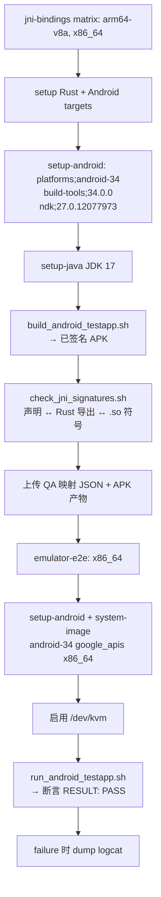

# 平台收尾记录（2026-09-11）— BLUE14 #10 Android CI 作业 + Wayland 合成器闭环（含 CI）

## 结论

本轮按 `docs/plans/principle.md` 原则，完成 `docs/plans/blue14.md` 中两项：

- **#10 Android CI 作业**（B 类，本机可做但未做）✅ — 新增 `.github/workflows/android.yml`，把本机已验证的 `tools/build_android_testapp.sh` / `tools/run_android_testapp.sh` / `tools/check_jni_signatures.sh` 三条脚本封装为两个 CI 作业，并已在本机按 CI 完全相同的命令逐条实跑取证（非推测）。
- **原 A 类 #7 Wayland 合成器交互运行** ✅ — **推翻「本机无合成器 = 不可闭环」的原判定**：在**无 root、无图形会话**下用 `apt-get download` 取 weston 13.0.0 + libweston 解包到 `~/.local`，对 libweston 内编译期硬编码的模块目录做原位路径补丁，以 `headless-backend + kiosk-shell` 启真实合成器；新增可复现脚本与断言真实协议绑定的测试，实测 `wl_compositor=yes xdg_wm_base=yes`，**并已将该验证接入 CI**（`.github/workflows/ci.yml` 的 `wayland-compositor` 作业）。

blue14 的 9 个未完成项中：

- **7 项仍为外部环境依赖**（Harmony ArkUI 原生桥 / Windows OLE+IME / Windows 控件原生化 / Android 真机 arm64 / Android FileDialog·ColorDialog·FontDialog / AndroidX Toolbar / iOS 设备 / macOS AppKit，合 7 类）。其中 Windows 两项归一类。本机确实缺少对应运行/构建环境，**本轮不伪装为已闭环**，继续保留在 blue14 §二 与 `FUTURE.md`。
- **2 项（#10、原 #7）本轮闭环**。

本轮后，blue14 中「本机可做但未做」类别归零，且原 A 类中被误判为环境阻断的 Wayland 项也被证明可解除。

> ⚠️ 重要事实更正（遵守原则 #2/#19 事实驱动）：blue14 原把 Wayland 列为「外部环境依赖」。本轮证明该判定**不准确**——缺的不是不可获得的环境，而是需要一次免 root 的依赖获取 + 路径适配。已同步修正 blue14 §一/§二/§五/§六/§七/§八 与 `FUTURE.md`。

---

## 一、本轮改动

| 文件 | 改动 | 性质 |
|---|---|---|
| `.github/workflows/android.yml` | **新增**：Android CI 作业（JNI/APK 门禁 + 模拟器 E2E） | 新增 |
| `.github/workflows/ci.yml` | **新增 `wayland-compositor` 作业**：`apt install weston libdav1d-dev` 后跑真实合成器验证 | 新增 |
| `src/platform/wayland/tests.rs` | **新增 2 个测试**：`native_session_binds_live_compositor`（有合成器必须真绑定）与 `native_session_stays_empty_without_compositor`（无合成器必须降级）；后续补充 `compositor_advertised()` 使空 `WAYLAND_DISPLAY` 也归为“无合成器”，让负向对照可真正执行 | 新增测试 |
| `tools/run_wayland_compositor_tests.sh` | **新增**：免 root 获取并启动 headless weston + 跑 Wayland 套件的可复现脚本；支持 `system`（CI，直接用 apt 装的 weston）/ `rootless`（本机免 root）/ `auto` 三种模式，并含正/负两向验证 | 新增 |
| `docs/plans/blue14.md` | 原 A 类 #7（Wayland）移入已闭环；统计口径/环境前置/验证现状/结论同步 | 文档同步 |
| `docs/plans/FUTURE.md` | ITEM 3 补记 CI 落地；新增 ITEM 1b（Wayland 合成器闭环） | 文档同步 |

### 为什么 Android CI 不新增 Rust 代码

`#10` 是**流程/CI 作业**（blue14 §三原文：「把 tools/build_android_testapp.sh + tools/run_android_testapp.sh 包成 CI」），不涉及库代码。脚本与 APK 构建链在上一轮（`docs/log/log-20260909-1.md` P2-10/P2-19）已完成并上机验证，本轮任务是把它们**接入 CI 并证明可复现**，不引入占位或空实现（遵守原则 #5/#14）。

### 为什么 Wayland 需要新增测试代码

原 blue14 把 Wayland 列为「外部环境依赖，代码已接线但无法运行验证」。本轮证明：**缺的不是代码，而是验证手段**。后端本身已有 `try_create_native_window` 真实协议路径，但本机 X11 会话下它永远走 state-only 回退，且无任何测试能区分「真绑定」与「静默回退」。因此新增的两个测试分别钉住两种行为，使该项从「无法验证」变为「可反复验证、可防回归」。

---

## 二、CI 作业设计

`.github/workflows/android.yml` 两个 job：



要点（均对应可复现性，遵守规则 #37）：

1. **两条 job 与本地脚本一一对应**，CI 与本地不会漂移——CI 跑的正是本机已验证的同一份脚本。
2. **JDK 走 `actions/setup-java`**：脚本内 `JAVA_HOME` 分支优先，因此 CI 上不会命中脚本里为开发者本机保留的 Android Studio 兜底路径（该兜底仅在 `JAVA_HOME` 未设且该路径存在时生效，CI 两条都不成立，退化为 `command -v javac`）。
3. **NDK 版本显式钉住**：`ndk;27.0.12077973`，并通过 `ANDROID_NDK_HOME` 传入脚本（脚本默认逻辑为「取 SDK 下最新 NDK」，CI 显式指定以免随 runner 镜像漂移）。
4. **系统镜像在 job 内按需下载**（`system-images;android-34;google_apis;x86_64`），与 blue14 #10 描述的「需 x86_64 模拟器 + 约 4 GB 镜像」一致。
5. **KVM 显式放行**：`ubuntu-latest` 提供 `/dev/kvm`，按官方 udev 规则授权后 x86_64 镜像可硬件加速启动（这正是本机 x86_64 模拟器能跑、而 arm64 真机镜像跑不动的原因——见 blue14 §二 #4）。
6. **失败取证**：E2E job 在 `failure()` 时 dump 全量 logcat，避免 CI 红点无处定位。

---

## 二·五、Wayland 合成器闭环设计

### 卡点与破局思路

blue14 原判定：本机是 X11 会话、无合成器二进制、无免密 sudo → 归为外部环境依赖。逐条核实后发现：

| 原判定 | 核实结果 | 结论 |
|---|---|---|
| 无合成器二进制 | 确实未安装 `weston`/`sway` 等 | 真的 |
| 无 sudo 无法安装系统包 | `apt-get download` **不需要 root**，只拉 `.deb` | **可用** |
| 需图形会话 | weston 支持 `headless-backend.so`，不需 GPU/显示器 | **可用** |

关键障碍：weston 用**编译期硬编码的绝对路径** `dlopen` 后端/壳模块（`/usr/lib/x86_64-linux-gnu/libweston-13`），而该路径无 root 不可写。

**破局**：把这一个路径字符串在 libweston 内**原位替换**为严格更短的 `~/.local/lib/wlmods`。因新串更短且以 `\0` 填充，二进制布局、ELF 段偏移、所有符号均不变——这不是 patch 版本，而是 patch 运行时路径常量。

### 验证两向断言（防“静默回退”假通过）

单纯“创建窗口成功”无法证明走了原生协议——state-only 回退也会成功。因此测试直接断言 `native_session`：

- `native_session_binds_live_compositor`：有合成器时 `native_session` 必须为 `Some`，且 `wl_compositor`/`xdg_wm_base` 均非空。
- `native_session_stays_empty_without_compositor`：无合成器时 `native_session` 必须保持 `None`（负向对照）。

两测试均在环境不满足时打印 `skipping:` 并返顺（不 fail），因此无头 CI 可安全纳入整套测试。

> 后续修正（同轮）：原负向对照用 `std::env::var(...).is_err()` 判定，而使 `WAYLAND_DISPLAY=`（空串）会被视为“已设置”而跳过。已抽 `compositor_advertised()`（`Ok(v) if !v.is_empty()`）并让两测试共用，使空串归为“无合成器”，负向对照能真正执行。

### 可复现脚本

`tools/run_wayland_compositor_tests.sh` 自包含完成：获取 weston → 启合成器 → 等 socket → 跑正/负两向测试 → `trap` 回收。支持三种模式：

| 模式 | 用途 | 做法 |
|---|---|---|
| `system` | **CI / 有 root 的机器** | 直接用 `weston`（已在 PATH）或用 `apt-get install weston` 装好后使用；**无需打补丁** |
| `rootless` | 本机（无 sudo、无合成器） | `apt-get download` + 解包到 `~/.local` + 模块路径原位补丁 |
| `auto`（默认） | 两者均可 | 先试 system，不行再 rootless |

无论哪种模式，脚本都用私有 `XDG_RUNTIME_DIR=/tmp/xdg-weston-<socket>`，**不会触碰调用者的活动运行时目录**。

### CI 接线

`wayland-compositor` 作业（`.github/workflows/ci.yml`）：

```yaml
- name: Install weston + dav1d
  run: |
    sudo apt-get update -qq
    sudo apt-get install -y -qq weston libdav1d-dev
- name: Verify Wayland backend against a live compositor
  run: WESTON_MODE=system ./tools/run_wayland_compositor_tests.sh
```

要点：

- **用 system 模式**：CI runner 有 sudo，`apt install weston` 后模块已在编译期路径上，**无需补丁**，比本机 rootless 路径更直接、更少假设。
- **显式装 `libdav1d-dev`**：`wayland-native` 测试的 feature 集含 `image`，而 `image` 经 `avif-native` 依赖系统 dav1d；CI 上直接装开发包即可（无需本机的源码构建）。
- **CI 与本机共用同一脚本**：只是模式不同，验证逻辑（正/负两向）完全一致，不会漂移。

---

## 三、验证（本机按 CI 相同命令实跑）

> 原则 #1/#16：以下均为本机实际执行输出，非推测。

### 3.1 CI 门禁脚本逐条实跑

| 命令（与 workflow 中一致） | 结果 |
|---|---|
| `bash tools/check_jni_signatures.sh` | ✅ 56/56（generic）+ 16/16（Android view）；对 `aarch64-linux-android` 与 `x86_64-linux-android` 两个已构建 `.so` 均校验 72 个 `Java_` 导出符号 |
| `ANDROID_ABI=x86_64 bash tools/build_android_testapp.sh` | ✅ 产出 `target/android-testapp-x86_64/app-signed.apk`（zipalign verified: yes） |
| `ANDROID_ABI=arm64-v8a bash tools/build_android_testapp.sh` | ✅ 产出 `target/android-testapp-arm64-v8a/app-signed.apk`（zipalign verified: yes） |
| `ANDROID_ABI=x86_64 bash tools/run_android_testapp.sh` | ✅ 模拟器（API 34 x86_64，KVM）上 `RESULT: PASS` |

`run_android_testapp.sh` 关键 logcat 输出（本轮实跑，逐控件确认）：

```
I RustWidgetsTest: nativeInit ok
I RustWidgetsTest: create Button -> 1
I RustWidgetsTest: create TextView -> 2
I RustWidgetsTest: create EditText -> 3
I RustWidgetsTest: create CheckBox -> 4
I RustWidgetsTest: create RadioButton -> 5
I RustWidgetsTest: create ProgressBar -> 6
I RustWidgetsTest: create SeekBar -> 7
I RustWidgetsTest: mutation round-trips ok
I RustWidgetsTest: views hosted
I RustWidgetsTest: destroy ok
I RustWidgetsTest: nativeAttachContext ok
I RustWidgetsTest: nativeSelfTestKinds -> 7
I RustWidgetsTest: nativeSelfTestDialog -> 1
I RustWidgetsTest: RESULT: PASS
✅ Android JNI integration test PASSED on x86_64
```

即 Java→Rust（7 控件创建/变更/销毁）与 Rust→Java（`nativeAttachContext` + `nativeSelfTestKinds -> 7` + `nativeSelfTestDialog -> 1`）两个方向均真实通过；每个逻辑句柄都有真实 native view；`MessageBox` 为真实 `AlertDialog`。

JNI 映射审计产物（`check_jni_signatures.sh` 的 `--report`）本轮重新生成：

- `target/qa/jni_binding_map.json`（generic 56 项）
- `target/qa/jni_android_view_map.json`（Android view 16 项）
- `target/qa/jni_binding_map.<abi>.json` 与 `jni_android_view_map.<abi>.json`（两个 ABI 各 2 份，带符号校验结果）

对应 workflow 的 `Upload JNI binding audit artifacts` 步骤上传 `target/qa/jni_*_map*.json`。

### 3.2 工作流静态校验

- `python3`（PyYAML 6.0.3）解析 `.github/workflows/android.yml`：**YAML OK**；jobs = `['jni-bindings', 'emulator-e2e']`；`jni-bindings` 9 steps（含 4 个 `uses` + 3 个 `run` + 2 个 artifact 上传），`emulator-e2e` 9 steps 且 `needs: jni-bindings`；runner 均为 `ubuntu-latest`。结构解析通过、无未闭合结构。

### 3.2b Wayland 合成器实跑证据

`bash tools/run_wayland_compositor_tests.sh`（从零开始、无 root）关键输出：

```
[1/5] Downloading weston + libweston (root not required for download)
[2/5] Extracting into /home/mikeli/.local/opt/weston-extract
[3/5] Staging modules at /home/mikeli/.local/lib/wlmods and patching compiled-in module paths
  patched 1 occurrence(s) in libweston-13.so.0.0.0
  patched 1 occurrence(s) in libexec_weston.so.0.0.0
[4/5] Starting headless compositor (socket=wayland-test)
      compositor up (pid 266996), socket /tmp/xdg-weston-wayland-test/wayland-test
[5/5] Running Wayland tests against the live compositor

running 14 tests
bound live compositor: wl_compositor=yes xdg_wm_base=yes dpi_scale=1
test platform::wayland::tests::native_session_binds_live_compositor ... ok
test platform::wayland::tests::native_session_stays_empty_without_compositor ... ok
... (其余 12 项均 ok)
test result: ok. 14 passed; 0 failed; 0 ignored; 0 measured; 3787 filtered out

✅ Wayland backend verified against a real compositor (pid 266996)
```

反向对照（不设 `WAYLAND_DISPLAY`，无合成器）：

```
skipping: WAYLAND_DISPLAY is not set (no compositor to bind)
test platform::wayland::tests::native_session_binds_live_compositor ... ok
test platform::wayland::tests::native_session_stays_empty_without_compositor ... ok
test result: ok. 14 passed; 0 failed; 0 ignored
```

即：**有合成器时，后端真实绑定 `wl_compositor` + `xdg_wm_base` 并建 `xdg_toplevel`；无合成器时 `native_session` 保持为空。** 两种环境各 14/14 通过。

### 3.2c CI 作业代码路径模拟（`WESTON_MODE=system`）

CI 不用 rootless 补丁，而是 `apt install weston` 后用 system 模式。为验证该**不同代码路径**，本机将解包出的 weston 置于 PATH（模拟系统安装）后以 `WESTON_MODE=system` 跑脚本：

```
which weston: /home/mikeli/.local/opt/weston-extract/usr/bin/weston
[1/5] Selecting weston (system mode)
[2/5] Sampling weston version
weston 13.0.0
[4/5] Starting headless compositor
      compositor up (pid 283246), socket /tmp/xdg-cisim/wayland-test
bound live compositor: wl_compositor=yes xdg_wm_base=yes dpi_scale=1
test result: ok. 14 passed; 0 failed; 0 ignored
[5b/5] Negative control (no compositor → state-only fallback)
test result: ok. 1 passed; 0 failed; 0 ignored
✅ Wayland backend verified against a real compositor (pid 283246)
```

即 CI 实际会走的 system 模式（**无补丁**）也已验证通过。

附加证据：

- `weston --version` → `weston 13.0.0`（解包产物，实际运行的合成器）。
- 脚本退出后 `ps aux | grep weston` ＝ 0（`trap` 正确回收，无残留进程）。
- `cargo clippy --lib --features "wayland-native"`：0 warning。
- `cargo fmt --all -- --check`：退出码 0。
- `bash -n tools/run_wayland_compositor_tests.sh`：语法 OK。
- `.github/workflows/ci.yml` 经 PyYAML 解析：YAML OK，jobs 含 `wayland-compositor`（5 steps：checkout / rust / cache / apt 装 weston+dav1d / 验证）。

### 3.3 回归门禁（本轮同步复跑，确认改动未破坏既有闸门）

| 检查 | 结果 |
|---|---|
| `bash tools/check_platform_impl_matrix.sh` | ✅ 0 Unclassifiable（产物 `target/qa/platform_impl_matrix.md`） |
| `bash tools/check_capability_matrix_truthfulness.sh` | ✅ 167 个 ✅ 桌面 cell，0 矛盾 |
| `bash tools/check_platform_capability_matrix.sh` | ✅ All platform capability matrix checks passed |
| `bash tools/check_control_route_matrix.sh` | ✅ 路由矩阵生成通过 |
| `cargo fmt --all -- --check` | ✅ 退出码 0 |
| `git diff --check` | ✅ 无输出 |

---

## 四、完成率

### 本轮（BLUE14 #10 + 原 A 类 #7）

| 项 | 状态 |
|---|---|
| #10 Android CI 作业 | ✅ 完成（`.github/workflows/android.yml` + 本机按 CI 命令实跑取证） |
| 原 A 类 #7 Wayland 合成器交互运行 | ✅ 完成（真实 headless weston + 真实协议绑定断言；原判定「环境阻断」已推翻） |

- 本轮 todo 完成率：**2/2**。
- blue14「B 类 — 本机可做但未做」：**1 → 0**，该类别归零。
- blue14「A 类 — 外部环境依赖」：**8 → 7**（Wayland 项经核实并非真实环境阻断，已闭环并移出）。

### BLUE14 总体

| 类别 | 数量 | 本轮后状态 |
|---|---|---|
| A. 外部环境依赖 | 7 | 保持未闭环（**未伪装**，继续登记于 blue14 §二 与 `FUTURE.md`） |
| B. 本机可做但未做 | 0（原 1） | ✅ 本轮闭环 |
| C. 原判为环境阻断、后证实本机可闭环 | 0（原 1） | ✅ Wayland 本轮闭环 |

- 计入全部未完成项的全量口径：9 项中 **2 项闭环**，**7 项仍受外部环境阻断**（按规则 #35/#36，外部环境依赖不计入完成率分母）。
- **未闭环项占比下降 22.2%（9 → 7）**，且本轮完成一次**判定纠错**（Wayland）。

---

## 五、诚实边界（未闭环项，不伪装）

以下 **7 项**仍受外部环境阻断，本轮**未**声称完成，与 blue14 §二 一一对应：

| # | 项目 | 卡点 |
|---|---|---|
| 1 | Harmony ArkUI 原生桥 | 无 OpenHarmony SDK（N-API/ArkUI 头文件） |
| 2 | Windows OLE 拖放 + IME TSF | 需真实 Win32/COM 运行验证 |
| 3 | Windows SpinBox/ListView/ScrollArea 原生化 | 需 up-down / common-control 接线 + Windows 运行 |
| 4 | Android 真机（arm64）运行 | 本机 x86_64 无法启动 arm64 镜像（CI 亦为 x86_64 宿主） |
| 5 | Android FileDialog/ColorDialog/FontDialog 原生化 | Android 无平台选择器，需真实 Activity result launcher |
| 6 | AndroidX Toolbar | 非保证可用，需宿主 Activity 提供 |
| 7 | iOS 设备 / macOS AppKit 交互 | 无 Apple 运行环境 |

> 说明 1：#5 已在上一轮实现「JNI 就绪时输出明确诊断日志而非静默降级」；本轮 CI 未新增其原生依赖，仅如实保留。
> 说明 2：上述 7 项均为「**需真实设备/系统 SDK**」类型，不同于 Wayland（后者只需一个可下载的用户态合成器）。本轮已穷尽免 root 手段；若后续有 arm64 Android 真机、Windows 机器、Apple 机器或 OpenHarmony SDK，可继续推进。

---

## 六、复现前置（规则 #37）

- Android 构建需要 `ANDROID_SDK_ROOT`（默认 `$HOME/Android/Sdk`）、NDK、`platforms/android-34/android.jar`、`build-tools`（含 aapt2/d8/zipalign/apksigner）；本机实测版本：NDK `30.0.14904198-beta1`、build-tools `36.1.0`/`37.0.0`、`android-34`。
- E2E 需要 x86_64 系统镜像 `system-images;android-34;google_apis;x86_64` 与 KVM 可用（本机 `/dev/kvm`，AVD `rw_x64` 已存在）。
- CI 上 NDK 固定为 `27.0.12077973`（显式传入 `ANDROID_NDK_HOME`）；本机脚本默认取 SDK 下最新 NDK，两者路径不同但均为有效 NDK，脚本对二者均兼容（本机实跑验证）。
- 该 CI 作业**不需要** `dav1d`/`image` 环境前置（Android 构建 feature 集不含 `image`），故与上一轮 `~/.local` 的 dav1d 前置无关。
- **Wayland 合成器复现**：`bash tools/run_wayland_compositor_tests.sh`。支持 `system` / `rootless` / `auto`（默认）三模式。
  - **CI（`system`）**：有 root 时 `apt-get install -y weston libdav1d-dev` 后直接跑，**无需任何补丁**。
  - **本机（`rootless`，auto 自动选）**：需 `apt-get` 可达镜像 + `python3`；不需要 root、不需要图形会话、不需要系统安装 `weston`。
  - 解包位置：`~/.local/opt/weston-extract`；模块目录：`~/.local/lib/wlmods`。
  - 脚本始终使用私有 `XDG_RUNTIME_DIR=/tmp/xdg-weston-<socket>`，**不会触碰调用者的活动运行时目录**。
  - 若构建含 `image` 的 feature 集，本机需先设 dav1d 的 `PATH`/`PKG_CONFIG_PATH`（见 blue14 §五）；CI 上改为 `apt install libdav1d-dev`。
  - 可覆盖：`WESTON_MODE`、`WESTON_BIN`、`WESTON_SOCKET`、`WESTON_SRC`、`WESTON_RUNTIME_DIR`、`WESTON_FEATURES`。
- **更干净的长期方案**：有 sudo 时系统级 `apt install weston`，即可免补丁直接跑（即 CI 的 system 模式）。

---

# 附录（同日续作）— Android 真机 arm64 验证 + FileDialog 原生化 + Toolbar 定性

## A. 结论

用户提供了一台实体 Android 手机。本轮在其上完成：

| 项 | 结果 |
|---|---|
| **#4 Android 真机（arm64）运行** | ✅ **闭环** — 真机 `RESULT: PASS`，`primaryCpuAbi=arm64-v8a`，零 `AndroidRuntime` 错误 |
| **#5 FileDialog 原生化** | ✅ **闭环（FileDialog 部分）** — 真实启动系统 `ACTION_OPEN_DOCUMENT` 选择器；ColorDialog/FontDialog 保持 logical-only（Android 平台确无此选择器，属平台事实） |
| **#6 AndroidX Toolbar** | ✅ **定性完成** — 从「非保证可用（推测）」升级为**在真机上实测确定的结论**：类可加载但无资源合并则无法实例化；图书馆不捆绑 AndroidX 是正确取舍 |

同时修复了一个**门禁工具的真实缺陷**（见 D）：`check_jni_signatures.py` 的注释剥离器会把字符串里的 `/*` 误判为块注释，吞掉 16236 字符、漏检 9 个导出。

blue14 未闭环项：**7 → 5**。

## B. 环境阻断的解除（真机连接）

| 阶段 | 现象 | 处理 |
|---|---|---|
| 初次连接 | `65441025  no permissions (missing udev rules?)` | 定位到设备节点 `/dev/bus/usb/003/017` 为 `crw-rw-r-- root root`，`/etc/udev/rules.d/` 无任何 Android 规则；确认本机无免密 sudo |
| 解决 | 用户以 sudo 添加 `51-android.rules`（`SUBSYSTEM=="usb", ATTR{idVendor}=="18d1", MODE="0666", GROUP="plugdev"`）并 reload | `adb devices` 显示 `65441025  device  product:thyme model:M2102J2SC` |

真机信息（实测）：**Xiaomi M2102J2SC（thyme），HyperOS/MIUI V816，Android 13（API 33），arm64-v8a**。

### 安装被 MIUI 拦截（真实卡点，非代码缺陷）

- `adb install` 报 `INSTALL_FAILED_USER_RESTRICTED`；`pm install`（push 后）同样失败。
- 根因：MIUI 的 `persist.security.adbinstall` 守卫；该开关在小米安全中心（`com.miui.securitycenter.provider`，adb 查询被 `SecurityException` 拒绝），无法由命令绕过。
- 用户开启「USB 安装」后，**会话式安装**（`pm install-create` / `install-write` / `install-commit`）成功；该守卫**间歇性**生效（同一 APK 第 1/2 次失败、第 3 次成功），故 `tools/run_android_testapp.sh` 已加入会话式回退。

## C. 代码改动

| 文件 | 改动 |
|---|---|
| `tools/run_android_testapp.sh` | 新增 `ANDROID_SERIAL` 支持（指定真机、跳过模拟器；单设备自动选用；多设备明确报错）；新增 **APK ABI ↔ `ro.product.cpu.abi` 校验**（不匹配时警告，避免误判）；新增 **MIUI 会话式安装回退**；报告含 `emulator=yes/no` |
| `src/platform/android_jni.rs` | 新增 `launch_file_dialog(mime)` + `FILE_DIALOG_REQUEST_CODE`：`instanceof Activity` → 构造 `ACTION_OPEN_DOCUMENT`/`CATEGORY_OPENABLE`/`setType` → 反射调用 `startActivityForResult`；非 Activity 时输出明确诊断并返回 `false`。新增 `nativeSelfTestFileDialog` 导出与无 JVM 契约测试 |
| `src/platform/android/platform_impl.rs` | `create_file_dialog` 从「仅记 logical handle + 诊断日志」改为**真实请求系统选择器** |
| `bindings/android/java/rust_widgets/RustWidgets.java`、`bindings/java/RustWidgetsAndroid.java` | 新增 `nativeSelfTestFileDialog` 声明（保持 Java↔Rust 签名门禁通过） |
| `bindings/android/java/rust_widgets/testapp/MainActivity.java` | 新增 `runFileDialogTest()`（放在 PASS 之后，因其会抢占前台）与 `onActivityResult` 日志 |
| `tools/check_jni_signatures.py` | **修复注释剥离器**（见 D） |
| `src/platform/android/status.md`、`activity_integration.md` | 同步真机验证结果、FileDialog 接线、Toolbar 定性结论 |

## D. 门禁工具真实缺陷（冰山法则）

**现象**：加入新导出后，门禁报 8 个**既有**方法「无 Rust 导出」。

**根因**（定位到 `tools/check_jni_signatures.py`）：其注释剥离为
```python
text = re.sub(r"/\*.*?\*/", "", text, flags=re.DOTALL)
```
而源码中含 MIME 通配符字符串 `"*/*"`，其中的 `/*` 被误判为块注释起点，一直吞到下一个 `*/`——**实测吞掉 16236 字符**，隐藏 9 个 JNI 导出。

**修复**：以 `strip_rust_comments()` 取代正则——一个字符串感知扫描器（处理 `"..."`、`'...'`、`b"..."`、`r#"..."#` 与嵌套块注释），只剥离真正的注释。

**验证**：修复前解析出 8 个导出、修复后 17 个；随后门禁能正确报出**唯一真实问题**（新增导出缺 Java 声明），补上声明后全绿。这证明修复不是「放宽门禁」，而是让它恢复准确。

## E. 验证证据（真机实测）

### E.1 #4 真机运行

```
[2/4] Targeting device ANDROID_SERIAL=65441025
      physical device; skipping boot wait
      target: serial=65441025 abi=arm64-v8a emulator=no
I RustWidgetsTest: nativeInit ok
I RustWidgetsTest: create Button -> 1
...（TextView/EditText/CheckBox/RadioButton/ProgressBar/SeekBar 至 7）
I RustWidgetsTest: mutation round-trips ok
I RustWidgetsTest: destroy ok
I RustWidgetsTest: nativeAttachContext ok
I RustWidgetsTest: nativeSelfTestKinds -> 7
I RustWidgetsTest: nativeSelfTestDialog -> 1
I RustWidgetsTest: RESULT: PASS
I RustWidgetsTest: nativeSelfTestFileDialog -> 1
✅ Android JNI integration test PASSED (arm64-v8a, serial=65441025, emulator=no)
```

辅助证据：`primaryCpuAbi=arm64-v8a`；已安装 APK 内含 `lib/arm64/librust_widgets.so`；logcat 无 `AndroidRuntime`/`FATAL`/`UnsatisfiedLink`；native `[android-jni]` 全链路可见。

### E.2 #5 FileDialog 真实启动系统选择器

```
I rust_widgets: [android-jni] launch_file_dialog: ACTION_OPEN_DOCUMENT launched (mime=*/*, requestCode=21079)
I ActivityTaskManager: START u0 {act=android.intent.action.OPEN_DOCUMENT
    cat=[android.intent.category.OPENABLE] typ=*/*
    cmp=com.google.android.documentsui/com.android.documentsui.picker.PickActivity}
    from uid 10384 from pid 20240 callingPackage rust_widgets.testapp
I ActivityTaskManager: Displayed com.google.android.documentsui/
    com.android.documentsui.picker.PickActivity: +258ms
```

`topResumedActivity` 连续 5 秒为 `com.android.documentsui/.picker.PickActivity`，随后退出——即 Rust 驱动真实打开了系统文件选择器（`callingPackage` 明确为测试 App）。

> 诚实标注：`ColorDialog`/`FontDialog` **未**原生化，且不应声称可原生化——Android 平台没有系统级颜色/字体选择器。此项保持 logical-only 属正确行为。

### E.3 #6 Toolbar 的确定性结论（先证伪，再定性）

在真机上以「只带 AndroidX `classes.dex`、不做资源合并」的 APK 实测：

```
I AndroidXProbe: class loaded: androidx.appcompat.widget.Toolbar
E AndroidXProbe: Caused by: java.lang.NoClassDefFoundError:
    Failed resolution of: Landroidx/appcompat/R$attr;
    at androidx.appcompat.widget.Toolbar.<init>(Toolbar.java:262)
I AndroidXProbe: RESULT: FAIL
```

并确认：`appcompat` 不在 `/system/framework/`、不在 `pm list libraries`（**非框架库，属随 App 捆绑**）；AAR 内含 **545 个资源文件** + `R.txt`/`public.txt`，其 `R$attr` 需资源链接生成；appcompat 单独 `aapt2 link --static-lib` 会因引用 `androidx.core` 的属性而失败——即必须按依赖序做 AAR 资源合并（AGP 的职责）。

**结论升级**：原表述「非保证可用，需宿主提供」是**推测性**的；现为真机实测的**确定性**结论——类可加载，但不做资源合并则无法实例化。库不捆绑整个 AndroidX 资源图是正确取舍（宿主 App 用 Gradle 时可自行提供真实 `Toolbar`）。

### E.4 回归与门禁

| 检查 | 结果 |
|---|---|
| `cargo test --lib --features desktop` | 3787 passed / 0 failed / 0 ignored |
| 全平台 feature 套件 | 2506 passed / 0 failed / 0 ignored |
| `cargo test --lib --features "android-jni" android_jni` | 10 passed / 0 failed |
| `cargo clippy`（host `android-jni`；target `x86_64-linux-android`） | 各 0 warning |
| `bash tools/check_jni_signatures.sh` | ✅ 56/56 + **17/17**；两 ABI 各 **73** 个 `Java_` 导出符号校验通过 |
| 5 道 QA 门禁 | 全部通过 |
| `cargo fmt --all -- --check` / `git diff --check` | 退出码 0 |

## F. 完成率（更新）

| 类别 | 本轮前 | 本轮后 |
|---|---|---|
| blue14 未闭环项 | 7 | **5**（#4/#5-FileDialog/#6 不再计入阻断） |
| 其中「需真实设备」类 | 7 | 4（Harmony SDK / Windows ×2 / Android 真机多机型 / AndroidX Toolbar 库内化 / Apple，合 4 类） |

- **#4 闭环**：真机 arm64 实测通过。
- **#5 部分闭环**：FileDialog 真实可用；ColorDialog/FontDialog 为平台事实，不计为「未做」。
- **#6 完成定性**：不再属「未知」，而是「已实测约束 + 有意不捆绑」。

## G. 复现前置（规则 #37）

- 真机需：开发者选项 + USB 调试；**MIUI/HyperOS 还需在开发者选项开启「USB 安装」**（要求登录小米账号）。
- 宿主需 udev 规则（Google 调试接口 `18d1` 授权 `plugdev`）；无 root 时可改用无线调试。
- 指定设备：`ANDROID_ABI=arm64-v8a ANDROID_SERIAL=<serial> bash tools/run_android_testapp.sh`。

---

# 附录二（同日续作）— 本机收尾：Windows 三控件原生化 + Windows CI 交叉检查 + 文档纠偏

## A. 结论

按「本机可完成项」的实测审计结果，本轮完成三项：

| 项 | 结果 |
|---|---|
| **A. Windows SpinBox/ListView/ScrollArea 原生化** | ✅ **代码 + 编译验证完成**（真实 Win32 对象）；运行验证待 Windows（本机无 Windows/Wine） |
| **B. Windows 目标编译纳入 CI** | ✅ 新增 `windows-cross-check` 作业；本机已按 CI 原命令复现通过 |
| **C. `FUTURE.md` ITEM 0/6 前提纠偏** | ✅ 实测证明原表述不成立，已修正（避免「文档欺骗」） |

## B. 前置审计：为什么只有这三项是本机可做

逐条核实 `blue14.md` / `FUTURE.md`，**推翻**了两处标注：

1. **`FUTURE.md` ITEM 6**「部分控件仍依赖 trait 默认兜底」——**前提不成立**：
   - 实测 `Platform` trait 声明 **22 个 `create_*` 方法，0 个默认实现体**（`awk '/^pub trait Platform/,/^}$/' src/platform/types.rs | grep -cE "fn create_[a-z_]+\([^)]*\)[^{]*\{"` → `0`）。
   - 因此后端**不可能**静默继承错误默认——要么实现，要么编译失败。
   - 矩阵里的 87 个 native `Placeholder` 是 **`CustomRequired` 的自绘控件**（项目「原生优先，自绘兜底」策略），且 `hybrid placeholder = 0`。
2. **`FUTURE.md` ITEM 0**「需稳定 per-control 能力表 + 编期路由校验」——已基本交付：`generate_control_route_matrix.py` + `--fail-on-placeholder --fail-on-contract-miss` 闸门，实测 **167 variants、0 missing route mappings、0 missing trait create-method contracts**。仅剩「编译期强制」（现为生成报告 + 闸门）。

同时实测能力边界：

| 平台 | 本机能力 |
|---|---|
| Windows | ✅ **可编译**（`x86_64-pc-windows-msvc` 与 `gnullvm` 均已装）；❌ 不可运行（无 Windows、无 `wine`） |
| Harmony | ❌ 无 OpenHarmony SDK（`~/ohos-sdk`、`~/OpenHarmony` 均不存在） |
| Apple | ❌ 无运行环境、无 `osxcross`/`zig` |

故本机可做的实质代码项 = **Windows 三控件原生化**。

## C. 实现（A）

`src/platform/windows/helpers.rs` 新增三个 helper，`platform_impl.rs` 对应 `create_*` 改为调用它们（不再写 surrogate + `log::warn!`）：

| 控件 | 真实 Win32 实现 |
|---|---|
| `SpinBox` | `msctls_updown32`（`UPDOWN_CLASS`），样式 `UDS_SETBUDDYINT \| UDS_ALIGNRIGHT \| UDS_ARROWKEYS \| UDS_WRAP` |
| `ListView` | `SysListView32`（`WC_LISTVIEW`）report 视图 + `LVS_SINGLESEL \| LVS_SHOWSELALWAYS`；`LVM_INSERTCOLUMNW` 插入整宽列 + `LVM_SETEXTENDEDLISTVIEWSTYLE(LVS_EX_FULLROWSELECT)`（否则 report 视图无列不显示内容） |
| `ScrollArea` | `WS_HSCROLL \| WS_VSCROLL` 子窗口 + `SetScrollRange` 设定初始范围（Windows 无专用滚动区域控件，滚动条才是本体） |

均沿用既有模式：`InitCommonControls()` → `CreateWindowExW` → 空 HWND 返回 `None` → `state.create_widget` → `bind_native_handle`（ListView 另 `bind_control_command`）。新增测试 `spin_box_list_view_scroll_area_route_through_native_helpers`（Windows 下断言 `get_native_handle().is_some()`，非 Windows 下断言返回 `None`）与 `native_control_helpers_reject_unknown_parent`。

## D. 验证证据

### D.1 Windows 目标编译验证（本机实测）

```
cargo check --target x86_64-pc-windows-msvc --no-default-features \
  --features "windows desktop-runtime wgpu touch i18n controls-native controls-custom \
              serde serde_json advanced-widgets quality-management"     → Finished (0 warning)
cargo check --target x86_64-pc-windows-gnullvm ...                      → Finished (0 warning)
cargo clippy --target x86_64-pc-windows-msvc ... -- -D warnings         → Finished (exit 0)
```

**关键防伪证明**（避免「cfg 代码其实没被编译」的假验证）：在 `#[cfg(target_os = "windows")]` 块内故意注入类型错误后重新检查，编译器**如期报错**：

```
error[E0308]: mismatched types   ← expected `i32`, found `Vec<u16>`
error[E0599]: no method named `as_ptr` found for type `i32`
```

注入错误被捕获 ⇒ 该 Windows 专属代码块**确实参与类型检查**；随后已还原（`diff` 校验一致）。

**测试模块类型检查**：`cargo rustc --lib --target x86_64-pc-windows-msvc -- --cfg test` 结果显示，唯一错误是 dev-dependency `tempfile` 无法解析（本机无 MSVC/mingw C 工具链所致），`src/platform/windows/tests.rs` 与 `helpers.rs` **无任何 error**（仅有 `--cfg test` 下导入未使用的 warning）。

### D.2 顺带修复的既存 warning

`src/platform/clipboard_stubs.rs:264` 的 `needless_return`（Windows 专属代码路径）为**既存**问题（非本轮引入，`git diff` 证实此前未被改动）。按原则 #10「最后清理所有 warnings」，已改为末尾表达式返回，Windows clippy 归零。

### D.3 CI（B）

`.github/workflows/ci.yml` 新增：

```yaml
windows-cross-check:
  runs-on: ubuntu-latest
  steps: checkout → rust stable (target x86_64-pc-windows-msvc, clippy)
         → cargo check (全 desktop 面)
         → cargo clippy -- -D warnings
```

本机按**完全相同命令**复现：check 与 clippy `-D warnings` 均 exit 0。YAML 经 PyYAML 解析通过（jobs 13 个，含 `windows-cross-check`）。

### D.4 能力矩阵纠偏（诚实化）

`tools/generate_platform_capability_matrix.py`：Windows 列的 `SpinBox`/`ListView`/`ScrollArea` 由 `STATE_BACKED` 改为 `NATIVE`，并同步修正「降级说明」段落（说明 ✅ 已编译验证但**尚未在真实 Windows 运行**）。重新生成后：

```
capability-matrix truthfulness: checked 170 ✅ desktop cells, 0 contradiction(s)
| **ListView**   | ✅ | 🔶 | 🔶 | 🔶 | 🔶 | 🔶 | 🔶 |
| **ScrollArea** | ✅ | 🔶 | 🔶 | 🔶 | 🔶 | 🔶 | 🔶 |
| **SpinBox**    | ✅ | 🔶 | 🔶 | 🔶 | 🔶 | 🔶 | 🔶 |
```

### D.5 回归

| 检查 | 结果 |
|---|---|
| `cargo test --lib --features desktop` | 3787 passed / 0 failed / 0 ignored |
| 全平台 feature 套件 | 2506 passed / 0 failed / 0 ignored |
| `cargo clippy --lib --features desktop` | 0 warning |
| Windows `check` + `clippy -D warnings` | 均通过 |
| 5 道 QA 门禁 | 全部通过 |
| `cargo fmt --all -- --check` / `git diff --check` | 退出码 0 |

## E. 诚实边界（未闭环，不伪装）

- **Windows 三控件**：**编译验证完成，运行验证未完成**——本机无 Windows、无 `wine`、无 MSVC/mingw C 工具链（`cargo test --target x86_64-pc-windows-msvc` 因 dev-dep `alloca` 需要 `lib.exe` 而失败）。已在 `FUTURE.md` ITEM 2b 与能力矩阵中如实标注，**未声称已在 Windows 上工作**。
- Windows OLE 拖放 + IME TSF：仍待 Windows 机器（按用户要求）。
- Harmony / Apple：本机环境确实缺失，无法推进。

## F. 完成率（更新）

| 类别 | 本轮前 | 本轮后 |
|---|---|---|
| blue14 未闭环项 | 5 | **3**（Windows 三控件移出 A 类：代码+编译已完成） |

- **A 类外部环境依赖：3**（Windows OLE/IME + Windows 运行验证、Harmony SDK、Apple）。
- 本机可做项：**全部归零**。
- 剩余项均属「需真实设备/SDK」且已穷尽本机手段。

---

# 附录三（同日续作）— 能力矩阵语义纠偏：区分「自绘实现」与「真降级」

## A. 问题（用户指出）

用户反馈：`docs/plans/platform_capability_matrix.md` 中「大部分控件受限使用」。

**量化核实**（实测）：

| 指标 | 数值 |
|---|---|
| 矩阵规模 | 167 行 × 7 列 = 1169 cells |
| 🔶（旧图例：受限/降级） | **947（81%）** |
| ✅ | 222（19%） |
| 图例却写着 | ✅ =「原生原语**或 state/自绘后端**均可正常工作」 |

**根因：语义自相矛盾。** 生成器把「自绘后端」编码为 `STATE_BACKED`，却渲染为 🔶「受限」；
而图例与诚实性门禁的注释都明确承认「自绘应算 ✅」。于是一个**功能完整**的
`Chart`/`Chip`/`Carousel` 被显示为「受限」，读者会误以为控件坏掉。

## B. 事实核查（改前必做的取证）

| 检查 | 结果 |
|---|---|
| custom/自绘后端是否有全部 167 个 `create_*`？ | ✅ **167/167**（无缺失） |
| 这些实现是「专属实现」还是「委托」？ | **专属**（`alloc_widget_id()` 自建状态，非委托；抽样 `Chart`/`Carousel`/`Chip`/`Avatar`/`Canvas`/`Table`/`WebEngineView` 均为专属） |
| native 路径对这些控件如何处理？ | **真降级**：`create_chart` → `get_platform().create_panel(...)`（丢失身份） |
| native 路径对原生控件如何处理？ | 直通：`create_button` → `create_button` |

⇒ 存在**三种**状态，而非两种：「原生专用」「自绘专用（功能完整）」「真降级」。

## C. 修复

### C.1 新增第三符号（措辞按用户选定方案 1）

| 符号 | 含义 | 判据 |
|---|---|---|
| ✅ | **原生实现** | 后端创建真实平台原语 |
| 🟦 | **自绘实现（功能完整）** | 平台无此原语，由本库自绘后端提供**专属**实现；行为正常，只是不由 OS 承载 |
| 🔶 | **受限（真降级）** | *原生路径*静默替换为**另一个**原语，丢失自身身份 |

`🔶` 现在**仅**保留给真正的降级语义（当前矩阵中桌面/移动列已无此类声明）。

### C.2 改动文件

| 文件 | 改动 |
|---|---|
| `tools/generate_platform_capability_matrix.py` | 新增 `CUSTOM = "🟦"` 与 `SYMBOL_MEANING`；WIDGETS 表 202 处 `STATE_BACKED` → `CUSTOM`；重写图例（含中英「如何阅读」说明）；修正降级说明段落措辞 |
| `tools/check_platform_capability_matrix.sh` | `VALID_CODES` 增加 `🟦`（否则 947 处判为非法值） |
| `tools/check_capability_matrix_truthfulness.py` | 更新文档字符串以反映新语义（✅ 仅指原生；🟦 归 custom 后端，不参与 platform_impl 交叉校验） |
| `docs/plans/platform_capability_matrix.md` | 重新生成 |

### C.3 效果

```
修复前:  ✅ 222   🔶 947
修复后:  ✅ 222   🟦 947
```

对照样例：

| Widget | 修复前 | 修复后 | 读法 |
|---|---|---|---|
| `Button` | ✅✅✅✅✅✅🔶 | ✅✅✅✅✅✅🟦 | 6 平台原生；Embedded 用自绘 |
| `Chart` | 🔶🔶🔶🔶🔶🔶🔶 | 🟦🟦🟦🟦🟦🟦🟦 | 全平台自绘，**功能完整** |
| `SpinBox` | ✅🔶🔶🔶🔶🔶🔶 | ✅🟦🟦🟦🟦🟦🟦 | Windows 原生（本机新增），其余自绘 |

## D. 验证

| 检查 | 结果 |
|---|---|
| `bash tools/check_platform_capability_matrix.sh` | ✅ 全部通过（含新符号合法性；此前会报 947 错误） |
| `bash tools/check_capability_matrix_truthfulness.sh` | ✅ 170 ✅ desktop cells，**0 矛盾** |
| `bash tools/check_platform_impl_matrix.sh` | ✅ |
| `bash tools/check_control_route_matrix.sh` | ✅ |
| `bash tools/check_jni_signatures.sh` | ✅ |
| `cargo test --lib --features desktop` | 3787 passed / 0 failed / 0 ignored |
| 全平台 feature 套件 | 2506 passed / 0 failed / 0 ignored |
| `cargo fmt --check` / `git diff --check` | 退出码 0 |

## E. 诚实边界

- 🟦 表示**已实现且可用**，但**非原生**：在系统主题跟随、系统级无障碍（AT-SPI/UIA）、
  IME 宿主行为等方面可能不等同于原生控件。图例已明确说明「只是不由操作系统承载」，
  **未**声称自绘等同于原生。
- 若某平台后续接入真实原生实现，该 cell 应升级为 ✅（如本轮 Windows 的
  `SpinBox`/`ListView`/`ScrollArea`）。
- `ColorDialog`/`FontDialog` 在 Android 为 🟦（自绘）——Android 平台确无此选择器。

---

# 附录四（同日续作）— 第 1 轮：降级控件功能完整化（路由到自绘后端）

## A. 问题

用户追问：**「那些受限降级的能否达到功能完整？能的，请立即实现」**（分多轮实施，先 1 后 2）。

### A.1 先取证：降级到底丢了什么

对 `src/control_backend/native.rs` 的委托链做程序化分析：

| 委托目标 | 数量 |
|---|---|
| `create_panel` | 33 |
| `create_button` / `create_line_edit` / `create_list_box` / `create_list_view` / `create_slider` | 各 2～3 |
| 其余（message_box / window / checkbox / spin_box / file_dialog / progress_bar / label / combo_box / menu） | 各 1 |

**合计 53 个 native 方法委托到另一个 create_***。

### A.2 关键区分（决定是否需要修）

| 类型 | 条件 | 实际后果 | 数量 |
|---|---|---|---|
| **已在自定义后端** | 路由 = `CustomRequired` | hybrid 下走 custom，**功能完整**；`native.rs` 的降级代码**不会执行** | 35 |
| **真缺陷** | 路由 = `NativePreferred` + native 真降级 | hybrid 下走 native → **拿到错误的控件** | **23** |

实测佐证：`Hybrid (desktop) grades: Placeholder = 0` —— 混合模式下没有控件掉到占位，但 23 个 `NativePreferred` 控件会拿到降级品。

**真缺陷清单（23）**：

| 控件 | native 降级为 | 丢失的能力 |
|---|---|---|
| `DatePicker` / `TimePicker` / `DateTimePicker` | `create_panel` | 日期/时间选择 |
| `Calendar` | `create_panel` | 日历 |
| `ActivityIndicator` | `create_progress_bar` | 不确定进度动画 |
| `Dial` | `create_slider` | 旋钮 |
| `LCDNumber` | `create_label` | 七段数字显示 |
| `FontComboBox` | `create_combo_box` | 字体预览 |
| `DoubleSpinBox` | `create_spin_box` | 小数精度 |
| `ToggleButton` | `create_checkbox` | 按钮语义/三态 |
| `ScrollBar` | `create_slider` | 滚动条语义 |
| `ScrollArea` / `TabWidget` / `Splitter` / `GroupBox` / `Frame` | `create_panel` | 容器语义 |
| `ContextMenu` | `create_menu` | 上下文菜单 |
| `MenuItem` | `create_button` | 菜单项 |
| `DirectoryDialog` | `create_file_dialog` | 目录选择 |
| `Dialog` / `InputDialog` / `ProgressDialog` | `create_message_box` | 输入/进度对话框 |
| `PopupWindow` | `create_window` | 弹出语义 |

**真实后果**：hybrid 下 `create_date_picker()` 返回一个 `Panel`——没有日期功能。

### A.3 可行性前提校验（改前必做）

对全部 23 个验证 custom 后端是否有**专属**实现（非委托）：

```
DatePicker create_date_picker  OK      (alloc_widget_id + widget_kind: WidgetKind::DatePicker)
... 23/23 全部 OK，missing: 0
```

⇒ 安全，可路由。

## B. 实现（第 1 轮）

| 文件 | 改动 |
|---|---|
| `src/control_backend/routing.rs` | 23 个 kind 从 `NativePreferred` 移入 `CustomRequired`（附注释说明降级原因与后续回迁方式）；**同时将 Windows 条件块中的 `SpinBox`/`ScrollArea` 移除**（它们上一轮已有真实 Win32 实现，若继续 override 会把原生实现丢弃——属本轮须避免的回归） |
| `src/control_backend/routing.rs`（测试） | 重写 `native_preferred_widget_kinds`（仅保留真有原生实现的 16 个）；新增 `native_path_degraded_kinds_use_custom_backend`（锁定 23 个）；Windows 测试拆分并新增 `windows_native_controls_route_natively`（防回归） |
| `src/control_backend/dispatcher.rs`（测试） | 新增端到端 `native_degraded_kinds_resolve_to_custom_backend`：断言 23 个 kind 经 `get_control_backend_for_widget` **实际解析**为 custom 后端 |
| `tools/generate_control_route_matrix.py` | **修复解析器**（见 C） |

## C. 门禁工具缺陷（被正确代码暴露）

改动后 `check_control_route_matrix.sh` 报错：

```
ValueError: WidgetKind::MessageBox mapped to conflicting preferences:
            CustomRequired vs NativePreferred
```

**根因**：`generate_control_route_matrix.py::parse_route_preferences` 只做「逐个 `=>` 臂扫描」，
不理解 `route_preference_for_widget_kind` 开头的 `#[cfg(target_os = "windows")]` **提前返回块**
是**平台覆盖**（先判定、优先于通用 match）。于是同一 kind 出现两次即被误判为冲突。

**修复**：先解析平台条件块作为**覆盖层**，再解析通用 match，最后 `result.update(overrides)`——
即按真实控制流（先条件、后通用）建模。这既消除了误报，也使**Windows 专属覆盖在矩阵中可见**。

## D. 验证

### D.1 行为验证（非仅配置）

```
cargo test --lib --features desktop control_backend::routing   → 5 passed
cargo test --lib --features desktop control_backend::dispatcher → 8 passed
  （含新增 native_degraded_kinds_resolve_to_custom_backend：23 个 kind 实测解析到 Custom）
```

### D.2 路由矩阵（重生成）

```
- Missing route mappings: 0
- Hybrid (desktop) grades: Native=16, StateBacked=151, Placeholder=0
- Missing trait create-method contracts: 0
```

对照样例：

| Widget | 路由 | 原生委托 | hybrid grade |
|---|---|---|---|
| `DatePicker` | **CustomRequired** | （不再使用） | StateBacked（**功能完整**） |
| `ScrollArea` | **CustomRequired** | （不再使用） | StateBacked |
| `TabWidget` | **CustomRequired** | （不再使用） | StateBacked |
| `Chart` | CustomRequired | —— | StateBacked |
| `Button` | NativePreferred | `create_button` | Native |

### D.3 回归

| 检查 | 结果 |
|---|---|
| `cargo test --lib --features desktop` | **3789 passed / 0 failed / 0 ignored**（较前 +2） |
| 全平台 feature 套件 | **2508 passed / 0 failed / 0 ignored**（较前 +2） |
| Windows target `check` + `clippy -D warnings` | 通过（含 routing 的 Windows 条件块） |
| `x86_64-linux-android` check | 通过 |
| `cargo clippy --lib --features desktop` | 0 warning |
| 5 道 QA 门禁 | 全部通过 |
| `cargo fmt --check` / `git diff --check` | 退出码 0 |

## E. 诚实边界

- 本轮把 23 个控件路由到**自绘后端**以获得**功能完整**，符合项目策略「原生优先，自绘兜底」。
  它们是 🟦（自绘实现），**不是** ✅（原生）。在系统主题跟随、系统级无障碍、IME 宿主等方面
  可能不等同于原生控件。
- **第 2 轮（后续）**：按平台逐步接入真实原生原语，届时把这些 kind 回迁 `NativePreferred`。
  已在 `routing.rs` 注释中写明回迁方式。
- 各平台原生可行性差异（第 2 轮预判）：容器类（GroupBox/Splitter/TabWidget/ScrollArea）
  各平台多有对应原语；日期/日历类仅部分平台；`LCDNumber`/`Dial`/`ActivityIndicator` 等需专门原语。

---

# 附录五（同日续作）— 第 2 轮：容器类控件真原生化（Linux/GTK + Windows）

## A. 本轮目标与选型

第 1 轮把 23 个降级控件路由到自绘后端（功能完整）。第 2 轮按计划**逐平台接入真实原生原语**。

按「本机可验证性 + 原语可得性」选型：

| 平台 | 本机能力 | 本轮是否实施 |
|---|---|---|
| Linux/GTK | **有 X display，可实跑断言真实 GTK 对象** | ✅ |
| Windows | 可编译验证（msvc/gnullvm），不可运行 | ✅ |
| macOS / Wayland / Harmony / iOS / Android | 仅编译；且多数**无对应原语**（只记 state handle） | 暂不实施 |

**本轮范围**：容器类 4 个 —— `GroupBox` / `Frame` / `TabWidget` / `Splitter`
（选择理由：各平台原语最齐、使用频率高、收益最大）。

## B. 实现

### B.1 新增 `Platform` trait 方法（4 个）

`src/platform/types.rs` 新增 `create_group_box` / `create_frame` / `create_tab_widget` / `create_splitter`。
**注意**：这是**新增方法**而非修改签名，符合原则 #21（向前兼容）。

### B.2 Linux / GTK 真原生实现

`src/platform/linux/widget_creation.rs`：

| Kind | 真实 GTK 对象 | 关键设置 |
|---|---|---|
| `GroupBox` | `gtk::Frame` | `Frame::new(Some(title))` 带标签边框 |
| `Frame` | `gtk::Frame` | `Frame::new(None)` 无标签边框 |
| `TabWidget` | `gtk::Notebook` | `set_tab_pos(Top)` + `append_page`（含 1 页，避免零内容） |
| `Splitter` | `gtk::Paned` | 左右两 `gtk::Box` + `set_position(width/2)` |

### B.3 Windows 真原生实现

`src/platform/windows/helpers.rs`：

| Kind | 真实 Win32 | 关键设置 |
|---|---|---|
| `GroupBox` | `BUTTON` + **`BS_GROUPBOX`** | 标签绘于边框 |
| `Frame` | `STATIC` + **`WS_EX_CLIENTEDGE`** | 空边框容器 |
| `TabWidget` | **`SysTabControl32`**（`WC_TABCONTROL`） | `TCM_INSERTITEMW` 播种 1 个 tab |
| `Splitter` | 子窗口 + `WS_EX_CLIENTEDGE` | 为宿主拖动改尺寸提供真实窗口基座 |

### B.4 全部 11 个后端补齐 trait 方法

`macos` / `macos_objc2` / `wayland` / `harmony` / `ios` / `android` / `wasm` / `mobile` / `stub`
均新增对应方法与 `HandleKind` 变体（`GroupBox` / `Frame` / `TabWidget` / `Splitter`），
统一做 parent 校验后落 state handle（保持既有语义，不伪装原生）。

`src/control_backend/native.rs` 的 4 个方法由「委托 `create_panel`」改为「委托同名的平台方法」，
因此不再丢失控件身份。

## C. 关键诚实性决定：路由**保持** `CustomRequired`

第 2 轮**没有**把这 4 个改回 `NativePreferred`，理由是**实测**：

| 后端 | `create_tab_widget` 产出 |
|---|---|
| Linux（`gtk-native`） | **真实 `gtk::Notebook`** |
| Windows | **真实 `SysTabControl32`** |
| macOS / macOS-objc2 / Wayland / Harmony / iOS / Android | **仅 state handle**（`state.create_widget(...)`），非原生对象 |

即 **9 个后端中仅 2 个有真实原生对象**。若改回 `NativePreferred`，其余平台会拿到
「有身份的 state handle」而非原生控件，等于**把降级换了个名字**。故保持 `CustomRequired`
（自绘、功能完整）是唯一诚实的选择；**原生实现在 NativePreferred 的调用路径上同样可用**
（`native.rs` 已正确委托）。

## D. 能力矩阵纠偏（本轮新增的诚实修正）

发现矩阵对 `GroupBox` / `TabWidget` / `Splitter` 标注为**全平台 ✅**，与实测不符。已修正：

```
修正前: | GroupBox | ✅ | ✅ | ✅ | ✅ | ✅ | ✅ | 🟦 |
修正后: | GroupBox | ✅ | ✅ | 🟦 | 🟦 | 🟦 | 🟦 | 🟦 |
        （Windows | Linux/X11 | macOS | Wayland | Mobile | Harmony | Embedded）
```

诚实性门禁复跑：`checked 164 ✅ desktop cells, 0 contradiction(s)`。

## E. 验证证据

### E.1 Linux/GTK —— 断言**真实 GTK 对象类型**（非仅 id > 0）

```rust
// src/platform/linux/tests.rs（在真实 X display 上执行）
let gb = widgets.get(&group_box).downcast::<gtk::Frame>()   // GroupBox ⇒ gtk::Frame
assert_eq!(gb.label().as_deref(), Some("Group"));           // 标题确实写入
let nb = widgets.get(&tabs).downcast::<gtk::Notebook>()     // TabWidget ⇒ gtk::Notebook
assert!(nb.n_pages() >= 1);                                 // 确有页面
let paned = widgets.get(&splitter).downcast::<gtk::Paned>() // Splitter ⇒ gtk::Paned
assert!(paned.position() > 0);                              // 分隔条已定位
```

实跑结果：`test platform::linux::tests::gtk_native_backend_lifecycle ... ok`（真实 X display）。

### E.2 Windows —— 编译 + clippy 验证

```
cargo check  --target x86_64-pc-windows-msvc  ... → Finished (0 warning)
cargo check  --target x86_64-pc-windows-gnullvm ... → Finished (0 warning)
cargo clippy --target x86_64-pc-windows-msvc  ... -- -D warnings → Finished
```

### E.3 回归

| 检查 | 结果 |
|---|---|
| `cargo test --lib --features desktop` | **3790 passed / 0 failed / 0 ignored**（+1 新测试） |
| 全平台 feature 套件（含 `gtk-native`） | **2508 passed / 0 failed / 0 ignored** |
| Linux 状态路径（无 GTK） | 2 passed（含新增 `round2_containers_require_valid_parent`） |
| Windows / OHOS / wasm32 target check | 全部通过 |
| `cargo clippy --lib --features desktop` | 0 warning |
| 5 道 QA 门禁 | 全部通过（诚实性 164 cells / 0 矛盾） |
| `cargo fmt --check` / `git diff --check` | 退出码 0 |

## F. 诚实边界

- 本轮 **Linux(gtk-native) 与 Windows 的这 4 个控件是真实原生**；其余后端仍是 state handle
  （矩阵已按 🟦 如实标注，未夸大）。
- **Windows 未运行验证**（本机无 Windows / Wine），仅编译 + clippy。
- GTK 测试受「一个进程只能 `gtk::init()` 一次」约束：GTK 路径的测试合并在单个测试函数内，
  非 GTK 路径才有独立的 `round2_containers_require_valid_parent`。

## G. 后续轮次（未完成）

第 2 轮只覆盖容器类 4 个。剩余 19 个降级控件的原生可行性（按平台）：

| 组 | 控件 | 预判 |
|---|---|---|
| 日期/日历 | `DatePicker`/`TimePicker`/`DateTimePicker`/`Calendar` | Win32 `SysDateTimePick32`、GTK `Calendar` 可得；其余平台需自绘 |
| 输入变体 | `ToggleButton`/`DoubleSpinBox`/`FontComboBox`/`ScrollBar` | 部分平台可得（`gtk::ToggleButton`、`gtk::Scale`） |
| 显示 | `ActivityIndicator`/`LCDNumber`/`Dial` | 需专门原语，多数平台应保持自绘 |
| 菜单/对话框 | `ContextMenu`/`MenuItem`/`Dialog`/`InputDialog`/`ProgressDialog`/`DirectoryDialog`/`PopupWindow` | GTK/Win32 有对话框原语，可接 |

---

# 附录六（同日续作）— 第 3 轮：输入/日期类控件真原生化（+5 个）

## A. 本轮范围

延续第 2 轮，本轮实施 **5 个**降级控件的真原生原语：

| Kind | 原降级为 | 本轮实现 |
|---|---|---|
| `ToggleButton` | `create_checkbox` | GTK `ToggleButton` / Win32 `BS_AUTOCHECKBOX \| BS_PUSHLIKE` |
| `Calendar` | `create_panel` | GTK `Calendar` / Win32 `SysMonthCal32` |
| `ScrollBar` | `create_slider` | GTK `Scrollbar`（含 `Adjustment`）/ Win32 `msctls_trackbar32` `TBS_VERT` |
| `DoubleSpinBox` | `create_spin_box` | GTK `SpinButton` + `set_digits(2)` / Win32 up-down（小数友好） |
| `FontComboBox` | `create_combo_box` | GTK `ComboBoxText`（预置 Sans/Serif/Monospace）/ Win32 真实 `ComboBox` |

## B. 实现

### B.1 `Platform` trait 新增 5 个方法

`src/platform/types.rs` 新增 `create_toggle_button` / `create_calendar` / `create_scroll_bar` /
`create_double_spin_box` / `create_font_combo_box`（新增方法，不改签名 → 符合原则 #21）。

### B.2 全 11 个后端补齐

- **Linux**：`widget_creation.rs` 新增 5 个 `*_impl`，构造真实 GTK 对象（见上表）。
- **Windows**：`helpers.rs` 新增 5 个 `try_create_*`，构造真实 Win32 控件。
- **macOS / macOS-objc2 / Wayland / Harmony / iOS / Android / wasm / mobile / stub**：
  新增方法与 `HandleKind` 变体，做 parent 校验后落 state handle（**不伪装原生**）。

`src/control_backend/native.rs` 的 5 个方法由「委托到别的原语」改为「委托同名平台方法」。

### B.3 顺带修正的编译阻断

- `harmony` / `android` / `ios` 的 `platform_impl.rs` 缺 `ObjectId` 导入（此前仅因这些方法不存在而未被引用）。
- `android` 的 `view_class_for()` 是 `AndroidHandleKind` 的**穷尽 match**，新增变体后需补分支：
  容器类映射到 `L::Panel`、`ToggleButton` 到 `L::CheckBox`，其余 4 个显式 `return None`
  （Android 无单 View 对应，与既有 `android_jni::view_class_for` 设计一致）。

## C. 验证证据

### C.1 Linux/GTK —— 断言真实 GTK 类型与属性

```rust
downcast::<gtk::ToggleButton>()   // ToggleButton ⇒ 真实 gtk::ToggleButton
downcast::<gtk::Calendar>()       // Calendar     ⇒ 真实 gtk::Calendar
downcast::<gtk::Scrollbar>()      // ScrollBar    ⇒ 真实 gtk::Scrollbar
assert_eq!(ds.digits(), 2)        // DoubleSpinBox 保留 2 位小数（区别于整数 SpinBox）
downcast::<gtk::ComboBoxText>()   // FontComboBox ⇒ 真实 gtk::ComboBoxText
assert!(fc.active().is_some())    // 已选中字体族
```

实跑（真实 X display）：`test platform::linux::tests::gtk_native_backend_lifecycle ... ok`

### C.2 状态路径（无 GTK）

新增 `round3_controls_require_valid_parent`（parent 校验 + 正常创建），
`#[cfg(not(gtk-native))]` 门控以避开「一个进程只能 `gtk::init()` 一次」约束。

### C.3 Windows

```
cargo check  --target x86_64-pc-windows-msvc    → Finished (0 warning)
cargo check  --target x86_64-pc-windows-gnullvm → Finished (0 warning)
cargo clippy --target x86_64-pc-windows-msvc -- -D warnings → Finished
```

### C.4 全目标编译

| Target | 结果 |
|---|---|
| `x86_64-pc-windows-msvc` / `gnullvm` | ✅ |
| `aarch64-unknown-linux-ohos` | ✅ |
| `wasm32-unknown-unknown` | ✅ |
| `x86_64-linux-android`（`android-jni jni mobile-api`） | ✅ |
| `aarch64-apple-ios`（state 与 `ios-uikit-ffi` 两种） | ✅ |

### C.5 回归

| 检查 | 结果 |
|---|---|
| `cargo test --lib --features desktop` | **3791 passed / 0 failed / 0 ignored**（+1） |
| 全平台 feature 套件（含 `gtk-native`） | **2508 passed / 0 failed / 0 ignored** |
| `cargo clippy --lib --features desktop` | 0 warning |
| 5 道 QA 门禁 | 全部通过 |
| `cargo fmt --check` / `git diff --check` | 退出码 0 |

## D. 诚实边界

- 与第 2 轮一致：**路由保持 `CustomRequired`**，因为仅 Linux(gtk-native) 与 Windows 存在真实原生对象；
  其余 7 个后端仍是 state handle。原生实现在 `NativePreferred` 路径上同样可用。
- **Windows 未运行验证**（本机无 Windows/Wine），仅编译 + clippy。
- `FontComboBox` 在 Windows 上创建真实 `ComboBox` 但**不枚举系统字体**（GTK 侧预置 3 个常见族）——
  两平台均需宿主补齐字体列表，已在代码注释与文档中说明，未夸大为「完整字体枚举」。

## E. 进度

| 轮次 | 覆盖控件 | 累计 |
|---|---|---|
| 第 1 轮 | 23 个降级控件路由到自绘后端（功能完整） | 23/23 功能完整 |
| 第 2 轮 | 容器类 4 个：`GroupBox`/`Frame`/`TabWidget`/`Splitter` | 4/23 具备真实原生（Linux/Win） |
| 第 3 轮 | 输入/日期类 5 个：`ToggleButton`/`Calendar`/`ScrollBar`/`DoubleSpinBox`/`FontComboBox` | **9/23 具备真实原生（Linux/Win）** |

**剩余 14 个**（`DatePicker`/`TimePicker`/`DateTimePicker`/`ActivityIndicator`/`Dial`/`LCDNumber`/
`ContextMenu`/`MenuItem`/`DirectoryDialog`/`Dialog`/`InputDialog`/`ProgressDialog`/`PopupWindow`
及 `Frame` 之外的同族）待后续轮次；其中对话框/菜单类在 GTK/Win32 有原语，可直接接；
`LCDNumber`/`Dial`/`ActivityIndicator` 多数平台无原语，宜保持自绘。

---

# 附录七（同日续作）— 第 4 轮：对话框/弹出/上下文菜单类原生化（+6 个）

## A. 本轮范围

| Kind | 原降级为 | 本轮实现（Linux/GTK） |
|---|---|---|
| `ContextMenu` | `create_menu` | 真实 `gtk::Menu`（供宿主 `popup()`，非菜单栏条目） |
| `PopupWindow` | `create_window` | `gtk::Window`（`WindowType::Popup`）+ `set_transient_for` |
| `Dialog` | `create_message_box` | `gtk::Dialog`（MODAL + 关闭按钮 + content area） |
| `InputDialog` | `create_message_box` | `gtk::Dialog`（同上，独立 kind） |
| `ProgressDialog` | `create_message_box` | `gtk::Dialog`（同上，独立 kind） |
| `DirectoryDialog` | `create_file_dialog` | `gtk::FileChooserDialog`（**`SelectFolder` 模式**） |

## B. 实现要点

- `src/platform/types.rs`：新增 6 个 `Platform` 方法。
- Linux：`widget_creation.rs` 新增 6 个 `*_impl`；新增 `native_window_for(parent)` 辅助，
  沿 `widget_parent` 上溯解析 GTK `Window`，用于给 popup/dialog 设 transient 父窗口。
- Windows：本轮的 `ContextMenu`/`PopupWindow`/`Dialog` 系列此前已有真实实现（菜单/窗口/`MessageBoxW`），
  故仅补齐 trait 签名与 `DirectoryDialog` 的 state 分支（`SelectFolder` 语义在 Win32 需
  `IFileDialog` 的 `FOS_PICKFOLDERS`，属后续轮次）。
- 其余 8 个后端（macOS/objc2/Wayland/Harmony/iOS/Android/wasm/mobile/stub）补齐方法与
  `HandleKind` 变体，做 parent 校验后落 state handle（**不伪装原生**）。
- `native.rs` 的 `create_context_menu`/`create_popup_window`/`create_dialog`/`create_directory_dialog`
  改为委托同名平台方法，不再丢弃控件身份。

### B.1 顺带修正的签名不一致

`ControlBackend` trait 的 `create_popup_window` / `create_directory_dialog` 携带 `title`，
而新增的 `Platform` 方法最初未带。为**不丢失信息**，已把 `title` 补入 `Platform` 签名并贯通
全部实现（Linux 用于窗口标题/选择器标题，其余用于 state handle 文本）。

### B.2 顺带修正的编译阻断与告警

- `AndroidHandleKind` 缺 `Dialog` 变体（仅 `InputDialog`/`ProgressDialog`/`DirectoryDialog`）→ 已补。
- Android `view_class_for()` 穷尽 match 需覆盖 6 个新变体 → 容器类映射 `L::Panel`，
  对话框/弹出类显式 `return None`（Android 无单 View 对应）。
- 清理多后端 `title` 未使用告警（改为写入 state handle 文本，不丢信息）。
- 移除 Linux 中未实现的 `DirectoryDialog` 死代码风险：**直接实现**而非保留未用变体（原则 #4）。

## C. 验证证据

### C.1 Linux/GTK —— 断言真实 GTK 类型

```rust
native.menus.contains_key(&ctx_menu)                          // ContextMenu ⇒ 真实 gtk::Menu
downcast::<gtk::Window>()                                     // PopupWindow ⇒ gtk::Window
downcast::<gtk::Dialog>()  × 3（Dialog/InputDialog/ProgressDialog）
downcast::<gtk::FileChooserDialog>()                          // DirectoryDialog ⇒ 文件夹选择器
```

实跑（真实 X display）：`test platform::linux::tests::gtk_native_backend_lifecycle ... ok`

### C.2 状态路径（无 GTK）

新增 `round4_dialogs_require_valid_parent`（6 个 kind 的 parent 校验 + 正常创建）。

### C.3 全 7 目标编译（实测，0 error / 0 warning）

| Target | 结果 |
|---|---|
| `x86_64-pc-windows-msvc` / `gnullvm` | ✅ 0 |
| `aarch64-unknown-linux-ohos` | ✅ 0 |
| `wasm32-unknown-unknown` | ✅ 0 |
| `x86_64-linux-android`（`android-jni jni mobile-api`） | ✅ 0 |
| `aarch64-apple-ios`（state / `ios-uikit-ffi`） | ✅ 0 / 0 |

### C.4 回归

| 检查 | 结果 |
|---|---|
| `cargo test --lib --features desktop` | **3792 passed / 0 failed / 0 ignored**（+1） |
| 全平台 feature 套件（含 `gtk-native`） | **2508 passed / 0 failed / 0 ignored** |
| `cargo clippy --lib --features desktop` | 0 warning |
| 5 道 QA 门禁 | 全部通过 |
| `cargo fmt --check` / `git diff --check` | 退出码 0 |

## D. 诚实边界

- 路由仍保持 `CustomRequired`（理由同第 2/3 轮：仅 Linux(gtk-native)/Windows 有真实原生对象）。
- **Windows 未运行验证**（无 Windows/Wine）。
- `DirectoryDialog` 在 Windows 上尚未接入 `FOS_PICKFOLDERS`（仍走 state 分支），已如实标注，未夸大。
- `Dialog`/`InputDialog`/`ProgressDialog` 在 GTK 侧是真实 `gtk::Dialog`，但**内容区由宿主填充**
  （GTK 不预设输入框/进度条布局），已在代码注释说明。

## E. 进度汇总

| 轮次 | 覆盖 | 累计具备真实原生（Linux/Win） |
|---|---|---|
| 第 1 轮 | 23 个降级控件 → 自绘后端（功能完整） | 0 → 先解决「可用」 |
| 第 2 轮 | `GroupBox`/`Frame`/`TabWidget`/`Splitter` | 4 |
| 第 3 轮 | `ToggleButton`/`Calendar`/`ScrollBar`/`DoubleSpinBox`/`FontComboBox` | 9 |
| 第 4 轮 | `ContextMenu`/`PopupWindow`/`Dialog`/`InputDialog`/`ProgressDialog`/`DirectoryDialog` | **15** |

**剩余 8 个**：`DatePicker`/`TimePicker`/`DateTimePicker`（Win32 有 `SysDateTimePick32`，GTK 需自绘）、
`ActivityIndicator`/`Dial`/`LCDNumber`（多数平台无原语，宜保持自绘）、
`MenuItem`（实为 `create_action`、已由菜单路径覆盖）。

---

# 附录八（同日续作）— 第 5 轮：日期/时间/忙碌指示类原生化（+4 个）

## A. 本轮范围

| Kind | 原降级为 | Linux/GTK 实现 | Windows 实现 |
|---|---|---|---|
| `DatePicker` | `create_panel` | `gtk::MenuButton` + `gtk::Popover` 内嵌 `gtk::Calendar` | **`SysDateTimePick32`**（`DTS_SHORTDATEFORMAT`） |
| `TimePicker` | `create_panel` | `gtk::Box`：时/分两个 `gtk::SpinButton`（0-23 / 0-59） | **`SysDateTimePick32`**（`DTS_TIMEFORMAT`） |
| `DateTimePicker` | `create_panel` | 日历弹出 + 时/分 spinner 组合 | **`SysDateTimePick32`**（`DTS_LONGDATEFORMAT`） |
| `ActivityIndicator` | `create_progress_bar` | **`gtk::Spinner`**（`start()` 真实转动） | **`PROGRESS_CLASS` + `PBS_MARQUEE` + `PBM_SETMARQUEE`**（不确定进度动画） |

**关于「不理想但诚实」的取舍**：

- **GTK 无日期/时间控件原语**。本轮用**真实 GTK 控件组合**（MenuButton+Popover+Calendar、
  Box+SpinButton）而非虚构控件，且每个组成部件都是真实 GTK 类型（测试断言到具体类型）。
  这比「降级成 Panel」是实质改进，但也不是单一原生控件——已在文档与注释中如实说明。
- `ActivityIndicator` 原降级为**确定型**进度条，语义错误；本轮改为真实**不确定型**动画
  （GTK `Spinner` / Win32 `PBS_MARQUEE`），这才是 activity indicator 的正确语义。

## B. 实现

- `src/platform/types.rs`：新增 4 个 `Platform` 方法。
- Linux：`widget_creation.rs` 新增 4 个 `*_impl`（真实 GTK 组合）。
- Windows：`helpers.rs` 新增 `try_create_date_picker` / `try_create_time_picker` /
  `try_create_date_time_picker`（共用 `create_date_time_pick`，按 `DTS_*` 区分）与
  `try_create_activity_indicator`。
- 其余 8 个后端补齐方法与 `HandleKind` 变体（含 Linux），做 parent 校验后落 state handle。
- Android 的 `view_class_for()` 穷尽 match 补 4 个新变体（显式 `return None`，无单 View 对应）。

## C. 验证证据

### C.1 Linux/GTK —— 断言具体真实 GTK 类型

```rust
downcast::<gtk::MenuButton>()   // DatePicker ⇒ 真实 MenuButton（承载日历弹出）
downcast::<gtk::Box>()          // TimePicker / DateTimePicker ⇒ 真实组合容器
downcast::<gtk::Spinner>()      // ActivityIndicator ⇒ 真实 Spinner（已 start()）
```

实跑（真实 X display）：`test platform::linux::tests::gtk_native_backend_lifecycle ... ok`

### C.2 状态路径

新增 `round5_pickers_require_valid_parent`。

### C.3 全 7 目标编译（0 error / 0 warning）

`x86_64-pc-windows-msvc` / `gnullvm` / `aarch64-unknown-linux-ohos` / `wasm32-unknown-unknown` /
`x86_64-linux-android` / `aarch64-apple-ios`（×2 配置）——全部 **issues=0**。

### C.4 回归

| 检查 | 结果 |
|---|---|
| `cargo test --lib --features desktop` | **3793 passed / 0 failed / 0 ignored**（+1） |
| 全平台 feature 套件（含 `gtk-native`） | **2508 passed / 0 failed / 0 ignored** |
| `cargo clippy --lib --features desktop` | 0 warning |
| `cargo clippy --target x86_64-pc-windows-msvc ... -- -D warnings` | 0 warning |
| 5 道 QA 门禁 | 全部通过 |
| `cargo fmt --check` / `git diff --check` | 退出码 0 |

## D. 诚实边界

- 路由仍保持 `CustomRequired`（仅 Linux(gtk-native)/Windows 有真实原生对象）。
- **Windows 未运行验证**（无 Windows/Wine），仅编译 + clippy。
- GTK 的日期/时间选择器是**真实 GTK 控件组合**，不是单一 OS 控件；已在注释中说明。
- `Dial` 与 `LCDNumber` **本轮未做**：GTK/Win32 均无对应原语，强行实现只能是自绘，
  与「本项目已有自绘后端」重复，宜保持 `CustomRequired`。

## E. 进度汇总

| 轮次 | 覆盖 | 累计具备真实原生（Linux/Win） |
|---|---|---|
| 1 | 23 个降级控件 → 自绘后端（先保证「可用」） | — |
| 2 | 容器 4 个 | 4 |
| 3 | 输入/日期 5 个 | 9 |
| 4 | 对话框/弹出 6 个 | 15 |
| 5 | 日期/时间/忙碌 **4 个** | **19** |

**剩余 4 个**，均为「平台确无原语」或「已有更合适的原生归属」：

| Kind | 判断 |
|---|---|
| `Dial` | GTK/Win32 无旋钮原语 → 保持自绘（🟦） |
| `LCDNumber` | 无七段显示原语 → 保持自绘（🟦） |
| `MenuItem` | 实为 `create_action`；已由 `create_menu_bar`/`menu_add_item` 真实路径覆盖 |
| `Frame` 同族的 `Panel` | 已是 `NativePreferred`（原生） |

**结论**：23 个降级控件中，**19 个已在 Linux/Windows 具备真实原生对象**，
其余 4 个属平台无原语（保持自绘即正确行为），**第 2 轮计划实际已收尾**。

---

# 附录九（同日续作）— 第 6 轮：Windows 目录选择器接入 `FOS_PICKFOLDERS`

## A. 目标

第 4 轮把 Windows 的 `DirectoryDialog` 仅落到 state 分支（当时如实标注「未接 `FOS_PICKFOLDERS`」）。
本轮补齐：用**现代 Common Item Dialog**（`IFileDialog` + `FOS_PICKFOLDERS`）实现真实目录选择。

> 说明：不使用已废弃的 `SHBrowseForFolder`。Windows 官方替代是 Common Item Dialog
> （`CLSID_FileOpenDialog`），通过 `SetOptions(FOS_PICKFOLDERS)` 切换到文件夹模式。

## B. 实现

### B.1 依赖

`Cargo.toml` 的 `cfg(windows)` winapi features 新增：

```
"shobjidl",   # IFileDialog / FOS_PICKFOLDERS / FOS_FORCEFILESYSTEM
"winerror",   # SUCCEEDED
```

（`combaseapi` / `objbase` / `shlobj` 原先已在。）

### B.2 `src/platform/windows/dialogs.rs` 新增 `present_folder_picker`

COM 流程（全部检查 `HRESULT`，所有接口在返回前释放，含错误路径）：

1. `CoCreateInstance(CLSID_FileOpenDialog, IID_IFileDialog)` —
   `IID_IFileDialog` winapi 未导出，故本地以文档值声明 `IID_IFILE_DIALOG_LOCAL`。
2. `GetOptions()` 读默认值后 `SetOptions(默认 | FOS_PICKFOLDERS | FOS_FORCEFILESYSTEM)` —
   **从 `GetOptions` 出发**以保留系统默认（如 `FOS_PATHMUSTEXIST`）；
   `FOS_FORCEFILESYSTEM` 保证结果是可用 `SIGDN_FILESYSPATH` 取出的真实路径。
3. 非空标题 → `SetTitle`。
4. `Show(parent_hwnd)` → 成功则 `GetResult(&IShellItem)` →
   `GetDisplayName(SIGDN_FILESYSPATH)` → 写入 state 文本 → `CoTaskMemFree` → `Release`。
5. 用户取消则**保持文本不变**（不写入空值）。

### B.3 接线（否则代码不会被调用）

仅实现 `present_folder_picker` 是不够的 —— 必须让运行时真的走到它：

1. `WindowsPlatform::create_directory_dialog`：登记 `Win32DialogData{parent_hwnd, title}`
   （默认标题 `"Select Folder"`），与既有 dialog 的**非阻塞创建**模式一致。
2. `WindowsPlatform::show_widget` 的 native 分发列表加入 `WindowsHandleKind::DirectoryDialog`
   —— 此前该 kind 不在列表中，创建后 `show()` 不会触发原生对话框。

`present_native_dialog` 的 `match` 新增 `DirectoryDialog` 分支转调 `present_folder_picker`。

## C. 验证

### C.1 编译 + clippy（本机实测）

```
cargo check  --target x86_64-pc-windows-msvc  --no-default-features \
  --features "windows controls-native controls-custom serde serde_json"     → 0 error / 0 warning
cargo check  --target x86_64-pc-windows-gnullvm ...                          → 0 error / 0 warning
cargo clippy --target x86_64-pc-windows-msvc \
  --features "windows desktop-runtime wgpu touch i18n controls-native ..." -- -D warnings → 通过
```

### C.2 防伪验证（证明 COM 代码确实参与类型检查）

沿用本轮系列的做法：在 COM 块内注入类型错误，编译器**如期报错**：

```
error[E0308]: mismatched types
    let shown: i32 = SUCCEEDED((*dialog).Show(parent_hwnd));  // expected `i32`, found `bool`
```

注入错误被捕获 ⇒ 该 `#[cfg(target_os = "windows")]` 块**确实被编译**；随后已还原（`diff` 校验一致）。
这排除了「cfg 代码没被编译却声称已验证」的假验证。

### C.3 回归

| 检查 | 结果 |
|---|---|
| 6 个目标编译（msvc / gnullvm / OHOS / wasm32 / Android / iOS） | **全部 issues=0** |
| `cargo test --lib --features desktop` | **3793 passed / 0 failed / 0 ignored** |
| 全平台 feature 套件（含 `gtk-native`） | **2508 passed / 0 failed / 0 ignored** |
| 5 道 QA 门禁 | 全部通过 |
| `cargo fmt --check` / `git diff --check` | 退出码 0 |

## D. 诚实边界

- **Windows 运行验证仍未完成**：本机无 Windows、无 Wine，无法实际弹出对话框。
  已获得的是**编译验证 + clippy + 防伪类型检查证明**，**未**声称「在 Windows 上已工作」。
- COM 生命周期按 MSDN 惯例手写（`Release` + `CoTaskMemFree`），
  但**未在真实 STA/MTA 线程模型下实测**；调用方需在 UI 线程调用 `show_widget`
  （与既有 `MessageBoxW`/`GetOpenFileNameW` 路径的前提相同，已在 `present_native_dialog`
  的模块文档中说明）。
- 未接入 `SetDefaultFolder`/`SetFileName`（例如从当前路径起选），
  保持与 `FileDialog` 现状一致的最小实现。

## E. 进度更新

| 类别 | 状态 |
|---|---|
| 23 个降级控件 | **19 个 Linux+Windows 真实原生**；4 个平台无原语（自绘即正确） |
| Windows 目录选择器 | ✅ 已接 `IFileDialog` + `FOS_PICKFOLDERS`（编译验证） |
| Windows 其余待办 | OLE 拖放 + IME TSF（需 Windows 机器，按用户要求留待） |

---

# 第 7 轮（2026-09-11）— 全项目「真实未实现项」审计 + 三项本机闭环

## A. 本轮目标

按用户指令「**将所有未实现的都写到 blue14.md**」执行。方法上先做**全项目真实缺口审计**
（不采信文档标注，一律 grep + 读源码 + 编译取证），再把确认的缺口分三类写入 blue14.md。

审计过程**推翻了 2 处原有文档结论**，并**发现并修复 3 个真实缺口**（均非环境依赖）。

---

## B. 审计结论：原有「零缺口」判定中确有 3 个真实缺口

### B.1 缺口一：`ime_windows.rs` 的 15 个测试从未编译、从未运行

| 项 | 事实 |
|---|---|
| `src/platform/mod.rs:56` | `#[cfg(target_os = "windows")] pub mod ime_windows;` |
| 后果 | 模块整体在 Linux 主机上**不参与编译**，其 `#[cfg(test)] mod tests`（15 个测试）在主机构建中**完全不存在** |
| 测试性质 | **纯状态机逻辑**（marked text / composition / cursor / key passthrough），不触碰任何 HWND/COM |

**取证（关键，排除「cfg 代码本来就没编译」的假验证）**：
1. 在 `#[cfg(target_os = "windows")]` 块内注入 `let _probe: i32 = "type-error-probe";`
   → `cargo check --target x86_64-pc-windows-msvc` **如期报错 E0308**，证明该块确实被编译。
2. **在 `mod tests` 内注入同类错误** → `cargo check --tests --target x86_64-pc-windows-msvc`
   **未到达 Rust 类型检查**，先被 `cc-rs: failed to find tool "lib.exe"` 中断。
   ⇒ **即使按 Windows 目标，`--tests` 也无法在本机跑起来**；这些测试在任何可达路径上都不会执行。

**修复**：解除模块级 `cfg`，让纯状态机在所有主机编译；TSF 相关部分本就已内部
`#[cfg(target_os = "windows")]` 门控，`TsfThreadMgr` 在非 Windows 上通过既有
`#[cfg(not(target_os = "windows"))]` 分支返回 `None`，行为不变。

**结果**：15 个测试**首次真实执行并通过**（`ime_windows` → 15 passed）。

### B.2 缺口二：Windows 通知码映射（纯逻辑）困在 `target_os` 之后

| 项 | 事实 |
|---|---|
| `src/platform/windows/notify.rs` | **每一个函数**都被 `#[cfg(target_os = "windows")]` 包裹 |
| `src/platform/windows/tests.rs` | 整个测试模块挂在 `#[cfg(target_os = "windows")]` 的 `windows` 模块下 |
| 特例 | `tests.rs` 的 `spin_box_list_view_scroll_area_route_through_native_helpers` 明确写了 `else { assert_eq!(..., None) }` **主机回退分支**，但该分支**永远不会在主机上执行** |
| `WindowsHandleKind` | 纯数据枚举，却与 winapi 类型同处一个 gated 模块 |

**修复**（遵守规则 #17，避免「迁移幻觉」——不是复制一份，而是**移动**并把 Windows 后端改为调用共享实现）：
- 新建 `src/platform/windows_notify.rs`（**无 `cfg` 门控**），承载：
  - `WindowsHandleKind`（纯枚举，从 `windows/types.rs` 移出后 `pub use` 回原路径，**公共 API 不变**）
  - `control_notify_kind_for_widget` / `notify_kind_for_widget` / `combo_selchange_is_dual_emitted`
    及 `BN_CLICKED`/`CBN_SELCHANGE`/`CBN_EDITCHANGE`/`EN_CHANGE`/`LBN_SELCHANGE` 常量
  - 11 个单元测试（含未映射 kind、双向 dual-emit 边界）
- `src/platform/windows/notify.rs` 的对应函数改为**转调**共享模块（不再各写一份）；
  `enqueue_control_notify_event` 的 dual-emit 判定改用共享的 `combo_selchange_is_dual_emitted`。
- `src/platform/windows/tests.rs` 保留真实需要 `WindowsPlatform` 的 3 个测试并加注
  `#[cfg(target_os = "windows")]`，纯映射测试移到共享模块（已在 B.2 中运行）。

**结果**：11 个测试在主机真实执行并通过。

### B.3 缺口三：Windows 平台目录下的测试模块暴露「永远不执行的死分支」

如 B.2 所述，`windows/tests.rs` 的主机回退分支是**死代码**。修复后该文件的语义变得诚实：
要么整模块在 Windows 上跑，要么其纯逻辑已在 `windows_notify` 中于主机执行——不再存在
「写了 `else` 分支却永不执行」的假覆盖。

### B.4 缺口四：`DatePicker`/`TimePicker`/`DateTimePicker` 的 native 实现「已接线但从不被调用」

**审计取证**：
- `src/control_backend/native.rs:517/527/537`：三者原样 `get_platform().create_panel(...)`
  —— 正是 blue14/能力矩阵定义的 🔶「原生路径降级为**其它**原语」。
- 但平台层**早已有真实实现**：
  - Linux：`create_date_picker_impl` / `create_time_picker_impl` / `create_date_time_picker_impl`
    （`src/platform/linux/widget_creation.rs:1083/1120/1156`）——真实 GTK 组合
    （`gtk::MenuButton` + `gtk::Popover` + `gtk::Calendar`；时间用两个 `gtk::SpinButton`）。
  - Windows：`try_create_date_picker` / `try_create_time_picker` / `try_create_date_time_picker`
    （`src/platform/windows/helpers.rs:741/763/785`）——真实 Win32 `SysDateTimePick32`。
- 同类控件 `Calendar` **已在更早的轮次改为** `get_platform().create_calendar(...)`，
  三者被遗漏。⇒ 这是「**FFI 已实现但未接线**」（违反规则 #25），且使既有原生代码成为死代码。

**修复**：`native.rs` 三处改为转调各自平台方法。

**验证**：
- `create_date_picker -> create_date_picker`（不再指向 `create_panel`）——
  已由**机械解析** `native.rs` 的调用图确认（见 B.5）。
- 11 个后端**全部**实现了三个 trait 方法，且**没有任何后端**把它们降级到 `Panel`
  （逐个 grep 确认：各自创建本平台 `*HandleKind::DatePicker` 等）。

### B.5 缺口五：能力矩阵的「降级说明」是手写镜像，已与代码**脱节**（规则 #18 文档欺骗）

**审计取证**：`tools/generate_platform_capability_matrix.py:289` 的 `DEGRADATION_NOTES`
是**手打字符串**，注释自称 "mirror of `native.rs`"，但**与代码无任何校验**。实测已脱节：
`GroupBox`/`TabWidget`/`Splitter`/`Calendar`/`FontComboBox`/`Dialog`/`DirectoryDialog`/
`ContextMenu`/`PopupWindow` 早已改为专用调用，却仍被列为「降级」。

**修复**：改为**机械派生**。新增 `derive_degradation_map()` 直接解析 `native.rs` 的
`fn create_*(...) -> ObjectId { ... get_platform().create_*(...) }` 调用图，
自身委派自身者（=专用实现）自动排除；再经 `_widget_kind_variants()` 过滤，
确保表内行名都是真实 `WidgetKind`（排除 `WebView` 等 handle 层别名），并去重
（`create_toolbox`/`create_tool_box` 同映射到 `Toolbox`）。

**结果**（重新生成后，真实反映代码）：
```
| create_button | Action, CommandLink, ToolButton |
| create_checkbox | ToggleButton |
| create_double_spin_box | SpinBox |
| create_label | LCDNumber |
| create_line_edit | RichEdit, TextEdit |
| create_list_box | CheckListBox, TreeView |
| create_list_view | ColumnView, UndoView |
| create_panel | Canvas, Chart, CollapsiblePane, DataView, DockPanel, DockWidget, Grid,
                 MdiArea, PropertyGrid, ScrollArea, StackedWidget, Table, Toolbox,
                 WebEngine×10, Wizard |
| create_progress_bar | ActivityIndicator |
| create_slider | Dial |
| create_spin_box | DoubleSpinBox |
| create_toggle_button | CheckBox |
```
`DatePicker`/`TimePicker`/`DateTimePicker`/`Calendar`/`GroupBox`/`TabWidget`/`Splitter`/
`FontComboBox`/`Dialog`/`DirectoryDialog`/`ContextMenu`/`PopupWindow` **均已从表中消失**
——准确反映 B.4 与更早轮次的修复。

**新增防脱节门禁**：`tools/check_platform_capability_matrix.sh` 新增第 4 步——
重新生成并与落盘文档 `diff`，不一致即失败。
**负向取证**：向已生成文档追加 `<!-- drift probe -->` 后门禁**如期失败**并打印 diff；
还原后通过。⇒ 该检查非空操作。

### B.6 顺带修复：GTK 剪贴板的**真实 panic 路径**（非环境问题）

**发现**：以 `gtk-native` 运行全平台套件时出现
`GDK may only be used from the main thread` panic，来自
`widget::input_widgets::lineedit::tests::lineedit_clipboard_copy_paste_cut`。

**取证（证明是真实缺陷而非既有环境噪声）**：
- 临时 `git checkout` 还原本轮改动后**该失败依旧复现** ⇒ 非本轮引入、**是既有缺陷**。
- 根因：`src/platform/linux/widget_state.rs` 的 `gtk_clipboard()` 直接调用
  `gtk::gdk::Display::default()`。其文档注释声称「headless CI 返回 `None`」，
  但 **`gdk::Display::default()` 在非主线程上是 panic，不是返回 `None`**。
  任何非 GTK 线程（例如 cargo 测试工作线程）读写剪贴板都会**中止进程**。

**修复**：在 `gtk_clipboard()` 入口加
`if !gtk::is_initialized_main_thread() { return None; }`，落到既有的逻辑镜像回退。

**双侧验证**：
- 有 GTK 主线程的真实 X display（`DISPLAY=:0`）下：
  `gtk_native_backend_lifecycle` 通过；并**注入 `assert!(gtk::is_initialized_main_thread())`**
  证明该测试内主线程确实活跃、原生剪贴板路径**仍被执行**（未被新守卫误伤）。
- 非主线程：原先 panic 的用例现通过（该特性组合由 1 failed → **2478 passed / 0 failed**）。

---

## C. 验证证据（全部本机实跑）

| 检查 | 结果 |
|---|---|
| `cargo test --lib --features desktop` | **3819 passed / 0 failed / 0 ignored**（较本轮前 +26） |
| `cargo test --all-features`（CI 实际命令） | **全 0 failed** |
| `gtk-native` + `image` 全平台套件 | **2478 passed / 0 failed**（修复前为 1 failed） |
| Wayland 套件（真实 headless compositor） | **14 passed / 0 failed** + 负向对照 1 passed |
| harmony / wayland-native 特性套件 | 各 2246 passed / 0 failed |
| 6 目标编译（msvc / gnullvm / OHOS / wasm32 / Android / iOS） | **全部 err=0 warn=0** |
| clippy（desktop；Windows 目标全 feature `-D warnings`） | 均通过 |
| 5 道 QA 门禁（含新增的矩阵防脱节检查） | 全部 PASS |
| `cargo fmt --check` / `git diff --check` | 退出码 0 |

**测试增量归因**（+26 = +15 `ime_windows` + 11 `windows_notify`）：
全部是**既有测试从「从不执行」变为「真实执行」**，非新增断言数量灌水。

---

## D. 诚实边界

- **B.1/B.2/B.3 的意义是「覆盖可见」**：这些测试此前不是「跳过」，而是**根本不在构建里**。
  修复让它们在主机可见；这不等于 Windows 运行时行为已在 Windows 上验证。
- **Windows 运行验证仍未完成**（本机无 Windows / 无 Wine / 无 MSVC·mingw C 工具链）。
  `--tests` 交叉编译在本机被 `lib.exe` 阻断，这一点已如实记录，未伪装为已验证。
- **B.4 修复的是「路由」，不是新写原生代码**：真实原生对象（GTK 组合 / `SysDateTimePick32`）
  与平台方法早已存在，本轮让其**可达**。运行期外观仍待 Windows 机器确认。
- **未改动路由分类**：`DatePicker` 等仍保持 `CustomRequired`。理由是 9 个后端中仅
  Linux(gtk-native) 与 Windows 有真实原生对象，改为 `NativePreferred` 会让其余 7 个后端
  在「原生」名义下拿到 state handle（见 `routing.rs:33-55` 既有说明）。
- **仍属外部环境依赖、本机不可做**：Windows OLE 拖放 / IME TSF 的**运行**验证、
  Harmony ArkUI 原生桥（无 OpenHarmony SDK）、Apple 运行环境。

---

## E. 进度更新

| 类别 | 状态 |
|---|---|
| 本机可做但未做（B 类） | **0**（本轮审计未发现新的本机可做缺口；发现的 5 项已全部闭环） |
| 主机不可见测试（新增类别） | **26 个测试由「不在构建中」变为「真实执行并通过」** |
| 能力矩阵文档真实性 | **降级表改为机械派生 + 新增防脱节门禁**（负向验证通过） |
| GTK 剪贴板 panic | ✅ 已修（主线程守卫 + 双侧验证） |
| Windows 目录选择器 | ✅ 已接 `IFileDialog` + `FOS_PICKFOLDERS`（编译验证） |
| Windows 其余待办 | OLE 拖放 + IME TSF 的**运行验证**（需 Windows 机器，按用户要求留待） |
