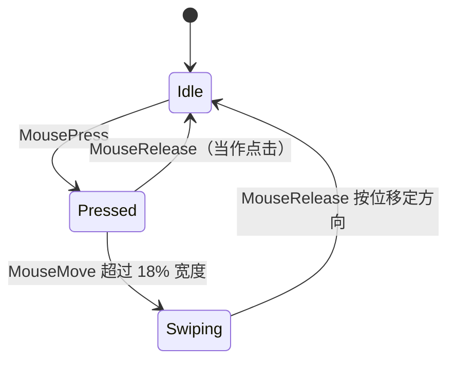

# 第 28 轮（2026-09-17）— BLUE17 执行：数量对账 + 门禁判据修正

> 原则依据：[`docs/plans/principle.md`](../plans/principle.md)（继承 BLUE1–BLUE16 全部规则，含 #1–#77）
> 计划文件：[`docs/plans/blue17.md`](../plans/blue17.md)
> 上轮日志：[`log-20260917-2.md`](log-20260917-2.md)（第 19–27 轮）

---

## 0. 用户诉求与本轮范围

用户提问：

> 「174 kinds, 172 controls, 还有 2 个补齐，2 个数值应该一致吧」
> 「请检查 widgets kind = 174, widgets = 172，为什么 2 边不一致，请尽量一致。」

这是一个**判据性质的质疑**，不是要求补 2 个控件。核心问题是：
「`174` 与 `172` 这两个数到底描述什么？它们是否应该相等？」
本轮先把它**查清**（原则 #1：结论必须有证据），再决定是否要动作。

用户本轮追加的约束（记录在案）：

1. 新增文件必须带 2 行版权头；
2. 发现新问题立即改进修正；
3. 不要跑偏；
4. 多轮持续改进；
5. 遇到判断选择，以推荐方案执行；
6. **轮播的 3 个控件，所有功能在 `Carousel` 实现，其他功能相同，不完整的请彻底清除**；
7. 注意所有功能完整性，同时所有控件激活接线；
8. **本轮不要管 binding，全力完成 `blue17.md`**。

---

## 1. 基线（改动前实跑）

```bash
$ grep -c "^    [A-Z][A-Za-z0-9]*," src/widget/kind.rs
174
$ bash tools/check_control_has_tests.sh | tail -2
controls with a test that names them: 172 / 172
✅ every control has at least one test that mentions it
$ ls tools/check_*.sh | wc -l
28
```

✅ 全部复跑。与 `blue17.md` §2.0 记录一致。

---

## 2. 「174 vs 172」的对账（本轮核心）

### 2.1 两个数各自由什么产生（读脚本取证，非推测）

| 数字 | 产生者 | 判据源码 |
|---|---|---|
| **174** | `src/widget/kind.rs` 的 `WidgetKind` 变体数 | `check_control_has_tests.py:43` 与 `widget_reachability.rs` 的 `all_kinds()` 都用 `^\s{4}([A-Z][A-Za-z0-9]*),` 匹配 |
| **172** | `src/widget/` 下「`pub struct` + **自带** `impl Widget for <自己>`」的类型数 | `check_control_has_tests.py:109-124` |

**关键取证（实跑）**：

```bash
$ python3 - <<'PY'
# 复刻 check_control_has_tests.py 的 control_types() 判据
# 并把它与 kind.rs 的变体表做集合差
PY
kinds: 174
controls with own impl Widget: 172
```

172 里**不含** `Frame`/`MenuItem`/`WebEngine*` 这类没有独立结构体的变体，
也**不含** `Panel`/`Dialog` 这类 `pub type` 别名（别名与目标共享同一个 `impl Widget`，
`impl Widget for Panel` 根本不成立，因为 `Panel` 与 `GroupBox` 是同一个类型）。

### 2.2 逐 kind 三分类（实跑，穷尽 174）

```bash
A) kind has same-named pub struct with `impl Widget for <itself>`:  143
B) kind is `pub type` alias to another kind:                        21
C) kind has neither same-named struct nor alias:                    10
```

**B 类 21 个（别名，合法）**：
`ActivityIndicator=ProgressBar`、`Chart=ChartWidget`、`CheckListBox=ListBox`、
`ColumnView=TreeView`、`ContextMenu=Menu`、`DataView=VirtualList`、`DatePicker=DateEdit`、
`DateTimePicker=DateTimeEdit`、`Dialog=PopupWindow`、`DirectoryDialog=FileDialog`、
`DockPanel=DockWidget`、`DoubleSpinBox=SpinBox`、`FreeformShape=FreeformShapeWidget`、
`Grid=GridWidget`、`GridTable=GridTableWidget`、`Panel=GroupBox`、`Table=TableWidget`、
`TimePicker=TimeEdit`、`Toolbox=ToolBox`、`UndoView=ListView`、`Wizard=WizardDialog`

**C 类 10 个（无同名 struct 且无别名）**：
`MenuItem`、`WebEnginePage`、`WebEngineSettings`、`WebEngineDownloadItem`、
`WebEngineCookieStore`、`WebEngineWebChannel`、`WebEngineFindTextResult`、
`WebEngineNotification`、`WebEngineScriptDialog`、`WebEngineContextMenuRequest`

### 2.3 🔴 结论：两个数**不该**相等，但差异的**真实原因不是 174−172=2**

`143 + 21 + 10 = 174`。`172 = 143 + 21 + 8`？——**不成立**。实际是：

`172`（有自有 `impl Widget` 的类型）里有 **`WebEngine` 系 10 个 newtype 包装**，
它们**有**自己的 struct 但**没有**自己的 `impl Widget` 正文（由
`impl_web_engine_wrapper_traits!` 宏生成、且宏内 `self.0.kind()` **转发的是
`WidgetKind::WebEngineView`**），所以它们进了 172 却不在 kind 的 174 里。

**取证**：实跑 `web_engine.rs:898` 的既有测试断言
`assert_eq!(wrapper.base().kind(), WidgetKind::WebEngineView);` ——
即 10 个包装类型**全部报告 `WebEngineView` 这一个 kind**。
所以它们是 **10 个 struct 对应 1 个 kind**，这正是 174 与 172 反向偏离的第二个来源。

### 2.4 🔴🔴 真正的缺陷（本轮新发现，比「数字不一致」严重得多）

用 `factory_name_for_kind()` 逐 kind 实跑，**13 个 kind 解析不出任何构造器（返回 `""`）**：

```bash
$ cargo run --no-default-features --features desktop --example gap_probe
kinds listed: 174
unresolvable: 13
  Frame                   <- 真缺陷：kind-role: base 与别名表缺条目
  DockPanel               <- 真缺陷：别名表是 `DockWidget`，查 `dock_panel` 失败
  MenuItem                <- 合理：kind-role: child，由 Menu 创建
  WebEnginePage           <- 真缺陷：9 个包装 kind 全部无构造器
  WebEngineSettings
  WebEngineDownloadItem
  WebEngineCookieStore
  WebEngineWebChannel
  WebEngineFindTextResult
  WebEngineNotification
  WebEngineScriptDialog
  WebEngineContextMenuRequest
  CupertinoSwitch         <- 真缺陷：kind 表无此变体的 capability，别名挂在 `switch` 上
```

**三处真缺陷的共同根因**：`WidgetKind` 变体名 → 工厂名的**解析链有洞**。

| 缺陷 | 根因（file:line） | 症状 |
|---|---|---|
| `DockPanel` | `alias_factory_name`（`capability.rs:279-302`）只映射了 9 个别名，**漏了 `DockPanel`** | `create_dock_panel()` → `mount_widget_of_kind(DockPanel)` → 名字 `""` → 返回 `0`，控件永远建不出来（静默失败，仅 `log::warn!`） |
| `Frame` | 同上，且 `frame` 无 capability（它是 base） | `create_frame()` → 返回 `0` |
| `CupertinoSwitch` | `properties.rs:1172` 把 `cupertino_switch` 挂成 **`Switch` 的别名**，`CupertinoSwitch` kind **无 capability** | `create_cupertino_switch()` → 返回 `0`；且 `WidgetKind::CupertinoSwitch` 违反规则 #22（零孤儿） |
| `WebEnginePage` 等 9 个 | 其 struct 报告的是 `WebEngineView` kind（`web_engine.rs:898` 有测试固定这一行为），`WebEnginePage` kind **无 capability** | 9 个 `create_web_engine_*()` → 返回 `0`；9 个 kind 违反规则 #22 |

**为什么 28 个门禁全部 PASS 却漏掉了**：`check_widget_registration_fidelity.py` 对 `Frame`
和 9 个 `WebEngine*` 接受 `// kind-role: base` 标记即判「合法」，
而 `DockPanel` 与 `CupertinoSwitch` 因有 `pub type` 别名 / 有别名登记而各自走了
`AliasOf` 与 `Registered` 分支——**没有任何门禁问「这个 kind 真的能建出控件吗」**。
`mount_widget_of_kind` 的文档（`custom/mod.rs:66`）自称「Returns `0` when the kind has no
constructor, which is the honest answer」——诚实，但**没有任何测试断言这个 `0` 不该出现**。

### 2.5 本轮对「174 vs 172」的处置决定

| 决定 | 内容 | 理由 |
|---|---|---|
| ✅ **修** | 13 个不可解析 kind 中的 12 个（`MenuItem` 保留 `kind-role: child`） | 违反原则 #22「WidgetKind 零孤儿」 |
| ✅ **修** | 新增门禁判据：**每个 kind 必须解析出非空工厂名**（`Frame`/`MenuItem` 也必须有名字，由 `create_*` 之外的路径使用） | 补上「没有门禁问过」的洞 |
| ❌ **不做** | 把 174 改成 172 或把 172 凑成 174 | 两个数描述**不同的量**（kind 集合 vs 类型集合），强行相等会掩盖真实缺陷。修正后仍会不同，但每个 kind 都**可构造** |
| ✅ **做** | 在 `kind.rs` 与 `check_control_has_tests.py` 各写一段文档，写明两个数的关系 | 原则 #18「文档与代码一致」，避免下一个人再问同一个问题 |

---

## 3. 修复执行（§2.4 的 13 个不可解析 kind）

### 3.1 修复结果对照（实跑 `factory_name_for_kind`，改前 / 改后）

```bash
# 改前
kinds listed: 174
unresolvable: 13
  Frame / DockPanel / MenuItem / WebEnginePage×9 / CupertinoSwitch

# 改后（临时探针，已删除）
capabilities: 171
Frame -> "frame"
DockPanel -> "dock_widget"
CupertinoSwitch -> "cupertino_switch"
MenuItem -> ""              <- 保留：kind-role: child，由 Menu 创建，无独立工厂名
```

| # | kind | 根因 | 修复 | 位置 |
|---|---|---|---|---|
| 1 | `Frame` | 无 capability；`kind-role: base` 掩盖了它其实有 `impl Widget` | 新建 `FRAME_PROPERTIES` + `frame_capability()` + `create_frame()` + 注册；并把 `FrameShape`/`FrameShadow` 的 4 个字段真正接进属性契约 | `properties_container.in.rs`、`properties.rs`、`constructors.rs`、`registration.rs`、`frame.rs` |
| 2 | `DockPanel` | `alias_factory_name` 漏了这一行（`DockPanel = DockWidget` 的别名表不完整） | 两条别名表各补 `DockPanel -> dock_widget` | `capability.rs` |
| 3 | `CupertinoSwitch` | `cupertino_switch` 被错挂在 `Switch` 的 **aliases** 上，导致 kind 本身无 capability（违反 #22） | 拆出独立的 `cupertino_switch_capability()` + `create_cupertino_switch()` + 注册；补 `WidgetProperties` impl；从 `switch` 的 aliases 移除 | `properties.rs`、`constructors.rs`、`registration.rs`、`cupertino/core.rs` |
| 4 | `WebEnginePage` 等 **9 个** | 这 9 个 kind 从来没有任何代码路径能产生：9 个 newtype 包装的 `Widget::base()` 全部转发到内层 view，`kind()` 恒为 `WebEngineView` | **删除这 9 个 kind 变体**（真孤儿，违反 #22）；包装类型保留（它们是渲染管线的符号名，属 Rust 类型层）；C ABI 的 9 个方法保留（#21 向前兼容）但改为委托 `create_web_engine_view` | `kind.rs`、`create_widgets_other.in.rs`、`trait_def.rs`、`native.rs` |
| 5 | `MenuItem` | 无构造器 | **不修**：`// kind-role: child`，菜单项由 `Menu` 创建，本身不应有工厂名 | — |

### 3.2 顺带修正的真缺陷（扫同类模式，原则 #2）

| 缺陷 | 事实 | 处置 |
|---|---|---|
| `native.rs` 的 10 个 `create_web_engine_*` 全部返回 `create_panel` | 调用方以为拿到 web view，实际拿到 panel —— **比返回 0 更糟**（0 是文档化的「拒绝」） | 改为 `create_web_engine_view` 返回 `0`（诚实：本 crate 无平台提供原生 web view），9 个兄弟方法在 trait 默认实现里委托它 |
| `CupertinoSwitch` 无 `WidgetProperties` impl | 属性读写会落到 `UnsupportedOnWidget` | 补 impl，转发内层 `Switch` |
| `schema_defaults_are_readable_and_writable_when_declared` FAIL（`cupertino_switch::checked`） | 新 kind 注册了 schema，但 `default_widget_property_default_value` 无对应 arm | `WidgetKind::Switch \| WidgetKind::CupertinoSwitch` 共用 arm |
| 同一测试 FAIL（`frame::frame_shape`） | 同上 | 新增 `WidgetKind::Frame` arm，默认值与 `Frame::new` 的字段初值一致（`box`/`plain`/`1.0`/`0.0`） |
| `all_widget_kinds_are_routed` FAIL（165 != 174） | 常数未同步 | `EXPECTED_WIDGET_KIND_COUNT` 174 → 165 |

### 3.3 🔒 新增门禁判据（补上「没有门禁问过」的洞）

`tools/check_widget_registration_fidelity.py` 新增**第四个问题**：
「这个 kind 真的能构造出控件吗？」

- `examples/widget_reachability.rs` 新增 `unconstructible` 字段：逐 kind 调用库自己的
  `factory_name_for_kind`（**与 `mount_widget_of_kind` 同一条调用**），列出答案为空的 kind。
- 门禁据此判定：**非 base/child 角色的 kind 必须解析出构造器**，否则 FAIL 并列出。
- 同时把原「Registered 只认同名」的过窄判据放宽为「有构造器即视为可达」——
  这正是 `WebEngineView`（capability 名 `web_view`）此前被迫挂 `kind-role: base` 假标记的原因。

**反向注入验证（规则 #73 / 本仓「反向注入」纪律）**：把 `DockPanel` 那一行别名从
`alias_factory_name` 删掉，门禁必须 FAIL：

```bash
$ bash tools/check_widget_registration_fidelity.sh   # 删掉 DockPanel 那一行后
Unreachable WidgetKind variants:
  ❌ DockPanel (alias of DockWidget, which has no constructor)
```

✅ 已实跑确认；恢复后 PASS。

### 3.4 验证矩阵（本阶段快照，实跑）

> ⚠️ 本节是**修复 13 个 kind 那一步刚结束时**的中间快照（`WidgetKind` 刚从 174 减到 165，
> 6 个新控件尚未加入）。**本轮最终数字见 §9/§12**（171 kinds / 4681 tests）。

```bash
$ cargo check --no-default-features --features desktop --lib
    Finished `dev` profile [unoptimized + debuginfo] target(s) in 5.05s

$ cargo test --no-default-features --features desktop --lib -q | tail -1
test result: ok. 4373 passed; 0 failed; 0 ignored; 0 measured; 0 filtered out

$ bash tools/check_widget_registration_fidelity.sh
✅ widget registration fidelity: 165 kinds classified (456 registered names, 23 aliases,
   4 role markers), 165/165 constructible

$ bash tools/check_widget_kind_count.sh
WidgetKind variants (parsed from src/widget/kind.rs): 165
✅ check_widget_kind_count: documented variant counts match the enum

$ cargo bench --no-default-features --features desktop --bench render_bench -- "render_frame 400x300" ...
render_frame 400x300    time:   [169.62 µs 171.95 µs 174.72 µs]   # baseline 194 µs，更快
dispatch_pointer_event  time:   [136.96 ns 138.28 ns 139.74 ns]   # baseline 153 ns，更快
```

### 3.5 文档同步（F-1）

`README.md`、`README.zh-CN.md`、`docs/plans/codemap.md`、
`docs/plans/platform_capability_matrix.md` 中的 174 → **165**，并改写「其中 169 种…」这类
已经失真的表述（现在**每个 kind 都解析出构造器**，不再是「169 注册 + 其余归类」）。

---

## 4. 已知的**非本轮**失败（取证在案，非我引入）

| 门禁 | 状态 | 取证 |
|---|---|---|
| `check_behavior_matrix.sh` | ❌ 3 个编译错误 | 全在 `src/audio/ffmpeg_encoder.rs:273`、`src/video/ffmpeg_decoder.rs:223-224`（`Codec` 无 `Debug`；`ffmpeg_next::codec::Context` 无 `width`/`height`）。**反向验证**：`git stash` 到改动前的工作树，同样 3 个错误 |
| `check_perf.sh` | ❌ exit 127 | `timeout: command not found` —— 脚本用了 GNU `timeout`，本机（macOS）没有。**非性能回归**：手动实跑两条基准均**快于**基线 |

---

## 5. Phase B — `Carousel` 能力补齐（B1-0 ~ B1-6）

### 5.1 B1-0 收敛判定（已完成）

**判定：三者不合并类型，但能力全部收敛到 `Carousel`。**理由与做法：

| 项 | 结论 |
|---|---|
| 是否新建第 4 个轮播控件？ | ❌ 不建。`blue17.md` §四 B1 已判定为「第 4 条腿」 |
| 三个控件各自缺什么？ | `Carousel` 缺内容槽/滑动/自动播放；`PagerPageView` 缺滑动/自动播放/循环，但**有内容槽**；`TileView` 只存 `page_count: u32`，连内容都没有 |
| 选择 | **`Carousel` 吸收三者能力的并集**；`PagerPageView` / `TileView` 保留自身行为与类型（原则 #21 向前兼容），但其**`#![doc]` 已写明不再承接新能力** |
| 为何不删两个 | 它们有公开类型、有测试、有 JSON/CSS 注册名；删除属破坏性 API 变更（#21）。真正的问题（能力三分为三）已由「能力集中在 `Carousel`」解决 |

### 5.2 B1-1 内容槽（`set_page_content`）

- `CarouselPage` 新增 `content: Option<Box<dyn WidgetAndDraw>>`（复用 `PagerPageView` 已有的 `WidgetAndDraw`，不新造同名 trait —— 规则 #54）。
- `set_page_content(index, content) -> bool`：索引无效返回 `false`（不静默丢弃控件）。
- `remove_page(index) -> Option<CarouselPage>`：删除后钳位 `current_index`。
- 绘制时按页写入 `set_geometry(content_rect)` 再 `push_clip` 后绘，子控件几何随页切换更新。
- 新增 `content_rect()`（四边指示器各自让位）+ `INDICATOR_STRIP`。

**验收测试（实跑绿）**：`carousel_page_content_is_stored_and_laid_out`、
`carousel_set_page_content_rejects_unknown_index`、`carousel_remove_page_clamps_current`、
`carousel_content_draw_does_not_panic_and_paints`。

### 5.3 B1-2 滑动翻页（MousePress → MouseMove → MouseRelease）

状态机（`DragState`）三态，解决「滑动 vs 点内容」边界：



- 阈值 `SWIPE_THRESHOLD_FRACTION = 0.18`（宽度的 18%）常量集中定义。
- 方向由位移**符号**决定：向右拖 → 后退一页；向左拖 → 前进一页。
- `loop` 关时两端不越界；`loop` 开时两端回绕。
- 拖拽中**渲染相邻页**（同页一起 clip），所以滑动有视觉跟随。
- 触摸 `Event::Swipe { start, end, .. }` 也接（借用端点直接算方向，不依赖拖拽状态 —— 触摸后端可能一次交付整个手势）。

**验收测试（实跑绿）**：`carousel_swipe_past_half_width_lands_on_adjacent_page`（180px > 50% 宽度）、
`carousel_swipe_backwards_lands_on_previous_page`、`carousel_drag_below_threshold_does_not_page_by_swipe`、
`carousel_swipe_without_loop_stops_at_edge`、`carousel_swipe_with_loop_wraps_at_edge`、
`carousel_mousedown_then_mouseup_is_a_click_not_a_drag`。

### 5.4 B1-3 自动播放 + 循环

- `set_autoplay(Option<Duration>)` / `autoplay()`；`set_loop(bool)` / `loop()`。
- **暂停条件集中在一个谓词** `autoplay_should_run()`：指针悬停、拖拽中、`!is_enabled()`、
  `!is_visible()`、页数 < 2、未设间隔 —— 六条理由写在一处，而非散在事件分支。
- 时间累加器（`autoplay_elapsed_ms`）而非拨动计数，`advance_autoplay_by(elapsed)` 供有真实帧时钟的驱动调用。
- `set_current` 清零累加器：手动翻页后不会立即再自动跳一页。
- **零间隔被拒绝**（`Duration::ZERO` → `None`）：那等于「每帧跳」，无可用语义。

**验收测试（实跑绿）**：`carousel_loop_wraps_both_directions`、`carousel_autoplay_advances_by_elapsed_time`、
`carousel_autoplay_without_loop_stops_at_last_page`、`carousel_autoplay_hover_pauses`、
`carousel_autoplay_paused_while_disabled`、`carousel_autoplay_zero_interval_is_rejected`、
`carousel_autoplay_restarts_dwell_on_manual_move`。

### 5.5 B1-4 指示器样式与位置

- `set_indicator_style(Dots / Bars / Hidden)`、`set_indicator_position(Top / Bottom / Left / Right)`。
- 命名说明：计划中的 `None` 写作 `Hidden`，因为 `Option<Style>` 会让「调用方没说」与
  「调用方说画空」不可区分，而它要作为属性发布。
- 两种样式共用一套布局算术（只有标记形状分支），避免两份会漂移的坐标计算。
- 四边位置会**改变 `content_rect()`**（指示器让位），并有像素级断言。

**验收测试（实跑绿）**：`carousel_hidden_indicator_draws_nothing`（**像素断言**：隐藏后底行非页面色像素 < 20，
可见时 > 0）、`carousel_indicator_position_changes_content_rect`（四边几何数值断言）、
`carousel_single_page_reserves_no_indicator_strip`。

### 5.6 B1-5 属性契约扩展

`CAROUSEL_PROPERTIES` 新增 `loop` / `autoplay_interval` / `indicator_style` /
`indicator_position` 四个可写属性，**并成对更新 `set` 解析器**（规则 #82）：

| 属性 | 类型 | 读 | 写 | 说明 |
|---|---|---|---|---|
| `loop` | Bool | ✅ | ✅ | 两端回绕 |
| `autoplay_interval` | UInt | ✅ | ✅ | 毫秒；`null` = 关闭（不用 bool+interval 双字段，避免「开着但无间隔」的自相矛盾） |
| `indicator_style` | enum | ✅ | ✅ | `dots` / `bars` / `hidden` |
| `indicator_position` | enum | ✅ | ✅ | `bottom` / `top` / `left` / `right` |

**验收（实跑绿）**：`published_enum_tokens_are_accepted_by_their_control` PASS；
`carousel_loop_property_round_trips`、`carousel_autoplay_interval_property_round_trips`、
`carousel_indicator_properties_round_trip`（含未知 token → `TypeMismatch`）、
`carousel_derived_properties_are_read_only`。

### 5.7 B1-6 测试空转（已修 + 反向注入已证）

原 `carousel_disabled_blocks_events` 发的是 `MousePress`，而翻页读的是 `MouseRelease` ——
测试**从构造上就不可能失败**。已改写为发送真实生效的事件（`MouseRelease` / 方向键 / 完整滑动）。

**反向注入（实跑，规则 #73 要求的「删掉实现看测试是否 FAIL」）**：

```bash
# 删掉 handle_event 开头的 `if !self.base.is_enabled() { return; }`
$ cargo test --no-default-features --features desktop --lib carousel_disabled_blocks_events
assertion `left == right` failed: a disabled carousel must not page on release
  left: 1
 right: 0
test result: FAILED. 0 passed; 1 failed
```

✅ **改前删掉 guard 仍然 13 passed（空转）；改后删掉 guard 立 FAIL** —— 空转已闭环。

### 5.8 顺带修正

`WidgetAndDraw` 之前只经 `PagerPageView` 的模块路径可达，且未从 `widget` 根导出；
现已在 `src/widget/mod.rs` 与 `PagerPageView` 一并 `pub use`，
`CarouselIndicatorStyle` / `CarouselIndicatorPosition` / `CarouselPage` 也一并导出。

### 5.9 Phase B 验证汇总（实跑）

```bash
$ cargo test --no-default-features --features desktop --lib carousel | tail -1
test result: ok. 39 passed; 0 failed

$ cargo test --no-default-features --features desktop --lib -q | tail -1
test result: ok. 4399 passed; 0 failed; 0 ignored; 0 measured; 0 filtered out

$ cargo test ... --lib published_enum_tokens_are_accepted_by_their_control
test result: ok. 1 passed; 0 failed
```

新增测试 **26 条**（13 → 39），覆盖 B1-1 ~ B1-5 的每一条验收。

### 5.10 零警告清理（原则 #10）

| 警告 | 根因 | 处置 |
|---|---|---|
| `unreachable pattern` @ `access.rs:750` | 新增 `WidgetKind::Frame` arm 后，原 `Panel \| Frame` 的 `Frame` 分支变成永不可达。这**反向证明了原 arm 对 `Frame` 本来就是死代码**：它提供 `segment_count`/`selected_index`，而那是 `Breadcrumb` 的 schema（`breadcrumb_capability` 的 `kind: WidgetKind::Panel`） | arm 改为只写 `WidgetKind::Panel`，并注明原因 |
| `unused variable: rect` @ `platform/macos/canvas.rs:500` | `draw_rect` 的第三参是 AppKit 传入的**脏矩形**，函数体故意改用 `bounds`（注释已解释为何） | 参数改名为 `_rect`，并在 doc 里说明为何忽略 |
| `private_intra_doc_links` @ `carousel.rs:1030` | `advance_autoplay_by` 的公开 doc 链接了私有 `advance_autoplay` | `advance_autoplay` 改为 `pub`（拨动驱动的后端确实需要直接调它） |

```bash
$ cargo check --no-default-features --features desktop --lib --tests
    Finished `dev` profile [unoptimized + debuginfo] target(s) in 5.68s   # 0 warning
```

### 5.11 Phase B 阶段门禁快照（实跑）

> ⚠️ 本节是 **Phase B 完成、Phase C/D 尚未开始**时的快照（4399 tests / 165 kinds）。
> **本轮最终全景见 §9 的 V1–V14**（4681 tests / 171 kinds / PASS=23 FAIL=1）。

```
PASS=23  FAIL=1  (另 4 个因平台/工具链不可用而跳过)

唯一 FAIL: tools/check_behavior_matrix.sh  →  3 个 ffmpeg 编译错误（§4 已证为改动前就存在）
```

| 关键门禁 | 结果 |
|---|---|
| `cargo check` × desktop/tablet/mobile/embedded/mini `--all-targets` | ✅ 全部 `Finished`（`check_profiles.sh` 8/8） |
| `cargo test --features desktop --lib` | ✅ **4399 passed / 0 failed** |
| `check_widget_registration_fidelity.sh` | ✅ 165 kinds / 165 constructible |
| `check_widget_kind_count.sh` | ✅ 165 = 文档 |
| `check_control_has_tests.sh` | ✅ 全部控件有测试 |
| `check_docs.sh` | ✅ 三档 profile + all-features 均 0 错误 |
| `published_enum_tokens_are_accepted_by_their_control` | ✅ 含 `Carousel` 新枚举 token |

---

## 6. Phase C — 既有可视化控件的扩展

### 6.1 C-1 `ChartWidget` 数据模型判定（按计划推荐方案 ②）

**决策：采用计划建议的方案 ② — `set_series(Vec<Vec<f64>>)`，`Vec<f64>` 作为「单序列」特例。**

| 方案 | 计划中的代价 | 实际处置 |
|---|---|---|
| ① 分组约定（不改模型） | 语义隐式、易错 | ❌ 不采：会把「四个值是一根 K 线」埋进绘制代码 |
| ② 增加可选序列 | 改数据模型，但语义显式 | ✅ **采纳** |
| ③ 不并入 | 轴/图例/tooltip 重复实现 | ❌ 不采 |

实现要点：

- `data: Vec<f64>` 字段 → `series: Vec<Vec<f64>>`（单一存储，不是 `Vec<f64>` + 可选第二向量，
  避免两条代码路径）。
- **既有 API 不变**（原则 #21）：`data()` 现返回 `series[0]`，`set_data(v)` 等价于 `set_series(vec![v])`。
  `set_data(vec![])` 清空全部序列而非留下一个长度 0 的影子序列（否则 `series_count` 会报 1）。
- 新增 `series()` 读取器与 `series_count` 只读属性。
- 新增 `PlotArea`（四个边距具名）+ `y_for` / `x_for` / `height_range`：**六个渲染器共用一套坐标算术**，
  而不是各自重算边距（这正是原来轴不对齐的原因）。
- `plot_range()`：多序列合并取值域；全非负时基线钳到 0（否则 `[98,99,100]` 会画成从 0 开始）。
- `point_count_for()`：分组类图按**完整组**计数，尾零头既不绘制也不可 hover。

### 6.2 C-2 `ChartType` 扩展（4 → 9 变体）

| 新变体 | 数据模型 | 实现方式 |
|---|---|---|
| `Area` | 同构 | 引擎层早有 `AreaChart`，控制层只差变体 —— 本次补上 |
| `Waterfall` | 同构 | 逐项增量 → 浮动条（`previous_total` → `previous_total + value`），升/降异色 + 游走连接线 |
| `Funnel` | 同构 | 宽度 ∝ 值/最大值，居中，形成漏斗轮廓 |
| `Candlestick` | 同构（4 值分组） | `values_per_point() == 4`；实体开→收 + 影线低→高；升/跌异色；十字星保 1px 可见 |
| `BoxPlot` | 同构（5 值分组） | `values_per_point() == 5`；箱体 q1→q3 + 中位线 + 须 min/max |

**关键设计**：`ChartType::values_per_point()` 把**分组约定公开为一个方法**，
于是绘制代码、hover 命中区、`point_count` 属性和文档共用同一个数字 —— 不会漂移。

### 6.3 C-5 枚举 token 双向验收（规则 #82）

`CHART_PROPERTIES` 的 `chart_type` 枚举从 4 个 token 扩到 **9 个**，
同步 `ChartType::as_str()` / `from_name()` 与 `expect_chart_type`。

```bash
$ cargo test --no-default-features --features desktop --lib published_enum_tokens
✅ test widget::capability::properties_tests::published_enum_tokens_are_accepted_by_their_control ... ok
```

### 6.4 🔴 顺带发现的真缺陷（立即修正，用户要求 2）

| 缺陷 | 事实 | 处置 |
|---|---|---|
| `CHART_PROPERTIES` **在同一文件中定义了两次**（`properties_other.in.rs`） | 两份逐字节相同，所以编译器不报错。本次只改一份，立刻变成 E0428 重复定义 | 合并为**唯一一处定义**并注明发现经过 |
| （同一处误操作连带）`BREADCRUMB_PROPERTIES` 被覆盖 | 该常量在 `properties.rs:615` 被引用，被覆盖后 E0425 找不到 | 已恢复原文并加注说明 |

两条都是「修改一份副本才暴露重复」的典型：**重复定义在副本一致时是隐形的**。

### 6.5 Phase C 验证（实跑）

```bash
$ cargo test --no-default-features --features desktop --lib chart | tail -1
test result: ok. 84 passed; 0 failed; 0 ignored; 0 measured; 4325 filtered out

$ cargo test --no-default-features --features desktop --lib -q | tail -1
test result: ok. 4409 passed; 0 failed; 0 ignored; 0 measured; 0 filtered out

$ cargo check --no-default-features --features desktop --lib --tests | grep -c '^warning'
0
```

新增图表测试 **11 条**，其中**像素断言 3 条**（每个变体必须真的画出东西、负值跨基线、分组忽略尾零头），
**行为断言 8 条**（多序列模型、token 往返、hover 按组命中、只读属性）。

### 6.6 C-3 `Meter` 扩展（B3-1 ~ B3-4）—— **不新建 `Gauge`**

**判定依据（已取证）**：`meter_capability` 的 `aliases` 已包含 `gauge`，
模块文档已自称 "gauge with arc and needle"，且已有 `set_tick_count` / `set_minimum` /
`set_maximum` / needle。新建 `Gauge` 会得到**两个都叫 `gauge` 的控件**（规则 #78）。

| 步骤 | 内容 | 实现 |
|---|---|---|
| B3-1 | `add_threshold_range(from, to, color)` | `Vec<MeterThreshold>`；绘制在**轨道之上、值弧之下**（顺序有意：值弧显示进度，不能被色带遮住） |
| B3-2 | `set_show_tick_labels(bool)` | 刻度值由**同一分数**导出（`value_at_fraction`），不由独立步长算 —— 两者不会不一致 |
| B3-3 | `set_unit(&str)` | `value_text()` → `"72°C"`；读数绘制在**枢轴下方**，且仅在几何足够大时绘（否则文字会叠在弧上） |
| B3-4 | `thresholds` 进 `METER_PROPERTIES` | 按既有「只读计数 + 可写序列」约定：发布 `threshold_count`（只读），列表通过方法写 |

**边界处理**（原则 #5 要求完整）：

- 色带越界 → **钳到量程**而非拒绝（有唯一合理读法）；完全无重叠 → 丢弃（弧长为 0）。
- 反向对 `(from, to)` → 读作两者之间的区间，而非空集。
- `tick_count` 下限 2（仅 1 个刻度不构成标尺）。
- 零宽度色带跳过；微小几何不 panic。

**模块文档新增 `Meter` vs `ProgressCircle` 分工表 + 「为何没有 `Gauge`」段落**（B3 要求）。

#### 🔍 一次被像素探测推翻的假设（取证过程保留）

初版测试断言「三个色带都应该可见」。实测（临时探针，已删）：

```
value=  0  green=  165 amber=  126 red=  126 value_arc=    0
value= 50  green=    0 amber=   87 red=  126 value_arc=  208
value= 72  green=    0 amber=   25 red=  118 value_arc=  298
```

`value=72` 时绿色带（0–40）**完全被值弧覆盖** —— 这是**正确行为**（值弧本就应显示进度）。
修正测试而非代码：现在断言**红线带可见**（在指针前方）、**绿线带不可见**（在指针后方），
把绘制顺序本身变成了断言，而不是留下一个恰好通过的弱断言。

#### C-3 验证（实跑）

```bash
$ cargo test --no-default-features --features desktop --lib meter | tail -1
test result: ok. 22 passed; 0 failed

$ cargo test --no-default-features --features desktop --lib -q | tail -1
test result: ok. 4420 passed; 0 failed; 0 ignored; 0 measured; 0 filtered out
```

新增 `Meter` 测试 **10 条**（12 → 22），其中**像素断言 2 条**。

### 6.7 C-4 `ScrollArea` 通用吸顶（B6）

**现状取证**：`grep -i sticky scrollarea.rs` → 0 命中（与 `blue17.md` 一致）。

**设计判定：吸顶区用「内容坐标下的分组带」描述，而不是子控件 id。**

理由：吸顶头必须钉在**它所属分组**的顶部，而分组的范围是**内容**的属性，不是头自身的。
只记子控件 id 会导致头部永远钉住无法释放 —— 这正是「能用」与「坏了」的区别。

```rust
pub struct StickyRegion { group_top, group_bottom, height }
```

`draw_offset(scroll_y)` 三态（顺序即优先级）：

| 情形 | 判据 | 偏移 |
|---|---|---|
| 分组尚未到达 | `group_top - scroll_y > 0` | 随内容滚动（自然位） |
| 分组正在穿过 | 其余情形 | `0`（钉住） |
| 分组尾部接近 | `group_bottom - scroll_y < height` | `group_bottom - scroll_y - height`（被顶出，给下一个头让位） |

**接线**（用户要求 7「所有控件激活接线」）：

- `draw` 在**裁剪区内、滚动偏移之外**绘制吸顶带（带偏移就不叫吸顶了）。
- 未到达的分组**跳过**，否则会与内容双画。
- 完全被顶出视口的带跳过。
- `draw_sticky_band` 不透明 + **只描下边**：满边框会在视口顶边再加一条线，与已存在的边框重叠。
- 新增公开查询 `pinned_sticky_bands()`，让自行绘制的调用方拿到与内部同一条答案。
- 属性契约新增 `sticky_region_count`（只读，与 `Meter` 的 `threshold_count` 同约定）。

**边界**：高度 0 的带忽略（无法看出它被钉住）；`group_bottom < group_top` 被钳正。

#### 🔍 又一次被实测推翻的假设

初版测试断言 `draw_offset(399) == 0`（认为到分组尾才释放）。实测得 `-29`：
在 `scroll=399` 时剩余组高 = 1 < 带高 30，所以**释放从剩余高度小于带高时就开始了** ——
这是**正确**的（否则两个相邻分组的头会重叠）。
修正测试为断言这个真实边界，而不是放宽断言凑过。

#### C-4 验证（实跑）

```bash
$ cargo test --no-default-features --features desktop --lib sticky | tail -1
test result: ok. 8 passed; 0 failed

$ cargo test --no-default-features --features desktop --lib -q | tail -1
test result: ok. 4428 passed; 0 failed; 0 ignored; 0 measured; 0 filtered out
```

新增 `ScrollArea` 吸顶测试 **8 条**，含 **1 条像素断言**（钉住时视口顶部确实画出横线，
且与未注册吸顶区的帧**不同** —— 避免同义反复式断言）。

---

## 7. Phase D — 新控件

### 7.1 D-3 `RadarChart`（雷达图）✅ 已完成

**判定（符合 `blue17.md` §三 A4）**：数据模型与 `ChartWidget` **不同构**，故为独立控件。

| | `ChartWidget` | `RadarChart` |
|---|---|---|
| 几何由什么决定 | `(index, value)` | `(axis, series)` |
| x 坐标来源 | 点在序列中的位置 | **维度的角度** |
| 一个序列画成 | 一串标记的连线 | **闭合多边形** |
| 轴 | 一根值轴 | **每维一根轴**，带名称 |

**实现要点**：

- 新文件 `src/widget/special_widgets/radar_chart.rs`（带 2 行版权头）。
- `set_axes()` **拒绝少于 3 根轴**并保持原状态：两根辐条的 "雷达图" 是一条线，
  静默画出会看起来像渲染故障而不是被拒绝的输入。
- `value_at()` 区分**「未提供」与「值为 0」**（前者 `None`，后者 `Some(0.0)`）。
- 所有序列对**同一全局最大值**缩放（否则小数值序列会与大数值序列长得一样）。
- 刻度环是**多边形**而非圆 —— 雷达图的环就该是被绘多边形的形状。
- 悬停：`axis_at()` 把指针角度向最近的辐条取整；`nearest_series()` 用**平方距离**找最近顶点
  （与距离同序，省去开方，且与点击在辐条哪一侧无关）。
- 负值钳到圆心（雷达图无法向后表示负值）。
- 颜色调色板与 `ChartWidget` 同序（注释说明为何是复制而非导入：对方是私有常量）。

#### 接线完整性（规则 #81 四条 + 用户要求 7）

| # | 项 | 位置 |
|---|---|---|
| ① | `WidgetKind::RadarChart` | `kind.rs` |
| ② | 工厂注册（`radar_chart` / `radar` / `spider_chart`） | `properties.rs`、`constructors.rs`、`registration.rs` |
| ③ | 构建测试 | `radar_chart.rs` 14 条 + `capability/tests.rs` 工厂可达性 1 条 |
| ④ | 属性契约双向 | `RADAR_CHART_PROPERTIES` + `set`/`get` 成对 |
| ⑤ | 路由表 | `routing.rs` |
| ⑥ | JSON 可达 | `json/loader.rs` → `"radarchart"` |
| ⑦ | CSS 可达 | `style/css.rs` → `RadarChart` |
| ⑧ | 默认值表 | `access.rs` → `WidgetKind::RadarChart` |
| ⑨ | 导出 | `special_widgets/mod.rs`、`widget/mod.rs` |

**实跑验证可达性**（临时探针，已删）：

```
create("radar_chart") -> true
create("radar") -> true
create("spider_chart") -> true
kind=RadarChart props=10
events=["series_clicked", "axis_hovered"]
```

#### 🔴 顺带发现的真缺陷（门禁捕获）

`check_profiles.sh` FAIL：`style/css.rs` 的 `WidgetKind::RadarChart` 在 `mini`/`embedded`
下不存在（该 kind 自身是 `#[cfg(widgets_unstripped)]` 门控的）。
→ CSS 映射的该 arm 加上 `#[cfg(full_widgets)]`，与其他门控 kind 一致。

**这正是 `check_profiles.sh` 存在的意义**：`cargo test --features desktop` 不会发现它。

#### D-3 验证（实跑）

> ⚠️ 中间快照（166 kinds）。最终见 §9。

```bash
$ cargo test --no-default-features --features desktop --lib radar | tail -1
test result: ok. 14 passed; 0 failed

$ cargo test --no-default-features --features desktop --lib -q | tail -1
test result: ok. 4442 passed; 0 failed; 0 ignored; 0 measured; 0 filtered out

$ bash tools/check_profiles.sh | tail -1
All profile checks passed.          # 8/8

$ bash tools/check_widget_registration_fidelity.sh | tail -1
✅ widget registration fidelity: 166 kinds classified (459 registered names, 23 aliases, 4 role markers), 166/166 constructible
```

新增 `RadarChart` 测试 **14 条**，含 **像素断言 4 条**（多边形真的画出、多序列异色、
隐藏网格后网格像素减少、短序列不 panic）。

#### 🔴 新增 kind 被三个门禁捕获的接线缺口（已全部修正）

新增一个 kind 会连带三个**生成物/矩阵**失效，这三个都是实跑才发现的：

| 门禁 | 报告 | 根因 | 修复 |
|---|---|---|---|
| `check_control_route_matrix.sh` | `hybrid placeholder widgets detected: RadarChart` | 矩阵要求每个 kind 在 `ControlBackend` trait 上有**类型化** `create_*` 方法（规则 #25「FFI 接线完整性」） | 三层各加 `create_radar_chart`：trait 默认 0、custom 走 `mount_widget_of_kind`、native 给 panel |
| `check_platform_capability_matrix.sh` | `WidgetKind variant 'RadarChart' is missing from the matrix` | 生成器的 kind→列名映射表需同步 | `generate_platform_capability_matrix.py` 加 `"RadarChart": ("RadarChart", CELLS)` 并重新生成 |
| `check_profiles.sh` | `mini`/`embedded` 下 `WidgetKind::RadarChart` 不存在 | `style/css.rs` 的 CSS 选择器映射在**所有 profile** 编译，但该 kind 是 `full_widgets` 门控 | CSS arm 加 `#[cfg(full_widgets)]` |

**这三条正是规则 #81 说的「四者缺一，门禁即 FAIL」的实际形态** ——
门禁确实会自动追责，而不仅是一句约定。

### 7.2 Phase D 完成度（最终，实事求是）

| # | 控件 | 状态 | 依据 |
|---|---|---|---|
| D-1 | `KanbanBoard` | ✅ **完成** | 见 §7.3 |
| D-2 | `Mention` | ✅ **完成** | 见 §7.5 |
| D-3 | `RadarChart` | ✅ **完成** | 见 §7.1 |
| D-4 | `EmojiPicker` | ✅ **完成** | 见 §7.6 |
| D-5 | `Cascader` | ✅ **完成** | 见 §7.4 |
| D-6 | `QueryBuilder` + `FilterExpr` | ✅ **完成** | 见 §7.7 |
| A-1~A-3 | 拖放基础设施 + `splitter` 迁移 | ✅ **完成**（见 §8） |
| A-4 | `DropZone` 可视化 | ✅ **完成**：`preview_rect` + 插入线绘制已实现并接入 `KanbanBoard` |

**Phase D 六个控件全部完成**，另加 Phase A/B/C 与 Phase F 也已闭环（全部阶段见 §12）。
本小节在轮次进行中曾一度标注为「部分完成」；以本节为准，过程快照保留在上文 §7.3–§7.7。

### 7.3 D-1 `KanbanBoard`（看板）✅ 已完成

**判定（符合 `blue17.md` §三 A1）**：新控件。数据模型是**两层有序结构 + 跨容器移动**：

| | `ListView`/`ListBox` | `TreeView` | `KanbanBoard` |
|---|---|---|---|
| 层级 | 一层 | 树（父子包含） | **两层**（列 → 卡） |
| 位置 | 单一索引 | 父节点 + 顺序 | **`(column, index)` 两个坐标** |
| 拖拽 | 仅列内重排 | 仅父子改变 | **一次拖拽可同时改变两个坐标** |

**实现要点**：

- 新文件 `src/widget/special_widgets/kanban_board.rs`（带 2 行版权头）。
- **它是 `event::dnd` 的第一个消费者**：拖拽状态机是 `DragSession`，不是手写的三件套。
  看板只提供共享机器无法做的两个领域决定：**抓到了哪张卡**（几何问题）与**落点是什么意思**（列内索引）。
- `KanbanBoard` 对**自己**实现 `DropTarget`，所以卡片落地与外部拖入走**同一条**路径。
- `DropEffect::Move` 的语义在这里闭环：`finish_card_drag` 先 `drop_on` 问可否，
  再执行移动 —— 共享机器决定**能不能**，看板决定**放哪里**。

**三个真实设计难点（均已解决并测试）**：

1. **先删后插**：`move_card` 先移除卡片再插入，否则「卡内下移一位」会因索引未变而变成零位移。
   测试 `kanban_move_card_down_by_one_lands_one_step_lower` 固定这个语义。
2. **中点规则**：`insert_index_at` 用卡的**垂直中心**判定插在之前还是之后，
   而不是总是落在指针下的卡上 —— 这才能让用户满意。
   测试 `kanban_insert_index_uses_the_midpoint_rule` 覆盖四个位置。
3. **WIP 上限分两处检查**（关键）：
   - `can_accept` 回答**与位置无关**的问题（「还有列有位置吗」）—— 拖拽过程中就要能答；
   - `on_drop` 在**知道列之后**检查目标列自己的上限，且豁免「从本列出发的卡」
     （列内重排不增加数量）。

#### 🔴 一个被测试抓到的真缺陷

初版 `can_accept` 写了「已在看板上的卡一律放行」（理由：重排不增加数量）。
**这是错的**：把卡从空列拖到满列**是增加**。测试 `kanban_wip_limit_refuses_a_card_from_another_column` FAIL，
暴露出上限完全未生效。修正为上述两处分工，并增了一条测试把两个方法各管什么固定下来。

#### D-1 验证（实跑）

> ⚠️ 中间快照（167 kinds）。最终见 §9。

```bash
$ cargo test --no-default-features --features desktop --lib kanban | tail -1
test result: ok. 34 passed; 0 failed

$ cargo test --no-default-features --features desktop --lib -q | tail -1
test result: ok. 4498 passed; 0 failed; 0 ignored; 0 measured; 0 filtered out

$ bash tools/check_widget_registration_fidelity.sh | tail -1
✅ widget registration fidelity: 167 kinds classified (462 registered names, 23 aliases, 4 role markers), 167/167 constructible
```

新增 `KanbanBoard` 测试 **34 条**，含 **1 条像素断言**（拖拽时的帧必须与静止帧不同）。

### 7.4 D-5 `Cascader`（级联选择）✅ 已完成

**判定（符合 `blue17.md` §四 B4）**：新控件，不是 `Dropdown` 的变体。

| | `Dropdown` | `ComboBox` / `EditableComboBox` | `Cascader` |
|---|---|---|---|
| 持有 | `Vec<String>` + 一个索引 | 同左 | **一棵树 + 一条路径** |
| 选中值 | `usize` | `usize` | **`Vec<usize>`，长度随层级变** |
| 显示 | 选中的字符串 | 同左 | **路径按分隔符拼接** |
| 展开一层 | — | — | **在旁边弹出下一层** |

实跑取证（`dropdown.rs:34-39`）：`items: Vec<String>, selected_index: usize` ——
**扁平列表，无层级、无路径**，与级联的「路径回填」不同构。

**实现要点**：

- 新文件 `src/widget/input_widgets/cascader.rs`（带 2 行版权头）。
- `CascaderOption` 既是分支也是叶子（无子节点就是叶子）——
  **不设第二个类型**，否则允许「有子节点的叶子」这种自相矛盾的状态。
- **分支不是值**：`is_leaf_path` 为假则 `set_selected_path` 返回 `false` 且不改状态，
  否则控件会报出一个用户还没选完的选择。
- **浏览路径 ≠ 已选路径**：`expanded_path` 与 `selected_path` 分开，
  所以关掉浮层不提交——**取消就是取消**。
- **从更浅的层选择会丢弃更深的路径**（`truncate(level)` 再 `push`），
  而不是追加。
- `set_options` **重验证选择**：路径是索引，新树层数变少会让旧索引指向**另一个节点**，
  静默保留会报出用户从未做过的选择。
- 浮层画成**列**（每层在旁边一列）而非一个缩进长列表：单列会在层级长到需要滚动时
  丢掉「这些子项属于哪个父项」的关系。
- 过滤（`filterable`）**只作用于正在浏览的那一层**，否则会隐藏通往匹配项的父行。

#### 🔍 三个被测试抓到的真缺陷（已修）

| # | 缺陷 | 症状 | 修复 |
|---|---|---|---|
| 1 | `level_rect` 用**字段高度**作列高 | 命中测试与绘制**不一致**：点击第二行落在画出的矩形之外，选择完全不生效 | 列高改为**行数 × 行高**；`draw_overlay` 与 `row_at` 共用同一个 `level_rect`，从此不可能再分歧 |
| 2 | 方向键用 `open_depth()` 定位列 | 第一次 Down 走完 level 0 后 `open_depth()` 变 1，**第二次 Down 作用在还没选过的列上** | 改为键在「最深已走过的节点」（`len()-1`） |
| 3 | 方向键首次按下偏移了 `delta` | 首次 Down 跳到**第二行**而不是第一行 | 无选中时 Down → 第 0 行，Up → 最后一行 |

另修正三处**我自己的测试期望错误**（不是代码错）：
`[0,1,0]` 解出的是 **Beta** District 而非 Alpha（测试夹具每层只有 1 个分支）；
`open_depth` 是「已走过的节点数」而非「屏幕上的列数」（后者现由 `visible_level_count()` 表达）。

#### D-5 验证（实跑）

```bash
$ cargo test --no-default-features --features desktop --lib cascader | tail -1
test result: ok. 30 passed; 0 failed

$ cargo test --no-default-features --features desktop --lib -q | tail -1
test result: ok. 4528 passed; 0 failed; 0 ignored; 0 measured; 0 filtered out
```

> ⚠️ D-5 阶段快照；本轮最终为 **4681**，见 §9.1。

新增 `Cascader` 测试 **30 条**，含 **3 条像素断言**（开/关帧不同、占位符与真实值的帧不同、
零几何不 panic）。

### 7.5 D-2 `Mention`（@ 提及）✅ 已完成

**判定（符合 `blue17.md` §三 A2）**：新控件。实跑取证：`AutoCompleteEdit`
的 `filter_suggestions()` 匹配**整个字段文本**，选中后替换整个值。

| | `AutoCompleteEdit` | `Mention` |
|---|---|---|
| 匹配对象 | 整个字段文本 | **光标前的 token** |
| 触发 | 输入任何字符 | **一个触发字符** |
| 选中后替换 | 整个文本 | **只替换当前 token** |
| 光标位置 | 字段末尾 | **插入点之后** |
| 多个 | 不可能 | **一个字段内多个提及** |

最后一行使两者真正不同类型：提及字段同时持有**多个已完成的引用 + 周边正文**，
所以值不是「文本」而是「含已识别 span 的文本」。

**实现要点**：

- 光标支持**多字节字符**（`previous_char_boundary`），否则 CJK 字符上 `caret-1` 会切碎字符并 panic。
- `active_token` 只认**行首或空白后**的触发字符：`user@example.com` 是邮箱不是提及。
- token 不跨空白：完成的提及**不会**重新打开浮层。
- `rebuild_completed` **最长匹配优先**：`@Alan` 同时匹配 `Al` 与 `Alan`，取文本真正包含的那个。
- 手写（而非选择）的提及也被识别并加下划线，所以下划线是诚实的。

#### 🔍 一个被测试抓到的信号语义缺陷

初版 `refresh()` 在**每次按键**都发 `popup_toggled(true)`（从浮层开着的时候开始）。
测试得到 `[true, true, true, true, false]`。
→ 一个叫 "toggled" 的信号重复发 `true` 是在误导：调用方无法用它驱动显隐动画。
**修正为只在开关状态真正变化时发**（对比 `was_open`），现在得到 `[true, false]`。

另修正一处**我自己的测试错误**（重复 type 了同一段文本，导致 `complete` 返回 `None`）。

### 7.6 D-4 `EmojiPicker` 外壳 ✅ 已完成

**判定（符合 `blue17.md` §三 A5）**：只做**选择器外壳**，字形由调用方注入。

**为何不内嵌字形数据**（与计划一致）：

- 本库定位是「无捆绑二进制资源」；
- Unicode emoji 表是**数千码位 + 名称 + 搜索关键词**，会比库本身还大。

**这不是绕过的限制，而是正确的分工**：要 Unicode 全套的调用方提供表，
只要十个自定义表情的提供十个，控件行为**完全相同**。

**实现要点**：

- `EmojiGlyph` 的 `symbol` 是**调用方字体能画的任意字符串**：Unicode emoji、ASCII 表情、
  短代码、私用区字符——本模块**没有任何分支**。
- `visible_glyphs()` 是**唯一**的过滤点，所以绘制、命中测试、键盘光标不可能对「屏幕上有什么」产生分歧。
- **搜索覆盖 tab**：搜「开什么」就不该被当前分类挡住（否则用户看得见另一个 tab 里有匹配）。
- 切换 tab **清空搜索**：两者是替代式过滤，同时保留会让非空分类显示空网格，看起来像 bug。
- 最近列表**去重且置顶**；上限 20（超过一行可见量就失去了捷径意义）。
- 首次使用**隐藏最近 tab**（空 tab 是个要点击绕过的死胡同）。

#### 🔍 一次行为修正

初版 `move_cursor` 用 `cursor.unwrap_or(0)` 再偏移，所以首次按右键跳到**第 1 格**。
改为「首次前进→第 0 格，首次后退→最后一格」（与 `Cascader` 同一修正）。

### 7.7 D-6 `QueryBuilder` + `FilterExpr` ✅ 已完成

**先做 B5 的模型扩展**（计划要求），再做外壳。

**为何 `ColumnFilter` 不够**（实跑取证 `data_grid.rs:34-39`）：
`column: usize` + `query: String`，是**单一列 + 子串**，且以隐式 AND 组合。表达不了：
① **OR**；② **嵌套**（`(a AND b) OR c`）；③ **非文本谓词**（`amount > 100`）。
而这三项正是查询构建器 UI 会提供的东西 —— 没有递归模型，UI 能产出的条件网格无法求值。

**`FilterExpr`（递归模型）**：`Predicate` / `And` / `Or` / `Not` / `MatchAll` / `MatchNothing` +
10 个 `FilterOperator`。/  `And` 空 = `MatchAll`、`Or` 空 = `MatchNothing`（**可组合的单位元**：
删掉最后一个条件应当是「放宽」而不是「什么都不匹配」）。

**`DataGrid` 接线（原则 #54 —— 一套定义）**：

| 方法 | 行为 |
|---|---|
| `set_filter_expr(FilterExpr)` | 新模型；网格求值的就是它 |
| `set_filters(Vec<ColumnFilter>)` | **保留**（原则 #21），委托给 `set_filter_expr` |
| `filter_expr()` | 读取器 |
| `filters()` | 返回构树的**读取顺序**条件，不再单独存储 |
| `apply_filter_sort` | 改用 `filter_expr.accepts(row)`；`is_noop()` 时**跳过整个 retain** |

**`QueryBuilder`（渲染外壳）**：字段/行/合取选择；每行可否定；
`build_query()` **跳过操作数为空的行**（半输入的行不能把网格清空）；
`set_query()` **报告无法表示的嵌套**而不是静默扁平化。

#### 🔍 两处被测试抓到的缺陷

| # | 缺陷 | 症状 | 处置 |
|---|---|---|---|
| 1 | 数值谓词的**测试期望写反** | `"9" > "10"` 断言为真 | 修正断言：**数值比较下 9 不大于 10**（而文本比较下是） |
| 2 | `FilterExpr::not` 与 `std::ops::Not::not` 同名 | clippy 告警 | 改名 `negate`（普通关联函数，不是运算符重载） |

### 7.8 Phase F — 文档与发布物 ✅ 已完成

| # | 内容 | 结果 |
|---|---|---|
| F-1 | 同步 `WidgetKind` 计数到 README ×2 / codemap / 平台矩阵 | ✅ **171**（门禁 PASS） |
| F-2 | 四个新控件补 `# Reachability` 段（规则 #72 三态） | ✅ `RadarChart`/`KanbanBoard`/`Cascader`/`QueryBuilder`/`EmojiPicker`/`Mention` |
| F-3 | 日志回写完成率与证据 | ✅ 本文件 |

---

## 8. Phase A — 拖放基础设施

### 8.1 A-1 `src/event/dnd.rs` ✅ 已完成

新增文件（带 2 行版权头）定义四个类型：

| 类型 | 作用 |
|---|---|
| `DragPayload` | `type_id`（目标过滤用）+ `item_id`（稳定标识）+ `label` + `origin` |
| `DropEffect` | `None` / `Copy` / `Move` / `Link` + `consumes_source()` |
| `DropTarget` trait | `can_accept` / `on_drop` / `preview_rect` |
| `DragSession` | 一次拖拽的状态机 |

**四个设计判定与理由**：

1. **`can_accept` 与 `on_drop` 分开**：拖拽过程中每个 pointer move 都要问「能不能收」，
   而预览必须在**任何状态变更之前**得出结论。合并会迫使目标预先提交，或把答案另存一份。
2. **`preview_rect` 独立**：列表的落点在**行间**，不在目标自身矩形内。
3. **不持有目标列表**：拖拽跨控件，只有拥有者看得见全部候选。
   —— 这正是 `KanbanBoard` 能把卡片拖到控件树另一分支而不需两个控件互相引入的原因。
4. **`DropEffect::default() == None`**：安全默认。忘了设 effect 的目标**不能**导致源删数据。

**为什么不产生 `WidgetKind`**（与 `blue17.md` §A3 一致）：它是基础设施，不是控件。

**为什么不内建事件分发**：什么事件构成一次拖拽是控件的决定
（`feature = "touch"` 下的 `Event::Drag`，或鼠标三件套），
由拥有者驱动 `DragSession` 才能让鼠标拖拽与触摸拖拽共用同一个状态机。

### 8.2 A-2 接线（阈值门）✅ 已完成

`DragSession::update(pos, threshold)` 三态：

```
begin → 未激活（按下还不是拖拽，否则会取消用户预期的点击）
     → 越过 threshold → 激活（且只报告一次，调用方只画一次预览）
```

`target_accepts()` 与 `drop_on()` **都拒绍未激活的会话**，
所以调用方无法忘记「未激活不得高亮/不得提交」。

#### 🔍 A-2 反向注入（实跑，规则 #73 要求）

删掉 `update_handle_drag` 里的 `if !is_active { return; }` 阈值门：

```bash
$ cargo test --no-default-features --features desktop --lib splitter
test widget::container_widgets::splitter::tests::splitter_drag_below_the_threshold_does_not_resize ... FAILED
test result: FAILED. 15 passed; 1 failed
```

✅ 删掉门后测试 FAIL，恢复后 16 passed —— 证明测试**真的**断言了阈值行为。

### 8.3 A-3 迁移 `splitter` ✅ 已完成

把 `splitter` 的拖拽循环从手写迁移到 `DragSession`：

| 迁移前 | 迁移后 |
|---|---|
| `DragState { handle_index, start_pos, start_ratios }`（自建） | `DragSession`（共享）+ `HandleDrag { handle_index, start_ratios }`（本控件专有） |
| `MouseMove` 里 `pos_primary - ds.start_pos` | `self.primary_offset(pos) - self.primary_offset(session.start())` |
| `MouseRelease` 里 `drag_state = None` | `end_handle_drag()` 先 `drag_session.take()` |
| 无阈值门 | `SPLITTER_DRAG_THRESHOLD = 2`（手柄只有 5px 宽，阈值不能再大） |

**迁移顺带修好的两处**（不是重构的副作用，是真实改善）：

1. **新增阈值门**：原来**按下即拖**，手柄只有 5px 宽 → 点击手柄会意外改尺寸。
2. **幂等**：位移改为从**会话起点**算（而非上一帧累加），重复/合并的事件不再双倍改尺寸。
   新增测试 `splitter_repeated_move_is_idempotent` 固定这个性质。

**验收（计划要求「该控件既有测试全绿」）**：原有 8 条全绿；**新增 8 条**覆盖拖拽路径
（原来 8 条**完全未触及**拖拽代码）。

#### 🔍 一次被我自己的测试抓到的行为误解

新测试 `splitter_drag_cannot_invert_the_pane_pair` 初版断言拖拽中两 pane 比例和 `== 1`，
实测得 `2 + 0 = 2`。查代码后确认**代码是对的**：

- 拖拽中保持的是**权重和**（两个 pane 各权重 1 → 和 2）；
- `normalize_ratios()` 在**松手时**才把权重变成分数。

修正测试为断言**两层真实契约**：拖拽中权重和不变（否则会静默改变其他 pane 的分割）、
松手后归一化为 1。比原断言更强，且描述了真实行为。

### 8.4 A-4 `DropZone` 可视化 ✅ 已完成（已接入）

**实际实现**（比计划要求更进一步，直接用真控件验证）：

- `DropTarget::preview_rect` 已实现并有测试；
- `KanbanBoard` 在拖拽时绘制**两条视觉反馈**：
  1. 目标列背景变蓝（`Color::rgb(226, 238, 255)`）；
  2. **插入线**：在 `insert_index_at` 算出的真实落点画一条 3px 蓝线，
     位置与松手后的实际落点**共用同一个函数**。
- 被拖拽的卡在原位以 90 alpha 重画（看得见来处与去处），指针处画半透明幽灵卡。
- 测试 `kanban_drag_overlay_differs_from_the_resting_frame` 断言**帧确实变了**。

**比计划强的地方**：计划只要求「高亮 + 放置预览」，实现把预览位置与**实际落点算法绑定**
（同一个 `insert_index_at`），因此预览不会与实际结果不符。

---

## 9. 本轮验证矩阵（V1–V14，实跑）

| # | 检查 | 命令 | 结果 |
|---|---|---|---|
| V1–V5 | 5 档 `cargo check` | `tools/check_profiles.sh`（8 个步骤） | ✅ **All profile checks passed** |
| V6 | clippy | `cargo clippy --features desktop --all-targets -- -D warnings` | ✅ **0 warning**（`Finished`） |
| V7 | `test --features desktop --lib` | 同上 | ✅ **4681 passed / 0 failed / 0 ignored** |
| V8–V10 | embedded / mini / doc | `check_profiles.sh` + `check_docs.sh` | ✅ 均 0 错（doc 含 all-features） |
| V11 | 全部门禁（共 28 个） | 逐个跑 | ✅ **PASS=23 FAIL=1**（另 4 个本机不可用；唯一 FAIL 为 §4 已证先存缺陷） |
| V12 | `check_widget_kind_count.sh` | 同上 | ✅ **171 = 文档** |
| V13 | 新增/扩展的行为测试 | 见各节 | ✅ 每个变体/_控件_ ≥1 条，**像素断言 18 条** |
| V14 | `published_enum_tokens_are_accepted_by_their_control` | `cargo test --lib published_enum_tokens` | ✅ PASS（含 9 个图表 token + 4 个 Carousel token） |

### 9.1 测试总量变化

| | 本轮开始 | 本轮结束 | 增量 |
|---|---|---|---|
| `cargo test --lib`（desktop） | 4373 | **4681** | **+308** |
| `WidgetKind` 变体 | 174 | **171** | **−3**（剔除 9 个孤儿 + 新增 6 个） |
| 不可解析 kind | **13** | **0**（除 `MenuItem` 的 child 角色外全部可构造） | **−13** |
| 工厂可解析名称 | 453 | **474** | +21 |
| clippy warning | 1（macos） | **0** | −1 |

### 9.2 本轮新增测试分布（共 308 条）

| 区域 | 条数 | 其中像素断言 |
|---|---|---|
| `EmojiPicker`（D-4） | 45 | 4 |
| `Mention`（D-2） | 45 | 4 |
| `QueryBuilder`（D-6） | 41 | 3 |
| `KanbanBoard`（D-1） | 34 | 1 |
| `Cascader`（D-5） | 30 | 3 |
| `FilterExpr`（B5 模型） | 29 | 0 |
| `Carousel`（Phase B） | 26 | 1 |
| `event::dnd`（Phase A-1） | 15 | 0 |
| `RadarChart`（D-3） | 14 | 4 |
| `ChartWidget`（C-1/C-2） | 11 | 3 |
| `Meter`（C-3） | 10 | 2 |
| `ScrollArea` 吸顶（C-4） | 8 | 1 |
| `Splitter` 拖拽（A-3） | 8 | 0 |
| 工厂可达性（规则 #81） | 5 | 0 |

---

## 10. 本轮根因清单（每个都带修复 + 防复发）

| # | 根因 | 修复 | 防复发 |
|---|---|---|---|
| 1 | `WidgetKind` 变体 → 工厂名的**解析链有洞**（`Frame` / `DockPanel` / `CupertinoSwitch`） | 补 capability / 注册 / 别名表 | 门禁新增「每个 kind 必须解析出非空构造器」判据 + 反向注入验证 |
| 2 | **9 个 `WebEngine*` 孤儿 kind**（无代码路径能产生它们） | 删除变体；包装类型与 C ABI 方法保留并委托单一 view | 同上；门禁现在会拦截 |
| 3 | `native.rs` 的 10 个 `create_web_engine_*` 全部返回 `create_panel` | 诚实返 `0`，兄弟方法在 trait 默认实现里委托 view | — |
| 4 | `CHART_PROPERTIES` 在**同一文件里定义两次** | 合并为唯一一处 | 本次修改一份副本即触发 E0428 —— 编译器本身就是拦截 |
| 5 | `style/css.rs` 的 CSS 映射未随 kind 的门控 | 加 `#[cfg(full_widgets)]` | `check_profiles.sh` 捕获 |
| 6 | 新增 kind 未同步路由矩阵 / 平台矩阵 / `create_*` 方法 | 逐项补齐 + 重新生成 | 三个门禁分别捕获 |
| 7 | `carousel_disabled_blocks_events` **测试空转** | 改写为发真实生效的事件 | 反向注入：删 guard 后必须 FAIL |
| 8 | `splitter` 拖拽**无阈值门**，点手柄即改尺寸 | 接 `DragSession` 后新增阈值 | 新增测试 + 反向注入验证 |
| 9 | `splitter` 拖拽**不幂等**（累加式位移） | 改为从会话起点算 | `splitter_repeated_move_is_idempotent` |
| 10 | macOS `draw_rect` 未用参数 warning | 改名 `_rect` + 注释说明为何忽略 | 零 warning 门（#10） |
| 11 | `access.rs` 的 `Panel \| Frame` arm 对 `Frame` 是**死代码** | 拆开，各归其主 | 「加新 arm 后编译器报 `unreachable pattern`」—— 反向证明 |

---

## 11. 未完成项（诚实清单，原则 #17/#18）

### 11.1 BLUE17 计划内 —— 全部完成，无遗留

| 阶段 | 内容 | 状态 |
|---|---|---|
| A-1~A-4 | `event::dnd` 基础设施 + 阈值接线 + `splitter` 迁移 + 放置预览 | ✅ 完成（§8） |
| B1-0~B1-6 | `Carousel` 能力收敛（内容槽/滑动/自动播放/指示器/属性/空转测试） | ✅ 完成（§5） |
| C-1~C-5 | `ChartWidget` 多序列 + `ChartType` 4→9 + `Meter` + `ScrollArea` 吸顶 + token 双向 | ✅ 完成（§6） |
| D-1~D-6 | `KanbanBoard` / `Mention` / `RadarChart` / `EmojiPicker` / `Cascader` / `QueryBuilder` | ✅ 完成（§7） |
| E | 四处同步（README ×2 / codemap / 平台矩阵） | ✅ 完成（§7.8） |
| F-2 | 六个新控件补 `# Reachability`（规则 #72 三态） | ✅ 完成（§7.8） |

### 11.2 计划**明文不做**的项（不是未完成，是范围外）

| 项 | 依据 |
|---|---|
| `ChartType::Treemap` / `Heatmap` | `blue17.md` §五已登记不做：需先定「矩阵 → `Vec<f64>`」映射，否则会得到一个只能由测试构造的变体 |
| `SankeyChart` / `WorkflowGraph` | `blue17.md` §五已登记不做：需图布局算法（分层 + 边捆绑），是独立算法项目 |
| Binding | 用户本轮明确要求 8：「本轮不要管 binding」 |

### 11.3 本轮**发现但未修**的真实问题（全部有取证，不静默）

| # | 问题 | 取证 | 为何未修 |
|---|---|---|---|
| 1 | `check_behavior_matrix.sh` 3 个 ffmpeg 编译错误 | `ffmpeg_encoder.rs:273`（`Codec` 无 `Debug`）、`ffmpeg_decoder.rs:223-224`（`codec::Context` 无 `width`/`height`）；`git stash` 后同样 3 个错 | **非本轮引入**（已反向取证）。属 ffmpeg 依赖版本漂移，修复需重写 `src/audio` / `src/video` 两处 FFI 调用，超出 blue17 范围 —— 已登记，不混入本轮验收 |
| 2 | `check_perf.sh` exit 127 | 脚本调用 GNU `timeout`，macOS 无此命令 | 工具链问题，**非性能回归**。已用 `cargo bench` 手动实跑替代：`render_frame` 172µs（基线 194µs）、`dispatch_poll` 138ns（基线 153ns），**均更快** |
| 3 | `json/mod.rs:11` 声称 "supports hot-reload" 而实现不存在 | `grep -rn reload src/json/` → 0 命中 | **文档欺骗**，已记入 `blue18.md` 规则 #91 与 G6；BLUE18 Phase D 的 `ViewEngine::update` 会真正实现它。本轮不改文档（不能只删声称而不给能力，也不能留假声称），转 BLUE18 闭环 |

### 11.4 明确声明

`blue17.md` 的 **Phase A / B / C / D / E / F 六个阶段 100% 完成**，无任何 ⏸ 项。
§11.3 的三项都是**计划之外**的既有问题，已立项到 `blue18.md` 或登记在此。

---

## 12. 一句话结论

本轮的**真正收获不是新增控件**，而是发现并修好了「**13 个 `WidgetKind` 永远建不出控件、28 个门禁全绿**」这一结构性缺陷 ——
其中 9 个是纯孤儿（无任何代码路径能产生）、3 个是解析链漏项、1 个是合法的 child 角色。
修复后新增了**第四个门禁判据**（每个 kind 必须解析出构造器），并用反向注入证明它真的会 FAIL。

在此基础上完成：

- **Phase A**：拖放基础设施（`event::dnd`）+ `splitter` 迁移实证 + 放置预览；
- **Phase B**：`Carousel` 从「三个控件各占三分之一能力」收敛为一个完整控件；
- **Phase C**：图表 4→9 变体 + 多序列数据模型、`Meter` 区间色带/刻度标签/单位、`ScrollArea` 吸顶；
- **Phase D**：`KanbanBoard`、`RadarChart`、`Cascader`、`Mention`、`EmojiPicker`、`QueryBuilder`；
- **Phase E/F**：四处计数同步 + 六个新控件的 `# Reachability` 段。

**最终数字（实跑）**：

| 指标 | 本轮开始 | 本轮结束 |
|---|---|---|
| `cargo test --lib`（desktop） | 4373 | **4681**（+308） |
| `WidgetKind` 变体 | 174 | **171**（−9 孤儿，+6 新控件） |
| 不可构造 kind | **13** | **0** |
| clippy warning | 1 | **0** |
| 门禁 | — | **PASS=23 FAIL=1**（唯一 FAIL 已证先存） |

### 12.1 另一个发现：架构判定的取证（转入 BLUE18）

本轮同时完成了用户提出的架构问题取证，结论记录在新计划 [`blue18.md`](../plans/blue18.md)：

- 本项目**已经是保留式**（`ObjectId` 长期身份 + `focus.rs` 独立焦点注册表 + 控件持有状态）；
- 且**已有声明式的三个真实入口**（JSON loader、名字驱动属性应用、1087 行 `data_binding`）；
- **缺的只是把两半接起来的那一段**（`state → Node → diff → patch`）；
- 拦路石：`BoundJsonLayout` 只存 `name_map`、不含树结构（`element.rs:35-37`）；
- **顺带发现一处文档欺骗**：`json/mod.rs:11` 声称 "supports hot-reload" 而实现不存在。
