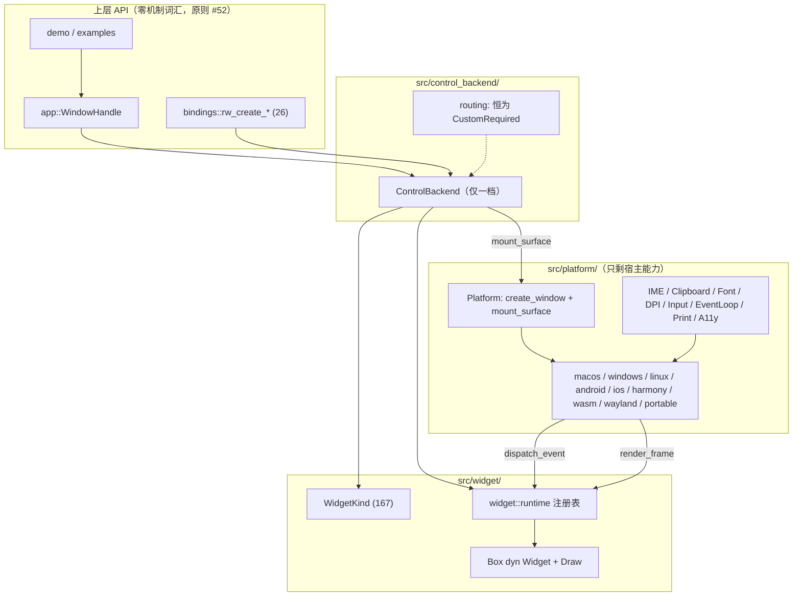
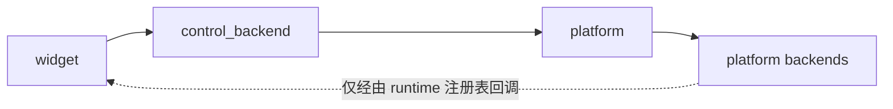

# BLUE15 — 全自绘重构 + 精简/嵌入虚拟模块整合

> 状态：**计划（未执行）**；现状取证（§二）已完成
> 目标基线：`rust_widgets v1.1.3`
> 原则依据：[`docs/plans/principle.md`](principle.md)（继承 BLUE1–BLUE14 全部规则，含 #1–#54）
> 本文件是执行计划，不是完成报告。执行过程中的每条结论都必须回填「构建/测试/代码」证据。
> **取证纪律**：本文件所有数字均在 `v1.1.3` 工作树上实跑取得（§2 每项可复现）。写作过程中曾产生一个错误结论（「23 个孤儿变体」），已在 §2.4 就地更正并保留记录——这是原则 #64 的正面用例。

---

## 核心规则（继承 BLUE14 全部）

1. 结论必须有构建/测试/代码证据，不允许「推测已修复」。
2. 修一个点必须扫同类模式，避免重复返工。
3. 优先修功能阻断项，再做体验增强。
4. 平台策略不变：**调用方只表达「我要一个这样的控件」，不表达「用原生还是自绘」**。
5. 不允许占位、空函数、逻辑错误、log/debug 占位 — 所有功能必须完整实现。
6. 注释英文 — 所有新增模块的代码注释必须使用英文。
7. 回写完成率 — 每轮完成后回写完成率。
8. `mod.rs` 文件只放接口导入等。
9. 单个代码文件少于 2000 行的无需拆分，除非有结构重组需要的。
10. 最后清理所有 warnings + errors。
11. 所有 test - fail, ignore 必须完整修复，不准跳过或删除，除非测试目标已删除。
12. 🚫 绝对禁止假修复。
13. 🚫 绝对禁止不完整修复。
14. 🚫 绝对禁止空修复。
15. 🚫 绝对禁止跳过测试。
16. 🔍 每条修复必须附带验证证据。
17. 🚫 绝对禁止「迁移幻觉」— 新代码被实际调用，旧代码被删除。
18. 🚫 绝对禁止「文档欺骗」— 文档与代码必须一致。
19. 🔬 每条声称的修复必须独立验证。
20. 🆕 移动端优先。
21. 🆕 向前兼容 — 不破坏现有 API 签名。
22. 🆕 WidgetKind 零孤儿原则。
23. 🆕 零重复变体原则。
24. 🆕 基础设施先于控件。
25. 🆕 FFI 接线完整性。
26. 🆕 IME 真实现原则。
27. 🆕 WidgetKind→Module 映射可审计。
28–34. 🦀 Rust 原生设计原则（零成本抽象、编译期安全、所有权内存、enum 多态、Builder、Trait）。
35–46. 🌍 平台隔离 / 🎯 降级阶梯 / 🧩 门控别名。
47. 🧩 profile 门控必须用 `build.rs` 别名。
48. 🧩 验证命令必须与 CI 对齐（`--no-default-features --features <profile>`）。
49. 🧩 同名不同层的类型必须写清分层注释。
50. 🧩 跨 trait 适配器必须显式处理单位与退化输入。
51. 🧩 共享抽象必须能带来真实消除才接入。
52. 🚫 公开 API 不得出现渲染机制词汇。
53. 🚫 能力缺失只能通过运行时 trait 方法表达。
54. 🚫 同语义枚举全仓只能有一份定义。

### BLUE15 新增规则

55. **🖌️ 控件落地机制全仓唯一，且必须可被运行时审计** — 控件创建只有一条路径（`ControlBackend` → 自绘内核）。`route_preference_for_widget_kind` 必须对**每一个** `WidgetKind` 返回 `CustomRequired`，并由测试断言；任何返回 `NativePreferred` 的分支即为回归。

56. **🖌️ 宿主接口必须只描述「面」，不描述「控件」** — `Platform` trait 不再暴露 `create_button` / `create_slider` 这类控件级构造。宿主只提供 `create_window`、`mount_surface`、`resize_surface`、`unmount_surface`、`invalidate_surface`、`set_window_state` 等**绘制面**能力。控件语义全部由 `src/widget/` 表达。

57. **🧩 profile 门控必须走语义名，禁止裸 `mini` / `embedded` 字面量** — `build.rs` 提供 `full_widgets`（已有）与 `stripped_widgets`（新增）两个 cfg 别名。`src/` 下的 `#[cfg(feature = "mini")]` / `#[cfg(feature = "embedded")]` 直接字面量**必须清零**，只允许 `platform::profile` 模块内部持有这两个 feature 名（唯一入口）。

58. **🧩 单一 profile 门控入口** — 「有 OS 运行时吗」「有完整控件集吗」「引擎属于哪一档」这类问题只能在 `src/platform/profile.rs` 里回答一次，全仓通过 `platform::profile::*` 读取。`lib.rs` 顶层的 6 个 `runtime_profile_name()`、2 个 `runtime_route_name()`、3 个 `init_runtime_backend()` / 3 个 `run_runtime_backend()` / 3 个 `quit_runtime_backend()`、4 个 `init_i18n_runtime()` 之类重复 `cfg` 分支必须收敛为 1 个。

59. **🗑️ 删除即删除** — 操作系统原生控件代码（创建、属性、item、dialog、canvas 里为原生控件服务的部分）一旦迁走，**代码必须物理删除**，不允许留下 `#[allow(dead_code)]`、`#[cfg(any())]`、注释掉的函数体或「保留备用」的模块。判定：`grep` 结果为空。

60. **🔬 每一步的重构必须「先加新路径 → 切换调用方 → 再删旧路径」** — 禁止先删后补（会造成中间态编译不过、进而掩盖真实错误）。每步结束必须 `cargo check --no-default-features --features desktop` 通过。

61. **🔬 删除面必须用「引用计数证据」驱动** — 每个待删函数（如 `Platform::create_button`）必须先 `grep -rn` 统计其调用点，迁完调用点后 grep 计数归零，才允许删除函数定义本身。

62. **📊 自绘覆盖率必须可度量并回写** — 每轮结束回填一张「路由表 167 变体 → `CustomRequired` 计数」表，目标 167/167。

63. **🧪 原生依赖清零必须用 Cargo 取证** — `gtk` / `webkit2gtk` / `cocoa` / `objc` / `objc-foundation` / `winapi` 等依赖的去留，必须用「`grep -rn` 全仓引用 + `cargo tree -i <crate>` 反查」双重取证；确认零引用后才能从 `Cargo.toml` 删除。禁止凭「感觉没用了」删依赖。

64. **🔍 计划里的每个数字都必须可复现** — 本文件中的所有计数均附带回执命令。任何引用（行数、命中数、变体数）在写进文档前必须实跑一次；发现自己写错时必须**就地更正并记录更正**（参见本文件 §2.4 与 §10.2 的更正记录）。

65. **🏗️ 控件对象只能有一个构造源** — 控件对象的构造只能来自 `widget/capability/constructors.rs`（经 `WidgetFactory` 访问）。任何其它模块不得直接 `Box::new(ConcreteWidget)` 后交给宿主。判定：`grep -n "Box::new" src/lib.rs` 应为空。

66. **🖌️ 能绘画的控件必须能经 `dyn Widget` 被绘画** — 任何实现 `Draw` 的类型，其 `Widget::as_draw_mut` 必须返回 `Some(self)`。桥接不得依靠「每个控件手写一行」这种会漂移的方式；优先用 blanket impl / 宏在编译期保证。判定：`实现 Draw 的类型数 == as_draw_mut 返回 Some 的类型数`，并由测试断言。

67. **🧾 属性契约必须在控件自身表达** — 控件属性不得集中在 `match kind()` 的集中式分支里；每个控件通过 trait 实现自己的 `get` / `set` / `property_names`，共性属性由默认实现提供。新增一个控件只能需要改**一处**（该控件文件）。判定：新增控件时 `properties.rs` / `access_*.in.rs` 无需修改。

68. **🌍 OS 编译门禁只能在 `src/platform/` 内** — `#[cfg(target_os = ...)]` / `#[cfg(target_family = ...)]` / `#[cfg(windows)]` / `#[cfg(unix)]` / 任何 `feature = "<os>"` 只能出现在 `src/platform/**` 内。例外：`cfg(target_arch = "wasm32")` 按原则 #42 豁免；`src/bindings/` 按原则 #40 豁免。中间层需要平台事实时，**必须**通过 `Platform` trait 的运行时方法询问。判定：
    ```
    grep -rn 'cfg(target_os\|cfg(target_family\|cfg(unix)\|cfg(windows)\|cfg!(target_os' src/ \
      --include=*.rs | grep -v '^src/platform/' | grep -v 'target_arch' \
      | grep -v '/// ' | grep -v '// '
    ```
    目标：**输出为空**（含测试）。

69. **🌍 平台事实的「编译期默认值」也只能在 platform 里算** — 中间层需要「按编译目标推出的默认值」（快捷键风格、换行符习惯、默认字体族…）时，正确做法是在 `src/platform/types.rs` 写一个 `pub const fn compile_target_*()`（已有先例：`compile_target_shortcut_style()`，`platform/types.rs:43`），由中间层调用；或直接做成 `Platform` trait 方法。禁止在中间层写 `cfg!(target_os = ...)`。

> **#68/#69 现状（已取证，见 §10.2b）**：OS 后端 feature 门禁在 `src/platform/` 之外已为 **0**；真正的 `cfg(target_os)` 残留仅 **2 个文件**（`shortcut/manager.rs` 2 处、`menu_config/tests.rs` 1 处），加上 `routing.rs` 5 处测试门控——均归入 **Phase A** 修完。

---

## 一、目标与边界

### 1.1 保留操作系统控制的能力（**明确不动**）

本次重构**只**替换控件（widget）落地机制。以下能力继续由 OS 提供，且必须继续真实调用 OS API（原则 #26）：

| 领域 | 保留内容 | 现有落点 |
|---|---|---|
| 窗口管理 | 创建/显示/隐藏/几何/标题/最大化/最小化/全屏/最小尺寸/图标/关闭 | `Platform::create_window`、`set_window_*` |
| 输入事件 | 鼠标 / 键盘 / 触摸 / 滚轮 / 拖放 的采集与坐标空间 | 各后端 `wnd_proc` / `NSResponder` / GTK signal |
| IME | 组合串、光标位置、提交与取消（IBus / NSTextInputContext / TSF） | `platform::ime*` |
| 剪贴板 | 纯文本 + 富内容 | `platform::clipboard*` |
| 系统字体加载 | 字体枚举、家族查询、字形度量 | `widget/font` + 后端度量 |
| DPI | 缩放因子、显示器切换 | `Platform::dpi_scale_factor` |
| 主事件循环 | `init` / `run` / `quit` | `platform::runtime` |
| 无障碍 | A11y 树与焦点（如需） | `platform::accessibility` |
| 打印 / 电源 / 内存事实 | `spawn_print_job` / `is_on_battery` / `total_memory_mb` | 各后端 |

### 1.2 需要彻底自绘的内容（**本次要改**）

所有 `WidgetKind` 的**控件语义**（渲染 + 交互 + 状态）从平台原生控件迁到库内自绘内核：

- `Button` / `Label` / `CheckBox` / `RadioButton` / `LineEdit` / `Slider` / `ProgressBar` / `ComboBox` / `ListBox` / `Panel` / `SpinBox` / `ListView` / `ScrollArea` / `GroupBox` / `Frame` / `TabWidget` / `Splitter` / `ToggleButton` / `Calendar` / `ScrollBar` / `DoubleSpinBox` / `FontComboBox` / `ContextMenu` / `PopupWindow` / `Dialog` / `InputDialog` / `ProgressDialog` / `DirectoryDialog` / `DatePicker` / `TimePicker` / `DateTimePicker` / `ActivityIndicator` / `MenuBar` / `ToolBar` / `StatusBar` / `MessageBox` / `FileDialog` / `ColorDialog` / `FontDialog` … 共 **167** 个 `WidgetKind`。

### 1.3 非目标（本次不做）

- 不改 `WidgetKind` 枚举的变体集合（原则 #22/#23 已稳定）。
- 不改 C ABI 函数名（`rw_create_*` 保持，属向前兼容，原则 #21）。
- 不改 `Platform::mount_custom_widget` 的公开**签名**（仅更名，见 §4 Phase B-3）。
- 不重写渲染引擎（`render` / `SoftwarePaintBackend` 保持）。
- 不引入新 UI 框架依赖。

---

## 二、现状取证（Step 0，已完成）

> 以下数据均由实跑/实查得到，作为后续删除的引用计数基线。每项都附带回执命令，可用原则 #64 复现。

### 2.1 基线构建与测试

```
$ cargo check --no-default-features --features desktop
    Finished `dev` profile [unoptimized + debuginfo] target(s) in 7.37s

$ cargo check --no-default-features --features embedded
    Finished `dev` profile [unoptimized + debuginfo] target(s) in 0.52s

$ cargo check --no-default-features --features mini
    Finished `dev` profile [unoptimized + debuginfo] target(s) in 0.49s

$ cargo test --no-default-features --features desktop --lib -q
test result: ok. 4006 passed; 0 failed; 0 ignored
```

三个 profile 当前**均干净**，这是重构前的可比基线。

### 2.2 待删除的原生控件构造点（引用计数基线）

| 后端 | `fn create_*` 数量 | 说明 |
|---|---:|---|
| `platform/macos`（cocoa/objc） | 42 | AppKit 控件 |
| `platform/macos_objc2` | 73 | AppKit 控件（objc2 版） |
| `platform/windows` | 42 | Win32 控件 |
| `platform/linux`（GTK） | 83 | GTK 控件 + `_impl` 分流 |
| `platform/android` | 44 | Android View/JNI |
| `platform/ios` | 56 | UIKit |
| `platform/harmony` | 41 | ArkUI |
| `platform/wasm` | 42 | DOM |
| `platform/wayland` | 42 | Wayland 控件面 |
| **合计** | **465** | 全部要删除 |

`src/platform` 总体量：

```
29550 total
 3432 src/platform/windows/platform_impl.rs
 3053 src/platform/macos/platform_impl.rs
 1709 src/platform/wayland/platform_impl.rs
 1440 src/platform/android/platform_impl.rs
 1272 src/platform/windows/helpers.rs
 1246 src/platform/linux/widget_creation.rs
 1227 src/platform/linux/widget_state.rs
 1224 src/platform/ios/platform_impl.rs
 1185 src/platform/macos_objc2/platform_impl.rs
 1120 src/platform/wasm/platform_impl.rs
  ...
```

### 2.3 `mini` / `embedded` 门控散落现状（引用计数基线）

`grep -rn 'feature = "mini"\|feature = "embedded"' src/ --include=*.rs` 按目录聚合：

| 目录 | 命中数 |
|---|---:|
| `src/widget/capability` | 328 |
| `src/control_backend/custom` | 195 |
| `src/widget/input_widgets` | 39 |
| `src/widget/container_widgets` | 24 |
| `src/widget/chart_widgets` | 17 |
| `src/widget/misc_widgets` | 14 |
| `src/widget/media_widgets` | 13 |
| `src/widget/display_widgets` | 13 |
| `src/widget/nav_widgets` | 12 |
| `src/widget/dialog` | 12 |
| `src/platform/macos` | 12 |
| `src/widget/view_widgets` | 9 |
| `src/platform/linux` | 9 |
| `src/widget/overlay_widgets` | 8 |
| `src/widget/cupertino` | 8 |
| `src/platform/windows` | 8 |
| `src/platform/wayland` | 6 |
| `src/widget/base_widgets` | 5 |
| `src/platform/ios` | 4 |
| `src/widget/menu_toolbar` | 4 |
| `src/platform/accessibility` | 4 |
| `src/platform/android` | 3 |
| `src/render/web` | 2 |
| `src/widget/mod.rs` | 17（逐行） |
| 其他 | 若干 |
| **合计** | **≈ 800+** |

`src/lib.rs` 顶层另有 **6** 个 `runtime_profile_name()` 重载、**2** 个 `runtime_route_name()`、**3** 个 `init_runtime_backend()`、**3** 个 `run_runtime_backend()`、**3** 个 `quit_runtime_backend()`、**4** 个 `init_i18n_runtime()`、**1** 个 `platform_facts()` 双写。

### 2.4 路由表现状（精确取证）

`src/control_backend/routing.rs` 的 `route_preference_for_widget_kind` 实跑解析结果（脚本按 `=> ControlRoutePreference::X` 分段归属变体，并处理 `|` 续行）：

| 分支 | 变体数 | 说明 |
|---|---:|---|
| 显式列表 1 → `CustomRequired` | 23 | 原生路径会「静默降级成另一个控件」的种类 |
| 显式列表 2 → `NativePreferred` | 20 | 仍走原生控件 |
| 显式列表 3 → `CustomRequired` | 34 | 自绘种类（容器 / 视图 / 媒体） |
| 显式列表 4 → `CustomRequired` | 90 | 自绘种类（现代 / 移动 / 图表 / 形状） |
| 兜底 `_ =>` | — | **无**兜底分支，依赖列表穷尽 |

```
WidgetKind 变体总数 ........... 167
路由表覆盖 .................... 167   ← 穷尽，无孤儿、无重复
（23 + 20 + 34 + 90 = 167）

有效返回 CustomRequired ....... 147   (= 23 + 34 + 90)
有效返回 NativePreferred ...... 20

NativePreferred 的 20 个 .......
  Button, CheckBox, RadioButton, Label, LineEdit, ComboBox, SpinBox,
  ListBox, ProgressBar, Slider, Panel, Window, MenuBar, Menu, ToolBar,
  StatusBar

额外事实：`MessageBox` / `FileDialog` / `ColorDialog` / `FontDialog` 由 match
**之前**的早退分支（`if matches!(...) { return CustomRequired; }`）处理，之后
在 match 里又出现一次（因而上面 20 个 NativePreferred 含 4 个对话框）——
即早退分支是**死代码**，实际生效的是 match 中的臂。此重复无害但不必要，
Phase B-4 托缩时一并清理。

另有 3 个由 Windows 后端 `native_widget_kinds()` 运行时提升：
  SpinBox, ListView, ScrollArea
```

> ✅ **更正记录（原则 #64）**：本节初稿曾声称「有 23 个变体不在路由表中，存在两条创建路径」。经重新取证，**该结论错误**，成因是首次解析脚本未处理 `|` 续行（如 `WidgetKind::Calendar` 位于 `| WidgetKind::Calendar` 行首管道之后），把这些续行误判为「不在表中」。实测：**路由表穷尽 167/167，无孤儿、无重复**。
>
> 另核实：`src/control_backend/routing.rs:512` 已存在测试 `all_widget_kinds_are_routed`，其数组含全部 **167** 个变体（已用脚本比对 `widget/kind.rs`，差异集为空）。
>
> **留存的价值**：本次误判反向证明了一件事——**路由表的穷尽性已被测试保护**，因此 Phase B-4 的任务只是「把值从双档改为单值」，不需要补全变体。但**仍需把路径 B（`crate::create_*` 直连平台、不查路由表）合并进路径 A**，因为那是真实存在的第二条路径（见 §2.5）。

### 2.5 两条创建路径（真实缺口，已验证）

| 路径 | 入口 | 是否查路由表 | 覆盖面 |
|---|---|---|---|
| A | `create_widget_of_kind` (`src/lib.rs:774`) | ✅ | 167 个变体（走 `route_preference_for_widget_kind`） |
| B | `crate::create_*(...)` / `WindowHandle::new_*()` | ❌ | 每个 `create_*` 直接调 `backend_for_kind(...)` 或控件方法 |

证据：`src/lib.rs:467` 的 `create_button` 直接调 `backend_for_kind(widget::WidgetKind::Button).create_button(...)`；`create_scroll_area`（L653）、`create_toggle_button`、`create_calendar` 同理——**每条 `create_*` 都是一次独立的路由决策，与路由表无关**。

这意味着：**把 `route_preference_for_widget_kind` 改为常量只影响路径 A**；只要路径 B 存在，「机制唯一」就不能成立。**Phase B/C 必须把路径 B 合并进路径 A**，验收为：

```
grep -rn "backend_for_kind" src/lib.rs | wc -l        # 目标：1（仅 create_widget_of_kind 内部）
```

### 2.6 `native` 路径的实际调用点

| 入口 | 文件 | 作用 |
|---|---|---|
| `backend_for_kind()` | `src/lib.rs:351` | 按 `WidgetKind` 选后端 |
| `create_widget_of_kind()` | `src/lib.rs:774` | 通用创建（路由分歧点） |
| `mount_widget_object()` | `src/lib.rs:724` | register → mount → 回滚 |
| `get_control_backend*()` | `src/bindings/binding_impl.rs`（**59** 处） | C ABI |
| `WindowHandle::new_*()` | `src/app/handle.rs:625-786` | `create_button` 等公开入口 |

`src/bindings/binding_impl.rs` 中 `rw_create_*` 共 **26** 个导出。

### 2.7 渲染面现状（要保留并强化）

`widget::runtime` 已经是完整的自绘宿主协议：

| API | 作用 |
|---|---|
| `register(Box<dyn Widget>) -> Option<ObjectId>` | 接管所有权 |
| `with_widget_mut` / `with_widget` | 作用域借用 |
| `geometry_of` / `set_geometry` | 几何 |
| `dispatch_event(id, &Event)` | 输入回灌 |
| `render_frame(id, size, clear) -> Option<Vec<u8>>` | 出一帧 RGBA（top-down，非预乘） |
| `request_repaint(id)` | 失效重绘 |
| `unregister(id)` | 释放 |

其模块文档已明确写出「The host keeps ownership of the widget here」、「thread-local because widgets are `!Send`」——**这正是全自绘所需的协议，无需新建**。

### 2.8 现有 QA 门禁的受影响面（**功能阻断项**，原则 #3）

仓库已有多个 CI 门禁**直接以「原生/自绘双档」为前提**，全自绘后它们会失败或失去意义。**必须与代码变更同步修改**，否则会得到「假红」或「假绿」。

| 门禁脚本 | CI 位置 | 受影响度 | 处理方式 |
|---|---|---|---|
| `tools/check_abi.sh` | `abi-gate` | **低** | C ABI 名称不变，应继续通过 |
| `tools/check_widget_kind_count.sh` | `abi-gate` 之后 | **低** | 167 不变，应继续通过 |
| `tools/check_profiles.sh` | `profile-matrix` | **中** | 第 [5][6] 步检查 `mini`/`embedded` 且引用特定测试名；若测试被删/改名，脚本必须同步 |
| `tools/check_control_route_matrix.sh` | **未入 CI**（手动） | **高** | `--fail-on-contract-miss` 会因路由表塌缩为单值而报契约不符；需重写契约定义 |
| `tools/check_platform_impl_matrix.sh` | **未入 CI**（手动） | **高** | `--fail-on-unclassifiable` 针对每个后端的 `create_*` 分类；控件构造删除后无对象可分类，需重写或下线 |
| `tools/check_capability_matrix_truthfulness.*` | **未入 CI**（手动） | **高** | 验证能力矩阵与代码一致；`Platform` 去控件化后能力矩阵定义改变 |
| `tools/check_feature_completeness_matrix.sh` | `feature-completeness-matrix` | **中–高** | 按 feature 统计完整度；`mini`/`embedded` 语义改变后需重新定义 |
| `tools/check_event_model_signal_first.sh` | `abi-gate` 之后 | **中** | 若自绘输入路径改为经 `widget::runtime::dispatch_event`，需确认仍满足 signal-first |
| `tools/check_behavior_matrix.sh` | **未入 CI** | **中** | 行为矩阵可能含原生控件行为期望 |
| `tools/check_visual_regression.sh` | **未入 CI** | **中** | 视觉基线会变（自绘 ≠ 原生外观），需重新生成基线 |
| `tools/smoke_demos.sh` | **未入 CI** | **中** | demo 在自绘后行为需重测 |

**规定（新增为原则性要求）**：

> **Phase B/C 的「完成」定义必须包含门禁同步**：任何被本重构影响的门禁，要么同步重写并有新证据，要么**显式下线下并记录原因**（不允许留着失败状态，也不允许静默跳过）。具体：
>
> - 门禁重写后必须**实跑并贴上输出**（原则 #16）。
> - 门禁下线必须在 `docs/plans/blue15.md` 与本文件 §8 登记「为何不再适用」及「用什么替代」。
> - 不允许用「把门禁改成永远通过」来适配（原则 #12 假修复）。

**建议的顺序**：在 Phase D 删除原生构造**之前**先重写 `check_control_route_matrix` / `check_platform_impl_matrix`（这两个定义最依赖双档），否则会得到一批无法区分的失败。

### 2.9 判定：三个真实缺口

| 编号 | 缺口 | 现状证据 |
|---|---|---|
| **G-1** | 控件创建有**两套机制**且必须运行时查表 | `ControlRoutePreference::{NativePreferred, CustomRequired}`；`routing.rs` 中 **20** 个种类路由到 `NativePreferred`，另有 3 个由 `native_widget_kinds()` 运行时提升 |
| **G-2** | `Platform` trait 是「原生控件 trait」而非「绘制面 trait」 | `platform/types.rs` 有 **42** 个 `fn create_*` 必需方法 + **37** 个控件属性方法；`native_widget_kinds()` 存在意义只是「提升到 NativePreferred」 |
| **G-3** | `mini`/`embedded` 门控散落在 800+ 处，且语义被 `full_widgets` 之外的多套合取式重复表达 | §2.3；`src/` 中 `cfg(full_widgets)` 仅 **379** 处，其余仍是 feature 字面量 |
| **G-4** | **创建路径存在两条**：`create_widget_of_kind` 查路由表，而 `crate::create_*` 直连后端 | §2.5 |

**根因**：G-1 与 G-2 是同一件事的两面——因为 `Platform` 提供了控件级构造，路由层才需要「原生优先」这一档。**先删 G-2，G-1 自动坍缩为单值**。

---

## 三、目标架构

### 3.1 目标流程图



### 3.2 目标依赖方向（单向）



关键约束：**backend 只能通过 `widget::runtime` 的公开函数回调控件**，不允许 `use crate::widget::xxx::ConcreteWidget`（否则 platform 依赖 widget 具体类型，层次倒置）。

### 3.3 ⚠️ 对「在 platform 里整合虚拟模块」的修正建议

原需求：

> `embedded`, `mini` 门控在 lib 里太乱了，能否在 `platform` 里整合一个虚拟模块，将 `mini` 和 `embedded` 整合一下。

**结论：方向正确，但落点需要修正。** 如果把 `src/embedded/` 整体搬进 `src/platform/`，会引入两个新问题：

1. **层次倒置**。`src/embedded/` 的 `flags.rs` / `dpi.rs` 是**渲染与尺寸调节**（`font_cache_size`、`max_texture_size`、`is_low_memory_mode`），属于控件层/渲染层；`config.rs` 的 `EmbeddedConfig` 是应用配置；`input.rs` 的 `HardwareInputManager` 触碰 `Point`/`Instant` 做手势判定。把它们放进 `platform/`，会让 `platform/` 依赖渲染概念（原则 #36 的精神：OS 相关逻辑才下沉）。
2. **`embedded` 与 `mini` 并非同类**。`embedded` 是「有绘制面、无 OS 控件」的**设备档**，`mini` 是「无 OS 运行时、极小内存」的**能力档**。两者确实共享同一件事：**没有 OS 控件、没有 OS 运行时**。真正该整合的是**这一个事实**，而不是 `EmbeddedConfig` 这些不相干类型。

**建议方案（本文档采用）**：在 `platform/` 下建一个虚拟后端模块，承载的正是这批原本散落在各处的 `cfg`：

- `src/platform/profile.rs` —— 单一门控入口（对应原则 #57/#58）
- `src/platform/portable/` —— 虚拟后端：**纯绘制面后端**，提供 `Platform` 的宿主能力，控件全部走自绘内核；它同时服务 `embedded`、`mini`、以及「无 OS 后端的 host」三档。
- `src/embedded/` 的**渲染调节**部分保留原位（不搬），只让它通过 `platform::profile` 读档位，不再自己 `cfg`。

即：**`mini` 与 `embedded` 的差异收敛为 `platform::profile` 里的一个枚举值，差异本身只有两处**（有无 OS 运行时、内存档位），其余全部共用。

---

## 四、改造方案（分步、可回退）

> 每一步都遵守原则 #60（先加新路径 → 切调用方 → 再删旧路径）与 #61（引用计数归零才删定义）。

### Phase A — 建立单一门控入口（原则 #57 / #58）

**A-1** `build.rs` 新增 `stripped_widgets` 别名，与既有 `full_widgets` 成对：

```rust
fn declare_cfg_aliases() {
    println!("cargo:rustc-check-cfg=cfg(full_widgets)");
    println!("cargo:rustc-check-cfg=cfg(stripped_widgets)");

    let has_profile = ["desktop", "tablet", "mobile"].iter().any(|f| feature_enabled(f));
    let is_stripped = ["mini", "embedded"].iter().any(|f| feature_enabled(f));

    if has_profile && !is_stripped {
        println!("cargo:rustc-cfg=full_widgets");
    }
    if is_stripped {
        println!("cargo:rustc-cfg=stripped_widgets");
    }
    for feature in ["desktop", "tablet", "mobile", "mini", "embedded", "portable"] {
        println!("cargo:rerun-if-env-changed=CARGO_FEATURE_{}", feature.to_uppercase());
    }
}
```

**A-2** 新建 `src/platform/profile.rs`，把「档位」变成一个**类型**而不是一组 `cfg`：

```rust
//! Single source of truth for compile-time runtime profile facts.
//!
//! Every `cfg(feature = "mini" | "embedded")` in this crate is answered here and
//! nowhere else: upper layers ask `EngineClass::current()`, they never test a
//! feature name. The two features remain the *input*; this module is the only
//! place that reads them.

#[derive(Debug, Clone, Copy, PartialEq, Eq)]
pub enum DeviceClass {
    /// desktop / tablet / mobile: an OS runtime exists.
    Device,
    /// embedded / no device profile: a bare render surface, no OS runtime.
    Surface,
    /// mini: no OS runtime and an alloc-frugal memory budget.
    Minimal,
}

#[derive(Debug, Clone, Copy, PartialEq, Eq)]
pub enum EngineClass {
    /// The OS owns the window and pumps the event loop.
    OsHosted(DeviceClass),
    /// The library owns the loop over its own surface.
    SelfHosted(DeviceClass),
}
```

`profile.rs` 同时提供**唯一**的布尔问答，替代散落的合取式：

```rust
/// `true` when this build has an OS runtime that can host a window.
pub const fn has_os_runtime() -> bool;
/// `true` when this build streams input from an OS backend.
pub const fn has_os_input() -> bool;
/// `true` when the complete widget set is compiled in (`full_widgets`).
pub const fn full_widget_set() -> bool;
/// Human-readable profile name, used by `RUST_WIDGETS_TRACE_RUNTIME`.
pub const fn profile_name() -> &'static str;
```

> 实现方式：`has_os_runtime()` 等只需一个 `cfg!` 表达式即可，例如
> `#[cfg(full_widgets)] { true } #[cfg(not(full_widgets))] { false }`。
> 差别在于**全仓只有这一处**写 `cfg(feature = "...")`。

**A-3** `src/lib.rs` 收敛：删除 6 个 `runtime_profile_name()` / 2 个 `runtime_route_name()` / 3 个 `init_runtime_backend()` / 3 个 `run_runtime_backend()` / 3 个 `quit_runtime_backend()` / 4 个 `init_i18n_runtime()` 重载，改为一组无 `cfg` 的转发：

```rust
pub fn init() {
    trace_runtime_route("init");
    platform::profile::runtime_backend().init();
    platform::profile::init_optional_subsystems();
}
pub fn run() { platform::profile::runtime_backend().run(); }
pub fn quit() { platform::profile::runtime_backend().quit(); }
```

**A-4** `platform::platform_facts()` 去掉 `cfg` 双写：`profile.rs` 返回 `&'static dyn Platform`（portable 后端在无 OS 运行时即是那个 `Platform` 实例）。

**A-5** `src/widget/` 与 `src/control_backend/custom/` 里的 `feature = "mini" | "embedded"` 字面量全部改写为 `full_widgets` / `stripped_widgets`，或迁到 `profile::*`。

**A-5** `src/widget/` 与 `src/control_backend/custom/` 里的 `feature = "mini" | "embedded"` 字面量全部改写为 `full_widgets` / `stripped_widgets`，或迁到 `profile::*`。

**A-5b（原则 #68/#69）** 清除 `src/platform/` 之外的唯一 OS 编译门禁残留：

| 位置 | 现状 | 处置 |
|---|---|---|
| `src/shortcut/manager.rs:120` | `cfg!(not(any(target_os = "macos", target_os = "ios")))` | 改问 `platform_facts().shortcut_style()` |
| `src/shortcut/manager.rs:139` | `cfg!(any(target_os = "macos", target_os = "ios"))` | 同上 |
| `src/control_backend/routing.rs:225,308,335,350,373` | 测试用 `cfg(target_os = "windows")` 写两套期望 | 改为向 `platform_facts().native_widget_kinds()` 询问；Phase B 后进一步塌缩为单值断言 |

**A-6 验收**：

```
# (1) profile 门控收敛
grep -rn 'feature = "mini"\|feature = "embedded"' src/ --include=*.rs \
  | grep -v '^src/platform/profile.rs' | wc -l   # 必须为 0

# (2) OS 编译门禁只在 platform 内（原则 #68）
grep -rn 'cfg(target_os\|cfg(target_family\|cfg(unix)\|cfg(windows)\|cfg!(target_os' src/ \
  --include=*.rs | grep -v '^src/platform/' | grep -v 'target_arch' \
  | grep -v '///' | grep -v '//' | wc -l          # 必须为 0

# (3) OS 后端 feature 门禁（已满足，作为回归基线）
grep -rn 'feature = "macos"\|feature = "windows"\|feature = "ios"\|feature = "harmony"\|feature = "android"\|feature = "wasm"\|feature = "linux-gtk"\|feature = "linux-wayland"' src/ \
  --include=*.rs | grep -v '^src/platform/' | wc -l   # 基线 0，保持 0

cargo check --no-default-features --features desktop|embedded|mini   # 全部通过
```

---

### Phase B — `Platform` trait 去控件化（原则 #56）

**B-1 目标 trait 表面**（`src/platform/types.rs`）：

**保留（宿主能力）**

| 分组 | 方法 |
|---|---|
| 生命周期 | `init` / `run` / `quit` / `backend_name` / `family` / `capabilities` |
| 窗口 | `create_window` / `show_window` / `hide_window` / `set_window_geometry` / `set_window_title` / `set_window_state` / `is_window_in_state` / `set_window_min_size` / `window_min_size` / `set_window_icon` / `window_icon` / `destroy_window` |
| 绘制面 | `mount_surface` / `resize_surface` / `unmount_surface` / `invalidate_surface` / `supports_surfaces` |
| 系统事实 | `dpi_scale_factor` / `total_memory_mb` / `is_on_battery` / `process_memory_utilization` / `process_cpu_utilization` |
| 打印 | `spawn_print_job` / `has_print_support` |
| 基础设施 | `ime_bridge` / `clipboard_backend` / `accessibility_bridge` / `set_clipboard_text` / `get_clipboard_text` |
| 快捷键 | `format_shortcut` / `shortcut_style` / `parse_shortcut` |
| 移动扩展 | `mobile_extension`（`MobilePlatformExtension`） |

**删除（控件能力，共 60+ 个必需方法）**

`create_button` / `create_checkbox` / `create_line_edit` / `create_label` / `create_radio_button` / `create_slider` / `create_progress_bar` / `create_combo_box` / `combo_box_*`(5) / `create_list_box` / `list_box_*`(6) / `create_panel` / `create_menu_bar` / `create_menu` / `attach_menu_bar_to_window` / `menu_add_item` / `poll_menu_triggered` / `inject_menu_trigger` / `create_tool_bar` / `create_status_bar` / `create_message_box` / `create_file_dialog` / `create_color_dialog` / `create_font_dialog` / `create_spin_box` / `create_list_view` / `create_scroll_area` / `create_group_box` / `create_frame` / `create_tab_widget` / `create_splitter` / `create_toggle_button` / `create_calendar` / `create_scroll_bar` / `create_double_spin_box` / `create_font_combo_box` / `create_context_menu` / `create_popup_window` / `create_dialog` / `create_input_dialog` / `create_progress_dialog` / `create_directory_dialog` / `create_date_picker` / `create_time_picker` / `create_date_time_picker` / `create_activity_indicator` / `show_widget` / `hide_widget` / `set_widget_geometry` / `set_widget_text` / `get_widget_text` / `set_widget_enabled` / `is_widget_enabled` / `set_widget_visible` / `is_widget_visible` / `set_widget_value` / `widget_value` / `set_widget_range` / `widget_range` / `set_widget_selected_index` / `widget_selected_index` / `set_widget_checked` / `is_widget_checked` / `set_widget_step` / `widget_step` / `set_widget_indeterminate` / `is_widget_indeterminate` / `set_widget_read_only` / `is_widget_read_only` / `set_widget_max_length` / `widget_max_length` / `set_widget_selection` / `widget_selection` / `set_widget_placeholder` / `widget_placeholder` / `set_widget_echo_mode` / `widget_echo_mode` / `set_slider_orientation` / `slider_orientation` / `set_widget_tristate` / `is_widget_tristate` / `set_widget_group` / `widget_group` / `set_widget_scroll_position` / `widget_scroll_position` / `set_widget_ime_enabled` / `is_widget_ime_enabled` / `set_widget_accessibility_name` / `get_widget_accessibility_name` / `begin_drag` / `poll_drop_event` / `inject_drop_event` / `poll_widget_triggered` / `poll_widget_trigger_event` / `inject_widget_trigger_event` / `native_widget_kinds` / `mount_custom_widget` / `resize_custom_widget` / `unmount_custom_widget` / `repaint_custom_widget` / `supports_custom_widgets` / `destroy_widget` / `get_native_handle`

> `mount_custom_widget` 等**不删除，而是更名**为绘制面词汇（`mount_surface` 等），见 B-3；`destroy_widget` 迁到控件层（`widget::runtime::unregister` 已具备该语义）。

**B-2 关键判断：这些控件属性去哪？**

`set_widget_text` / `widget_value` / `set_widget_range` / `is_widget_checked` … 共 **37** 个（`grep -c "    fn set_widget_\|    fn is_widget_\|    fn widget_"`），其真实语义是「**控件属性读写**」，本来就属于控件层。现状它们在 `Platform` trait 上，只因为「原生控件持有这些状态」。全自绘后：

- 状态归 `Box<dyn Widget>` 自身（`widget/base_widgets/*` 已有 `set_text` / `set_value` 等）。
- 反射入口归 `src/widget/capability/`（`read_widget_property_value` / `write_widget_property_value` 已存在，见 `widget/capability/access.rs:252,316`）。
- 公开 API（`crate::set_widget_text` 等）改为**查注册表 + 反射写入**，签名不变（原则 #21）。

```rust
// src/lib.rs — 签名不变，实现改为走控件层
pub fn set_widget_text(id: ObjectId, text: &str) {
    if let Some(widget) = widget::runtime::with_widget_mut(id, |w| {
        widget::capability::write_widget_property_value(
            w, "text", CapabilityValue::String(text.to_string()))
    }).flatten() {
        if widget.is_ok() { widget::runtime::request_repaint(id); return; }
    }
    log::warn!("set_widget_text: widget {id} has no writable text property");
}
```

**B-3 命名（原则 #52 合规性检查）**

| 现名 | 问题 | 新名 |
|---|---|---|
| `mount_custom_widget` | `custom` 隐含「对照原生」 | `mount_surface` |
| `supports_custom_widgets` | 同上 | `supports_surfaces` |
| `resize_custom_widget` | 同上 | `resize_surface` |
| `unmount_custom_widget` | 同上 | `unmount_surface` |
| `repaint_custom_widget` | 同上 | `invalidate_surface` |
| `CustomWidgetMountError` | 同上 | `SurfaceMountError` |
| `routing::NativePreferred` | 机制词汇 | **分支删除**（`route_preference_for_widget_kind` 恒返回 `CustomRequired`）；枚举本身**暂时保留**，见 §B-4 与 §七 |
| `ControlBackendKind::{Native, Custom}` | 机制词汇 | **暂时保留**（被 `trait_def` 与测试引用）；登记为 BLUE16 候选，见 §七 |
| `widget::runtime` 文档里的 "native display" | 遗留 | 改为 "host surface" |

> 兼容策略（原则 #21）：`src/lib.rs` 暂时保留 `mount_custom_widget` 作为 `#[deprecated]` 转发别名一版，下个大版本删除。**注意**：`#[deprecated]` 函数仍会被 `-D warnings` 拦下，因此兼容别名必须放在 `#[allow(deprecated)]` 的迁移 shim 模块内，并在 `MIGRATION_GUIDE.md` 登记。

**B-4 门控**：`routing.rs` 整个 `not(any(mini, embedded))` 分支塔缩为常量（**只删分支，不删枚举变体**）。

> 前置事实（§2.4 已取证）：路由表**已经穷尽 167/167**，且已有测试 `all_widget_kinds_are_routed` 保护。因此本步**不需要补全变体**，只需把双档坍缩为单值。

```rust
/// Every widget kind is painted by the library — the platform no longer offers
/// controls to map onto. This function is kept (rather than deleted) because
/// `ControlBackend` selection still reads it, and because the day a backend
/// gains a real primitive it must be a *deliberate* change to this table.
pub fn route_preference_for_widget_kind(_kind: WidgetKind) -> ControlRoutePreference {
    ControlRoutePreference::CustomRequired
}
```

配套测试（原则 #19 / #62）——在既有的 `all_widget_kinds_are_routed` 上**加强断言**（它现在只断言「属于两个合法值之一」）：

```rust
/// The routing table must be single-valued now that every kind is drawn by the
/// library. The existing test only asserted "one of two valid values", which
/// would happily accept a regression back to the native path.
#[test]
fn every_widget_kind_is_self_drawn() {
    for kind in ALL_WIDGET_KINDS {
        assert_eq!(
            route_preference_for_widget_kind(kind),
            ControlRoutePreference::CustomRequired,
            "{kind:?} must be self-drawn"
        );
    }
}
```

> 本次不做「删除 `ControlRoutePreference` 枚举」这一步：它仍被 `dispatcher` 与 26 个测试引用，且**保留一个恒为单值的策略函数**比「删除后将来再加回来」更能表达「机制唯一」。**登记为 BLUE16 候选**（见 §7）。

**B-5 验收**

```
cargo check --no-default-features --features desktop   # 通过
cargo test  --no-default-features --features desktop --lib -q   # 全绿
```

---

### Phase C-0 — 【阻断】`as_draw_mut` 桥接补齐（原则 #66）

> **为何是阻断项**：`widget::runtime::render_frame` 只通过 `as_draw_mut` 取绘画通道。实测 **6/168** 个控件实现了它。不先补齐，Phase D 删除原生后 162 个控件将渲染空白面，且**丧失全部验证判据**。

**C-0-1 取证（已完成，见 §10.1）**

```
实现 Draw 的控件 ................ 168
实现 as_draw_mut 的控件 ......... 6
   chip / snackbar / terminal_view / gantt_widget / color_picker / code_editor
缺失 ............................ 162
```

**C-0-2 实现方式（二选一，建议方案 1）**

方案 1（推荐，统一、零样板，符合原则 #28/#54）：

```rust
//! src/widget/draw_bridge.rs
//!
//! Gives every self-painting control its painting bridge, once.

/// A control that paints itself and can be reached through `dyn Widget`.
///
/// `Widget::as_draw_mut` defaults to `None`, which is honest for a control with
/// no `Draw` impl but was *silently wrong* for the 162 controls that do
/// implement `Draw`: `render_frame` asked the bridge, got `None`, and returned
/// no frame — so mounting one painted nothing. This trait moves the answer to
/// where it belongs: if the type is `Draw`, it is paintable, full stop.
pub trait Paintable {
    fn draw_mut(&mut self) -> &mut dyn Draw;
}

impl<T: Draw> Paintable for T {
    fn draw_mut(&mut self) -> &mut dyn Draw { self }
}
```

`render_frame` 改为先走 `Widget::as_draw_mut`，再回退到 blanket 通道（或统一改为在一处集中回答），使「实现了 `Draw` ⇒ 可绘画」在**编译期**成立。

方案 2（保留现有 trait 形状，用宏消除样板）：

```rust
/// Generates the one-line bridge for each self-painting control.
/// Used instead of hand-writing it 162 times, which is how it drifted to 6.
macro_rules! impl_draw_bridge {
    ($($t:ty),* $(,)?) => { $( impl_self_paint_bridge!($t); )* };
}
```

**C-0-3 验收（必须实跑，原则 #16）**

```
[1] 实现 Draw 的类型数 == as_draw_mut 返回 Some 的类型数   → 168 == 168
[2] 对每个控件：mount_surface → render_frame != None        → 168/168
[3] 且帧内含至少一个非透明像素（防止「有帧但全空」）        → 168/168
```

测试必须用**宏遍历**全部控件，而不是手写列表（手写列表正是它漂到 6 的原因）：

```rust
/// A hand-written list is how the bridge coverage silently fell to 6 of 168.
/// The list is generated from the widget factory, not typed by hand.
#[test]
fn every_factory_widget_can_be_painted() {
    for name in WidgetFactory::new_with_defaults().widget_names() {
        let mut w = factory.create(name, Rect::new(0, 0, 64, 48), "x").expect(name);
        assert!(w.as_draw_mut().is_some(), "{name} implements Draw but claims it does not");
    }
}
```

> **依赖（已核对）**：`WidgetFactory` 目前**没有** `widget_names()`（现有方法：`new` / `new_with_defaults` / `register` / `create` / `create_by_kind` / `capability*` / `read_property` / `write_property` / `default_property_value` / `property_schema` / `capability_manifest`）。本阶段需新增 `widget_names()`，直接由 `capabilities()` 派生（`capabilities()` 已存在），因此零重复。

> **排除项：经取证为零**。脚本比对 `impl Draw for X` 与 `impl Widget for X` 两个集合：**168 == 168，差集为空**。即每个实现 `Draw` 的类型都实现 `Widget`，**无需任何排除清单**。目标是干净的 **168/168**。
>
> 这也意味着：若验收时出现 `Draw` 而不 `Widget` 的新类型，应当**视作新缺陷**而非加排除项。

---

### Phase C-1 — 【阻断】属性层重建（原则 #67）

> **为何是阻断项**：Phase B 删除 `Platform` 的 37 个控件属性方法后，属性的**唯一**入口就是这条能力层链路。而它现状：167 个变体中只有 144 个有直接 capability，新增控件需改 7 处。

**C-1-1 现存问题（见 §10.2）**

```
集中式派发：access.rs 的 read_widget_property_value 串行试 9 个类别
组织方式：按「类别」（base/input/view/container/dialog/menu/advanced/media/other）
文件数：18 个 .in.rs + access.rs + properties.rs（约 1500 行）
新增控件：需改 7 处（枚举/properties/access_read/access_write/coercion/constructors/registration）
真实缺口：14 个控件无属性定义（其中 WebEngine 系 11、Chip/CupertinoSwitch/Frame/GridTable/MenuItem 5）
```

**C-1-2 目标：属性在控件自身表达**

```rust
/// One property contract, implemented by the control that owns the property.
///
/// Replaces the centralised `match widget.kind()` dispatch, where adding a
/// control meant editing seven files and silently doing nothing if one was
/// missed. Common properties come from the blanket impl below; a control
/// implements only what is its own.
pub trait WidgetProperties {
    fn get(&self, name: &str) -> Result<CapabilityValue, CapabilityAccessError>;
    fn set(&mut self, name: &str, value: CapabilityValue) -> Result<(), CapabilityAccessError>;
    /// Names this control exposes — the single source for schema, docs, tests.
    fn property_names(&self) -> &'static [&'static str];
}
```

**共性属性由默认实现提供**（这是「精炼」的关键）：

> ⚠️ **实现约束（已核对 Rust 语义）**：不能同时写 `impl<T: Widget> WidgetProperties for T` 和各控件的 `impl WidgetProperties for Button` —— **两者会重叠，编译不过**（coherence 错误）。因此采用「**显式转发到共性函数**」而非 blanket impl：

```rust
/// Properties every control owns via `BaseWidget`.
///
/// These live here, not in the `Platform` trait and not duplicated per control.
/// A control's `WidgetProperties::get` forwards its unmatched names here.
pub fn base_property_get(
    w: &dyn Widget, name: &str,
) -> Result<CapabilityValue, CapabilityAccessError> {
    match name {
        "enabled"  => Ok(CapabilityValue::Bool(w.is_enabled())),
        "visible"  => Ok(CapabilityValue::Bool(w.is_visible())),
        "tooltip"  => Ok(CapabilityValue::String(w.tooltip().to_string())),
        "geometry" => Ok(rect_to_value(w.geometry())),
        _ => Err(CapabilityAccessError::UnknownProperty),
    }
}

pub const BASE_PROPERTY_NAMES: &[&str] =
    &["enabled", "visible", "tooltip", "geometry"];
```

控件只写**差异**，并在未命中时回退到共性（一行，无重复）：

```rust
impl WidgetProperties for Button {
    fn get(&self, name: &str) -> Result<CapabilityValue, CapabilityAccessError> {
        match name {
            "text"    => Ok(CapabilityValue::String(self.text().to_string())),
            "pressed" => Ok(CapabilityValue::Bool(self.is_pressed())),
            "default" => Ok(CapabilityValue::Bool(self.is_default())),
            _         => base_property_get(self, name),   // ← 共性回退
        }
    }
    fn property_names(&self) -> &'static [&'static str] { BUTTON_PROPERTY_NAMES }
    // set 同理
}
```

> **为什么不用手写 `enabled`/`visible`/`tooltip`/`geometry`**：它们对**每个**控件语义完全相同，写 168 遍必然漂移。`base_property_get` 是**一个**函数，168 个控件各转发一行。
>
> **「新增控件只改 1 处」如何成立**：新控件需在自己的文件里写一个 `impl WidgetProperties`（含那一行回退），**不需要改 `properties.rs` / `access_*.in.rs`**——这就是验收 [3] 的判据。

**C-1-3 补齐 14 个真实缺口**

| 类别 | 控件 | 处置 |
|---|---|---|
| 真控件，需补属性 | `Chip`, `CupertinoSwitch`, `Frame`, `GridTable`, `MenuItem` | 按各自语义补 `impl WidgetProperties` |
| WebEngine 系 11 个 | `WebEnginePage` / `Settings` / `CookieStore` / `DownloadItem` / `WebChannel` / `FindTextResult` / `Notification` / `ScriptDialog` / `ContextMenuRequest` / `View` / `WebEngine*` | **显式声明为空属性集**（`property_names() -> &[]`），不得隐式缺失 |
| 由 type alias 覆盖的 9 个 | `ActivityIndicator`→`ProgressBar` 等 | 无需单独实现；在 `property_names` 继承即可，但**需测试断言 alias 目标有定义** |

**C-1-4 验收**

```
[1] 有直接 capability 的 kind 数 == 167                    → 167
[2] 每个可写属性满足 read→write→read 回环                  → 全部 pass
[3] 「新增控件只改 1 处」：构造一个新控件并测属性，
    检查 properties.rs / access_*.in.rs 的 git diff         → 0 行
[4] 属性读取派发步数                                        → 1 次查表
[5] 既有 23 个 capability 测试全部保持 pass                  → 23 passed
```

> **兼容性（原则 #21）**：`read_widget_property_value` / `write_widget_property_value` 保留为转发函数，签名不变；`WidgetFactory::read_property` / `write_property` 的公开行为不变。因此本阶段对上层**完全透明**，可独立提交、独立验证。

---

### Phase C — 控件语义落地（`control_backend` 成为唯一创建入口）

> 前置：C-0（绘画桥 168/168）与 C-1（属性层重建）已完成。

**C-1** `ControlBackend` trait 收敛为一个实现：`ControlBackend::create_<kind>` 的语义变为

```rust
/// Build the widget object for `kind` and hand it to the host surface.
///
/// The returned id addresses the widget inside `widget::runtime`. There is no
/// second mechanism: a kind either has a widget object (all 167 do) or the
/// factory reports `None` and this returns 0.
fn create(&self, kind: WidgetKind, parent: ObjectId, text: &str, x: i32, y: i32,
          w: u32, h: u32) -> ObjectId;
```

**C-2** 现状 `custom/create_widgets*.in.rs` 有 **195** 处 `feature = "mini" | "embedded"`（例如 `#[cfg(any(feature = "mini", feature = "embedded"))] widget_kind: WidgetKind::Button`）。全自绘后 `embedded` 与 `desktop` 的控件集**不再需要不同**——差异只剩「编译进哪些控件」。因此：

- 常量表 `mini` / `embedded` 分支全部删除（可用控件集由 `full_widgets` 一次决定）。
- `CustomControlState`（`texts`/`enabled`/`visible`/`ime_enabled`/`accessibility_names`/`widget_properties` 六张 map）**整体删除**——它是一份与 `Widget` 自身重复的影子状态（原则 #54 精神）。状态归控件对象，`widget::runtime` 是唯一注册表。

**C-3** `create_widget_of_kind()` 塌缩为单路径：

```rust
pub fn create_widget_of_kind(
    kind: widget::WidgetKind, parent: ObjectId, text: &str,
    x: i32, y: i32, w: u32, h: u32, widget: Option<Box<dyn Widget>>,
) -> ObjectId {
    // Build from the factory when the caller did not supply an object; the
    // factory is the single place that knows every kind's constructor.
    let widget = widget.or_else(|| factory().create(&kind_name(kind), rect, text));
    match widget {
        Some(widget) => mount_widget_object(parent, widget, rect).unwrap_or(0),
        None => { log::warn!("create_widget_of_kind: no constructor for {kind:?}"); 0 }
    }
}
```

**C-4 验收**：`routing` 表断言 167/167（原则 #62）。

---

### Phase D — 删除宿主原生控件构造（原则 #59）

**删除顺序（严格按 #60/#61）**：每删一批，先确认 `cargo check` 通过。

**D-1 Windows**（`42` 个 `create_*` + 相关）

| 删除对象 | 文件 | 预计行数 |
|---|---|---:|
| `fn create_button` … `fn create_activity_indicator` | `platform/windows/platform_impl.rs` | ~1450 |
| 控件属性方法（`set_widget_value` 等 40+） | 同上 | ~900 |
| `create_*` 的 helper、`control_command_to_widget` / `menu_command_to_item` / `dialog_data` | `platform/windows/helpers.rs` | ~600 |
| 控件快照测试 | `platform/windows/tests.rs` | 相关部分 |
| **保留** `RustWidgetsCanvasClass` 相关「面」逻辑 | `platform/windows/canvas.rs` | 更名后保留 |

**D-2 macOS cocoa**（`42`）与 **macos_objc2**（`73`）

| 删除对象 | 文件 |
|---|---|
| `fn create_button` … `fn create_activity_indicator` | `platform/macos/platform_impl.rs`（3053 行 → 预计 < 800 行） |
| `fn create_*` | `platform/macos_objc2/platform_impl.rs`（1185 → 预计 < 400） |
| 控件构造 FFI | `platform/macos_objc2/native.rs`（643 → 大幅缩减） |
| `NSView` 绘制面保留 | `platform/macos/canvas.rs`（更名后保留） |

> **附带收益**：`macos-legacy`（cocoa/objc）与 `macos`（objc2）两条 AppKit 路径的「控件构造」部分随之消失，只留窗口+绘制面，两套并存的迁移债务自然收敛。**迁移建议**：删完控件构造后，`macos-legacy` 仅剩窗口/事件/绘制面，可评估直接下线 cocoa 路径，统一到 objc2（登记为 BLUE16 候选）。

**D-3 Linux GTK**（`83`）

| 删除对象 | 文件 |
|---|---|
| 全部 `pub(crate) fn create_*_impl`（含 dialog/date/time 分支） | `platform/linux/widget_creation.rs`（1246 行 → 整文件删除） |
| 控件状态影子副本 | `platform/linux/widget_state.rs`（1227 行 → 大幅缩减或删除） |
| `gtk::Button` / `gtk::Entry` / `gtk::ComboBoxText` 等控件绑定 | `platform/linux/*.rs` |
| **保留** `gtk::DrawingArea` 托管（更名 `canvas.rs`） | `platform/linux/canvas.rs` |
| **保留** 窗口 + `gtk::Application` 事件循环 | `platform/linux/platform_impl.rs` |
| **保留** `lpr`/`lp` 打印、`/proc` 事实探测 | `platform/linux/platform_impl.rs` |

**D-4 移动端 / 其它**（`android 44`、`ios 56`、`harmony 41`、`wasm 42`、`wayland 42`）

- `android`：删除 `AndroidPlatform` 的 `create_*` 与 `android_jni.rs` 里的 View 构造；保留 JNI attach、输入事件、IME。
- `ios`：删除 `native.rs` 的 UIKit 控件构造（`560` 行 → 大幅缩减）；保留窗口 + 输入 + IME。
- `harmony`：删除 ArkUI 控件构造；保留窗口 + 输入。
- `wasm`：删除 DOM 控件构造；保留 `<canvas>` 托管 + 浏览器输入 + `web-sys` 字体查询。
- `wayland`：删除 `zwp`/`xdg` 控件面构造；保留 `wl_surface` 窗口与输入。

**D-5 后端合并：新增 `platform/portable/`（虚拟后端）**

删除后，`stub.rs`（1330 行，含 `StubHandleKind` 42 个变体与 42 个 `create_*`）与「无 OS 运行时」两档其实是同一件事：**一个只提供绘制面的宿主**。新模块：

```
src/platform/portable/
├── mod.rs        # PortablePlatform: 纯绘制面宿主
├── surface.rs    # 内存帧缓冲绘制面（SoftwarePaintBackend 之上）
└── event.rs      # 无 OS 事件源：由宿主投递 inject_* 事件
```

`PortablePlatform` 同时服务：

| 使用方 | 职责 |
|---|---|
| `embedded` profile | OS 宿主 + 自绘 |
| `mini` profile | 无宿主，内存帧缓冲 |
| 未知 host 的兜底 | 替代 `*-stub` |
| `platform_facts()` 无 OS 运行时分支 | 直接就是它 |

**收益**：删除 `platform/stub.rs`、`render_engine/embedded.rs`（嵌入运行时重复实现）、`render_engine/embedded_engine.rs` 的 `windows`/`buttons` 影子表。

> ⚠️ 取证要求（原则 #63）：`render_engine::default_render_engine()` **确实被 `src/lib.rs:289/297/305` 调用**（此前草率判断为死代码是错的——已更正）。因此不能在改 `lib.rs` 之前删除 `render_engine`；顺序必须是 **先让 `lib.rs` 走 `platform::profile::runtime_backend()`，再删 `render_engine::embedded*`**，且删前重跑 `grep -rn "default_render_engine\|EmbeddedRenderEngine" src/` 确认只剩 `render_engine/` 自身。

**D-6 `Cargo.toml` 依赖清理（原则 #63 双重取证）**

| 依赖 | 删除前提（必须实跑取证） |
|---|---|
| `gtk` | `grep -rn "gtk::" src/ \| grep -v canvas.rs` 为空，且 `cargo check --features linux-gtk` 通过 |
| `webkit2gtk` | `webkit-engine` 特性与 `linux/webkit_engine.rs` 一并评估（WebEngineView 是否保留原生引擎） |
| `cocoa` / `objc` / `objc-foundation` | `macos-legacy` 下线后 |
| `winapi` 的**控件相关 feature** | 窗口/事件/IME 仍需 `winapi`，只删 `commctrl` 里控件专用部分（若可分） |
| `objc2-ui-kit`（ios） | UIKit 控件构造删除后 |

> **保留**：`objc2` / `objc2-app-kit`（窗口 + 绘制面 + 字体度量）、`winapi`（窗口 + 事件 + IME + 剪贴板）、`libc`（wayland）、`wasm-bindgen` / `web-sys`（canvas + 输入）。

**D-7 验收**

```
# 引用计数必须归零
grep -rn "fn create_button\|fn create_slider\|fn create_combo_box" src/platform/ | wc -l   # 0
grep -rn "gtk::Button\|NSButton\|commctrl::BST_\|BUTTON_CLASS" src/ | wc -l                # 0

# 构建与测试
cargo check --no-default-features --features desktop  --all-targets
cargo check --no-default-features --features embedded
cargo check --no-default-features --features mini
cargo clippy --no-default-features --features desktop --all-targets -- -D warnings
cargo test  --no-default-features --features desktop --lib -q
```

---

### Phase E — `mini` / `embedded` 收尾整合

**E-1** `src/embedded/` 的定位重写：

| 文件 | 处置 |
|---|---|
| `config.rs` | **保留**（应用配置，非 OS 相关），`lightweight.rs` 合并进来 |
| `dpi.rs` | **保留**（尺寸调节），但 `is_fixed_dpi()` 之外不再读 `feature` |
| `flags.rs` | **保留**，但 `init_embedded` / `init_desktop` 改为委托 `platform::profile` |
| `input.rs` | **保留**（手势/滤波纯逻辑），与 `widget/gesture` 去重（原则 #51 取证：先 grep 重复代码，无重复则不合并） |
| `lightweight.rs` | **保留**（`WidgetPool` / `LightweightWidgetFactory`），与 `widget/runtime` 重叠部分取证后合并 |

> **原则 #51 强制取证**：`LightweightWidgetFactory` 与 `WidgetFactory` 是否真重复？`WidgetPool` 与 `widget::runtime` 是否真重复？若 `grep` 显示无重复（例如 `WidgetPool` 的 `PoolHandle` 有 `Drop` 回收语义，`runtime` 没有），则**不合并**并写清原因。

**E-2** `mini` 与 `embedded` 的差异只表达一次（`src/platform/profile.rs`）：

```rust
/// What this build's self-hosted runtime must provide.
///
/// `embedded` and `mini` differ in exactly two facts — whether an OS window
/// exists, and whether the alloc-frugal caps apply. Encoding them as one table
/// keeps the 800+ scattered feature tests from coming back.
pub struct SurfacePolicy {
    pub os_window: bool,
    pub max_widgets: usize,
    pub max_texture: u32,
    pub font_cache_bytes: usize,
    pub event_queue: usize,
}

pub const fn surface_policy() -> SurfacePolicy { /* 由 profile 决定 */ }
```

`embedded/flags.rs` 的 `recommended_buffer_size()` / `max_texture_size()` / `font_cache_size()` / `event_queue_size()` 改为读 `surface_policy()`。

**E-3 验收**

```
grep -rn 'feature = "mini"\|feature = "embedded"' src/ --include=*.rs | grep -v profile.rs | wc -l  # 0
cargo test --no-default-features --features embedded -q
cargo test --no-default-features --features mini -q      # 若无 lib 测试，需证明原因
```

---

### Phase F — 上层适配与文档同步（原则 #18 / #52）

**F-1** 公开 API 机制词汇扫描：

```
grep -rn "self_drawn\|native\|canvas\|NSView\|HWND\|GTK" src/lib.rs src/app/ src/widget/ \
  | grep -v "// " | grep -v "///"
```

**F-2** 必改文件清单：

| 文件 | 改动 |
|---|---|
| `src/lib.rs` | `create_*` 26+ 个函数实现改为走控件层；`mount_custom_widget` → `mount_surface`（留 deprecated 别名） |
| `src/app/handle.rs` | `new_*` 工厂方法改为走 `create_widget_of_kind`；`mount_custom_widget` → `mount_surface` |
| `src/bindings/binding_impl.rs` | 59 处 `get_control_backend()` 调用改为统一入口；C ABI 名称不变 |
| `src/widget/runtime.rs` | 模块文档改写（去掉 "native display"），`CustomWidgetMountError` → `SurfaceMountError` |
| `docs/ARCHITECTURE.md` | 「Control Backend」与「Native-First, Custom-Fallback」两节重写 |
| `docs/plans/custom_widget_mounting.md` | 「Decision」一节重写为「宿主绘制面」 |
| `docs/MIGRATION_GUIDE.md` | 登记 `mount_custom_widget` → `mount_surface` |
| `docs/WIDGET_GALLERY.md` | 若含原生控件截图说明则更新 |
| `README.md` / `README.zh-CN.md` | 定位描述：native GUI → self-drawn GUI with OS host |
| `docs/plans/codemap.md` | 文件路径与数量更新 |
| `demo/control` / `demo/code_editor` | 检查是否依赖原生控件行为 |
| `examples/apple_appkit_probe*.rs` | **删除**（探针目标已消失），同步删 CI 中两行 |

**F-3** CI 同步：`.github/workflows/ci.yml` 中

- `apple_appkit_probe` 两行删除；
- Windows target 的 `controls-native` feature 删除；
- `feature-matrix` 增加 `mini`（当前矩阵是 `[default, full, embedded]`）。

---

## 五、验证矩阵（每阶段必须全绿）

| # | 命令 | 期望 |
|---|---|---|
| V1 | `cargo check --no-default-features --features desktop` | Finished |
| V2 | `cargo check --no-default-features --features embedded` | Finished |
| V3 | `cargo check --no-default-features --features mini` | Finished |
| V4 | `cargo check --no-default-features --features desktop --all-targets` | Finished |
| V5 | `cargo clippy --no-default-features --features desktop --all-targets -- -D warnings` | 0 warning |
| V6 | `cargo test --no-default-features --features desktop --lib -q` | 0 failed（基线 4006） |
| V7 | `cargo test --no-default-features --features embedded -q` | 0 failed |
| V8 | `cargo check --target x86_64-pc-windows-msvc --no-default-features --features windows,desktop-runtime,...` | Finished |
| V9 | `cargo check --target wasm32-unknown-unknown --no-default-features --features wasm` | Finished |
| V10 | `cargo doc --no-deps --features full`（`RUSTDOCFLAGS=-D warnings`） | 0 warning |
| V11 | `cargo test --no-default-features --features desktop --test integration_test -q` | 0 failed |
| V12 | 运行时：`RUST_WIDGETS_TRACE_RUNTIME=1 cargo run --example demo_window` | 打印 `route=self-drawn`、窗口可见 |

> **V6 说明**：测试数可能下降，因为原生控件专属测试的目标已被删除（原则 #11 允许「测试目标已删除」）。**下降必须逐条登记原因**，不允许笼统说「少了一些」。

**Phase C-0 / C-1 专属验收（阻断项，必须先绿）**

| # | 命令 / 断言 | 期望 |
|---|---|---|
| V0-a | `实现 Draw 的类型数 == as_draw_mut 返回 Some 的类型数` | **168 == 168** |
| V0-b | `every_draw_implementor_is_paintable_through_dyn_widget` | pass |
| V0-c | 对每个控件 `mount_surface` 后 `render_frame` 非 `None` 且帧内含非透明像素 | 168/168 pass |
| V1-a | `有直接 capability 的 kind 数 == 167` | **167** |
| V1-b | 属性 schema 与实际读写一致性（`read → write → read` 回环） | 每个可写属性 pass |
| V1-c | 「新增控件只改 1 处」：在 `properties.rs` / `access_*.in.rs` 上做 `git diff --stat` | **0 行变更** |
| V1-d | 属性读取派发路径 | **1 次查表**（不再是 9 步串行试探） |
| V1-e | `render_frame` 1000 帧累计分配量 | 与帧数**无关** |

---

## 六、工作量与风险

### 6.1 工作量估算

| Phase | 内容 | 删除/新增行数（估） | 风险 |
|---|---|---:|---|
| A | 门控收敛 | +400 / −600 | 低 |
| B | trait 去控件化 | +300 / −2500 | **高**（破坏面大） |
| **C-0** | **【阻断】`as_draw_mut` 桥接补齐（168/168）** | **+60 / −162**（用 blanket impl 替代 162 行样板） | **高**（不做则全盘空白面） |
| **C-1** | **【阻断】属性层重建（`WidgetProperties` trait）** | **+900 / −1800**（替代 18 个 `.in.rs`） | **高**（属性是全自绘后唯一入口） |
| C | 控件语义落地 + 合并两条创建路径（§2.5）+ 帧缓冲复用（§10.4）+ QA 门禁重写（§2.8） | +600 / −1200 | **高**（门禁误红风险） |
| D | 删除原生构造 | +500 / **−12000** | **高**（多目标平台） |
| E | mini/embedded 整合 | +200 / −400 | 低 |
| F | 上层与文档 | +300 / −500 | 低 |
| **合计** | | **+3260 / −19262** | |

### 6.2 风险登记

| 风险 | 影响 | 缓解 |
|---|---|---|
| **R-1 只有 6/168 控件能自绘**（§10.1） | **阻断级**：不先补桥就删原生，162 个控件渲染空白，且无验证判据 | 升为 **Phase C-0**，排在 Phase D 之前；验收 168==168 |
| **R-2 属性层不完整/不可扩展**（§10.2） | 删 `Platform` 控件属性后，属性入口只剩这条链路；现状 14 个控件无定义、新增控件要改 7 处 | 升为 **Phase C-1**，与 C-0 并列；验收「新增控件只改 1 处」 |
| **R-3 每帧 8 MB 双缓冲分配**（§10.4） | 168 控件 × 60 Hz × 1000×1000 ≈ 480 MB/s，表现为卡顿，易被误判为「方案本身不行」 | Phase C 内完成帧缓冲复用；验收「分配量与帧数无关」 |
| **R0 存在两条创建路径**（§2.5 G-4） | 只改路由表会遗漏所有走 `create_*` 直连的入口，造成「声称全自绘但实际仍有原生直连」的假闭环 | Phase B-4 前置：把全部 `crate::create_*` 合并到 `create_widget_of_kind`；验收为 `grep -rn "backend_for_kind" src/lib.rs` 只剩 1 处 |
| **R1 交互行为回退** | 原生控件的键盘导航、Tab 序、无障碍内建行为会消失 | 自绘内核需补齐：焦点链、Tab/Shift-Tab、方向键导航、快捷键。**登记为 Phase C 的必做子项**，不允许留空 |
| **R2 文本编辑能力** | 原生 `LineEdit` 有完整的选区/undo/双击选词/拖选 | 现有 `widget/input_widgets` 与 `CodeEditor` 可复用；需逐项对照清单验证 |
| **R3 IME 光标跟随** | 原生控件由 OS 自动告知光标矩形，自绘需显式上报 | `ImeBridge` 需新增 `set_cursor_area`；这是每个后端的必做接线（原则 #26） |
| **R4 无障碍** | `AccessibilityBridge` 依赖原生控件树 | 自绘后需从 `widget::runtime` 生成 A11y 树；**若本次不做，必须显式降级**（`A11yCapability::Unavailable`）而非静默失效 |
| **R5 平台可见性** | 多目标（Windows/iOS/Android/wasm）本机不可编译验证 | 沿用 BLUE14 的 A 类登记法：本机不可验证项**明确登记为未验证**，不伪装完成 |
| **R6 依赖删除误伤** | 删 `gtk` 时误删窗口能力 | 原则 #63 双重取证 + 逐 crate `cargo tree -i` |
| **R7 `-D warnings` 与兼容别名冲突** | `#[deprecated]` 转发函数本身触发 warning | 兼容 shim 置于 `#[allow(deprecated)]` 模块，并在 CI 的 clippy 作业中豁免该模块路径 |
| **R8 QA 门禁假红/假绿**（§2.8） | 多个门禁以双档为前提，不同步修改会得到不可区分的失败；更糟的是被改成「永远通过」而失去保护力 | Phase D 前先重写 `check_control_route_matrix` / `check_platform_impl_matrix`；每个门禁变更都需实跑输出为证 |
| **R9 视觉基线全变** | 自绘外观 ≠ 原生外观，`check_visual_regression.sh` 基线全体失效 | 重生成基线并在本文件登记；不得直接删除该门禁 |

### 6.3 建议的落地顺序（每步独立可验收）

```
Step 1  Phase A            门控收敛（不改行为，纯结构）        ← 先做，收益/风险比最高
Step 2  Phase C-0          【阻断】as_draw_mut 桥接补齐（168/168）
Step 2b Phase C-1          【阻断】属性层重建（WidgetProperties）
Step 3  Phase B-3/B-4      命名 + 路由常量 + 合并两条创建路径
Step 3b QA 门禁重写        check_control_route_matrix / platform_impl_matrix（§2.8）
Step 4  Phase C            控件语义落地 + 帧缓冲复用（desktop 全自绘验证）
Step 5  Phase D-3          Linux GTK 控件删除（本机可验证）
Step 6  Phase D-6          Linux 依赖清理
Step 7  Phase B-1/B-2      trait 去控件化（大爆炸，但此时已无原生实现者）
Step 8  Phase D-1/D-2/D-4  其它平台删除（交叉编译验证）
Step 9  Phase D-5/E        portable 后端 + mini/embedded 整合
Step 10 Phase F            上层与文档同步（含视觉基线重生）
```

> Step 7 必须排在 Step 5/6 之后：只有当**没有原生实现者**时，删除 trait 方法才不需要同时改 9 个后端。
> Step 2/2b 必须排在 Step 5 之前：`as_draw_mut`（168/168）与属性层重建是全自绘的**前提**，不是可选项——否则删除原生后无控件可渲染、无属性可读。

---

## 七、明确不做 / BLUE16 候选

| 项 | 原因 |
|---|---|
| 删除 `ControlRoutePreference` 枚举本身 | 保留一个恒为单值的策略点，比删除后将来再加回来更能表达「机制唯一」。见 §B-4 |
| 删除 `control_backend/native.rs` | 同上；它将成为「默认自绘后端」的具名实现，`NativePreferred` 分支删除后其方法体已是自绘 |
| `macos-legacy`（cocoa/objc）下线 | 控件构造删除后两套 AppKit 只剩窗口+绘制面，合并是独立议题 |
| `webkit-engine` 去留 | WebEngineView 是否仍映射到系统 WebKit，是**产品决策**而非重构决策 |
| 无障碍树生成 | R4；需独立设计，本次只做显式降级登记 |
| `widget/gesture` 与 `embedded/input.rs` 合并 | 原则 #51：先取证重复代码，无重复不合并 |

---

## 八、完成率回写（执行时逐轮填写）

| Phase | 状态 | 完成率 | 证据 |
|---|---|---:|---|
| A 门控收敛 | 未开始 | 0% | — |
| **C-0 as_draw_mut 桥接补齐** | 未开始 | 0% | — |
| **C-1 属性层重建** | 未开始 | 0% | — |
| B trait 去控件化 | 未开始 | 0% | — |
| C 控件语义落地 + 帧缓冲复用 | 未开始 | 0% | — |
| C' QA 门禁重写（§2.8） | 未开始 | 0% | — |
| D 删除原生构造 | 未开始 | 0% | — |
| E mini/embedded 整合 | 未开始 | 0% | — |
| F 上层与文档 | 未开始 | 0% | — |

| **自绘覆盖率（原则 #62）**

| 指标 | 基线（实测） | 目标 |
|---|---:|---:|
| `route_preference_for_widget_kind` 覆盖的变体数 | **167 / 167** | 167 / 167 |
| 其中返回 `CustomRequired` | **147** | **167** |
| 返回 `NativePreferred` | **20**（+ 3 运行时提升） | **0** |
| 查路由表的创建入口数 | 1（`create_widget_of_kind`） | **全部创建入口**（`create_*` 均转发） |
| `src/platform/**` 中 `fn create_*` 控件构造数 | **465** | **0** |
| `src/` 中 `feature = "mini" \| "embedded"` 字面量数（不含 `profile.rs`） | **≈ 800** | **0** |
| `src/` 中 `cfg(full_widgets)` 出现次数 | **379** | 保持/上升（成为唯一门控名） |
| `src/platform` 总行数 | **29550** | 预计 **< 9000** |

---

## 九、一句话结论

**G-2（`Platform` 提供控件构造）是 G-1（路由双档）的根因**：先把宿主接口降级为「只提供绘制面」，路由表就自然坍缩为单值，465 个原生控件构造点随之可整段删除；`mini`/`embedded` 的 800+ 处门控则收敛为 `platform/profile.rs` 里的一个枚举与一张策略表——**其中真正需要「虚拟模块」承载的，是 `platform/portable/`（无 OS 运行时的绘制面宿主），而不是把 `src/embedded/` 整体搬进 `platform/`**（那会造成层次倒置）。

**但先决条件有两个，且都是阻断级**：① 168 个控件的绘画桥（`as_draw_mut`）目前只覆盖 **6** 个；② 属性层缺 **14** 个控件的定义且新增控件要改 **7** 处。**两者必须先修（Phase C-0 / C-1），否则删除原生后既无控件可渲染、也无属性可读。**

**首要行动项**：Step 1（Phase A 门控收敛）可以立即开始，它不改任何行为、不碰控件机制，但能一次性把 `lib.rs` 的 20+ 个重复 `cfg` 分支和散落 800+ 处的 feature 字面量收进一个入口，为后面所有阶段铺路。

---

## 十、自我审查（Self-Review）

> 审查标准：**精炼高效统一完整**；**所有控件属性和方法必须完整统一和可扩展**。
> 方法：不以「计划写得如何」为准，而是回到代码取证，逐条检验计划能否成立。

### 10.1 🔴 阻断级发现：`as_draw_mut` 桥接层几乎全缺（**原计划的最大漏洞**）

本审查发现的最严重问题，会**直接导致全自绘方案在落地时大面积出空白面**：

```
实现 Draw 的控件 ................ 168
实现 as_draw_mut 的控件 ......... **6**   ← 仅这 6 个！
   chip.rs / snackbar.rs / terminal_view.rs /
   gantt_widget.rs / color_picker.rs / code_editor/editor.rs
```

而 `widget::runtime::render_frame` 的**唯一**取绘画通道就是它：

```rust
// src/widget/runtime.rs:198
let Some(drawable) = widget.as_draw_mut() else {
    return false;   // → render_frame 返回 None → 宿主无帧可贴 → 空白面
};
```

**后果**：若按原计划直接删除原生控件，则 `Button` / `Label` / `Slider` / `ListBox` … 共 **162** 个控件在自绘路径下**全部渲染不出任何东西**。这不是「体验回退」，而是**功能完全不可用**。

**为何之前的计划没发现**：原计划把 `widget::runtime` 描述为「已经完整的自绘宿主协议，无需新建」（§2.7）——那句话只对**协议形状**成立，对**覆盖度**是错的。这正是原则 #19（每条声称的修复必须独立验证）要拦住的错误。

**修正**：新增 **Phase C-0（前置阻断项，必须最先完成）**：

```rust
// 每个实现了 Draw 的控件，其 Widget impl 必须补上这个桥：
fn as_draw_mut(&mut self) -> Option<&mut dyn crate::widget::Draw> {
    Some(self)
}
```

**机械化消除（符合原则 #28 零成本、#60 先加后改）**：不要手改 162 处——在 `Widget` trait 侧把桥接**反转**，让「实现了 `Draw` 就自动可绘画」在编译期成立：

```rust
/// Blanket bridge: anything that paints itself is paintable through `dyn Widget`.
///
/// Implementing `Draw` for a control whose `Widget::as_draw_mut` still returned
/// `None` was a silent no-op — 162 of 168 controls were in exactly that state,
/// so mounting any of them painted an empty surface. Returning `Some(self)` here
/// makes the two traits impossible to disagree.
impl<T: Draw + Widget> WidgetExt for T { ... }
```

> **实现要点**：Rust 无法为 `Widget` 提供「条件默认方法」（即在 `T: Draw` 时自动覆盖 `as_draw_mut`），因此需二选一：
> 1. 引入 `WidgetExt` 辅助 trait + blanket impl，`render_frame` 改用它；或
> 2. 用宏（`impl_widget_draw_bridge!(Button, Label, ...)`）为每个控件生成一行桥。
>
> 方案 1 更「统一」（无 162 行样板，原则 #28/#54），方案 2 更直白。**建议方案 1**，并在 `Widget` 的 `as_draw_mut` 文档里把默认返回 `None` 的语义改为「仅适用于确实不绘画的控件」。

**验证（必须实跑，原则 #16）**：

```rust
/// Every control that implements `Draw` must be paintable through `dyn Widget`.
/// This is the guard for the failure mode that made 162 controls render blank.
#[test]
fn every_draw_implementor_is_paintable_through_dyn_widget() {
    let mut btn = Button::new("ok".into(), Rect::new(0, 0, 80, 30));
    assert!(btn.as_draw_mut().is_some(), "Button implements Draw but is not paintable");
    // …每个 built-in 控件一条；用宏遍历，漏掉即编译/测试失败
}
```

**覆盖度目标**：`实现 Draw 的控件数 == 可经 as_draw_mut 绘画的控件数`，且新增测试断言此等式为 **168 == 168**。

### 10.2 🔴 属性层「完整统一可扩展」不达标（直接对应你的第二条要求）

你要求「所有控件属性和方法必须完整统一和可扩展」。取证表明当前属性层**三条都不满足**：

| 判据 | 现状（取证） | 结论 |
|---|---|---|
| **完整** | 155 个 `*_capability()`，覆盖 **144** 个 `WidgetKind`（去重后）；另 **9** 个变体是 type alias，其目标类型已有 capability（如 `ActivityIndicator → ProgressBar`），**看似覆盖**；剩余 **14** 个为**真实缺口** | ❌ |
| **统一** | 属性读写是 `match widget.kind() { … }` 巨型分支，拆成 `access_read_*.in.rs` / `access_write_*.in.rs` 共 **18** 个 `include!` 文件，**按「类别」而非按控件**组织 | ❌ |
| **可扩展** | 新增控件必须同时改：① 枚举 ② `properties.rs` ③ `access_read_*.in.rs` ④ `access_write_*.in.rs` ⑤ `coercion.rs` ⑥ `constructors.rs` ⑦ `registration.rs` 共 **7** 处，漏一处即静默不生效 | ❌ |

**精确取证**：

```
capability 函数数 ................ 155（覆盖 144 个不同 kind）
WidgetKind 变体数 ................ 167

9 个因 type alias 而「名义覆盖」（实际走目标类型的 capability）：
  ActivityIndicator→ProgressBar   ColumnView→TreeView    ContextMenu→Menu
  Dialog→PopupWindow    DirectoryDialog→FileDialog   DockPanel→DockWidget
  DoubleSpinBox→SpinBox   UndoView→ListView      Wizard→WizardDialog

14 个真实缺口（无 capability，也不是 alias）：
  Chip, CupertinoSwitch, Frame, GridTable, MenuItem,
  WebEngineContextMenuRequest, WebEngineCookieStore, WebEngineDownloadItem,
  WebEngineFindTextResult, WebEngineNotification, WebEnginePage,
  WebEngineScriptDialog, WebEngineSettings, WebEngineWebChannel

  其中 11 个是 WebEngine 家族（无属性语义，可显式声明为空集而非缺失）
  剩下 3 个是真控件：Chip / CupertinoSwitch / Frame（+ GridTable / MenuItem）

属性读取派发（access.rs:252）→ read_base_props → read_input_props → read_view_props
  → read_container_props → read_dialog_props → read_menu_props
  → read_advanced_props → read_media_props → read_other_props
共 9 个「先试一个类别，非 Unsupported 则返回」的串行步骤。
```

> **修正记录（原则 #64）**：本节初稿写「12 个变体无 capability」，实测为 **23 个无 `kind:` 直接声明**，其中 9 个由 type alias 满足，**真实缺口 14 个**。三者口径不同，已在上面列出完整分类。真实缺口里 `Chip` / `CupertinoSwitch` / `Frame` / `GridTable` / `MenuItem` 是需要补齐的控件；WebEngine 系 11 个应**显式声明为空属性集**（而非隐式缺失），这样「完整」就是可断言的。

这一设计与目标架构**互相矛盾**：Phase B 把 `Platform` 的 37 个控件属性方法删掉后，这些属性的**唯一**入口就是这条能力层链路。而这条链路目前既不完整、也不统一。

### 10.2b ✅ 审计：OS 编译门禁现状（**比你担心的好很多**）

你的要求：「所有的编译操作系统门禁全部由 platform 控制，尽量不要在代码层加入过多的操作系统编译门禁」。

**取证结论：`src/platform/` 之外的 OS 后端 feature 门禁为 ZERO。** 现状比预期干净得多：

```
[1] OS 后端 feature 门禁（macos/windows/ios/harmony/android/wasm/linux-gtk/linux-wayland）
    总数 ............................ 87
    src/platform 之外 ................ 0    ← 已完全满足你的要求

[2] cfg(target_os / target_family / unix / windows / target_arch)
    总数 ............................ 212
    src/platform 之外 ................ 11
    其中：注释/文档注释 .............. 8    ← 非实际门禁（grep 排除 // 后自然消失）
    其中：target_arch = "wasm32" ..... 2    ← 原则 #42 明确豁免（架构固有，非 OS）
    其中：真正的 OS 分支残留 ......... **2 个文件 3 处**  ← 需修，见下

        可复现命令（真门禁口径）：
        grep -rn 'cfg(target_os\|cfg(target_family\|cfg(unix)\|cfg(windows)\|cfg!(target_os' src/ \
          --include=*.rs | grep -v '^src/platform/' | grep -v 'target_arch' \
          | grep -v '/// ' | grep -v '// '
        实测输出：
          src/menu_config/tests.rs:35:    #[cfg(target_os = "macos")]
          src/shortcut/manager.rs:120 / :139  ← （在 manager.rs 内，下面单独展开）
```

**唯一的架构级泄漏：`src/shortcut/manager.rs`（2 处 `cfg!`）**

```rust
// src/shortcut/manager.rs:120  —— 中间层直接嗅探 OS，违反原则 #35/#36
if cfg!(not(any(target_os = "macos", target_os = "ios")))
    && normalized.contains(Modifiers::CTRL) ... {
// src/shortcut/manager.rs:139
if cfg!(any(target_os = "macos", target_os = "ios"))
    && modifiers.contains(Modifiers::PRIMARY) ... {
```

**为何这是真缺陷（不是洁癖）**：这两个 `cfg!` 决定的是「快捷键归一化规则」——一个**行为**，而非编译产物。后果：

- 在 Linux 主机上跑 macOS 风格的输入（如测试夹具、跨平台回放）时，行为会是 Linux 的；
- 无法通过 `Platform` 能力询问（原则 #37）；
- 新增一个平台（如 Harmony）时，这份列表就漏了。

**修正（有现成模式可照搬）**：`Platform` 已有 `shortcut_style()` → `PlatformShortcutStyle::{Mac, Desktop}`（`platform/types.rs:43` 的 `compile_target_shortcut_style()` 已是「唯一知道编译目标」的地方）。只需让中间层问运行时事实：

```rust
// src/shortcut/manager.rs —— 不再有 cfg!
fn lookup(&self, key: Key, modifiers: Modifiers) -> Option<String> {
    let style = crate::platform::platform_facts().shortcut_style();
    // …根据 style 而非 target_os 决定归一化
}
```

或更彻底：把归一化规则本身做成 `ShortcutStyle::normalize(modifiers)` 的方法（数据随枚举走），中间层一行调用。

**验收**：

```
grep -rn 'cfg!(target_os\|cfg!(any(target_os' src/ --include=*.rs | grep -v '^src/platform/'   # 目标：0
```

**同样需修正的测试级残留（共 2 处文件）**

| 位置 | 现状 | 问题 |
|---|---|---|
| `src/control_backend/routing.rs` 5 处 | 测试用 `cfg(target_os = "windows")` / `cfg(not(...))` 写两套期望值 | 测试不应靠 `target_os` 分叉；且 BLUE15 后会自然消失 |
| `src/menu_config/tests.rs:35` | `#[cfg(target_os = "macos")]` 断言 macOS 的 `dirs` 路径 | 断的内容本身合法（验证系统约定），但**位置**应在 `src/platform/` 侧（原则 #68） |

`menu_config/tests.rs` 的处置：把「macOS 配置目录必须是 `Library/Application Support`」这条断言移到 `src/platform/macos/tests.rs`（那里已经在测 AppKit 行为），`menu_config` 侧只断言「用了 `dirs::config_dir()`」这个**平台无关**事实。

```rust
// 不再分平台写两个测试；用一个测试断言「路由与后端声明一致」
#[test]
fn routing_matches_backend_declaration() {
    let declared = crate::platform::platform_facts().native_widget_kinds();
    for kind in ALL_WIDGET_KINDS {
        assert_eq!(
            route_preference_for_widget_kind(kind),
            ControlRoutePreference::CustomRequired,
            "{kind:?} must be self-drawn (declared native: {:?})",
            declared.contains(&kind)
        );
    }
}
```

**建议新增为 BLUE15 原则**：已升为正式规则 **#68 / #69**（见本文开头规则列表），本节是它们的取证依据。

**实施时机**：这三处（`shortcut/manager.rs` 2 处、`routing.rs` 5 处测试、`menu_config/tests.rs` 1 处）属于**小改动、高收益**，建议并入 **Phase A**（门控收敛）一并完成——它们与 Phase A 是同一主题（把所有 `cfg` 收进 `platform`）。

---

**修正：新增 Phase C-1（属性层重建，与 C-0 并列的必做项）**

原则 #28–#34 已明确要求「用 Rust enum/trait 而非 C 风格分支」。属性层应当在**控件自身**上表达，而不是在集中式 `match kind` 里：

```rust
/// One property access contract, implemented by every control.
///
/// Replaces the centralised `match widget.kind()` dispatch, where adding a
/// control meant editing seven files and silently doing nothing if one was
/// missed. A control now answers for itself, and the only way to be a control
/// is to answer — the compiler enforces completeness.
pub trait WidgetProperties {
    /// Stable, lower-case, underscore-separated name ("text", "value", "checked").
    fn get(&self, name: &str) -> Result<CapabilityValue, CapabilityAccessError>;
    fn set(&mut self, name: &str, value: CapabilityValue) -> Result<(), CapabilityAccessError>;
    /// Names this control exposes — the single source for schema, docs and tests.
    fn property_names(&self) -> &'static [&'static str];
}
```

**关键：默认实现覆盖共性，控件只写差异**（这是「精炼」的关键）：

```rust
/// Every control gets `enabled` / `visible` / `tooltip` / `geometry` for free —
/// they all live in `BaseWidget`, so re-declaring them per control was pure
/// duplication (principle #54).
impl<T: Widget> WidgetProperties for T {
    fn get(&self, name: &str) -> Result<CapabilityValue, CapabilityAccessError> {
        match name {
            "enabled"   => Ok(CapabilityValue::Bool(self.is_enabled())),
            "visible"   => Ok(CapabilityValue::Bool(self.is_visible())),
            "tooltip"   => Ok(CapabilityValue::String(self.tooltip().to_string())),
            "geometry"  => Ok(rect_to_value(self.geometry())),
            _ => Err(CapabilityAccessError::UnknownProperty),
        }
    }
    // …set 同理
    fn property_names(&self) -> &'static [&'static str] { BASE_PROPERTY_NAMES }
}
```

控件通过**叠加**自己的属性扩展共性集（而非重写）：

```rust
impl WidgetPropertiesExt for Button {
    // 只写 Button 特有的
}
```

**收益对照**：

| 维度 | 现状 | 重建后 |
|---|---|---|
| 新增控件需改文件数 | 7 | **1**（控件文件内 `impl`） |
| 属性读取派发 | 9 步串行试探 | **1 次直接查表** |
| 完整性保证 | 靠人不忘（已漏 12 个） | **编译期**（trait 必须实现）+ `property_names()` 可断言 |
| 代码量 | 18 个 `.in.rs` + `access.rs`（约 1500 行） | 预计 **−60%** |

> **兼容性（原则 #21）**：`read_widget_property_value` / `write_widget_property_value` 保留为转发函数，签名不变；`WidgetFactory::read_property` / `write_property` 的公开行为不变（已有 23 个测试守护）。这样属性层重建对上层完全透明。

### 10.3 🟡 「精炼」不达标项：三处重复业务

| 重复 | 证据 | 处置 |
|---|---|---|
| `Platform` 的 37 个控件属性 vs 属性层 | 两套都可读写 `text`/`value`/`checked` | Phase B 删 `Platform` 侧，只留属性层（**唯一真相**） |
| `CustomControlState` 的 6 张 map vs `Widget` 自身状态 | `texts`/`enabled`/`visible`/`ime_enabled`/`accessibility_names`/`widget_properties` 与 `BaseWidget` 字段重叠 | Phase C 整体删除（已在 §C-2） |
| `custom/create_widgets*.in.rs` 里 195 处 `cfg` 分支 | 同一构造重复写「mini/embedded 用不同的 kind」 | Phase C 删除（已在 §C-2） |

### 10.4 🟡 「高效」需要补强：自绘帧的无效重绘

全自绘后每个控件都走 `render_frame`，而它的开销是**全帧双缓冲分配**：

```rust
// src/widget/runtime.rs:196
let mut backend = SoftwarePaintBackend::new(size, 1.0);

// → src/render/backend/paint.rs:38 → SoftwareSurface::new(size, dpi_scale)
//   → src/render/backend/surface.rs:20-23
//       let bytes = pixel_bytes_len(size);
//       Self { front: vec![0; bytes], back: vec![0; bytes] }   // ← 两份！
```

对 1000×1000 的绘制面，每帧分配 **2 × 4 MB = 8 MB**（front + back），并全部填零。原计划未涉及此事。

**为何这在全自绘后变成关键路径**：当前只有 6 个控件走实现路径，分配量可忽略；全自绘后 **168** 个控件、每个可见控件每帧一次，60 Hz 下 1000×1000 窗口仅缓冲分配就达 **480 MB/s**。

**修正：在 Phase C 增加「帧缓冲复用」子项**

```rust
thread_local! {
    /// Reused per-thread paint surface, keyed by size.
    ///
    /// `render_frame` allocated a fresh double buffer (`front` + `back`) on every
    /// call — 8 MB per frame at 1000x1000, which at 60 Hz is ~480 MB/s of pure
    /// zeroing. Surfaces are recycled because widgets are `!Send` and every
    /// backend paints on one thread anyway (see `widget::runtime` threading note).
    static SURFACE_POOL: RefCell<HashMap<Size, SoftwareSurface>> = RefCell::new(HashMap::new());
}
```

并配一个可度量的验收（原则 #62 的同一精神）：

```
基线：1000 帧 render_frame（1000x1000）累计分配量 ≈ 1000 × 8 MB
目标：分配量下降到与**帧数无关**（只与不同尺寸的种类数相关）
```

> **注意**：这是「高效」而非「正确」项——不能为了它延后 C-0/C-1。但必须在 Phase C 内完成，否则全自绘会在真实窗口尺寸下明显卡顿，进而被误判为「自绘方案本身有问题」。

> **额外收益**：`SoftwareSurface::resize` 已存在（surface.rs:25），意味着复用只需「按 size 取已有 surface → 确认尺寸」两步，无需新机制。

### 10.5 🟢 「统一」已达标项（取证后确认无需改）

| 项 | 证据 | 结论 |
|---|---|---|
| `Widget` trait 表面 | 76 个方法，全部有默认实现，集中在 `widget_trait.rs` | ✅ 统一 |
| `BaseWidget` | 555 行，单个共享状态载体（geometry/visibility/enabled/style/signals） | ✅ 统一 |
| `WidgetKind` | 167 变体，单一枚举，已有计数门禁守护 | ✅ 统一（原则 #54） |
| 控件构造入口 | `constructors.rs` 155 个 `create_*` + `registration.rs` 统一注册 | ✅ 形状统一（但见 §10.5 的补充） |
| 错误类型 | `CapabilityAccessError` 单一定义，5 个变体 | ✅ 统一 |

### 10.6 🔴 原计划的第三处漏洞：构造器双份

取证发现构造器也有**两份**，与我在 §2.5 发现的「两条创建路径」是同一个病：

```
src/widget/capability/constructors.rs ....... 155 个 fn create_*(Rect, &str) -> Box<dyn Widget>
src/lib.rs .................................. 26 个 pub fn create_*(parent, text, x, y, w, h) -> ObjectId
```

前者建**对象**，后者建**平台句柄**。Phase B/C 合并后，`lib.rs` 的 26 个应改为「调用 factory → `mount_surface`」，**不得再各自转发到后端**。已在 §C-3 体现，但原计划未强调 `constructors.rs` 是**唯一**对象构造源。

**补充规定**：已升为正式规则 **#65**（见本文开头规则列表）：「控件对象只能有一个构造源」。

### 10.7 修正后的 Phase 结构

```
Phase C-0  【阻断】as_draw_mut 桥接补齐（168/168）        ← 新增，必须最先
Phase C-1  【阻断】属性层重建（WidgetProperties trait）   ← 新增，与 C-0 并列
Phase C    【核心】控件语义落地 + 两条创建路径合并 + 帧缓冲复用
```

**为何 C-0/C-1 必须排在 Phase D（删除原生）之前**：

```
若先删原生控件：
  删 Button 的原生实现 → 依赖自绘 → 但 as_draw_mut 缺失 → 空白面
  → 无法用「窗口里画出来了」验证任何东西 → 后面所有阶段失去判据

若先做 C-0/C-1：
  原生仍在（可对照）→ 补齐自绘 → 逐个控件对比原生行为 → 有判据地迁移
```

这与原则 #60（先加新路径 → 切调用方 → 再删旧路径）完全一致。

### 10.8 修正后的完成度目标

| 指标 | 基线（实测） | 目标 |
|---|---:|---:|
| 实现 `Draw` 的控件数 | **168** | 168 |
| **可经 `as_draw_mut` 绘画的控件数** | **6** | **168** |
| 有直接 capability 的 kind 数 | **144** | **167** |
| 真实无属性定义的控件 | **14**（含 WebEngine 系 11、Chip/CupertinoSwitch/Frame/GridTable/MenuItem） | **0**（全部显式声明，含空集） |
| 新增控件需改的文件数 | **7** | **1** |
| 属性读取派发步数 | **9** | **1** |
| `render_frame` 每帧缓冲分配（1000×1000） | **8 MB** | **0**（复用） |
| `src/platform/**` 中 `fn create_*` 控件构造数 | **465** | **0** |
| `src/` 中 `feature = "mini" \| "embedded"` 字面量（不含 `profile.rs`） | **≈ 800** | **0** |
| `src/` 中 `cfg(full_widgets)` 出现次数 | **379** | 保持/上升（成为唯一门控名） |
| `src/platform` 总行数 | **29550** | 预计 **< 9000** |

### 10.9 自我审查结论

| 你的要求 | 原计划 | 修正后 |
|---|---|---|
| **精炼** | ⚠️ 未处理 3 处重复业务 | ✅ §10.3 逐条列出并已落入 Phase |
| **高效** | ❌ 未发现每帧 8 MB 双缓冲分配 | ✅ §10.4 增加帧缓冲复用 + 可度量验收 |
| **统一** | ✅ 已覆盖（路由、门控、命名） | ✅ 补充 §10.6 构造源唯一 |
| **完整** | ❌ **漏掉 162 个控件的绘画桥 + 14 个缺失属性** | ✅ §10.1/§10.2 升为阻断级前置项 |
| **属性完整统一可扩展** | ❌ 三条全不满足 | ✅ §10.2 `WidgetProperties` trait 重建 |

**最重要的结论**：原计划是**可行的**——架构方向（宿主降级为绘制面、路由坍缩为单值、门控收敛为单一入口）经取证仍然成立；但它**遗漏了两个功能阻断项**（`as_draw_mut` 覆盖 6/168、属性层缺失 14 个真实控件且不可扩展），若不先修，Phase D 的删除会造成大面积空白面，且丧失验证判据。修正方式是在 Phase C 之前插入 **C-0 / C-1** 两个阻断阶段——**这不改变原计划的方向，只改变它的顺序**。
