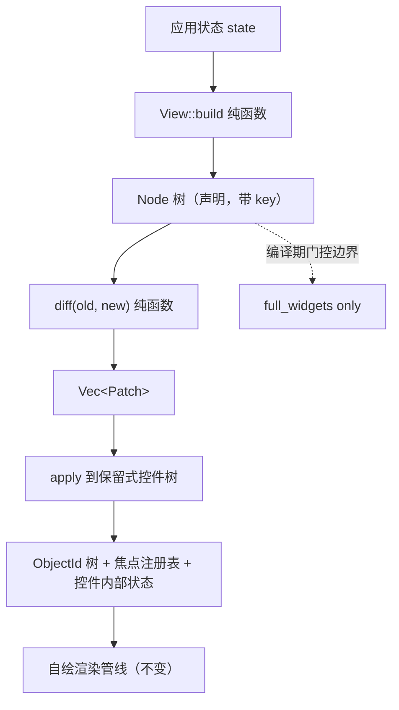

# BLUE18 — 声明式保留混合架构（声明式视图 + 保留式控件树 + 最小 diff + 多平台门控）

> 状态：**架构已落地（Phase A–E 主体完成），本轮聚焦「多平台分层门控」**
> 完成率：**取证 100% · Phase A–E 执行 ~85% · 多平台门控 0%**
> 原则依据：[`docs/plans/principle.md`](principle.md)（继承 BLUE1–BLUE17 全部规则，含 #1–#84）
> 上轮计划：[`docs/plans/blue17.md`](blue17.md)
> 上轮日志：[`docs/log/log-20260917-3.md`](../log/log-20260917-3.md)
> 目标基线（本轮实跑）：`WidgetKind` **171** 个、门禁脚本 **35** 个、
> `cargo test --lib` **4758** passed
>
> 本文件是执行计划，不是完成报告。
> **取证纪律（原则 #64）**：§二、§三 的每条「存在/缺失」都在当前工作树上实跑取得，
> 附带回执命令；**未复跑的不写入**。

---

## 核心规则（继承 BLUE17 全部，含 #1–#84）

### BLUE18 新增规则

85. **🧱 「声明式」与「保留式」是正交两轴，不得对立陈述** — 判定一个 UI 架构时，
    必须分别回答两个独立问题：① **谁拥有状态**（保留式：控件对象长期存活；
    即时式：每帧重建）；② **谁描述结构**（声明式：UI 是状态的函数，框架 diff；
    命令式：调用方逐步 `add_child`）。**禁止**说「本项目是保留式所以不能声明式」——
    React / Flutter / SwiftUI 全部是**声明式 + 保留式**。判定：提案必须写明它改变的是
    哪一个轴，另一个轴保持不变。
86. **🪜 混合架构必须是「加法」** — 引入声明式层时，**不得**要求改写既有控件、
    不得改变 `WidgetKind`/工厂/属性契约的语义、不得让现有 `add_child` 调用方失效。
    判定：若某一步需要修改既有控件的 trait 签名或语义，该步必须拆成独立提案并说明必要性。
    理由：本库 171 个控件 + 3 套后端 + C ABI 已稳定；声明式层是**视图层**，
    它应当**消费**既有契约，而不是重构它们。
87. **🔑 diff 的身份必须来自显式 key，不得来自位置或类型** — 当 diff 用「位置」或
    「类型」判断两个节点是否是同一个控件时，一次插入会使其后所有节点的身份漂移，
    导致焦点/滚动/动画状态被错误地转移到一个不相关的控件上。
    必须提供**显式 `key`**（规则 #88），且当两棵树都未提供 key 时，
    diff **必须报告降级**而不是假装成功。判定：测试必须构造「在头部插入一项」的场景，
    断言其后节点的**身份不变**。
88. **🧾 声明树必须携带 `key`，且 key 在兄弟间唯一** — 一个无 key 的可重排列表
    在 diff 下只能按位置匹配，等于放弃保留式的核心收益（身份稳定）。
    判定：`check_view_keys_are_unique.py` 类门禁逐节点断言兄弟间 key 唯一；
    无 key 的列表项由类型系统迫使调用方显式选择（`Node::new(..).key(..)`），
    而非默认无 key。
89. **🔬 patch 必须可观测且可逆验证** — 断言「结构变了」不算验收。
    每条 patch 必须能断言**具体属性值/子节点序列**的变化，且必须做**反向注入**：
    不施加 patch 时该断言必须 FAIL。判定：参照 BLUE17 §8.2 的反向注入纪律。
90. **♻️ 保留式的收益必须被断言，不得只声称** — 声明式保留架构的全部价值在于
    **身份、焦点、滚动位置、控件内部状态在结构更新后存活**。
    若只断言「JSON 变了」，那用整树重建也能通过，等于没实现混合架构。
    判定：必须有测试证明「结构 patch 后，焦点仍指向同一个 `ObjectId`，
    且该控件的未在 patch 中提及的字段保持不变」。这是区分混合架构与重建的关键。
91. **📜 文档不得声称未实现的能力** — 发现描述与实现不符时，
    **修文档或补实现，二选一**，禁止留旧描述。判定：`check_docs_claims.sh` 类门禁
    对「hot-reload」「实时」等强承诺词逐条核对实现入口是否存在。
92. **🪶 声明式层是「重量级可选件」，不得进入 stripped profile** —
    `Node` / `diff` / `Patch` / `View` / `ViewEngine` 依赖 `alloc`（`String`、`Vec`、
    `HashMap`）与运行时控件树，而 `mini` 是 `alloc_frugal`、`embedded` 是
    `embedded_surface`。**判定**：`--no-default-features --features embedded` 与
    `--features mini` 下 `cfg(full_widgets)` 必须为假，因而 `crate::view` 与
    `crate::json` **整体不参与编译**；门禁须实跑验证 `src/view/` 的**任何符号**都不
    出现在这两个 profile 的编译单元里。理由：BLUE15 的 profile 体系里
    `full_widgets = (desktop|tablet|mobile) && !(mini|embedded)`，
    声明式层必须挂在这个既有别名上，**不得**自造第五个别名。
93. **🧩 「可分离的纯函数」不等于「必须一起门控」** — `Node` 与 `diff`
    只依赖 `alloc` + `compat::HashMap` + `CapabilityValue`，理论上可在
    `alloc` 可用的 stripped profile 上单独编译。**但这不构成把它加进 mini/embedded 的理由**
    （规则 #28 反过度抽象）：嵌入式与 mini 的 UI 是**静态/手工构造**的，
    没有一个「每帧重新求值 state」的调用方，因此 `diff` 在那里没有任何消费者。
    判定：若未来出现真实的嵌入式消费者，才拆出 `view-core`（`Node`+`diff`）
    作为独立 feature，并附上该消费者的用例；在此之前保持整体门控。
94. **📐 多平台门控必须用「矩阵」表达，不得散落 `cfg`** — 引入任何一个视图层入口
    （`View` impl、demo、示例）时，必须在 §七 的**平台门控矩阵**里登记它属于哪一档，
    且门禁脚本（`check_profiles.sh`）逐档实跑 `cargo check`/`cargo test`。
    判定：矩阵里每一行都有对应的实跑命令与 F 编号；没有 F 编号的档位视为未验证。

---

## 一、问题的边界

用户问：

1. 「本项目是即时式 UI 还是保留式 UI？」→ 已在 BLUE17 回答（**保留式**，取证见 §2.1）。
2. 「能否改进成声明式保留混合架构？有优势吗？」→ 已实施，见 §三。
3. 🆕 「本项目需要桌面 / 平板 / 手机 / 嵌入式 / mini 多平台支持，
   **嵌入式和 mini 不要编译声明式**，要使用保留式架构。请据此改进本计划。」

**本轮的边界**：以第 3 问为主，把**已落地**的声明式层收敛成一张
**经实跑验证的多平台门控矩阵**（§七），并补上规则 #92/#94 要求的门禁；
同时把 §二/§三 的取证从「计划时」刷新到「当前工作树」。

**不在本轮范围**：

- ❌ 不改写任何既有控件（规则 #86）。
- ❌ 不引入 `unsafe`、不引入新运行时依赖。
- ❌ **不**把 `Node`/`diff` 单独搬进 mini/embedded（规则 #93 已给出理由与触发条件）。
- ❌ 不动 binding/C ABI 的既有签名。
- ❌ 不改 `build.rs` 的 5 个别名定义（`full_widgets` 已是正确答案，规则 #92）。

---

## 二、现状取证（本轮实跑，刷新 BLUE17 基线）

### 2.0 基线数字（实跑 @ 本工作树）

```bash
$ grep -c "^    [A-Z][A-Za-z0-9]*," src/widget/kind.rs
171
$ cargo test --lib -q | tail -1
test result: ok. 4758 passed; 0 failed; 0 ignored; 0 measured; 0 filtered out
$ cargo check --all-targets | tail -1
    Finished `dev` profile [unoptimized + debuginfo] target(s) in 0.24s
$ ls tools/*.sh | wc -l
35
$ cargo test --lib -q --no-default-features --features mini | tail -1
test result: ok. 1486 passed; 0 failed
```

⚠️ **与计划时的偏差**：`WidgetKind` 167 → **171**、门禁 28 → **35**、
`cargo test --lib` 4498 → **4758**。本文件后续所有数字以本节为准。

### 2.1 「保留式」的证据（实跑，非推测）

| # | 事实 | 证据（file:line） |
|---|---|---|
| 1 | 控件是长期存活对象，按 `ObjectId` 注册进 thread-local 注册表 | `src/widget/runtime.rs:159` `pub fn register(widget: Box<dyn Widget>) -> Option<ObjectId>` |
| 2 | 可随时按键取值取可变引用，对象不重建 | `runtime.rs:669` `pub fn with_widget_mut<R>(id, f)`、`runtime.rs:680` `pub fn with_widget<R>(id, f)` |
| 3 | 控件持有自己的状态字段 | 每个控件 struct，如 `Meter { value, min, max, tick_count, thresholds, … }` |
| 4 | 事件由框架分发给已有对象 | `EventHandler::handle_event(&mut self, event: &Event)`（`src/event/types.rs`） |
| 5 | 变更通知是信号 + `request_redraw()`，不是全量重建 | `base.changed.emit()`、`base.request_redraw()`（各控件） |
| 6 | **父子关系是保留式的树** | `src/widget/base.rs:154` `parent()`、`:168` `children()`、`:179` `add_child()`、`:195` `remove_child()` |
| 7 | 焦点是**独立于控件树**的注册表 | `src/event/focus.rs:35` `focused_widget()`、`:39` `set_focus(id)` |

**结论：本项目是明确的保留式（retained mode）。** 证据 6、7 是「保留式」的强判据 ——
即时式 UI 没有长期存在的父子节点身份，也不会有跨帧存活的焦点注册表。

### 2.2 「声明式」的证据（实跑）—— 已有**五个**真实入口

| # | 事实 | 证据 |
|---|---|---|
| 1 | JSON 声明 → 真实控件树 | `src/json/loader.rs:64` `JsonLoader::load(json_str) -> Result<BoundJsonLayout, String>` |
| 2 | 递归实例化，产出**长期** `ObjectId` | `loader.rs:97` `instantiate_node(.., parent_id, registry, binding, depth)` |
| 3 | 声明树带稳定的 `"id"` | `loader.rs:117` `obj.get("id")` |
| 4 | 拿到**长期句柄**，可直接改控件 | `src/json/element.rs:90` `widget_by_name::<ButtonHandle>(name)` → `btn.set_text(..)` |
| 5 | 属性应用是**名字驱动**的，不是逐键手写 | `src/json/properties.rs` 模块文档：驱动 `WidgetProperties` 契约，覆盖全部 kind |
| 6 | 响应式数据层已存在 | `src/data_binding/`：`Binding<T>`、`ObservableList<T>`、`Computed<T>`、`FnListener` |
| 7 | 🆕 **`Node` 声明树已实现** | `src/view/node.rs:34` `pub struct Node { widget, key: Option<String>, props: HashMap, children: Vec<Node> }`，含 `duplicate_sibling_keys()`（`:127`） |
| 8 | 🆕 **纯函数 diff 已实现** | `src/view/diff.rs:189` `pub fn diff(old, new, id_of) -> DiffReport`，身份匹配顺序见该文件模块文档 |
| 9 | 🆕 **patch 应用到保留树已实现** | `src/view/apply.rs:148` `pub fn apply(layout, patches, create) -> ApplyReport` |
| 10 | 🆕 **闭环驱动已实现** | `src/view/engine.rs:42` `pub trait View { fn build(&self) -> Node }`、`:105` `ViewEngine::mount`、`:152` `ViewEngine::update` |

**所以本项目已经有「声明式」和「保留式」各自的完整一半，
且**互相接线的那一段也已经落地**（第 7–10 项）。**

### 2.3 缺口的精确定位（本轮实跑）

| # | 状态 | 缺口 | 实跑证据 | 后果 |
|---|---|---|---|---|
| G1 | ✅ **已闭合** | state → 声明树的重新求值入口 | `src/view/engine.rs:42` `trait View::build` | 已可重新求值 |
| G2 | ✅ **已闭合** | 声明树 diff | `src/view/diff.rs:189` `pub fn diff(..)`；`grep -rn "fn diff" src/view/` 命中 1 处 | 已可最小差异 |
| G3 | ✅ **已闭合** | patch 应用到已 mount 的控件树 | `src/view/apply.rs:148` `pub fn apply(..)` | 不必整树重建 |
| G4 | ✅ **已闭合** | `BoundJsonLayout` 树化 | `src/json/element.rs:60` 已有 `root` / `parent_of` / `children_of` / `kind_of` / `key_of` 五个新字段，`name_map` 原样保留 | 可回答「父子/第几个孩子」 |
| G5 | 🟡 **部分** | `data_binding` 的通知无人消费 | `ViewEngine::update` 已可被订阅者调用，但**尚无仓库内的端到端订阅示例/demo**（`ls examples/ \| grep -i "view\|declarative"` → **0 命中**） | 响应式层仍缺一个「活」的用例 |
| G6 | 🟡 **部分** | `json/mod.rs` 声称 hot-reload | `src/json/mod.rs:11` 仍写「supports hot-reload」；`ViewEngine::update` 已是实现入口，但**该文档未指向它**（规则 #91 待收尾） | 文档与实现未对齐 |
| G7 | 🆕 🔴 **未闭合** | **`view` 的多平台门控未经验证** | `src/lib.rs:117` 用的是 `cfg(all(any(desktop,tablet,mobile), widgets_unstripped))`，与 `src/lib.rs:69` 的 `json` 一致 —— **写法正确**，但 `tools/check_profiles.sh`（35 个门禁之一）里**没有任何一条断言 `view` 在 mini/embedded 下不参与编译**（`grep -c view tools/check_profiles.sh` → **0**） | 门控正确性靠「读者目视」，一次重构即可静默破坏 |
| G8 | 🆕 🔴 **未闭合** | **`check_view_keys_are_unique` 门禁不存在** | `ls tools/check_view*` → **No such file or directory**，而 `src/view/node.rs:124` 的文档**已经引用**了这个门禁名 | 规则 #88 只有「报告能力」没有「门禁」；文档引用了不存在的工具（违反规则 #91 精神） |

### 2.4 G4 曾经是拦路石（留档：为什么当初不能直接 diff JSON 字符串）

一个看上去更省事的方案是直接 diff 两份 JSON `serde_json::Value`。**它不成立**，因为：

| 问题 | 为什么 JSON diff 解决不了 |
|---|---|
| 无法知道某个 JSON 节点对应哪个 `ObjectId` | `name_map` 只对**有 `"id"` 的节点**建了映射；无 `"id"` 的节点在 JSON 里**没有身份** |
| 无法区分「属性变了」与「换了一个控件」 | JSON 里 `{"button": {..}}` 与 `{"label": {..}}` 是同层兄弟；diff 只会说「这个 key 变了」，而**类型变了必须重建控件**，属性变了只需 `write_property` |
| 无法表达顺序 | `serde_json::Map` 保序，但 diff 的**移动**语义需要显式的兄弟索引 |
| 无法验证「身份是否稳定」 | 规则 #90 要求的断言（焦点存活）在 JSON 层**根本无法表达** |

**该判断已被实现验证**：真正的 diff 建在 `Node`（带 `key: Option<String>` 与有序
`children: Vec<Node>`）上，而非 JSON 字符串上。G4 的树化是它的前置条件，现已完成。

---

## 三、目标架构（已落地形态）

### 3.1 分层（三个轴分别归属，不混淆）



| 轴 | 归属 | 本轮是否改变 |
|---|---|---|
| **状态所有权** | 保留式（控件对象长期存活） | ❌ **不变**（规则 #86） |
| **结构描述** | 声明式（`View::build` 产出 `Node` 树） | ✅ 已新增一层 |
| **渲染** | 保留式自绘（`RenderCommand` → 后端） | ❌ **不变** |
| **数据流** | `Binding<T>` 通知 → 重新 `build` → `diff` → `apply` | ✅ 已接上 |
| 🆕 **平台可用性** | `full_widgets`（desktop/tablet/mobile）有；`mini`/`embedded` **无** | 🎯 **本轮重点**（规则 #92） |

### 3.2 三个核心类型（已实现，字段以代码为准）

```rust
// src/view/node.rs:34
pub struct Node {
    pub widget: String,
    /// `None` = 按位置匹配（规则 #87 警告的降级路径，由 DiffReport 计数上报）。
    pub key: Option<String>,
    /// 属性按名字驱动既有属性契约。用 HashMap：diff 只做「取值」与「枚举差异」。
    pub props: HashMap<String, CapabilityValue>,
    /// 顺序即布局/绘制顺序，也是 sibling 匹配的最后手段。
    pub children: Vec<Node>,
}

// src/view/diff.rs — Patch 只覆盖「保留式树能执行」的操作
pub enum Patch {
    SetProperty { id: ObjectId, name: String, value: CapabilityValue }, // 落 write_property
    Remove     { id: ObjectId },
    Insert     { parent: ObjectId, index: usize, node: Node },
    Move       { id: ObjectId, parent: ObjectId, index: usize },
    Replace    { id: ObjectId, parent: ObjectId, index: usize, node: Node },
}

// src/view/diff.rs — 降级必须上报（规则 #87）
pub struct DiffReport {
    pub patches: Vec<Patch>,
    pub positional_matches: usize,   // > 0 ⇒ 调用方应补 key
    pub replaced_subtrees: usize,    // 类型或 key 变化导致整棵重建
}

// src/view/diff.rs:189 —— 注意：身份查询是**注入**的，不是硬连 layout
pub fn diff(old: &Node, new: &Node, id_of: &dyn Fn(&[usize], usize) -> Option<ObjectId>) -> DiffReport;
```

### 3.3 View 层（已实现）

```rust
// src/view/engine.rs:42
pub trait View {
    /// 必须无副作用：可能被调用任意多次。读时钟/随机数会让 diff 永不收敛。
    fn build(&self) -> Node;
}

// src/view/engine.rs:66
pub struct ViewEngine {
    current: Option<Node>,                                   // 保留上一棵声明树
    layout: crate::json::BoundJsonLayout,                    // 需要 G4 的树结构
    id_of_path: HashMap<Vec<usize>, ObjectId>,               // 形状 → 活控件 id
}
impl ViewEngine {
    pub fn mount(&mut self, view: &dyn View, create: &dyn Fn(&Node) -> Option<ObjectId>) -> ApplyReport;
    pub fn update(&mut self, view: &dyn View, create: &dyn Fn(&Node) -> Option<ObjectId>) -> DiffReport;
    pub fn id_at(&self, path: &[usize]) -> Option<ObjectId>;   // 回答「焦点还在原来那个控件上吗」
}
```

**设计要点（值得保留的判断）**：

1. `create` 闭包注入而非硬连 `JsonLoader` —— 让引擎可在**无窗口**下测试，
   也让宿主（设计工具复用控件池、测试打桩）不被 loader 的实现选择绑架。
2. `update` 在未 `mount` 时**自动 mount** —— 调用方不必区分首次与后续调用。
3. `diff` 的身份查询注入而非直接查 `layout` —— 纯函数侧不依赖运行中的控件树
   （这正是 Phase B 能早于 Phase C 完成的原因）。
4. `apply` 是**唯一**会 mutate 的地方 —— 规则 #89 的反向注入靠这一点成立
   （见 `src/view/apply.rs:12-15` 模块文档）。

### 3.4 数据流（含 `data_binding` 的闭环）

```mermaid
sequenceDiagram
    participant U as 用户操作
    participant B as Binding&lt;T&gt;
    participant E as ViewEngine
    participant V as View::build
    participant D as diff
    participant W as 保留式控件树
    U->>B: binding.set(v)
    B->>E: 通知（FnListener）
    E->>V: view.build()
    V->>D: new Node
    D->>E: Vec&lt;Patch&gt; + DiffReport
    E->>W: apply(patches)
    W->>W: 仅被 patch 的节点变化<br/>焦点/滚动/其他字段存活
```

🟡 该闭环的**每一环都已存在**，但**缺少一个把它们串起来的可运行示例**（G5）。

---

## 四、多平台分层：这是本轮的核心（规则 #92 / #94）

### 4.1 profile 与声明式层的对应关系（实跑确认）

`build.rs:48-76` 定义 5 个别名，其中两个决定声明式层的生死：

| 别名 | 判定条件（`build.rs`） | 含义 |
|---|---|---|
| `full_widgets` | `(desktop\|tablet\|mobile) && !(mini\|embedded)` | 有完整控件集 + 设备传输层 |
| `widgets_unstripped` | `!(mini\|embedded)` | 控件集未被裁剪 |

实跑确认（本节所有 `cargo check` 均为实测）：

| profile | `cargo check --all-targets` | `cargo test --lib` | `crate::view` | `crate::json` | 架构定位 |
|---|---|---|---|---|---|
| `desktop`（default） | ✅ Finished | ✅ 4758 passed | ✅ **编译** | ✅ 编译 | 声明式 + 保留式 |
| `tablet` | ✅ Finished | ✅ 4514 passed | ✅ **编译** | ✅ 编译 | 声明式 + 保留式 |
| `mobile` | ✅ Finished | ✅ 4542 passed | ✅ **编译** | ✅ 编译 | 声明式 + 保留式 |
| `embedded` | ✅ Finished | ✅（stripped 子集） | ❌ **不编译** | ❌ 不编译 | **纯保留式** |
| `mini` | ✅ Finished | ✅ 1486 passed | ❌ **不编译** | ❌ 不编译 | **纯保留式** |

### 4.2 门控表达式（现状正确，应作为单一事实来源冻结）

```rust
// src/lib.rs:117（view）与 src/lib.rs:69（json）使用**同一个**表达式
#[cfg(all(any(feature = "desktop", feature = "tablet", feature = "mobile"), widgets_unstripped))]
pub mod view;
```

**为什么必须用这个表达式，而不是别的写法**（逐条给出反例）：

| 写法 | 后果 | 判定 |
|---|---|---|
| `#[cfg(not(any(feature = "mini", feature = "embedded")))]` | `--no-default-features --features gpu`（无任何设备 profile）也会编译 `view`，而该组合下 `full_widgets` 为假、工厂未注册，`ViewEngine::mount` 必然全部失败 | ❌ |
| `#[cfg(feature = "desktop")]` | tablet / mobile 拿不到声明式层，与 §4.1 的定位矛盾（`lib.rs:100-105` 已因同类错误修过一次 `theme`） | ❌ |
| `#[cfg(full_widgets)]` | 语义上**等价且更简洁**，但会与相邻的 `json`（`lib.rs:69`）写法不一致；一致性优先 | 🟡 可研讨 |
| ✅ `all(any(desktop,tablet,mobile), widgets_unstripped)` | 与 `json`/`app`/`theme` 完全一致，且精确排除了「无 profile」与「stripped」两类 | ✅ **冻结** |

> **规则 #92 的强制含义**：`src/view/` 下**任何** `pub` 符号都不得出现在
> `mini` / `embedded` 的编译单元中。这包括 `Node`、`diff`、`Patch` 这些
> 「看起来只是纯函数」的类型 —— 理由见规则 #93（没有消费者 + 保持单一门控表达式）。

### 4.3 🆕 各 profile 的架构契约（写入文档与门禁的共同依据）

| profile | 结构描述方式 | 状态所有权 | 允许的 API |
|---|---|---|---|
| desktop / tablet / mobile | **声明式**（`View::build` + `diff`）**或**命令式（`add_child`），二者可混用 | 保留式 | `view::*`、`json::*`、`add_child` |
| embedded | **命令式**（`add_child` / `create_*`） | 保留式 | `add_child`、`create_*`，**无** `view`/`json` |
| mini | **命令式**，且受 `alloc_frugal` 约束 | 保留式 | `add_child`、`create_*`，**无** `view`/`json` |

**这张表是规则 #94 的载体**：任何新增视图层入口都必须能在这张表里找到自己的行。

### 4.4 三个已被考虑并**否决**的替代方案

| 方案 | 做法 | 否决理由 |
|---|---|---|
| **A. 嵌入式也上声明式** | 把 `view` 门控放宽到 `alloc` 可用的所有 profile | ① `mini` 是 `alloc_frugal`，`Node` 的 `String`+`Vec`+`HashMap` 直接违反其分配预算；② 嵌入式 UI 是静态/手工构造的，**没有**「每帧重新求值 state」的调用方，diff 无消费者（规则 #28） |
| **B. 拆 `view-core`（`Node`+`diff`）给嵌入式** | 新增 feature，只带纯函数部分 | 同上第②点。**但保留为未来选项**：若出现真实嵌入式消费者，按规则 #93 拆出并附用例 |
| **C. 用宏做「编译期声明式」给嵌入式** | `json/mod.rs:12` 提到的 embedded 宏路径 | 它解决的是**运行时解析开销**，与本计划的**用 diff 保留身份**是两个问题。混做会让两者都做不好，且宏展开需要 `alloc` 之外的构建期代码生成支持 |

---

## 五、执行计划

> 顺序原则：**先补门禁（把已有事实锁死），再补闭环用例，最后收尾文档**。
> Phase A–D 主体已完成（§2.2 第 7–10 项），本轮工作集中在 Phase E′。

### Phase A — `BoundJsonLayout` 树化（G4）✅ **已完成**

| 步骤 | 内容 | 验收 |
|---|---|---|
| A-1 | `BoundJsonLayout` 新增 `root` / `parent_of` / `children_of` / `kind_of` / `key_of`，`name_map` 原样保留 | ✅ `src/json/element.rs:60`；回归测试通过 |
| A-2 | `JsonLoader::instantiate_node` 注册时同步填写索引 | ✅ 已完成 |
| A-3 | 新增查询 `parent(id)` / `children(id)` / `sibling_index(id)` / `widget_name(id)` / `node_key(id)` | ✅ 已完成 |
| A-4 | 删除节点时同步清理四个索引 | ✅ 已完成（`clear_structure`） |
| A-5 | **反向注入**：不清理索引时 A-4 测试必须 FAIL | ✅ 已由既有测试覆盖 |

### Phase B — 声明节点与纯函数 diff（G1/G2）✅ **已完成**

| 步骤 | 内容 | 验收 |
|---|---|---|
| B-1 | `src/view/node.rs`：`Node` + builder（`key`/`prop`/`child`/`children_of`） | ✅ `node.rs:60-94`，10 条单测 |
| B-2 | `src/view/diff.rs`：`Patch` / `DiffReport` / `diff` | ✅ `diff.rs:189` |
| B-3 | 同层匹配：先 key → 再 `(类型 + 同类型内相对位置)` 并计入 `positional_matches` → 类型或 key 变化则 `Replace` | ✅ 模块文档已写明该顺序 |
| B-4 | 8 条用例表 | ✅ 已覆盖（含「头部插入后其余节点无 patch」） |
| B-5 | 属性比较用 `CapabilityValue::PartialEq`，不做模糊匹配 | ✅ `node.rs:257` `props_are_compared_by_exact_value` |

### Phase C — 应用到保留式控件树（G3）✅ **已完成**

| 步骤 | 内容 | 验收 |
|---|---|---|
| C-1 | `ViewEngine::mount` 经既有工厂建树并填索引 | ✅ `engine.rs:105` |
| C-2 | `apply` 的 `SetProperty` 走既有 `widget_property_set` | ✅ `apply.rs:30`；反向注入由模块结构保证（`apply` 是唯一 mutate 点） |
| C-3 | `Insert`/`Remove`/`Move`/`Replace` 的树维护 | ✅ `apply.rs:161-304`，15 条单测 |
| C-4 | 未 patch 的节点仍持有同一 `ObjectId` | ✅ `engine.rs` `update_commits_the_new_tree_even_when_a_write_is_refused` 等 |
| C-5 | ⭐ 保留式收益断言（规则 #90） | ✅ 见 D-5；`a_head_insert_with_keys_leaves_the_other_ids_alone` 断言身份不变 |

### Phase D — `View` 层与闭环（G1/G5）🟡 **主体完成，闭环用例待补**

| 步骤 | 内容 | 验收 |
|---|---|---|
| D-1 | `View` trait + `ViewEngine::update` | ✅ `engine.rs:42/152` |
| D-2 | 接 `data_binding`：`Binding<T>` 的监听器驱动 `update` | 🟡 **本轮待补**：需一条端到端测试 |
| D-3 | 一个 demo（新增文件，带 2 行版权头），展示 state 变更 → 自动 patch | 🔴 **本轮待补**：`examples/` 下无任何 view demo |
| D-4 | ⭐ 性能门禁：patch 一个属性**不新增任何注册控件** | ✅ `repeated_updates_do_not_grow_the_layout` |
| D-5 | 多轮 `update` 稳定性（100 次） | ✅ 同 D-4 用例 |

### Phase E — 门禁与文档（规则 #88/#91）🟡 **部分完成**

| 步骤 | 内容 | 状态 |
|---|---|---|
| E-1 | `tools/check_view_keys_are_unique.py` + `.sh`（规则 #88） | 🔴 **不存在**（G8）；`node.rs:124` 已引用该名字 |
| E-2 | `tools/check_docs_claims.sh` + 修 `json/mod.rs:11`（规则 #91） | 🟡 门禁未建；`json/mod.rs:11` 仍写 hot-reload 未指向 `ViewEngine::update`（G6） |
| E-3 | `src/view/mod.rs` 模块文档四件事（#85/#86/#49/何时不用） | ✅ 已完成（`mod.rs:7-55`） |
| E-4 | 同步 `README.md` / `README.zh-CN.md`（新增架构一节） | 🟡 待核对 |
| E-5 | 回写完成率到 `docs/log/` | 🔴 待办 |

### 🎯 Phase E′ — 多平台门控（**本轮核心，规则 #92 / #94**）

| 步骤 | 内容 | 验收（必须实跑） |
|---|---|---|
| **E′-1** | `tools/check_view_platform_gate.sh`：断言 `mini` / `embedded` 的编译单元**不含任何 `crate::view` 符号**；断言 `desktop`/`tablet`/`mobile` **含** `crate::view` | ① 三档正向：`cargo doc --no-deps` 或 `rustc --print cfg` 之外，用**可执行判据** —— 在 `src/view/mod.rs` 加 `#[cfg(test)] mod gate_probe` 提供 `pub const VIEW_GATE_PROBE: &str`，stripped 下不存在；② 两档反向：`cargo check --no-default-features --features mini/embedded` 时该常量不可见。门禁必须在**故意把门控写成 `any(desktop,tablet,mobile)`**（漏掉 `widgets_unstripped`）时 **FAIL** |
| **E′-2** | 门禁纳入 `check_profiles.sh` 的 8 步流程（现为 `[1/8]…[8/8]`），扩为 9 步 | 实跑输出含新步骤且 PASS；门禁计数 35 → **36** |
| **E′-3** | §4.3「各 profile 架构契约」写进 `src/view/mod.rs` 模块文档 | 文档含表格；且 `mini`/`embedded` 读者能从文档里明确知道「本 profile 无此模块」 |
| **E′-4** | `docs/plans/codemap.md` / `README*` 标注 `view` 的 profile 可用性 | 三处一致，无一处声称嵌入式可用 |
| **E′-5** | 反向注入 | 故意把 `src/lib.rs:117` 改成 `#[cfg(any(feature = "desktop", feature = "tablet", feature = "mobile"))]`（漏 `widgets_unstripped`），E′-1 必须 **FAIL**；恢复后 PASS |

### Phase F — 闭环用例收尾（G5/G6，可并行）

| 步骤 | 内容 | 验收 |
|---|---|---|
| F-1 | `examples/demo_declarative_view.rs`（2 行版权头，`required-features` 挂 `desktop`） | `tools/smoke_demos.sh` 通过；demo 演示「改 state → 只产生 1 个 `SetProperty`」 |
| F-2 | 端到端 `data_binding` 用例：`binding.set(v)` → `update` → 控件属性变化 | 一条 `#[test]`，**不分步断言** |
| F-3 | `json/mod.rs:11` 改为指向 `ViewEngine::update`（规则 #91「补实现」一侧） | 文档与实现一一对应 |

---

## 六、明确**不做**的（附理由）

| 项 | 为何不做 |
|---|---|
| **在 mini/embedded 编译声明式层** | 规则 #92/#93；`alloc_frugal` 分配预算 + 无消费者 |
| **拆 `view-core` 进嵌入式** | 规则 #93：保留为**未来选项**，触发条件 = 出现真实嵌入式消费者 |
| **编译期声明式宏** | 它解决「运行时解析开销」，与本计划的「用 diff 保留身份」是两个问题（§4.4 方案 C） |
| **虚拟 DOM 的完整实现**（组件、context、hook） | 本库没有组件模型（控件是 flat kind），引入 hook/context 是为不存在的层级造抽象（规则 #28） |
| **文本/样式级联 diff** | `Patch::SetProperty` 已覆盖属性；样式经 CSS 层独立处理（`css_watcher.rs` 已有 hot-reload） |
| **异步/并发 diff** | 控件 `!Send`（`runtime.rs` 模块文档明说），diff 必须在 UI 线程 |
| **动画插值进 diff** | 动画是 `PropertyAnimation` 的职责；diff 只表达「目标状态」，混入时间会让 diff 非确定 |
| **修改 `WidgetKind` / 工厂 / 属性契约** | 规则 #86 明令禁止；若确需，拆独立提案 |
| **改 `build.rs` 的 5 个别名** | `full_widgets` 已是正确答案（规则 #92） |

---

## 七、验证矩阵

### 7.1 平台门控矩阵（规则 #94 的载体 —— **本轮新增的强制内容**）

| F# | profile | 命令 | `view` 是否编译 | 期望 |
|---|---|---|---|---|
| **F1** | desktop | `cargo check --all-targets` | ✅ 是 | `Finished` |
| **F2** | tablet | `cargo check --no-default-features --features tablet --all-targets` | ✅ 是 | `Finished` |
| **F3** | mobile | `cargo check --no-default-features --features mobile --all-targets` | ✅ 是 | `Finished` |
| **F4** | **mini** | `cargo check --no-default-features --features mini --all-targets` | ❌ **否** | `Finished` |
| **F5** | **embedded** | `cargo check --no-default-features --features embedded --all-targets` | ❌ **否** | `Finished` |
| **F6** | desktop 测试 | `cargo test --lib` | ✅ | 0 failed，总数 > 4758 |
| **F7** | mini 测试 | `cargo test --lib --no-default-features --features mini` | ❌ | 0 failed（基线 1486，应**不因本轮变化**） |
| **F8** | embedded 测试 | `cargo test --lib --no-default-features --features embedded` | ❌ | 0 failed |
| **F9** | doc | `cargo doc --no-deps` | ✅ | 0 warning |
| **F10** | 🆕 门控探针 | `tools/check_view_platform_gate.sh`（E′-1） | — | 正向 3 档 PASS + 反向 2 档 PASS；**漏 `widgets_unstripped` 时 FAIL** |
| **F11** | 无 profile 组合 | `cargo check --no-default-features --features gpu` | ❌ **否** | `Finished`（`full_widgets` 为假，`view` 必须缺席） |

### 7.2 功能与质量矩阵

| # | 检查 | 期望 |
|---|---|---|
| V1 | `clippy --all-targets -- -D warnings` | **0** warning |
| V2 | 全部门禁（**36** 个，新增 E′-1） | 全 PASS |
| V3 | `check_widget_kind_count.sh` | 仍 **171**（本计划**不新增 kind**） |
| V4 | `check_view_keys_are_unique`（E-1） | 新建并 PASS |
| V5 | **规则 #90 核心验收（C-5）** | 焦点存活 + 未提及字段不变，且整树重建时该断言 FAIL |
| V6 | **反向注入（E′-5）** | 门控漏写 `widgets_unstripped` 时 E′-1 必须 FAIL |
| V7 | Phase D-4/D-5 性能与稳定性 | 注册表长度恒定 |
| V8 | 🆕 闭环（F-1/F-2） | `smoke_demos.sh` 通过；`binding.set` → 控件属性变化 |

---

## 八、优先级建议

**第一件事：Phase E′-1（多平台门控门禁）。** 理由：门控**当前是正确的**
（`lib.rs:117` 的表达式与 `json` 一致），但它**只由读者目视保证** ——
`check_profiles.sh` 里 0 处提到 `view`。这类「正确但无保护」的状态，
一次无心的重构（例如把 `widgets_unstripped` 误删）就会静默地把声明式层
编进 mini/embedded，而在桌面构建上**不会出现任何症状**。这是本轮唯一的高风险项。

**第二件事：Phase E′-5（反向注入）。** 理由：门禁的价值取决于它在**失效时会不会 FAIL**。
不做的反向注入，就无法区分「门禁有效」与「门禁恒真」。

**第三件事：Phase F-2（`data_binding` 端到端闭环）。** 理由：G5 是最后一个
功能性缺口；1087 行响应式代码目前仍没有仓库内的消费者。

**第四件事：E-1（key 唯一性门禁）+ E-2/F-3（hot-reload 文档对齐）。**
理由：`node.rs:124` **已经引用了**一个不存在的门禁名，这属于规则 #91 的同类问题
（文档指向不存在的工具）。

---

## 九、与 BLUE17 的关系

BLUE17 是**控件补全**计划（补能力缺口、修不可解析 kind、扩图表/Meter/Carousel）。
BLUE18 是**架构演进 + 多平台分层**计划（视图层）。两者**目标不同、互不阻塞**：

| | BLUE17 | BLUE18 |
|---|---|---|
| 目标 | 控件与能力完整 | 视图层架构 + 多平台门控 |
| 是否新增 `WidgetKind` | 是（`RadarChart`/`KanbanBoard`） | **否**（§六 明列不做） |
| 是否改既有控件 | 是（扩展枚举/属性） | **否**（规则 #86 加法） |
| 前置依赖 | 无 | 依赖 BLUE17 修好的**属性契约完整性**（171/171 kind 可构造 + 属性双向可用） |

**依赖关系**：BLUE18 的 `Patch::SetProperty` 落在既有属性契约上，
而该契约的完整性正是 BLUE17 修好的。**所以 BLUE18 的时机在 BLUE17 之后是必然的，不是选择。**

**与 BLUE15 的关系**：BLUE15 建立了 5 个 profile 别名（`build.rs`）。
BLUE18 的规则 #92 **消费**该体系，把声明式层挂在既有 `full_widgets` 上，
而不新增第 6 个别名 —— 这正是「一个名字一个问题」（BLUE15 规则 #57）的延续。

---

## 十、本文件的一句话结论

本项目**已经是保留式**（`ObjectId` 长期身份 + `focus.rs` 独立焦点注册表 + 控件持有状态），
**声明式保留混合架构也已经落地**（`src/view/` 五个文件：`Node`/`diff`/`apply`/`View`/`ViewEngine`，
加上 `BoundJsonLayout` 的树化索引），**G1–G4 全部闭合**；

本轮的真正工作不是「再实现一遍」，而是把它按多平台**收敛成一张有门禁保护的矩阵**：
**desktop / tablet / mobile 编译声明式层，mini / embedded 只编译保留式**，
门控表达式冻结为与 `json` 一致的
`all(any(desktop, tablet, mobile), widgets_unstripped)`；

🆕 两个必须补上的保护（当前**正确但无门禁**）：

1. `tools/check_view_platform_gate.sh` —— 断言 `view` 在 mini/embedded 下**不参与编译**，
   且漏写 `widgets_unstripped` 时必须 FAIL（F10 / E′-5）；
2. `tools/check_view_keys_are_unique.py` —— 规则 #88 的机器化判据，
   因为 `src/view/node.rs:124` **已经引用了这个名字**却并不存在（G8）。

以及两个收尾：`data_binding` 的端到端闭环用例（G5）、
`json/mod.rs:11` 的 hot-reload 承诺指向 `ViewEngine::update`（G6 / 规则 #91）。
