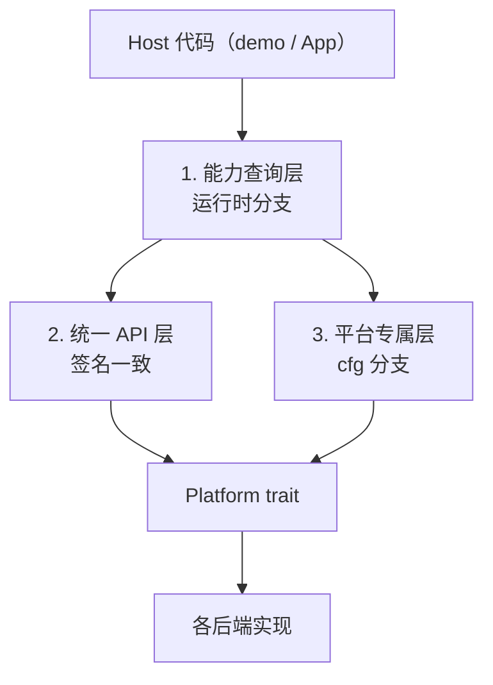

# 平台差异的处理契约

> 回答一个问题：**是不是所有 API 都要包装成统一形式？差异该由谁处理？**

不是。本项目采用**三层**处理，每层职责不同，混用会导致 API 膨胀或静默失败。

## 总览



## 第一层：能力查询 —— 差异在**运行时**暴露

适合"所有平台都有这个概念，但支持程度不同"的能力。

```rust
if rust_widgets::supports_self_drawn() { ... }
rust_widgets::capabilities().native_menu
```

* 签名在所有平台完全一致，**不需要 `cfg`**。
* 不支持的平台返回 `false`，宿主据此降级。
* **禁止**用它来假装支持：`supports_*` 返回 `true` 而实际无效，是本项目明确禁止的
  "假修复"（principle #12）。

**已采用此模式的**：`supports_self_drawn()`、`PlatformCapabilities::native_menu` /
`dpi_scaling` / `ime` / `accessibility`。

## 第二层：统一 API —— 语义相同，实现不同

适合"每个平台都能做，只是底层机制不同"的能力。

```rust
win.new_button("OK", 10, 10, 80, 30);      // macOS NSButton / Windows BUTTON / GTK Button
win.new_menu_bar(0, 0, 800, 26);
win.mount_self_drawn(widget, rect);        // 各后端各自实现
```

* 调用方**完全不关心**平台。
* 差异**必须留在平台代码里**（`src/platform/<os>/`），不能泄漏到签名。
* 后端做不到时**返回 `false` / `Err`**，由第一层的能力查询提前拦住。

## 第三层：平台专属 API —— 用 `cfg` 显式隔离

适合"只有一个平台有这个概念"的能力。

```rust
#[cfg(target_os = "macos")]
fn set_dock_badge(label: &str);
```

* 这类 API **不进** `Platform` trait 的公共面，避免所有后端被迫实现空方法。
* 调用方必须自己 `cfg`。

## 第四层（本轮新增）：快捷键 —— 语义统一，记号按平台渲染

菜单快捷键曾用**平台字符串常量**处理（`"Cmd+Z"` 硬编码），这是错的：

1. 常量解决不了**显示**：macOS 是 `⌘⇧Z`（无 `+`），Windows 是 `Ctrl+Shift+Z`。
2. 常量会渗透进业务代码，破坏「demo 零 cfg」。
3. 常量只针对字符串，**验证不了快捷键真的能用**（Windows 需要 `ACCEL` 表，GTK 需要
   `AccelGroup`）。

正确做法是引入 **`PRIMARY` 语义**，而不是 `CMD` 常量：

| 平台 | `Modifiers::PRIMARY` 解析为 | 菜单显示 |
|---|---|---|
| macOS | Command | `⌘Z` |
| Windows | Ctrl | `Ctrl+Z` |
| Linux / GTK | Ctrl | `Ctrl+Z` |

### 用法：一套代码，零 cfg

```rust
use rust_widgets::shortcut::{Key, Shortcut};

// 声明一次，各平台显示各自的原生记号
let undo = Shortcut::primary(Key::Z);
win.new_menu_item_with_shortcut(&menu, "Undo", Some(undo));
```

### 三层的分工

| 层 | 职责 | 位置 |
|---|---|---|
| `Shortcut`（类型） | 平台无关的语义（`PRIMARY` = 主加速键） | `src/shortcut/types.rs` |
| `Platform::format_shortcut` | 把语义渲染成该 OS 的**显示记号** | 各后端 |
| `Platform::parse_shortcut` | 把显示记号转成该 OS 的**加速键表示** | 各后端 |

`Primary` 与物理 `Ctrl` 是**不同的修饰键**，不能合并：macOS 上 `⌘C` 和 `⌃C` 是两个键。
事件层的 Command 位（bit 3）会同时置 `PRIMARY` 和 `CTRL`，这样只检查 control 位的
控件（如 `CodeEditor` 的按键处理）也能识别 `⌘C` 为复制。

### 各平台如何真正装上加速键

声明只有在后端真的注册后才有效果，这是三层契约里「统一 API」那一层的责任：

| 平台 | 机制 |
|---|---|
| macOS | `NSMenuItem` 的 `keyEquivalent` + `keyEquivalentModifierMask` |
| Windows | `CreateAcceleratorTableW` 建 `HACCEL`，消息循环里 `TranslateAcceleratorW` |
| GTK | `GtkAccelGroup` + `gtk_widget_add_accelerator`，挂在拥有菜单的 `GtkWindow` 上 |

> **Windows 的 `TranslateAcceleratorW` 曾完全缺失**：`menu_add_item` 的参数名是
> `_shortcut`，快捷键只画在标签里、按下去没有任何反应。现在消息循环会在
> `TranslateMessage`/`DispatchMessageW` 之前先尝试加速键翻译。

### 验证方式

* 跨平台渲染规则：`src/shortcut/tests.rs` 同时断言 macOS 与桌面两种记号
  （`format_shortcut_for_platform`），**在任何主机上都能跑**，不需要 Windows 机器。
* macOS 运行时：`cargo run --example menu_shortcut_runtime` — 建真窗口、读回
  AppKit 实际存的 `keyEquivalent`、再触发菜单动作并确认队列里收到对应 item id。
* Windows 解析规则：`tools/win32_accel_probe`（在宿主机上跑，因为 `winapi` 的
  `um` 模块不在非 Windows target 上暴露）。
* GTK 安装路径：`tools/gtk_accel_check.py` 把 `menu_impl.rs` 里的加速键安装代码
  抽出来，对着真的 `gtk`/`gdk` crate 编译。

## 该选哪一层：判断标准

| 问题 | 用哪层 |
|---|---|
| 所有平台都有这个概念，只是支持程度不同？ | 第一层（能力查询） |
| 所有平台都能实现，机制不同？ | 第二层（统一 API）+ 后端内部 `cfg` |
| 只有个别平台存在这个概念？ | 第三层（`cfg` 隔离） |

**反例（不该做的）**：

* 为"只有 macOS 有的 Dock 徽标"加一个 `Platform::set_dock_badge()` 默认空实现
  —— 所有后端被迫带一个永远无效的方法，且调用方无法判断它是否真的生效。
* 把"Linux 没有原生菜单"这件事藏起来，让 `create_menu_bar` 返回一个看起来正常的 id
  —— 宿主会以为菜单能用。正确做法是 `capabilities().native_menu` 返回 `false`。

## 本轮踩到的两个真实案例

### 案例 1：菜单 parent 传错 → 静默无效（已修）

`WindowHandle::new_menu(text, ...)` 原本把 **window** 当 parent 传给
`create_menu`，而 macOS 后端只在 parent 是 `MenuBar` 时才挂载子菜单，
`HandleKind::Window` 分支是个**空实现**。结果：菜单永远不出现，且没有任何提示。

这是第二层的典型错误——统一 API 没有在"做不到"时如实报告。修复：

1. 签名改为 `new_menu(&MenuBarHandle, ...)`，让错误的调用**编译不过**（编译期约束优于运行时检查，principle #29）；
2. 后端遇到 `Window` parent 时打 `log::error!` 并返回 `0`，不再静默。

### 案例 2：鸿蒙无自绘支持 → 如实拒绝（已测）

`HarmonyPlatform` 没有实现 `mount_self_drawn`，因此继承 trait 默认的
`false`。测试 `self_drawn_support_is_refused_until_the_arkui_bridge_exists`
锁住这个契约，确保装 SDK 之前不会有人误以为能用。

## demo 的写法

`demo/code_editor` 的正确跨平台形态：

```rust
// 1. 先查能力，不支持就明确退出（不显示空窗口）
if !rust_widgets::supports_self_drawn() {
    eprintln!("后端 '{}' 不支持自绘控件 ...", rust_widgets::backend_name());
    std::process::exit(1);
}

// 2. 之后全部用统一 API，不出现任何 cfg
win.new_menu_bar(...);
win.mount_self_drawn(...);
```

demo 里**不应出现 `cfg(target_os)`**。目前 `demo/code_editor` 与 `demo/control`
都满足这一点；平台差异全部由 `src/platform/` 消化。

## ⚠️ 设备配置（Device Profile）不可混用

`Cargo.toml` 的 Axis 1 有**五个**设备配置：`desktop`（默认）、`tablet`、`mobile`、`embedded`、`mini`。
**它们互斥，只能选一个。**

```bash
# ✅ 正确
cargo build                                    # desktop（默认）
cargo build --no-default-features --features mini
cargo build --no-default-features --features embedded
cargo build --no-default-features --features tablet

# ❌ 错误：desktop 与 mini 同时生效
cargo build --features mini
```

> 本文下面只讨论**已实测**的 `desktop` / `mini` / `embedded` 三者。
> `tablet` / `mobile` 同样属于 Axis 1，但它们的组合未在本轮验证范围内。

### 为什么不能混用

`mini`/`embedded` 为了控制体积会**移除一整个模块**，而 `desktop` 会把它加回来：

| 被移除的模块 | 谁依赖它 |
|---|---|
| `widget::runtime`（`#[cfg(not(feature = "mini"))]`） | 三端的自绘画布 `platform/<os>/canvas.rs` |

结果不是「两者取其轻」，而是**编译失败**：`canvas.rs` 引用了一个不存在的模块。

### 三个平台都受影响（不是 macOS 独有）

同一个 `cfg` 不一致在三个后端各有一份。在修复前，混合开启 `desktop` + `mini` 时报：

| 后端 | 报错位置 |
|---|---|
| macOS | 6 个 `E0433`（`widget::runtime` 不存在）+ 1 个 `E0277` |
| Windows | 9 个 `E0433` |
| Linux/GTK | 同型（需开 `gtk-native` 才走到） |

> 这些数字是 **`mini` 与 `desktop` 默认特性同时生效**时的实测值。
> 建议把 `cargo check --lib --all-features` 当作回归门禁 —— 它是唯一会自动把两者
> 同时打开的常用命令，因此也是最早暴露问题的地方。

### 现在的处理方式

自绘相关的模块与 trait 方法全部按**同一条件**门控：

```rust
#[cfg(not(any(feature = "mini", feature = "embedded")))]
fn supports_self_drawn(&self) -> bool { true }
```

于是混合开启时：

* **不再编译失败** —— `mini` 与 `desktop` 同时开启也能 build 通过；
* `supports_self_drawn()` 在 `mini`/`embedded` 下**如实返回 `false`**，宿主据此拒绝
  挂载，而不是挂上去得到一个空白窗口。

> **这是一个刻意的不对称**：`mini` 下不是「自绘功能降级」，而是「这个能力不存在」。
> 返回 `true` 会是本项目禁止的假修复（principle #12）。

### 验证

8 个配置必须同时为 0 error / 0 warning：

| 配置 | 命令 |
|---|---|
| desktop（默认） | `cargo check --lib` |
| mini | `cargo check --lib --no-default-features --features mini` |
| embedded | `cargo check --lib --no-default-features --features embedded` |
| harmony | `cargo check --lib --features harmony` |
| 全部特性 | `cargo check --lib --all-features` |
| Windows + mini | `cargo check --lib --target x86_64-pc-windows-gnu --features mini` |
| Windows + harmony | `cargo check --lib --target x86_64-pc-windows-gnu --features harmony` |
| Windows（默认） | `cargo check --lib --target x86_64-pc-windows-gnu` |

其中 `--all-features` 是最容易漏的 —— 它会把 `desktop` 与 `mini` 同时打开，
正是最初暴露这个问题的地方。

## 现状对照表

### 平台 × 能力

| 能力 | macOS | Windows | Linux(GTK) | Harmony |
|---|---|---|---|---|
| 原生菜单栏 | ✅ | ✅ | ✅ | ⬜ 状态树 |
| 工具栏 | ✅ | ✅ | ✅ | ⬜ |
| 状态栏 | ✅ | ✅ | ✅ | ⬜ |
| 自绘控件挂载 | ✅ | ✅ | ✅ | ⬜ 待 SDK |
| 菜单快捷键（显示） | ✅ `⌘Z` | ✅ `Ctrl+Z` | ✅ `Ctrl+Z` | ⬜ |
| 菜单快捷键（真的能用） | ✅ keyEquivalent | ✅ HACCEL 表 | ✅ AccelGroup | ⬜ |
| `native_menu` 声明 | ✅ | ✅ | 默认 true | `false` |
| `supports_self_drawn` | `true` | `true` | `true` | `false` |

### 设备配置 × 能力（⚠️ 配置互斥）

`desktop` / `mini` / `embedded` **只能开一个**（见上文）。下表说明同一能力在不同
配置下的差异：

| 能力 | desktop | mini | embedded |
|---|---|---|---|
| `widget::runtime`（控件注册表） | ✅ | ⬜ 编译移除 | ⬜ 编译移除 |
| 自绘控件挂载（`mount_self_drawn`） | ✅ | ⬜ 编译移除 | ⬜ 编译移除 |
| `supports_self_drawn()` | `true` | **`false`** | **`false`** |
| 菜单 / 工具栏 / 状态栏 | ✅ | ✅ | ✅ |
| 菜单快捷键（显示） | ✅ | ✅ | ✅ |
| 菜单快捷键（真的能用） | ✅ 原生加速键 | ✅ 原生加速键 | ✅ 原生加速键 |
| 构建组合 | — | 不可与 `desktop` 同开 | 不可与 `desktop` 同开 |

> 菜单与快捷键**不**受 `mini` 影响：它们的代码没有 `mini` 门控（只有自绘相关的
> 5 个 trait 方法有）。所以 `mini` 是一个「无自绘、但菜单完整」的配置。
> `src/platform/<os>/platform_impl.rs` 里的 `mini` 门控数量可自行核对：
> `grep -c 'feature = "mini"' src/platform/*/platform_impl.rs`。

> 表中 `⬜` 在 `mini`/`embedded` 下**不是降级而是不存在**：自绘模块被整体编译移除，
> 所以 `supports_self_drawn()` 必须返回 `false`。宿主据此拒绝挂载（见 `demo/code_editor`
> 的启动检查）。

### `tablet` / `mobile` 的两个坑（实测）

这两个配置也属于 Axis 1，但它们与 `desktop` 有三处不同，容易踩：

**1. 自身不选中 OS 后端。** 它们的 feature 列表里只有 `os-auto`，而全文搜索确认
`os-auto` **没有任何 `cfg` 使用它** —— 是个空 feature。

```bash
$ cargo run --example probe --no-default-features --features tablet
backend = macos-fallback-stub    # 不报错，静默拿到 stub
supports_self_drawn = false

$ cargo run --example probe --no-default-features --features tablet,macos
backend = macos-objc2-preview
supports_self_drawn = false      # 后端真实了，但自绘仍不支持
```

**2. macOS 上它们选中 objc2 预览后端，而该后端未实现自绘。** 目前 macOS 能承载
自绘控件的只有 `desktop` 配置（`cocoa` 后端）：

| 配置（macOS） | `backend_name()` | `supports_self_drawn()` |
|---|---|---|
| `desktop`（默认） | `cocoa` | `true` |
| `tablet,macos` | `macos-objc2-preview` | `false` |
| `mobile,macos` | `macos-objc2-preview` | `false` |
| `mini,macos` | `macos-fallback-stub` | `false` |
| `embedded,macos` | `embedded-runtime-stub` | `false` |

**3. 因此不要把 `tablet`/`mobile` 当作「桌面能力减去一些东西」**。它们是一个独立的
目标平台：能跑原生控件与完整菜单，但自绘界面要等 objc2 后端补齐。

> 这三个值均可用下述命令复现（`examples/` 下建一个打印 `backend_name()` 与
> `supports_self_drawn()` 的探针即可）。宿主的正确做法始终是**查询能力**，而不是按
> 配置名推断。
