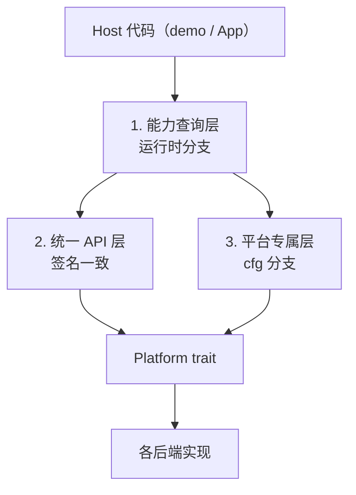

# 平台差异的处理契约

> 回答一个问题：**是不是所有 API 都要包装成统一形式？差异该由谁处理？**

不是。本项目采用**三层**处理，每层职责不同，混用会导致 API 膨胀或静默失败。

## 总览



## 第一层：能力查询 —— 差异在**运行时**暴露

适合"所有平台都有这个概念，但支持程度不同"的能力。

```rust
if rust_widgets::supports_self_drawn() { ... }
rust_widgets::capabilities().native_menu
```

* 签名在所有平台完全一致，**不需要 `cfg`**。
* 不支持的平台返回 `false`，宿主据此降级。
* **禁止**用它来假装支持：`supports_*` 返回 `true` 而实际无效，是本项目明确禁止的
  "假修复"（principle #12）。

**已采用此模式的**：`supports_self_drawn()`、`PlatformCapabilities::native_menu` /
`dpi_scaling` / `ime` / `accessibility`。

## 第二层：统一 API —— 语义相同，实现不同

适合"每个平台都能做，只是底层机制不同"的能力。

```rust
win.new_button("OK", 10, 10, 80, 30);      // macOS NSButton / Windows BUTTON / GTK Button
win.new_menu_bar(0, 0, 800, 26);
win.mount_self_drawn(widget, rect);        // 各后端各自实现
```

* 调用方**完全不关心**平台。
* 差异**必须留在平台代码里**（`src/platform/<os>/`），不能泄漏到签名。
* 后端做不到时**返回 `false` / `Err`**，由第一层的能力查询提前拦住。

## 第三层：平台专属 API —— 用 `cfg` 显式隔离

适合"只有一个平台有这个概念"的能力。

```rust
#[cfg(target_os = "macos")]
fn set_dock_badge(label: &str);
```

* 这类 API **不进** `Platform` trait 的公共面，避免所有后端被迫实现空方法。
* 调用方必须自己 `cfg`。

## 该选哪一层：判断标准

| 问题 | 用哪层 |
|---|---|
| 所有平台都有这个概念，只是支持程度不同？ | 第一层（能力查询） |
| 所有平台都能实现，机制不同？ | 第二层（统一 API）+ 后端内部 `cfg` |
| 只有个别平台存在这个概念？ | 第三层（`cfg` 隔离） |

**反例（不该做的）**：

* 为"只有 macOS 有的 Dock 徽标"加一个 `Platform::set_dock_badge()` 默认空实现
  —— 所有后端被迫带一个永远无效的方法，且调用方无法判断它是否真的生效。
* 把"Linux 没有原生菜单"这件事藏起来，让 `create_menu_bar` 返回一个看起来正常的 id
  —— 宿主会以为菜单能用。正确做法是 `capabilities().native_menu` 返回 `false`。

## 本轮踩到的两个真实案例

### 案例 1：菜单 parent 传错 → 静默无效（已修）

`WindowHandle::new_menu(text, ...)` 原本把 **window** 当 parent 传给
`create_menu`，而 macOS 后端只在 parent 是 `MenuBar` 时才挂载子菜单，
`HandleKind::Window` 分支是个**空实现**。结果：菜单永远不出现，且没有任何提示。

这是第二层的典型错误——统一 API 没有在"做不到"时如实报告。修复：

1. 签名改为 `new_menu(&MenuBarHandle, ...)`，让错误的调用**编译不过**（编译期约束优于运行时检查，principle #29）；
2. 后端遇到 `Window` parent 时打 `log::error!` 并返回 `0`，不再静默。

### 案例 2：鸿蒙无自绘支持 → 如实拒绝（已测）

`HarmonyPlatform` 没有实现 `mount_self_drawn`，因此继承 trait 默认的
`false`。测试 `self_drawn_support_is_refused_until_the_arkui_bridge_exists`
锁住这个契约，确保装 SDK 之前不会有人误以为能用。

## demo 的写法

`demo/code_editor` 的正确跨平台形态：

```rust
// 1. 先查能力，不支持就明确退出（不显示空窗口）
if !rust_widgets::supports_self_drawn() {
    eprintln!("后端 '{}' 不支持自绘控件 ...", rust_widgets::backend_name());
    std::process::exit(1);
}

// 2. 之后全部用统一 API，不出现任何 cfg
win.new_menu_bar(...);
win.mount_self_drawn(...);
```

demo 里**不应出现 `cfg(target_os)`**。目前 `demo/code_editor` 与 `demo/control`
都满足这一点；平台差异全部由 `src/platform/` 消化。

## 现状对照表

| 能力 | macOS | Windows | Linux(GTK) | Harmony |
|---|---|---|---|---|
| 原生菜单栏 | ✅ | ✅ | ✅ | ⬜ 状态树 |
| 工具栏 | ✅ | ✅ | ✅ | ⬜ |
| 状态栏 | ✅ | ✅ | ✅ | ⬜ |
| 自绘控件挂载 | ✅ | ✅ | ✅ | ⬜ 待 SDK |
| `native_menu` 声明 | ✅ | ✅ | 默认 true | `false` |
| `supports_self_drawn` | `true` | `true` | `true` | `false` |
