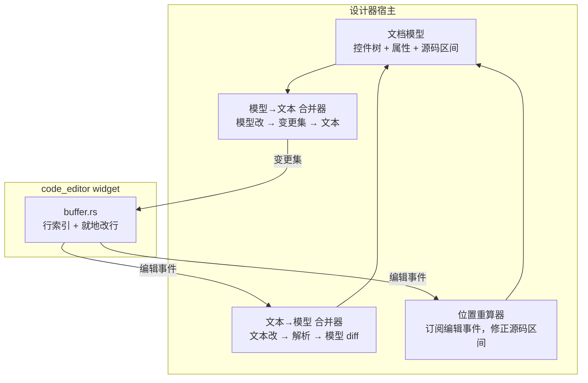
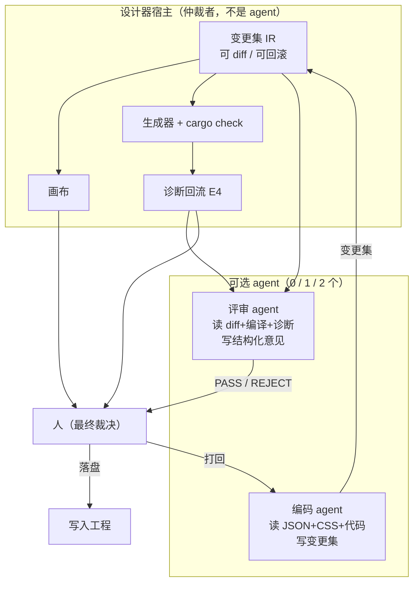

# 设计器白皮书（草案 v0.1）

> 状态：**草案**，尚未评审
> 关联：[`blue19.md`](blue19.md)（事件契约类型化 + 设计器就绪的执行计划）、
> [`principle.md`](principle.md)（项目原则 #1–#101）
> 本文档描述**设计器是什么、为什么这样设计**；`blue19.md` 描述**怎么做**。
>
> **取证说明**：本文所有「本库已具备 X」的陈述均在当前工作树上实跑验证，
> 关键处附命令或在 §6 汇总。**未验证的不写入。**

---

## 1. 一句话定位

**一个 JSON + CSS 的可视化 UI 设计器，产出可编译的 Rust 代码（以及可选的 JSON 运行时），
底层使用 rust-widgets 库。**

它不是运行环境，是**开发工具**：设计器本身永远跑在桌面宿主上，
`mini`/`embedded` 是它的**生成目标**，不是它的运行环境（§5.3）。

---

## 2. 设计目标

| # | 目标 | 判据 |
|---|---|---|
| G1 | **所见即所得**，改一处立即看到 | 反馈延迟毫秒级，不重编译 |
| G2 | **产物是干净的本项目代码** | 生成物可 `cargo build`，无设计器运行时依赖 |
| G3 | **AI 友好** | 反馈回路短；结构可由 AI 生成与修改 |
| G4 | **覆盖全部 profile** | desktop / tablet / mobile / mini / embedded |
| G5 | **不说谎** | 不可用的能力在画布上就标示，不在生成时才失败 |

---

## 3. 为什么是 JSON + CSS

**职责分离**，且与库既有分工一致（实跑取证）：

| 关注点 | 载体 | 本库模块 | 不重叠的证据 |
|---|---|---|---|
| **结构**（有哪些控件、怎么嵌套） | JSON | `src/json/` | — |
| **外观**（颜色、边框、字体） | CSS | `src/style/css.rs` | `grep -c "children\|layout" src/style/css.rs` = `0` |

依赖是**单向的**：`src/json/` 通过 `Widget::apply_css` 调用 CSS 解析器。
所以两者可以独立演进，且 CSS 不会因 JSON 层被移除而消失。

### 3.1 为什么不发明新格式

**JSON + CSS 是 AI 时代的最大公约数**：

- AI 对两者的训练数据量最大，生成质量最高
- 无需为设计器教 AI 一套新语法
- CSS 的样式直觉（选择器、层叠、变量）已被广泛理解

---

## 4. 架构

### 4.1 总览

```
┌─────────────────────────────────────────────────────────┐
│ 设计器（永远跑在 desktop 宿主）                            │
│                                                         │
│  ┌───────────────┐  ┌──────────────┐  ┌──────────────┐  │
│  │ 画布           │  │ 属性面板      │  │ 事件连线      │  │
│  │ (模式 1 预览)  │  │ (PropertySchema)│ │ (EventSchema) │  │
│  └───────┬───────┘  └──────┬───────┘  └──────┬───────┘  │
│          │                 │                 │          │
│          └─────────────────┴─────────────────┘          │
│                            │                            │
│                  ┌─────────▼─────────┐                  │
│                  │ 文档模型 (JSON+CSS) │                  │
│                  └─────────┬─────────┘                  │
│                            │                            │
│                  ┌─────────▼─────────┐                  │
│                  │ 生成器 (多目标)    │                  │
│                  │  ① 查可用控件 (d-1)│                  │
│                  │  ② 解 CSS 内联 (d-2)│                 │
│                  │  ③ 跑布局 (d-3)    │                  │
│                  │  ④ 查容量 (d-4)    │                  │
│                  └─────────┬─────────┘                  │
└────────────────────────────┼────────────────────────────┘
                             │
              ┌──────────────┼──────────────┐
              ▼              ▼              ▼
        ┌──────────┐  ┌──────────┐  ┌──────────┐
        │ desktop  │  │  mini    │  │ embedded │
        │ 产物      │  │ 产物      │  │ 产物      │
        └──────────┘  └──────────┘  └──────────┘
```

### 4.2 两套产物模式（D7）

| 模式 | 产物 | 何时生效 | 适用 profile |
|---|---|---|---|
| **模式 1** | JSON + CSS 资源，运行时加载 | 改文件即生效，**不重编译** | 仅 desktop/tablet/mobile |
| **模式 2** | 生成的 Rust 代码 | 需重新编译 | **全部**（mini/embedded **只能**用这个） |

**技术依据**：`ViewEngine::mount/update` 接受一个 `create: &dyn Fn(&Node) -> Option<ObjectId>`
回调——**它天然是两模式的公共接口**（模式 1 由 JSON 加载器提供，模式 2 由生成代码提供）。
因此两套共存**不需两套架构，只需两个 `create`**。

### 4.3 为什么两套并存，而不是只做一套

| | 模式 1（不重编译） | 模式 2（重编译） |
|---|---|---|
| 代表 | Flutter 热重载、QML 式声明 + 运行时解释、Web | SwiftUI、Compose、React |
| 迭代速度 | **毫秒** | **Rust 重编译（秒到分钟）** |
| 产物干净度 | 需打包解析器 | **纯 Rust** |
| 类型安全 | 运行时校验 | **编译期** |

**「哪个更现代」不是判据**：React 是转代码的却最主流，Web 的 HTML/CSS 是不重编译的却最传统。
两种都大获成功。

真正的判据是三条，且指向不同答案：**迭代速度 → 模式 1；产物干净度 → 模式 2；类型安全 → 模式 2。**

所以**分层**（先例：开发期热重载 + 产物编译，二者分开）：

- **开发期**：模式 1（反馈回路，AI 友好）
- **交付期**：模式 2 可选（去运行时开销，得编译期检查）

**AI 时代把「迭代速度」的权重放大了**——AI 的核心瓶颈是试错次数，模式 1 把每次试错
成本降两个数量级。但也要承认模式 1 的两个真实劣势：AI 易生成「看起来对、跑起来错」的 JSON
（这正是 `blue19.md` 要补 `EventSchema` 的根本理由），且缺结构性约束。

---

## 5. 关键约束

### 5.1 profile 可用性矩阵（实跑取证）

| 能力 | 门控别名 | desktop/tablet/mobile | `mini` | `embedded` |
|---|---|---|---|---|
| `BaseWidget::add_child` | **无** | ✅ | ✅ | ✅ |
| `crate::create_*` | `not(alloc_frugal)`（**118 处**） | ✅ | ⚠️ 多数不存在 | 需逐条核查 |
| `crate::json` | `full_widgets` | ✅ | ❌ | ❌ |
| `crate::view` | `declarative_view` | ✅ | ❌ | ❌ |
| `crate::layout` | **无** | ✅ | ✅ | ✅ |
| capability 表（`EventSchema`） | `full_widgets` | ✅ | ❌ | ⚠️ 部分（静态表） |

**这张表是设计器「兼容多 profile」的事实基础。**

### 5.2 四条硬约束（D7-d）

| # | 约束 | 理由 |
|---|---|---|
| **d-1** | 控件可用性按目标 profile **查询**，不自维护清单 | `embedded` 只支持 **18 个 kind**（`canonical_name_for_kind`），选错则生成物编译失败 |
| **d-2** | CSS 在**生成期**解析并内联为属性赋值 | 目标 profile 无样式引擎；生成物中 `grep "apply_css"` 应为 0 |
| **d-3** | 布局在**生成期**算出常量坐标 | embedded/mini 的 UI 是静态构造，**没有每帧重新求值的调用方** |
| **d-4** | 容量约束在生成期检查并**报错** | `mini` 下 `BaseWidget::children` 定容 **64**（`MiniVec`），超限会静默丢控件 |

### 5.3 d-3 的技术依据（最关键的一条）

D7-d-3 要求「设计器的布局引擎能在生成期独立运行」。**本库已满足**（实跑取证）：

1. `pub mod layout;` **无 cfg 门控**（对比：`json` 受 `full_widgets`、`view` 受 `declarative_view`）
2. 布局层**零平台依赖**（`grep -c "platform::" src/layout/*.rs` → 全部 `0`）
3. 接口是**回调式**（`src/layout/types.rs:54-60`）：

```rust
pub trait Layout {
    fn update(&self, rect: Rect, widgets: &mut dyn FnMut(ObjectId, Rect));
}
```

**布局不需要真实控件存在**，只需 `ObjectId → Rect` 的回调。
⇒ 设计器可在生成期独立算出全部坐标。

**前提**：设计器**必须复用这套 `Layout` trait**，不得自己重写一套布局算法。
否则「设计期所见」与「运行期所得」会漂移——这正是设计器最致命的失败模式。

### 5.4 `mini` 与 `embedded` 不是同一种受限

| | `mini` | `embedded` |
|---|---|---|
| 门控 | `alloc_frugal`（`no_std`） | `embedded_surface` |
| capability 层 | ❌ 整体编译掉 | ✅ 保留，用静态表命名 |
| 控件名解析 | 不存在 | `canonical_name_for_kind`，**仅 18 kind** |

`src/widget/capability.rs:390-395` 的设计依据：

> Returns `""` for an unmatched kind, which the constructor lookup reads as
> "not available in this profile". **Inventing a name here would let the factory build a
> control the profile does not have.**

---

## 6. 取证汇总

| 断言 | 命令 | 结果 |
|---|---|---|
| `src/json` / `src/view` 受门控 | `grep -n "pub mod json\|pub mod view" src/lib.rs` | `full_widgets` / `declarative_view` |
| `src/layout` 不受门控 | 同上 | 无 `cfg` |
| 布局层零平台依赖 | `grep -c "platform::" src/layout/*.rs` | 全部 `0` |
| `create_*` 在 mini 下缺席 | `grep -c "cfg(not(alloc_frugal))" src/lib.rs` | `118` |
| `embedded` 控件集 | `canonical_name_for_kind` 匹配臂 | `18` 个 kind |
| `add_child` 始终可用 | `grep -n "pub fn add_child" -B3 src/widget/base.rs` | 无 `cfg` |
| 事件侧只有字符串 | `src/widget/capability/types.rs` | `events: &'static [&'static str]` |
| 已发布事件数 | `check_capability_events_are_emitted.sh` | 326 pairs / 186 names |
| 信号载荷种类 | `tools/list_event_payload_shapes.py` | 335 声明 / 60 种 |
| JSON 事件路径独立且无门禁 | `grep -rn "on_click" src/json/`；`tools/` 零命中 | 8 个硬编码键 |
| profile 门禁 | `check_view_platform_gate.sh` | EXIT=0 |

---

## 7. 与 `blue19.md` 的关系

| 本文档 | `blue19.md` |
|---|---|
| **是什么、为什么** | **怎么做** |
| 定位、目标、架构、约束 | 任务表（T-A~T-24）、决策项（D1~D7-d）、DoD |
| 稳定的设计意图 | 会随执行演进的计划 |

**执行时以 `blue19.md` 为准**；本文档回答「为什么这么设计」，`blue19.md` 回答「下一步做什么」。

---

## 8. 尚未确定的问题

| # | 问题 | 影响 |
|---|---|---|
| Q1 | 生成器的**输出粒度**：每个窗口一个 `.rs`，还是每控件一个？ | 影响可读性与增量编译 |
| Q2 | **生成物是否入库**（committed）？ | 入库便于 review；不入库避免漂移 |
| Q3 | **事件连线的目标**只限属性，还是也能调命令？ | 决定类型兼容表规模（`blue19.md` D6） |
| Q4 | 设计器**是否支持自定义控件**（用户自己写的 Widget）？ | 影响控件注册与代码生成 |
| Q5 | **多窗口 / 多页面**如何表达？ | 影响文档模型 |
| Q6 | 是否需要**版本迁移**（设计器升级后旧 JSON 仍可打开）？ | 影响 JSON 格式设计（须留版本字段） |
| Q7 | **代码编辑器**：生成物「整份可编辑」还是「只有属性值可编辑」？ | 决定它是文本编辑器还是结构化编辑器——**已由 §12.5.1 回答** |
| Q8 | 用户改代码后，是**整体重新生成**还是**增量打补丁**？ | 同上——**已由 §12.5.1 回答** |

---

## 9. 明确不做

1. **不做可视化布局的「绝对自由拖拽」**——坐标必须能被 `Layout` trait 表达，
   否则 d-3 无法在生成期算死。
2. **不在嵌入式设备上跑设计器**——设计器是桌面工具。
3. **不发明新的 UI 描述语言**——用 JSON + CSS（§3.1）。
4. **不让设计器自己实现布局算法**——必须复用 `Layout` trait（§5.3）。
5. **不生成会静默丢控件的代码**——容量超限必须报错（d-4）。

---

## 10. 从前 9 节得到的结论

**设计器具备三个已在本库验证的立论基础：**

1. **结构 + 外观的分离**已有（`src/json` + `src/style/css`，单向依赖）；
2. **两套模式的公共接口**已有（`ViewEngine` 的 `create` 回调）；
3. **生成期算布局的能力**已有（`src/layout` 无门控、无平台依赖、回调式接口）。

**而这个阶段的最小前置是：事件侧的类型化契约**（`blue19.md` 步骤 1）。
没有它，属性面板能显示控件有哪些属性，却说不清事件带来什么值——连线无法校验，JSON 无法表达映射。

§11 起进入代码编辑器与 AI 协作两条线；**全书的最终结论与执行入口统一在 §13**。

---

## 11. 代码编辑器：最终方案

> 本节回答：「设计器里的代码编辑器，边界在哪，扩展路线是什么，最终方案是什么」。
> **取证说明**：§11.2 的缺陷逐条读取源码确认（附 `file:line`）；
> §11.5 的性能数字、§11.6 的规模数字均由探针实跑得到，命令见各节。

---

### 11.1 定位：它是设计器的**一个视图**，不是通用编辑器

设计器需要代码视图，因为它要回答一个 JSON 面板回答不了的问题：
**「这段界面，到底会生成什么 Rust」**（§2 G5「不说谎」）。

因此它服务的对象是**本设计器的生成物**，不是任意工程。这个定位决定了下面全部取舍：

> **判据是「设计器用得上」，不是「某个编辑器有」。**

推论（贯穿全节）：

| 取舍 | 理由 |
|---|---|
| 凡通用编辑器有、而设计器用不上的能力，**不做** | 那些能力是数十万行量级的子系统群 |
| 凡设计器特有、而通用编辑器结构上不可能有的，**优先做** | 见 §11.4 的 E1–E4 |
| widget 只拥有**视图**；宿主拥有**系统** | 见 §11.3 |

---

### 11.2 现状与阻塞项（逐条取证）

`src/widget/special_widgets/code_editor/` 共 **8 222 行**，模块划分清晰
（`types`/`syntax`/`buffer`/`multicursor`/`pairs`/`editor`/`input`/`render`），
并已声明三处插件接缝：`SyntaxHighlighter`、`CompletionSource`、`DiagnosticMarker`。

**接缝的形状是对的**（`DiagnosticMarker` 与 `CompletionSource` 都是「宿主推入」，见 §11.3），
但 `SyntaxHighlighter` 有一个**阻塞性缺陷**，必须最先修：

```rust
// syntax.rs:45
fn highlight_line(&self, line: &str) -> Vec<TokenSpan>;
```

这个签名表达的是**「每行独立、无状态、纯函数」**。而真实语法高亮**本质是有状态的**——
块注释、多行字符串都跨行。只给一行文字，**无法判定第二行是否仍在一段字符串里**。

由此连带四条事实（均为源码取证）：

| # | 事实 | 位置 | 后果 |
|---|---|---|---|
| C1 | 无「行起始状态」入参，也无「行尾状态」出参 | `syntax.rs:45` | **跨行结构高亮必然错误**，任何真引擎都装不上 |
| C2 | 逐行 `Vec::new()` | `editor.rs:2896` `tokens_on_line` | 一屏 50 行 = 每帧 50 次分配 |
| C3 | 在 `draw` 路径上同步调用 | `editor.rs:2898` | 长文件全量重算，卡帧 |
| C4 | `Box<dyn SyntaxHighlighter>` 无 `Send + Sync` | `editor.rs:143` | **不能放后台线程做增量解析** |

**C1 与 C4 是「接真语法引擎」现在物理上走不通的原因**——不是没接，是接口容不下。

---

### 11.3 分层：什么属于 widget，什么属于宿主

`code_editor/mod.rs` 已写明这条边界（原文引述）：

> | Concern | Where it belongs |
> |---|---|
> | Tree-sitter grammar / real incremental parsing | `plugin: syntax` crate |
> | Syntax highlight themes & semantic tokens | `plugin: theme` crate |
> | LSP client (completion, hover, diagnostics, goto) | `plugin: lsp` crate |
> | DAP / terminal / language REPLs | `plugin: debug` crate |
> | Multiplayer (CRDT), collaboration | `plugin: collab` crate |
> | File-system, workspace, VCS integration | host application |

**这条判断成立，且要在实现时严格执行。** 特别地，**LSP 不得进入 widget**，理由是架构而非工作量：

| 理由 | 说明 |
|---|---|
| **同步 vs 异步** | LSP 是异步 + 多进程 + 有 I/O；widget 的 `draw`/`handle_event` 是同步的 |
| **一个实例服务整个工程** | 设计器必须让**同一个**语言服务器同时服务代码视图与「跳到定义」，两个实例会各持一份不一致的状态 |
| **跨文件** | LSP 的能力（跳转、重命名、诊断）本质跨文件，而一个 widget 只看得见自己那份文本 |

正确形状（**宿主拥有系统，widget 拥有视图**）：

```
设计器宿主
  ├─ DocumentStore      文件模型、脏标记
  ├─ LspClient          单实例，工程级
  └─ CodeEditor widget
        ├─ tree-sitter 高亮    进程内，纯计算（非 I/O）
        ├─ DiagnosticMarker    由宿主从 LSP 推入   ← 接缝已有
        └─ CompletionSource    由宿主代理到 LSP      ← 接缝已有
```

**同一条原则也适用于 AI**（§12.6 第 9 条）：网络、密钥、重试、流式响应都是宿主职责。

---

### 11.4 设计器特有：这才是应当投入的方向

通用编辑器的能力已被成熟产品做到极致，追不上也不必追。
**设计器需要的是它们在结构上给不了的东西**——它们全部依赖
「生成器知道每个控件对应哪段源码」这一事实（§4）。

| # | 能力 | 为什么设计器需要 | 现有接缝 |
|---|---|---|---|
| E1 | **UI ↔ 代码双向定位** | 点画布上的控件 → 代码跳到它的构造处；点代码 → 画布选中该控件 | **需新接缝**：源码 span ↔ 控件 id 映射 |
| E2 | **属性级编辑** | 选中控件 → 只显示它那一段；改属性 → 只重写那几个 token | **需结构化编辑 API**（现仅文本 API） |
| E3 | **生成区只读保护** | 生成器产出的部分不应手改（会被覆盖） | **需区间保护** |
| E4 | **诊断回流到画布** | 编译错误直接在控件上标红 | `DiagnosticMarker` 可复用，但**需映射到控件** |

E1 与 E4 是**同一件事的两面**：都需要「源码位置 ↔ 控件 id」这张映射表，
而生成器在生成时就拥有它。

**在 AI 目标下（§12），E1–E4 从「加分项」升级为「必需基础设施」**——
它们是 agent 唯一能理解画布的通道。

---

### 11.5 存储层选型：三种结构，一个结论

> 探针：`examples/probe_splice_cost.rs`（现状）、`examples/probe_line_vec_cost.rs`（替代方案原语）。
> 命令：`cargo run --release --example probe_splice_cost`。

#### 11.5.1 现状的真实代价（实测）

`EditorModel::splice`（`buffer.rs:184`）每次都 `full_text()` → 拼新串 → `set_text` 重新分行。
这是 **O(文件)** 的整篇重建，而一次按键本应是 **O(行)**。

单次按键插入一个字符（release 构建，40 字节/行的真实 Rust 源码）：

| 文档规模 | 现状 splice | 其中 `full_text()` |
|---|---|---|
| 1 000 行 | **35.0 µs** | 3.2 µs |
| 10 000 行 | **359.7 µs** | 30.1 µs |
| 50 000 行 | **1991.4 µs** | 177.4 µs |

**线性，斜率 40 ns/行。** 结论：

* 设计器生成的 `.rs` 在 **1 000–5 000 行**量级 → 单键 35–180 µs，**可接受**（16.7 ms 预算的 1.1%）；
* **10 000 行起**（360 µs/键）开始压掉每帧 2% 的预算，且发生在 UI 线程；
* **50 000 行**（2 ms/键）**就是卡的**。

#### 11.5.2 三种结构对比

| 维度 | `ropey` crate | 自研 skip-list | 行索引（现状 + 就地改行） |
|---|---|---|---|
| 形态 | B-tree of leaf chunks（叶 ~1 KB） | 概率平衡多层链表 | `Vec<String>`，一行一个 `String` |
| 随机访问第 k 字节 | O(log n) | O(log n) 期望 | **O(1)**（已知行号时） |
| 在中间插入 | O(log n) | O(log n) 期望 | 改行 O(行内)；插/删**行** O(n) memmove |
| 缓存局部性 | 中（B-tree 叶连续，尚可） | **差**（指针跳，skip-list 的已知弱点） | **好**（行内 `String` 紧凑） |
| 代码量 | 0（依赖） | 2 000–4 000 行 | **0**（改造现有 356 行） |
| `no_std` + `alloc` | ✅ `default-features = false` | ✅ | ✅ 现在就是 |
| `unsafe` | **有** | 可选（用 `SafeCell` 可免） | **无** |
| 与本库原则 #28–#34 | 冲突（「No `unsafe`」） | 可控 | **完全一致** |
| 量级适配 | 为 **GB 级**文档设计 | 为 **GB 级**文档设计 | **为 1–50 万行设计** |

#### 11.5.3 替代方案的原语成本（实测）

| 文档规模 | 行内改一个字符 | `Vec<String>` 中间插/删一行 | 全量 `join` |
|---|---|---|---|
| 1 000 行 | 0.01 µs | 0.19 µs | 3.4 µs |
| 10 000 行 | 0.01 µs | 2.48 µs | 33.9 µs |
| 50 000 行 | 0.01 µs | 16.91 µs | 166.8 µs |
| 100 000 行 | **0.01 µs** | 37.65 µs | 280.9 µs |

**「行索引 + 就地改行」比现状快 36×（50 000 行时 1991 µs → 17 µs 上界）**，
且 `Vec::insert` 的 memmove 要到 50 000 行才进入 17 µs 量级——那时每帧也只做**一次**。
O(log n) 在这里换来的是 0.01 µs 与 0.001 µs 的区别，即**用户感知不到的差异**。

#### 11.5.4 结论与选型

**不引入 `ropey`，不自研 skip-list。选「行索引 + 就地改行」。**

| 判据 | 事实 |
|---|---|
| 量级不匹配 | 通用 rope 结构解决的是「任意**字节偏移**处的 O(log n) 插入」；本库的坐标轴只有「行 + 列」，行索引是 O(1)，rope 的 O(log n) 反而**更慢**（§15.3 实测 0.018 vs 0.010 µs）|
| `unsafe` 冲突 | `ropey` 带 `unsafe`，与本库 `code_editor/mod.rs:58` 的「no `unsafe`」+ 原则 #28–#34 正面冲突；自研可免 `unsafe`，但那正是要花 3 000 行去避免的东西 |
| 依赖面 | 新增依赖要过 `check_profiles.sh`、`check_behavior_matrix.sh`，且须在 `mini`/`embedded` 成立；行索引方案**零新增依赖** |
| **修不了真瓶颈** | §15.2：真实瓶颈是 `find_all` 的全文件扫描与每键两次整篇克隆——**rope 一个都修不了** |

> **⚠️ 本节结论在 §15 被加强，但理由被修正。**
> §11.5.1 只看 `splice` 就说「35–180 µs 可接受」，那**不完整**：
> 一次按键的真实成本是它的 2.5–3.6 倍（§15.2）。
> **「不用 rope」的结论成立，但依据是「瓶颈不在存储结构」（§15.4）。**

#### 11.5.5 同时要做的一件事：惰性镜像

现状的 `full_text()` + `Rc<RefCell<String>>` 镜像（`buffer.rs:33`，为复用 undo 命令）
**不应每键都做**。做法是把镜像改成**惰性**：仅当真正需要整篇文本时
（保存 / 复制全文 / undo 快照边界）才 `join`。这一步与选型无关，**现在就该做**。

| 半 | 内容 | 依赖 |
|---|---|---|
| 2a | 编辑原语改为「就地改行 + 仅在跨行时拆/合」 | 独立于步 1 |
| 2b | `Rc<RefCell<String>>` 镜像改为惰性 `join` | 独立于一切 |
| **2c** | **`find_all` 不再每键扫全文**（§15.5 的 B5）——**收益最大，§11.5 漏列** | 独立于一切 |

---

### 11.6 规模参照：为什么「对齐通用编辑器」不可行（实测）

> 所有行数由 `find <dir> -name '*.rs' | xargs wc -l` 实跑得到。
> 此处**只列同类系统的量级**，用于判断「什么该做、什么不该做」。

一个成熟的通用代码编辑器产品，其相关部分的行数量级：

| 部件 | 行数 |
|---|---|
| 编辑器本体 | **182 918**（60+ 个顶层文件） |
| UI 框架（编辑器所依赖） | 85 175 |
| 语法/语言集成层 | 27 930 |
| 多缓冲区 | 17 707 |
| 坐标转换 | 6 746 |
| 文本存储（rope） | **4 132** |
| 显示映射层（9 个 map：fold / wrap / tab / inlay / block / crease / invisibles / highlights / dimensions） | 16 217 |

**对照本项目**：`src/` 全量（180 个控件）395 436 行，`code_editor/` **8 222 行**。

三条读数：

1. **编辑器本体一个部件的行数（182 918）超过本项目整个控件库的一半。**
   「达到通用编辑器的全部能力」在量级上即不可行。
2. **真正的成本在「本体 + UI 框架 + 语言集成」三块**（合计 296 023），
   而**文本存储只占 4 132**。这印证 §11.5.4：数据结构不是重点。
3. **量级差不是工作量问题，是层次问题。** 那些能力分布在几十个独立 crate 里
   （成熟产品的 `crates/` 有 248 个），**任何一个 widget 都拥有不了**。

**该抄的是「显示映射层」这个架构思路**（见 §11.7.4 步 4）：把「文档坐标 → 屏幕坐标」
显式建模成一等对象，而不是在渲染代码里逐处手算偏移的复合。

---

### 11.7 最终方案（定稿）

#### 11.7.1 总判断

**本项目的代码编辑器不自建通用编辑器，只做「设计器的代码视图」。**

判据是 §11.6 的量级表 + §11.4 的差异化分析：
通用能力已被成熟产品做到极致且代价是数十万行；而**设计器特有的能力
（E1–E4）它们结构上给不了**，因为生成器在生成时就拥有「源码位置 ↔ 控件 id」映射表。

#### 11.7.2 目标形状

```
code_editor widget（保持 8 000 行量级，不膨胀）
  ├─ buffer.rs      ← 改造：就地改行 + 惰性 join（§11.5.5）
  ├─ syntax.rs      ← 改造：跨行状态 + Send+Sync + 状态缓存（步 1，唯一硬前置）
  ├─ render.rs      ← 改造：抽出坐标映射层（§11.6 的架构借鉴）
  └─ 插件接缝        ← 已存在：SyntaxHighlighter / CompletionSource / DiagnosticMarker

设计器宿主（新增，不进 widget）
  ├─ 文档模型        控件树 + 属性 + 每节点的源码区间
  ├─ 变更集 IR       结构化、可 diff、可回滚（§12.3）
  ├─ 双向合并器      模型→文本 / 文本→模型（§12.4）
  ├─ 位置重算器      订阅编辑事件，修正源码区间   ← E1/E4 的地基
  └─ LspClient      工程级单实例（§11.3）
```

#### 11.7.3 双向合并器（本设计器的核心机制）

**这是本设计器当前完全缺失的部分，也是 §8 的 Q7/Q8 的技术答案。**
它不是「选文本编辑器或结构化编辑器」的二选一，而是**两个方向的合并器 + 一个位置重算器**：



**三个要点：**

1. **两个方向是分开的合并器，不是一个人做两件事。**
   模型侧（模型 → 变更集队列 → 一次性落到文本）与文本侧（文本 → 解析 → 与模型 diff）
   必须是**两个独立单元**。混在一起做，必然陷入「谁先谁后」的循环触发。
2. **必须有一个显式的位置重算器。**
   它订阅编辑事件（`replaced(offset, old_len, new_len)` / `moved(...)`），维护脏区间，
   编辑完修正各节点的源码区间。**没有这个，E1（UI↔代码双向定位）就不成立**——
   这正是 §11.4 说的「E1 与 E4 是同一件事两面，都需要映射表」。
3. **编辑接口应是抽象接口，含批事务。**
   `replace` / `move` / `indent` + `start_group` / `flush_group` / `commit_group`。
   批量改属性时避免每改一个就重排版一次。

#### 11.7.4 执行顺序（按依赖，不可跳步）

| 步 | 内容 | 前置 | 量级 | 属于 |
|---|---|---|---|---|
| **0** | 定 agent 边界：谁有写权限、什么必须问人（§12.5） | — | 决策 | — |
| **1** | 修 `SyntaxHighlighter` 接缝（跨行状态 + `Send + Sync` + 状态缓存） | — | ~200 行 | widget |
| **2** | **变更集 IR + 双向合并器 + 位置重算器** | 步 0 | ~2 000 行 | **宿主** |
| **3a** | `buffer.rs` 编辑原语改为就地改行 | 独立 | ~150 行 | widget |
| **3b** | `Rc<RefCell<String>>` 镜像改惰性 join | 独立 | ~50 行 | widget |
| **4** | `render.rs` 抽出坐标映射层 | 独立 | ~300 行 | widget |
| **5** | 编译驱动 + 诊断回流（E4） | 步 2 | ~400 行 | 宿主 |
| **6** | UI ↔ 代码双向定位（E1） | 步 2 | ~500 行 | 宿主 |
| **7** | 接真语法引擎（默认高亮 + 结构来源） | 步 1 | 独立 crate | 插件 |

**步 0 与步 1 可立即开始，互不依赖。步 2 是宿主侧所有能力（含 AI）的公共地基。**

#### 11.7.5 明确否定的路线

| 路线 | 判定 | 证据 |
|---|---|---|
| 追求「通用编辑器的全部能力」 | **否定** | §11.6：编辑器本体一个部件 182 918 行 > 本项目整个控件库的一半，且站在 85 175 行 UI 框架之上 |
| 引入 `ropey` / 自研 skip-list | **否定** | §11.5：量级差 3 个数量级 + `unsafe` 冲突 + 零依赖即可达成 36× 提升 |
| 把 LSP 放进 widget | **否定** | §11.3：同步 vs 异步、一个实例服务整个工程、跨文件 |
| 抄编辑器的子系统群（git / inlay / 补全预测 / 协作） | **否定** | §11.6 第 3 条：它们是几十个独立 crate |
| **抄「显示映射层」的架构思路** | **肯定** | §11.6；解决 `render.rs` 的重复手算 |
| **自建双向合并器 + 位置重算器** | **肯定** | §11.7.3；这是 E1/E4 与 AI 变更集落地的唯一路径 |

---

### 11.8 与 §9「明确不做」的关系

沿用同一原则，代码编辑器一侧补三条：

6. **不在 widget 内实现 LSP / DAP / 协同**——它们是宿主或独立 crate 的职责（§11.3）。
7. **不追求与通用编辑器功能对齐**——判据是「设计器用得上」，不是「某个产品有」（§11.1）。
8. **不让高亮成为帧的瓶颈**——高亮必须在后台线程，`draw` 只读缓存（C2/C3/C4 的教训）。

---

## 12. AI 辅助 / AI 自动的开发设计器

> **本节是全书的落点。** §1–§11 描述的是**手工**设计器；
> 目标加入 AI 之后，**设计器的消费者从「人」变成「agent + 人」**，
> 这一节说明它改变了什么、什么必须因此提前。

---

### 12.1 定位与运行模式

**设计器是一个 AI 辅助 / AI 自动的开发工具，内置可选的协作 agent。**

关键设计：**agent 是可选增强，不是必需组件。**

| 模式 | 启用 | 行为 |
|---|---|---|
| **M0 人工** | 未配置任何 agent | 全部操作由人完成——画布拖放、属性编辑、代码视图。**这是基线，必须始终可用** |
| **M1 单 agent（编码）** | 只配置编码 agent | agent 提出变更，**人评审** |
| **M2 双 agent** | 编码 + 评审都配置 | agent 提出变更，第二个 agent 先评审，人来裁决 |

**三条由 M0 推出的硬性设计约束：**

| # | 约束 | 理由 |
|---|---|---|
| **M-1** | **全部功能在 M0 下可用** | agent 是可选增强。任何「只有 agent 能用」的功能都是设计错误 |
| **M-2** | **agent 数量可配置**（0 / 1 / 2 / 更多） | 用户已有配置：只设编码 agent 只设评审 agent 不设都合法 |
| **M-3** | **人的裁决权始终最高** | agent 只能提出与评审，不能替代人做最终决定 |

**这条 M-1 决定了一件事**：§11.7.3 的双向合并器与位置重算器**不是为 AI 做的**，
它们服务的是「模型 ↔ 代码」的一致性——**人手改代码时同样需要**。
AI 只是让它从「锦上添花」变成「不可省略」。

---

### 12.2 agent 改变了什么（优先级的重排）

| 维度 | 手工设计器（§1–§11） | 加入 agent 之后 |
|---|---|---|
| 主要操作者 | 人的鼠标/键盘 | **agent 的工具调用** |
| 输出粒度 | 每次一个属性 | **一次一整个可评审的变更集** |
| 正确性来源 | 人的眼 | **可选的第二个 agent 的评审** → 需要可评审的中间表示 |
| 反馈回路 | 画布立即更新 | **画布 + 编译结果 + 评审意见** 三者 |
| 最关键的能力 | 所见即所得 | **可验证、可回滚、可评审的结构化产物** |

**结论：AI 目标不与前 11 节冲突，反而把 §11.4 的 E1–E4
从「差异化加分项」提升成「必需基础设施」。**

---

### 12.3 变更集 IR —— 这套架构的枢纽

现状 `src/json/`（8 文件，6 008 行）描述的是**文档状态**；
而 agent（以及「撤销」「评审」「增量重生成」）需要的是**文档的变更**。两者不是一回事：

| | 文档状态（现有） | 变更集 IR（需新增） |
|---|---|---|
| 形状 | 整棵控件树的 JSON | 操作序列：`AddNode` / `SetProperty` / `MoveNode` / `RemoveNode` |
| diff | 需要两个状态对比 | **本身就是 diff** |
| 回滚 | 存整份副本 | 逆操作 |
| 评审 | 看两份 JSON 找差异 | **直接读变更列表** |
| 与 §11.7.3 的关系 | 文档模型 | **正是「模型→文本 合并器」的输入** |

**变更集 IR 是四个功能的公共地基**：agent 提议、人评审、撤销、增量重生成。

---

### 12.4 agent 协作架构



**三条不可违反的约束：**

| # | 约束 | 理由 |
|---|---|---|
| **A-1** | agent 的产物必须是**结构化的变更集**，不是直接改文件 | 否则评审无从 diff，回滚无从执行，人无从介入 |
| **A-2** | **宿主是仲裁者，不是第三个 agent** | 谁有写权限、什么能落盘、什么必须问人——必须是**确定性代码**，不能交给 LLM |
| **A-3** | 评审 agent 的输出是**结构化的**，不是自由文本 | 「PASS/REJECT + 位置 + 规则 + 证据」才能被程序消费；散文评论只能给人看 |

**两个 agent 的能力需求不同：**

| 能力 | 编码 agent | 评审 agent | 本库现状 |
|---|---|---|---|
| 结构化变更集 | 写 | 读 | ❌ 需新增（§12.3）|
| 编译与诊断 | 触发 | 读 | ⚠️ 需宿主调 `cargo check`；E4 待做 |
| 源码定位 | 写（声明位置）| 读（指出问题行）| ❌ 需新增（§11.7.3 位置重算器）|
| 变更 diff 显示 | — | **需要** | ✅ `diff_viewer.rs` 450 行 **已有** |
| 表达式/Markdown 渲染 | 输出解释 | 输出解释 | ✅ `markdown_editor.rs` 494 行 **已有** |
| 进程输出 / 构建日志 | 触发构建 | 读日志 | ✅ `terminal_view.rs` 564 行 **已有** |
| 结构化意见协议 | — | 写 | ❌ 需新增（A-3）|
| **评审规则库** | — | 查 | ✅ `principle.md` **101 条成文规则**，现成可用 |

**两条读数：**

1. **显示层三个控件本库都已具备**，且都是独立控件。缺的全是**协议与仲裁**——属宿主，不属 widget（§11.3 同一原则）。
2. **本项目有独有的评审资产**：`docs/plans/principle.md` 的 101 条成文规则 +
   `docs/log/` 的逐轮取证记录，可直接作为评审 agent 的**规则库与示例库**，无需从零构建。

---

### 12.5 agent 边界（步 0 的产出）

这是**决策清单**，不是代码。**A-2 要求它由确定性代码执行。**

| 操作类别 | 默认权限 | 理由 |
|---|---|---|
| 改画布上的控件属性 | **agent 可自主**（M1/M2 下） | 可逆、无副作用、有变更集记录 |
| 增删控件节点 | **需评审通过** | 影响布局与生成代码结构 |
| 修改生成的 Rust 代码 | **agent 只读**（§12.6 Q7） | 会被下次生成覆盖 |
| 修改手写区（非生成区） | **需人确认** | 无生成器保护 |
| 落盘写文件 | **仅人可触发** | A-2 |
| 运行 `cargo check` | **agent 可自主** | 只读，且是反馈回路的一部分 |
| 新增依赖 / 改 `Cargo.toml` | **必须人确认** | 影响全部 profile 与门禁 |

#### 12.5.1 对 §8 两个悬置问题的回答

| # | 问题 | 答案 | 依据 |
|---|---|---|---|
| **Q7** | 生成物「整份可编辑」还是「只有属性值可编辑」？ | **生成区只读 + 属性区可编辑**（E2/E3） | A-1 要求 agent 改的是变更集而非文本；且生成区手改会被覆盖 |
| **Q8** | 改代码后「整体重新生成」还是「增量打补丁」？ | **必须增量** | 变更集天然是增量的；整体重生成会让评审无从定位（A-1/A-3） |

**这两个答案反过来确认了 §11.7.3 的双向合并器是必需的**，而不是可选的。

---

### 12.6 明确不做的（AI 侧）

沿用 §9 / §11.8 的同一原则，再补三条：

9. **不在 widget 内实现 LLM 调用**——网络、密钥、重试、流式响应都是宿主职责（§11.3 同构）。
10. **不让 agent 直接写文件**——一律走变更集 IR（A-1）。这是唯一能保证可回滚的方式。
11. **不把 agent 设为必需**——M0 人工模式必须始终完整可用（M-1）。

---

## 13. 结论（最终）

**设计器的核心不是「画界面」，而是「把界面描述编译成可运行的本项目代码」，
并让这个过程可被 agent 辅助、可被评审、可被回滚。**

它的立论基础已在本库中得到验证：

1. **结构 + 外观的分离**已有（`src/json` + `src/style/css`，单向依赖）；
2. **两套模式的公共接口**已有（`ViewEngine` 的 `create` 回调）；
3. **生成期算布局的能力**已有（`src/layout` 无门控、无平台依赖、回调式接口）；
4. **代码视图的三个显示控件**已有（`code_editor` / `diff_viewer` / `markdown_editor` / `terminal_view`）；
5. **评审规则库**已有（`principle.md` 101 条）。

**真正缺的是三件事，且有严格顺序：**

| 序 | 缺什么 | 属于 | 阻塞谁 |
|---|---|---|---|
| 1 | **事件侧的类型化契约**（`blue19.md` 步骤 1） | 库 | 连线无法校验、JSON 无法表达映射 |
| 2 | **`SyntaxHighlighter` 接缝的行状态**（§11.2 C1/C4） | widget | 跨行高亮错误；真语法引擎装不上 |
| 3 | **变更集 IR + 双向合并器 + 位置重算器**（§11.7.3/§12.3） | 宿主 | agent 提议、评审、撤销、增量重生成全部 |

**第 3 项是 AI 目标的公共地基。** 在它之前接 agent，等于让 LLM 直接改文件——
没有 diff、没有回滚、没有评审依据（A-1/A-3）。

**执行入口：§11.7.4 的步 0 与步 1 可以立即开始，互不依赖。**

---

## 14. code_editor 的最终改动清单与三种使用形态

### 14.1 最终改动清单（逐项，含位置与量级）

**总原则：widget 保持 8 000 行量级，不膨胀。** 所有「系统级」能力进宿主。
改动分三类：**① 契约修正**（必须，因为接口容不下真引擎）、
**② 性能修正**（实测有据）、**③ 新形态支持**（为 §14.2 的双模式）。

#### 类 ①：契约修正（不改则真引擎装不上）

| # | 改动 | 位置 | 量级 | 为什么必须 |
|---|---|---|---|---|
| **A1** | `SyntaxHighlighter` 增行起始状态入参 + 行尾状态出参 | `syntax.rs:39-51` | ~40 行 | **C1**：现签名是「每行独立纯函数」，跨行结构（块注释、多行字符串）**必然高亮错误** |
| **A2** | `Box<dyn SyntaxHighlighter>` 加 `Send + Sync` | `editor.rs:143`、`mod.rs` 导出 | ~10 行 | **C4**：现在**不能放后台线程**；不改则增量解析无从谈起 |
| **A3** | 行状态缓存（每行的起始状态按行号缓存） | `editor.rs` / 新增小模块 | ~120 行 | **C2/C3**：现在每帧逐行 `Vec::new()`（`editor.rs:2896`）且在 `draw` 里同步算（`editor.rs:2898`） |
| **A4** | 可编辑性分层：`ReadOnly` 区间（生成区）与可编辑区间 | `types.rs`（`CodeEditorConfig`）+ `editor.rs` 所有变更入口 | ~180 行 | **E3 + Q7**：生成区只读、属性区可编辑（§12.5.1）。**这是新形态，现完全缺失** |
| **A5** | 语言按 buffer 生效（现 `EditorBuffer.language` 存了但活动缓冲区不切换）| `buffer.rs` / `editor.rs` | ~60 行 | §14.2 多标签多语言的前提；现字段 `types.rs:412` 是**存而不生效** |

**A1 + A2 是 §11.2 的 C1/C4，是唯一的硬前置。**

#### 类 ②：性能修正（实测有据，§11.5 / §15 / §16）

| # | 改动 | 位置 | 量级 | 实测收益 |
|---|---|---|---|---|
| **B6** | **minimap 改缓存 + 增量补丁** | `render.rs:1001-1044` | ~150 行 | **唯一会死机的一项**：1M 行 10.5 ms/帧 → 常数（§16.2/§16.3）|
| **B1** | 编辑原语改为「就地改行；仅跨行编辑才拆/合」 | `buffer.rs:184` `splice` | ~150 行 | 50 000 行时 **3280 µs → ≤17 µs（193×）** |
| **B2** | `text: Rc<RefCell<String>>` 镜像改**惰性** `join` | `buffer.rs:33` + undo 路径 | ~50 行 | 去掉**每键两次**整篇 `String` 克隆（`editor.rs:487`、`507`）|
| **B5** | **`find_all` 不再每键扫全文** | `editor.rs:1806` `refresh_derived_state` → `2423` `recompute_match_cache` | ~120 行 | **实测最大单项**：10 000 行时 1739 µs/键（§15.2）|
| **B7** | 大文件分级降级 + 打开时提示 | 新模块 + `types.rs` 配置 | ~200 行 | §16.5；「不说谎」的直接推论 |
| **B8** | undo 快照改**按区间**而非整篇克隆 | `editor.rs:509` + `TextSnapshotCommand` | ~180 行 | 1M 行时避开 1.3 ms/次（§16.1）|
| **B3** | 抽出坐标映射层（文档坐标 ↔ 屏幕坐标） | `render.rs:1473` | ~300 行 | 消除折行/折叠/滚动偏移的**逐处重复手算**（§11.6 架构借鉴） |
| **B4** | 视觉行 **反查**（屏幕行 → 源行） | `render.rs` + `types.rs` `RowSpan` | ~80 行 | 现只有顺查；反查是命中、光标、E1 定位的前提 |

#### 类 ③：新形态支持（§14.2）

| # | 改动 | 位置 | 量级 | 服务于 |
|---|---|---|---|---|
| **D1** | `SyntaxHighlighter` 可**按语言**注册表 | `syntax.rs` + `mod.rs` | ~80 行 | 三个视图用不同语言 |
| **D2** | 结构感知命令的**优雅降级** | `editor.rs` | ~60 行 | 语言无语法支持时，缩进/注释/配对退回朴素行为，**不静默出错** |
| **D3** | 同一 widget 的**多实例**协作约定（宿主串联滚动/光标）| 文档 + 少量 getter/setter | ~70 行 | 分栏对照 |

#### 明确**不改**的（保持 widget 边界，§11.3）

| 不改 | 理由 |
|---|---|
| LSP 客户端 | 异步/多进程/跨文件；宿主职责 |
| 真语法引擎的集成 | 独立插件 crate（步 7）|
| git / 协作 / 调试器 | 各自是独立子系统 |
| 文本存储换 rope | §11.5.4 / §15 / §16.6 已定量排除 |
| LLM 调用 | 网络/密钥/流式都是宿主职责（§12.6 第 9 条）|

#### 顺序与总量

| 批次 | 内容 | 前置 | 累计量级 |
|---|---|---|---|
| **批 1** | A1 A2 A3（修高亮接缝）| — | ~170 行 |
| **批 2** | B1 B2 **B5**（存储层 + 查找扫描）| 独立 | **~320 行** |
| **批 2.5** | **B6 B7 B8**（大文件：不死机 + 降级 + 快照）| 独立 | **~530 行** |
| **批 3** | A4 A5 D1 D2（多形态与多语言）| 批 1 | ~380 行 |
| **批 4** | B3 B4（坐标映射层）| 独立 | ~380 行 |
| **批 5** | D3（多实例约定）| 批 4 | ~70 行 |
| **宿主侧** | 变更集 IR + 双向合并器 + 位置重算器 + LSP | §12.5 | ~2 000 行（**不在 widget**）|

**合计 widget 侧约 1 850 行**——即 8 222 → 约 10 100 行，仍在同一量级。

---

### 14.2 三种使用形态：可行，且已被同一份设计覆盖

用户提出：**编辑器要双模式——设计器 / 独立编辑器；且编辑器支持其他语言高亮。**

**结论：可行，不需要第三套架构。** 三种形态共用同一个 widget 与同一批接缝，
差异只在**宿主如何组装**：

| 形态 | 画布 | 代码视图语言 | 语言引擎 | 变更集 ID | 关键能力 |
|---|---|---|---|---|---|
| **① 设计器** | 有 | **生成的 Rust** | Rust 语法引擎 | 需要 | E1–E4（UI↔代码定位、属性级编辑、只读生成区、诊断回流）|
| **② 独立编辑器** | 无 | **任意语言** | **按语言选** | 不需要 | 全部标准编辑能力（已具备）|
| **③ 分栏对照** | 可选 | 同一文件 | 同 ② | 可选 | **同一 widget 的两个实例** |

#### 14.2.1 为什么不需要新架构

| 需求 | 现有设施 | 结论 |
|---|---|---|
| 任意语言高亮 | `SyntaxHighlighter` trait + `BuiltinHighlighter`（**已支持 7 种语言族**：Rust / Python / JavaScript / Go / C-family / Markdown / PlainText，见 `syntax.rs:55-71`）| **已具备**，缺的只是「按语言选引擎」的注册表（D1）|
| 切语言 | `CodeEditor::set_language`（`editor.rs:378`）**已有** | **已具备** |
| 每 buffer 独立语言 | `EditorBuffer.language`（`types.rs:412`）**已存在** | 字段在，但活动缓冲区不切换 → D1 |
| 只读模式 | `CodeEditorConfig.read_only`（`editor.rs`）**已有** | 但**区间级**只读（E3）缺失 → A4 |
| 分栏 | 无 | 由宿主放两个 widget 实例（D3）|

**所以「双模式 + 多语言」不是新增架构，是三处补完**：A4、A5/D1、D3。

#### 14.2.2 形态 ② 的现状与差距（诚实评估）

| 能力 | 现状 | 差距 |
|---|---|---|
| 多语言**词法**高亮 | ✅ 已有 7 种语言族 | 无 |
| 语言切换 | ✅ `set_language` | 无 |
| **跨行结构**高亮 | ❌ 块注释、多行字符串错误 | **A1** |
| 结构感知命令（注释/缩进/配对）| ⚠️ 按语言，但无优雅降级 | **D2** |
| 真语法引擎 | ❌ 接缝容不下 | A1+A2 |
| 编辑性能 | ⚠️ 一次按键 **1.45 ms @ 10 000 行**（§15.2）| B1+B2+**B5** |

**即：形态 ② 现在可用但有明确缺陷（跨行高亮错误，一次按键 1.45 ms/10 000 行）。**
批 1+批 2（~490 行，含 B5）即可让形态 ② 达到「同类工具正常水平」。

#### 14.2.3 形态 ① 的差距

形态 ① **不能只靠 widget**，必须先有宿主侧三件事（§11.7.3 / §12.3）：
**变更集 IR + 双向合并器 + 位置重算器**。
在这三件之前，形态 ① 的 E1–E4 全部无法实现——因为映射表还没有。

#### 14.2.4 建议的开发顺序

| 阶段 | 内容 | 使形态 ① 可用？ | 使形态 ② 可用？ |
|---|---|---|---|
| 阶段一 | 批 1 + 批 2 + 批 3（~870 行）| 否 | **是** |
| 阶段二 | 宿主侧变更集 IR + 双向合并器 + 位置重算器 | **是**（E3、E4 先到）| — |
| 阶段三 | 批 4 + 批 5 + E1/E2 | 完全 | — |

**阶段一独立可交付，且直接提升形态 ②。** 建议从这里开始。

---

## 15. 一个反直觉的实测结论：不需要 rope

> 用户追问「真的不需要 rope?」。前文的论证只测了 `splice` 一个原语，
> **那不足以支撑结论**。本节补两个探针重新回答，并**修正了原来的理由**。
>
> 探针：`examples/probe_keystroke_cost.rs`、`examples/probe_rope_necessity.rs`。

#### 15.1 前文漏掉的东西：一次按键不止一次 O(文件)

读 `commit_edit`（`editor.rs:497-523`）与 `refresh_derived_state`（`editor.rs:1795-1808`）后，
一次按键在 widget 内实际发生的 O(文件) 操作有**四类**：

| # | 操作 | 位置 | 性质 |
|---|---|---|---|
| 1 | `splice` → `full_text()` → 拼新串 → `split_lines` | `buffer.rs:184-202` | 整篇重建 |
| 2 | `let before = self.text()`（克隆镜像 `String`）| `editor.rs:487` | 整篇拷贝 |
| 3 | `commit_edit` 里 `self.text` 再取一次喂 `TextSnapshotCommand` | `editor.rs:507-514` | 整篇拷贝 |
| 4 | `refresh_derived_state` → `recompute_match_cache` → **`find_all` 扫全文** | `editor.rs:1806`、`2423`、`2372` | **逐行 `Vec<char>` 分配 + 全文件扫描** |

**第 4 项是上一节完全没算的**，而它的量级最大。

#### 15.2 实测：一次按键的端到端成本

（release，行宽约 46 字节的真实 Rust 源码，`find.query = "value"`）

| 文档规模 | 仅 `splice` | **一次按键总计** | 其中 `find_all` 扫描 | 总/仅splice |
|---|---|---|---|---|
| 1 000 行 | 38.1 µs | **136.0 µs** | 158.8 µs | 3.57× |
| 5 000 行 | 240.8 µs | **731.9 µs** | 834.8 µs | 3.04× |
| 10 000 行 | 466.8 µs | **1447.6 µs** | 1739.1 µs | 3.10× |
| 20 000 行 | 887.7 µs | **2979.2 µs** | 3645.9 µs | 3.36× |
| 50 000 行 | 3280.6 µs | **8140.5 µs** | 9131.4 µs | 2.48× |

**读数（重要）：**

* 一次按键真实成本是 `splice` 的 **2.5–3.6 倍**；
* **10 000 行 = 1.45 ms/键**，已吃掉 16.7 ms 帧预算的 **8.7%**；
* **50 000 行 = 8.1 ms/键**，**半帧**——而人打字是连续的，掉键不可避免；
* **瓶颈是 `find_all` 的全文件扫描，不是文本存储。**

#### 15.3 关键实验：修好算法后，rope 还剩多少空间？

保留现有 `Vec<String>` 存储，只做算法修正（编辑原语改就地、空闲时不扫 find）：

| 文档规模 | 就地改行（修好后） | rope **乐观下界** | 全量 `join`（仅快照需要） |
|---|---|---|---|
| 1 000 行 | 0.010 µs | 0.023 µs | 4.0 µs |
| 10 000 行 | 0.010 µs | 0.015 µs | 33.3 µs |
| 50 000 行 | 0.009 µs | 0.018 µs | 193.1 µs |
| 100 000 行 | 0.011 µs | 0.018 µs | 408.3 µs |
| 500 000 行 | 0.009 µs | 0.021 µs | 3635.0 µs |

「rope 乐观下界」= 同一个就地编辑 **加上**一次二分索引下降（任何树结构最低限度的代价）。

**读数：**

* 修好后是 **0.01 µs**，与文件长度**无关**（1000 行与 500 000 行同值）；
* 连**乐观下界的 rope 都比它慢**（0.018 vs 0.010 µs）——因为真实 rope 还要切叶、平衡、更新索引；
* **即使文档到 500 000 行，就地改行仍是 0.009 µs。**

#### 15.4 重新回答：真的不需要 rope

**结论不变，但理由必须修正——这一点很重要。**

| 说法 | 对不对 | 说明 |
|---|---|---|
| 「不需要 rope」 | ✅ **对** | 见下 |
| 「因为 `splice` 只要 35 µs，可以接受」 | ❌ **错** | §15.2 证明真实成本是它的 3 倍，**10 000 行起就已经不可接受** |
| 「瓶颈是文本存储（所以换 rope）」 | ❌ **错** | 瓶颈是 `find_all` 的全文件扫描 + 每键整篇克隆；**rope 一个都修不了** |

**正确结论：rope 不解决问题，因为问题不在存储结构。**

| 问题 | rope 能修？ | 真正的修法 |
|---|---|---|
| `splice` 整篇重建 | ✅ 能 | 就地改行（更简单，且比 rope 更快）|
| 每键克隆整篇 `String`（两处）| ❌ **不能** | 惰性镜像；只在快照点 `join` |
| **每键 `find_all` 扫全文** | ❌ **不能** | 只在具备权威全文时才算；或按行索引增量维护 |
| 坐标：行↔偏移 | 能，但用不上 | 行索引已 O(1)；本库坐标轴只有「行 + 列」 |

**rope 的每一次胜利都在「偏移坐标系」里**（在任意字节偏移处 O(log n) 插入/查询）。
而本库的编辑入口全部是**行 + 列**（`TextPosition`），
行索引是 O(1)，rope 的 O(log n) 反而更慢（§15.3 实测：0.018 vs 0.010 µs）。

**所以「不需要 rope」不是因为文档小，是因为坐标轴是行 + 列、且真正的瓶颈在别处。**
即便将来要编辑 50 万行的文件，这个结论依然成立（§15.3 最末行）。

#### 15.5 但这一节改变了什么（对既定计划的修正）

§11.5 把「改 `buffer.rs` 编辑原语」列为**唯一的性能改动**。**这是不完整的。**
修正后：

| 改动 | 修哪个问题 | 优先级 |
|---|---|---|
| **B1** 编辑原语改就地改行 | `splice` 整篇重建 | 高 |
| **B2** 镜像改惰性 `join` | 每键 2 次整篇克隆 | 高 |
| **B5（新增）** `find_all` 不再每键扫全文 | **§15.2 的瓶颈** | **最高** |
| B3/B4 坐标映射层、视觉行反查 | 渲染侧重复手算 | 中 |

**B5 是新增项，且是三项里收益最大的。** 做法（不改存储）：

1. 高亮/查找结果只在**具备权威全文**时算，而不是每次按键都算；
2. 或按行维护匹配索引：编辑只影响被改的那一行，增量修正它。

**这一项与 rope 无关，纯粹是「别在每次按键时扫全文」。**

---

## 16. 通吃方案：如何不死机地打开 100 万行文件

> 用户问：「有没有通吃的方案，如果打开一个 100w 行的文件，那不死机了」。
> **这一问问出了一个前 15 节都没找到的真缺陷。**
> 探针：`examples/probe_huge_file.rs`、`examples/probe_minimap.rs`、`examples/probe_minimap_cached.rs`。

---

### 16.1 先纠正一个方向性错误

前 15 节（尤其 §15）都在讨论「编辑时要不要 rope」。
但「打开 100 万行会不会死机」**和编辑无关**——它由**打开路径 + 每帧渲染路径**决定。
实测把这两条路分开量了：

| 环节 | 100 万行实测 | 会死机吗 |
|---|---|---|
| 读文件 + `split_lines` | **37.8 ms** | ❌ 不会（一次性，可接受）|
| 行索引（若改用偏移表）| 9.1 ms | ❌ 不会 |
| 内存（`Vec<String>`）| **55 MB** | ❌ 不会 |
| 单次行内编辑 | **0.058 µs** | ❌ 不会 |
| 整篇克隆（undo 快照）| **1.3 ms** | ⚠️ 每次编辑都做就危险 |
| 顶部插入一行（整篇 memmove）| 3.1 ms | ⚠️ 同上 |
| **minimap 每帧绘制** | **10.5 ms** | ✅ **会——这就是死机点** |

**结论：打开一个 100 万行的文件，死在 minimap。**

---

### 16.2 死机点定位（逐行取证）

`render.rs:1015`，`draw_minimap`：

```rust
for (index, text) in self.model.borrow().lines.iter().enumerate() {
    // ... 每行算 indent / length
    context.fill_rect(...);   // 每个非空行一次 fill_rect
}
```

**这个循环在每一帧里遍历文档的全部行。** 实测（`probe_minimap`）：

| 文档规模 | 现状 minimap 循环 |
|---|---|
| 10 000 行 | 0.17 ms |
| 100 000 行 | 1.05 ms |
| **1 000 000 行** | **10.53 ms** |
| 5 000 000 行 | 51.21 ms |

**1M 行 = 10.5 ms/帧**，占 16.7 ms 预算的 **63%**；
**5M 行 = 51 ms/帧**，帧率掉到 20 fps 以下。
再加上 `fill_rect` 的**百万次调用**（渲染后端侧的开销未计入上表），实际更糟。

**这是「打开 100w 行就死机」的直接原因。**

#### 一个失败的修复方案（如实记录）

我第一版想用「分桶」解决（把行分组，只画 120 个矩形）。**实测无效**：

| 文档规模 | 现状 | 分桶版 | 比值 |
|---|---|---|---|
| 100 000 行 | 1.05 ms | 1.06 ms | 1× |
| 1 000 000 行 | 10.53 ms | 10.88 ms | 1× |

**因为分桶只减少了 `fill_rect` 次数，没有减少「遍历所有行」。**
遍历本身就是 O(文档)，这才是瓶颈。

---

### 16.3 通吃方案：缓存 + 增量补丁

正确做法是**把 minimap 的状态缓存下来，只在被改动的行上打补丁**：

```
Minimap 缓存 = 每条像素带一个桶 { indent 累计, length 累计, 行数 }
  ├─ 打开文件：全量重建一次            O(文档)，一次性
  ├─ 编辑一行：只更新它落进的桶         O(1)
  └─ 每帧绘制：只读缓存，画 120 个矩形    O(像素带)，与文档无关
```

实测（`probe_minimap_cached`）：

| 文档规模 | 全量重建（打开时一次） | **每键补丁** |
|---|---|---|
| 100 000 行 | 1.6 ms | **16.0 µs** |
| 1 000 000 行 | 13.7 ms | **13.6 µs** |
| 5 000 000 行 | 68.2 ms | **13.7 µs** |

**关键读数：**

* **每键补丁 13.6 µs，且与文档长度无关**（1M 与 5M 行同值）；
* 每帧绘制变成**读取 120 个桶 + 画 120 个矩形**——与文档大小**完全无关**；
* 打开 5M 行的一次性重建 68 ms，**用户可接受**（且可异步做）。

**这就是「通吃」：无论 1 万行还是 500 万行，每帧成本都是常数。**

---

### 16.4 通吃方案的两条通用原则

上面的修复不是特例，它是两条原则在一个点的应用。**这两条原则应当写进 §17 的编码规范。**

| 原则 | 反例（现状）| 正例（通吃）|
|---|---|---|
| **P1：每帧的工作量必须与视口成正比，不与文档成正比** | `draw_minimap` 遍历全部行 | 读缓存的 120 个桶 |
| **P2：每次编辑的工作量必须与改动范围成正比，不与文档成正比** | `splice` 重建整篇 + 每键 `find_all` 扫全文 | 就地改行 + 补丁 |

**已验证符合 P1/P2 的现有代码：**

| 代码 | 符合 | 证据 |
|---|---|---|
| `refresh_visible_rows` | ✅ P1 | 只算 `height / line_height`，O(1) |
| `position_at_point` | ✅ P1 | 只算点击处那一行 |
| `scroll_visual_row` | ✅ P1 | 只存起始视觉行 |

**已验证违反的：**

| 代码 | 违反 | 实测 |
|---|---|---|
| `draw_minimap` | ❌ P1 | 1M 行 10.5 ms/帧 |
| `EditorModel::splice` | ❌ P2 | 50 000 行 3.3 ms/键 |
| `commit_edit` 的两次 `self.text()` | ❌ P2 | 1M 行 1.3 ms/次 |
| `recompute_match_cache` → `find_all` | ❌ P2 | 10 000 行 1.7 ms/键 |

**四处处方见 §14.1（B1/B2/B5）与本节（B6）。**

---

### 16.5 大文件策略：分级降级（这才是真正的「通吃」）

即便每帧成本变成常数，还有些东西是 O(文档) 的，不能无限撑下去。
**通吃方案必须包含「什么时候不假装能撑」的明确规则**（对应 §2 G5「不说谎」）：

| 文档规模 | 策略 | 依据 |
|---|---|---|
| **< 5 万行** | 全功能，无降级 | 实测所有操作都在预算内 |
| **5 万 – 50 万行** | 关**折叠算法/缩进引导**等需要全文分析的功能；minimap 用缓存版 | 这些是 O(文档) 的分析 |
| **50 万 – 200 万行** | 再关 **minimap**（或降采样）+ **语法高亮**（按需，只高亮视口）| 高亮的行状态链是 O(文档) |
| **> 200 万行** | **只读模式 + 提示用户**（「文件过大，已切换为查看模式」）| 诚实优于假装 |

**关键：降级必须发生在打开时，并显式告知用户**——
不是等到卡死了才让用户猜。这是 §2 G5 的直接推论。

**并且：降级是「功能降级」，不是「画错」。** 每条降级都有对应文档与状态栏提示。

---

### 16.6 rope 仍然不需要——这次有了更强的证据

| 问题 | rope 能修？ | 实测依据 |
|---|---|---|
| **minimap 每帧遍历全文** | ❌ **完全不能** | §16.2；这是桶缓存问题 |
| 每键整篇克隆 | ❌ 不能 | §16.1：1M 行 1.3 ms |
| 每键 `find_all` 扫全文 | ❌ 不能 | §15.2 |
| `splice` 整篇重建 | ✅ 能 | 但就地改行更快且更简单（§15.3：0.010 vs 0.018 µs）|

**四个真问题里，rope 只能修一个——而那个还有更简单的修法。**
1M 行场景下一个都修不掉。**rope 与「会不会死机」无关。**

---

### 16.7 本节对计划的新增项

| # | 改动 | 位置 | 量级 | 优先级 |
|---|---|---|---|---|
| **B6** | **minimap 改缓存 + 增量补丁**（每条像素带一个桶）| `render.rs:1001-1044` | ~150 行 | **最高**（唯一会死机的一项）|
| **B7** | 大文件分级降级 + 打开时提示 | 新模块 + `types.rs` 配置 | ~200 行 | 高 |
| **B8** | undo 快照改为**按区间**而非整篇克隆 | `base_widgets/text_snapshot` 或本控件内 | ~180 行 | 中 |

**B6 是「打开 100w 行不死机」的唯一必需项。** 且它独立于批 1–5，可立即做。

---

## 17. 开发落地：以 Qt Creator 的工作流为参照

> 本节把前文的架构结论转成可实施的产品方案。Qt Creator 是**工作流与工作台组织方式**
> 的参照，不是要复刻的技术栈或功能清单。设计器仍以本库的 JSON + CSS、Rust 代码生成、
> profile 能力表及布局引擎为准。

### 17.1 借鉴什么，不照搬什么

Qt Creator 的有效经验是把「项目、编辑、构建、运行、诊断」放在同一工作台里，并让用户
能在不同工作视图间切换。对应到本设计器：

| Qt Creator 的工作流概念 | 本设计器中的对应物 | 边界 |
|---|---|---|
| Welcome / Open Project | 新建、打开、恢复最近设计器工程 | 打开的是工程，不是孤立的画布 |
| Projects / 文件导航 | 工程树：页面、资源、样式、生成文件 | 工程树不直接修改文档模型 |
| Design / Form Editor | 可视化画布 + 对象树 + 属性面板 | 画布编辑必须遵守目标布局规则 |
| 编辑器标签页 / 分屏 | 设计视图、JSON/CSS 视图、生成 Rust 视图 | 生成区与手写区明确区分 |
| Kits / Build / Run | 目标 profile + Rust target/toolchain + 构建和预览 | profile 可用性来自能力查询，不靠 UI 静态猜测 |
| Issues / Application Output | 诊断列表、构建输出、运行状态 | 诊断可定位到源代码，也尽可能回指控件 |

**不照搬** Qt 的 `.ui` 格式、QObject 信号槽实现、C++/qmake/CMake 项目语义、
插件市场或 IDE 的完整调试器。对应能力必须先满足本项目的 G1–G5 和 §5 的约束。

### 17.2 工作台布局与导航

桌面端主窗口采用稳定的 IDE 工作台布局；面板可停靠、隐藏、恢复默认布局，但首版不提供
用户自定义工作区系统。

```text
┌──────────────────────────────────────────────────────────────┐
│ 菜单 / 工具栏：工程、撤销重做、保存、目标、构建、运行、预览     │
├────────────┬─────────────────────────────┬─────────────────┤
│ 工程 /     │ 文档标签页                    │ 对象树 /        │
│ 控件面板   │ 设计画布 | JSON/CSS | Rust    │ 属性检查器      │
│            │                             │                 │
├────────────┴─────────────────────────────┴─────────────────┤
│ 问题 / 构建输出 / 运行日志 / 搜索结果                          │
├──────────────────────────────────────────────────────────────┤
│ 状态栏：脏状态、当前页面、目标 profile、构建状态、光标位置       │
└──────────────────────────────────────────────────────────────┘
```

**导航规则：**

1. 同一页面的设计视图、描述文件与生成代码是同一文档的不同视图，不复制出彼此独立的内容。
2. 画布、对象树、属性面板共享一个稳定的 `NodeId` 选中状态；任一视图改变选择时，其余视图同步。
3. 底部问题列表中的条目至少包含严重级别、消息、文件位置；有关联节点时同时提供「定位控件」操作。
4. 所有面板可从「视图」菜单恢复；关闭或重启后保存面板可见性和窗口尺寸，不保存临时预览状态。
5. 目标 profile 在构建/运行工具栏明确显示；不支持的控件应在控件面板和画布上禁用或标记原因。

### 17.3 核心对象与文件组织建议

工程以 JSON + CSS 为可审查的设计源文件；资源（图片、字体等）保持为工程文件。以下是
**建议的初始目录约定**，不是新增的运行时格式：

```text
my-app/
├── designer-project.json     # 工程元数据、入口页面、目标配置
├── ui/
│   ├── main.json             # 页面/窗口结构与属性
│   └── settings.json
├── styles/
│   └── app.css
├── assets/
├── src/
│   ├── generated/            # 可再生成的 Rust 构造代码及源码映射
│   └── handwritten/          # 用户逻辑；生成器不得覆盖
└── Cargo.toml
```

工程模型至少需要表达：工程标识与格式版本、窗口/页面入口、资源引用、默认样式表、
目标 profile 配置，以及生成文件与设计源文件的对应关系。所有路径以工程根目录解析，
拒绝越出工程根目录的资源路径；找不到的资源必须在问题面板报错，不能静默忽略。

建议文档模型以稳定 ID 标识节点，结构上区分 `Window/Page`、控件节点、属性值、
子节点、布局约束和事件绑定。CSS 继续负责外观，不把控件树、事件连线或布局结构塞进 CSS。
格式字段、迁移策略和生成边界的最终决策见 §17.7。

### 17.4 设计视图的操作契约

画布不是任意坐标绘图工具，而是文档模型的可视化编辑器。每次用户操作都产生可撤销的
结构化变更；画布只呈现当前模型和预览结果。

| 用户操作 | 模型变化 | 必须提供的反馈 |
|---|---|---|
| 从控件面板添加控件 | 插入有稳定 ID 的节点，并按选中容器的布局规则放置 | 无可用父容器或目标 profile 不支持时，明确拒绝并说明原因 |
| 在画布 / 对象树选择 | 只更新 `NodeId` 选中状态 | 属性面板、代码映射、对象树同步定位 |
| 在属性面板修改值 | 产生一条有旧值、新值、节点 ID 的变更集 | 立即校验类型/范围；无效值不进入模型 |
| 重排或重设布局 | 更新布局关系，而不是无条件写入绝对坐标 | 预览结果与运行时复用同一 `Layout` 规则 |
| 复制、删除、重命名节点 | 以一个事务修改模型及相关绑定 | 一次撤销完整恢复；删除带引用的节点时报告受影响项 |
| 编辑 JSON/CSS | 解析后计算模型差异，再提交有效差异 | 语法错误保留编辑文本、标注位置，不覆盖最近一次有效模型 |
| 编辑生成 Rust | 只允许修改声明为可编辑的区域 | 生成区拒绝编辑；拒绝原因可见，变更必须通过合并器 |

首版画布提供选择、添加、删除、复制、树内重排、缩放、平移和对齐辅助线。尺寸与定位
交互必须转换成当前布局系统可表达的约束；不支持的约束给出解释，不以悄悄改成绝对布局
作为降级。拖拽操作按住时可显示临时预览，释放时只提交一个 undo 事务。

### 17.5 属性检查器与控件面板

属性面板以 `PropertySchema`（或等价的类型化描述）驱动，不为每种控件复制一套手写表单。
每个属性描述至少含名称、类型、默认值、可编辑性、取值约束、显示分组和目标 profile
可用性。编辑器控件按类型选择（布尔、枚举、颜色、尺寸、文本、资源引用等），并在提交前
校验；错误同时显示在属性项上和问题面板中。

控件面板按类别列出当前目标可用控件，搜索结果显示控件名称及简短说明。添加控件时由
能力注册表校验，不根据名称猜测构造器是否存在。切换 profile 后重新计算可用性，并保留
文档中不兼容的节点，以诊断标记和生成阻断提示告知用户，不静默删除。

### 17.6 工程、预览与构建反馈回路

用户的主流程应为：

```text
打开工程 → 选择目标 → 编辑结构/属性/样式 → 预览 → 构建
                                      ↑            ↓
                                修改并撤销 ← 诊断定位
```

* **预览**：开发期优先使用模式 1；变更立即更新预览，不启动 `cargo`。预览应显示当前
  profile/窗口尺寸，并标明与真实目标的差异；它不能以模拟成功掩盖目标不支持的能力。
* **生成**：由模型产生确定性的变更集和 Rust 输出，同时生成源码 span ↔ `NodeId` 映射。
  相同输入应产生稳定输出，未改动节点不应被无意义地全量重写。
* **构建**：构建服务由宿主启动 Rust 工具链进程，异步收集标准输出、标准错误、退出码和
  取消状态。UI 线程不等待构建结束；启动失败、非零退出和取消均展示为不同状态。
* **诊断**：解析器输出文件、行列、级别和消息；映射存在时关联控件，否则仍保留源代码
  定位。诊断过期时依据文档版本标记为 stale，而不是展示成当前错误。
* **运行**：首版以桌面目标为基线，明确区分「预览」和「编译后运行」。外部进程退出码、
  启动错误及运行日志必须可见。

### 17.7 §8 悬置问题的默认决策建议

以下建议用于首个可运行版本的范围收敛；与已经确定的 §12.5.1（生成区保护、增量变更）
保持一致。若实施前项目方决定不同，应先更新本表，再开始依赖这些决定的生成器工作。

| 问题 | 默认决策建议 | 对首版的影响 |
|---|---|---|
| **Q1 输出粒度** | 一个工程一个 Cargo package；每个窗口/页面单独生成模块，工程入口和共享注册代码集中管理 | 页面级 diff 与构建错误定位较清晰 |
| **Q2 生成物是否入库** | 设计 JSON、CSS 和资源入库；生成 Rust 采用确定性输出并纳入版本控制，提交 diff 可审查 | 首版避免构建时依赖设计器；生成文件标明受管理区域 |
| **Q3 事件连线范围** | 首版支持类型兼容的控件事件到属性更新/已声明命令；不支持任意表达式执行 | 复用事件类型契约，限制不安全和不可校验的绑定 |
| **Q4 自定义控件** | 首版只接受显式注册且提供属性/事件/目标能力描述的控件；暂不做动态插件加载 | 生成器与属性面板不需要猜测第三方 API |
| **Q5 多窗口/页面** | 工程拥有多个页面/窗口，指定启动入口；页面间导航使用显式动作/命令 | 保持 JSON 文档边界清晰，便于独立生成 |
| **Q6 格式迁移** | 工程文件必须带格式版本；打开旧版先执行有版本号的迁移，再校验并展示迁移结果 | 避免格式演进造成静默数据损坏 |

以上均为**建议而非声称已经实现**。特别是 Q2 和 Q3 会影响代码生成与工程工作流，首轮开发前应确认。

### 17.8 分阶段开发与验收门槛

各阶段的验收以可操作结果为准，不以控件数量或界面截图代替。

| 阶段 | 交付物 | 验收门槛 |
|---|---|---|
| **P0 工作台骨架** | 主窗口、工程打开/新建、面板布局、最近工程 | 可打开示例工程；无效工程显示路径和原因；关闭前对脏文档提示保存 |
| **P1 文档与对象树** | 版本化 JSON 模型、节点 ID、对象树、保存/重载 | 保存重载后结构与属性一致；未知字段和解析错误不导致静默清空 |
| **P2 设计视图** | 控件面板、选择、添加/删除、基本布局与预览 | 设计器和运行时复用同一布局契约；不支持的控件有可见诊断 |
| **P3 属性编辑** | 类型化属性检查器、事务、撤销/重做 | 一次属性编辑是一个 undo 单位；错误值不污染有效模型 |
| **P4 生成与构建** | 增量生成、源码映射、目标选择、构建输出与诊断回流 | 示例生成物通过实际 `cargo check`；编译错误能定位到源文件，存在映射时回指控件 |
| **P5 代码往返** | JSON/CSS/Rust 视图、只读生成区、双向合并与位置重算 | 代码修改仅更新可识别的模型差异；冲突显式呈现且可取消，不覆盖用户文本 |
| **P6 profile 扩展** | tablet/mobile/mini/embedded 能力查询及输出验证 | 每个目标以实际构建结果验收；不支持能力在生成前阻断并说明原因 |

P0 可与 §13 的事件契约和高亮接缝准备并行；P2/P3 依赖稳定文档模型与属性描述；
P4 依赖生成器和 profile 能力查询；P5 依赖 §11.7 的变更集 IR、双向合并器和位置重算器。
桌面端首个闭环应先覆盖 P0–P4；这只是交付顺序，不取消 G4 的最终多 profile 目标。

### 17.9 实施约束与质量门槛

1. **单一事实来源**：项目文档模型是设计数据唯一权威；属性面板、画布、生成器和预览不得各自持有可独立修改的副本。
2. **变更可撤销**：用户可见的结构和属性修改均经变更集事务提交；失败事务不留下半完成状态。
3. **确定性生成**：固定输入、目标和生成器版本必须得到可重复的输出；格式化和节点顺序规则固定。
4. **失败显式化**：解析、校验、资源加载、构建、启动失败均提供上下文；禁止用空内容、旧结果或静默默认值伪装成功。
5. **视口成本受限**：遵循 §16 的 P1，绘制成本与视口成正比；大型文档使用缓存及显式功能降级。
6. **编辑成本受限**：遵循 §16 的 P2，单次编辑只处理改动范围；不得把全文件扫描或全量重生成放进每键路径。
7. **复用运行时契约**：布局、事件和控件能力以库的接口/描述为准；设计器不得维护会漂移的平行实现。
8. **版本化可迁移**：持久化格式、生成器和源码映射都必须可识别版本；不兼容输入应拒绝并给出迁移路径。

按此路线，首个里程碑不是「把所有控件都拖到画布上」，而是形成一条可验证闭环：
**打开工程、修改一个控件、即时预览、撤销重做、生成 Rust、运行 `cargo check`，并能从诊断回到控件或代码位置。**
